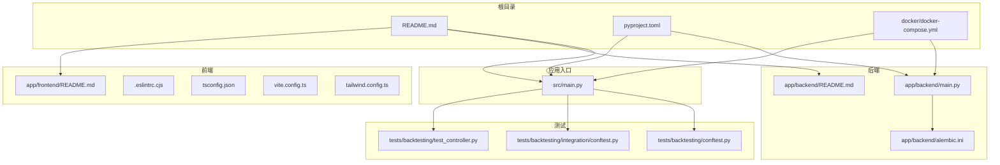
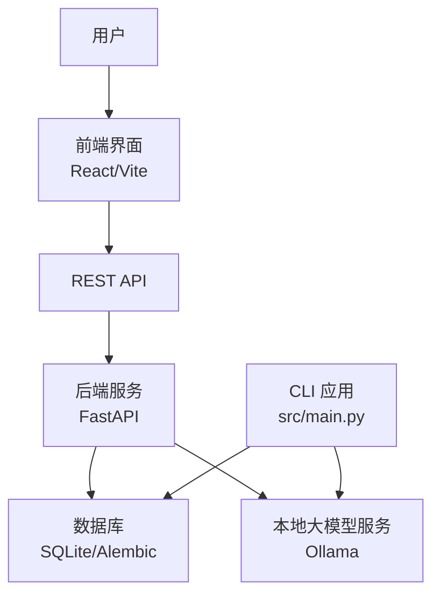
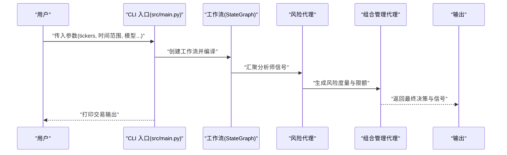
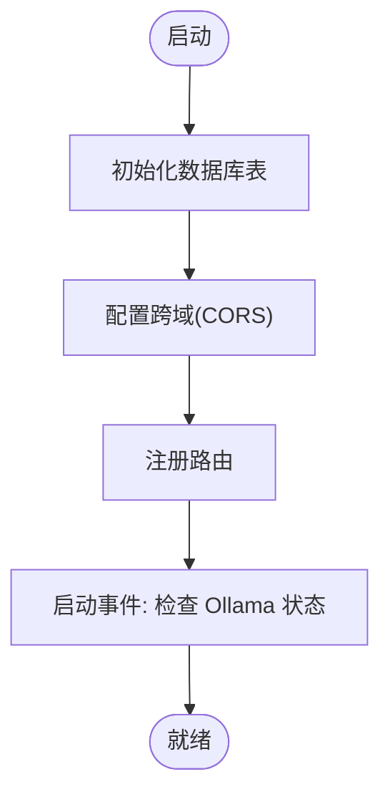
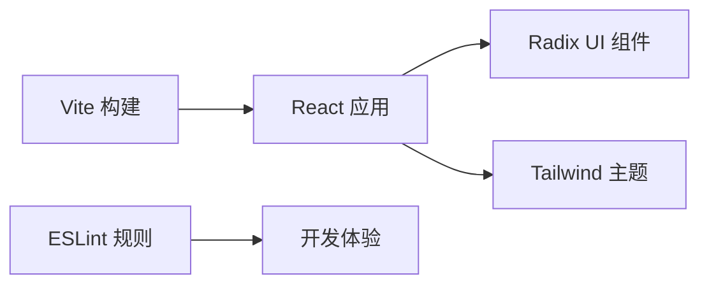
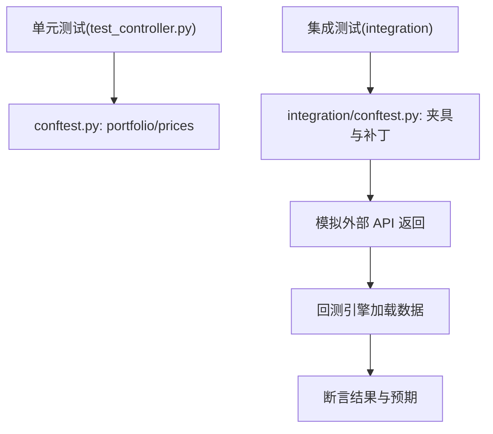
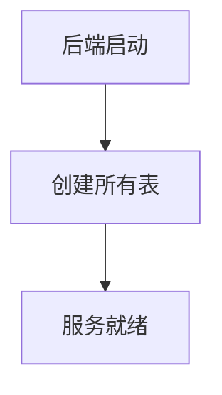
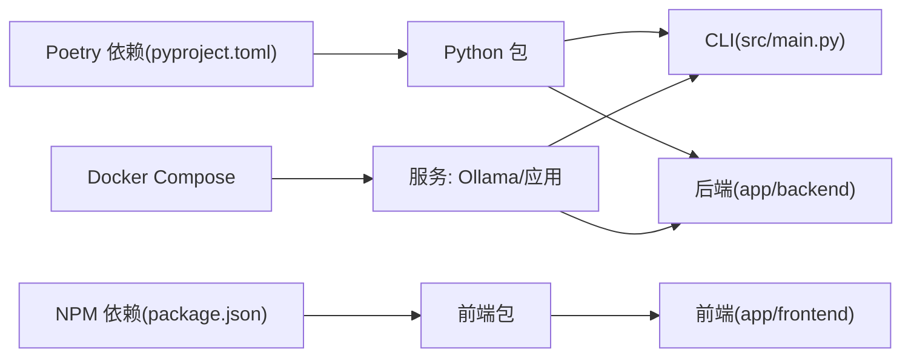

# 开发者指南

<cite>
**本文引用的文件**
- [README.md](file://README.md)
- [app/backend/README.md](file://app/backend/README.md)
- [app/frontend/README.md](file://app/frontend/README.md)
- [pyproject.toml](file://pyproject.toml)
- [app/frontend/package.json](file://app/frontend/package.json)
- [app/frontend/.eslintrc.cjs](file://app/frontend/.eslintrc.cjs)
- [app/frontend/tsconfig.json](file://app/frontend/tsconfig.json)
- [app/frontend/vite.config.ts](file://app/frontend/vite.config.ts)
- [app/frontend/tailwind.config.ts](file://app/frontend/tailwind.config.ts)
- [docker/docker-compose.yml](file://docker/docker-compose.yml)
- [app/backend/main.py](file://app/backend/main.py)
- [app/backend/alembic.ini](file://app/backend/alembic.ini)
- [src/main.py](file://src/main.py)
- [tests/backtesting/conftest.py](file://tests/backtesting/conftest.py)
- [tests/backtesting/integration/conftest.py](file://tests/backtesting/integration/conftest.py)
- [tests/backtesting/test_controller.py](file://tests/backtesting/test_controller.py)
- [.github/ISSUE_TEMPLATE/bug_report.md](file://.github/ISSUE_TEMPLATE/bug_report.md)
- [.github/ISSUE_TEMPLATE/feature_request.md](file://.github/ISSUE_TEMPLATE/feature_request.md)
</cite>

## 目录
1. [简介](#简介)
2. [项目结构](#项目结构)
3. [核心组件](#核心组件)
4. [架构总览](#架构总览)
5. [详细组件分析](#详细组件分析)
6. [依赖关系分析](#依赖关系分析)
7. [性能考虑](#性能考虑)
8. [故障排查指南](#故障排查指南)
9. [结论](#结论)
10. [附录](#附录)

## 简介
本指南面向开发者，提供从开发规范、测试策略到贡献流程的完整说明。内容涵盖代码风格与命名约定、文档标准、单元测试/集成测试/端到端测试编写方法、Git 工作流与分支策略、代码审查流程、调试与性能分析、依赖管理与版本控制、发布流程、社区贡献与问题报告、开发环境搭建与 IDE 配置、以及持续集成与质量门禁建议。

## 项目结构
该项目采用多模块组织方式：Python 后端（FastAPI）、前端（React/Vite）、CLI 应用、回测引擎、Docker 化运行与数据库迁移（Alembic）。根目录提供统一安装与运行说明；后端子目录提供 REST API；前端子目录提供可视化界面；CLI 位于 src；回测相关测试位于 tests；容器化部署位于 docker。

**图表来源**
- [README.md:1-158](file://README.md#L1-L158)
- [app/backend/main.py:1-56](file://app/backend/main.py#L1-L56)
- [app/backend/alembic.ini:1-120](file://app/backend/alembic.ini#L1-L120)
- [docker/docker-compose.yml:1-95](file://docker/docker-compose.yml#L1-L95)
- [src/main.py:1-180](file://src/main.py#L1-L180)
- [tests/backtesting/conftest.py:1-27](file://tests/backtesting/conftest.py#L1-L27)
- [tests/backtesting/integration/conftest.py:1-129](file://tests/backtesting/integration/conftest.py#L1-L129)
- [tests/backtesting/test_controller.py:1-36](file://tests/backtesting/test_controller.py#L1-L36)

**章节来源**
- [README.md:1-158](file://README.md#L1-L158)
- [app/backend/README.md:1-102](file://app/backend/README.md#L1-L102)
- [app/frontend/README.md:1-37](file://app/frontend/README.md#L1-L37)

## 核心组件
- CLI 入口与主流程：负责解析参数、构建工作流、编排分析节点、风险与组合管理节点，并输出交易决策与中间信号。
- 后端服务：基于 FastAPI 提供 REST API，支持健康检查与运行接口，内置 CORS 与数据库初始化。
- 前端界面：React/Vite 构建，TailwindCSS 主题系统，Radix UI 组件库，提供可视化流程图与面板。
- 回测引擎与测试：提供控制器、指标、组合等模块，并配套单元与集成测试，使用 pytest、pandas、mock 数据。
- 容器化运行：通过 docker-compose 提供本地 Ollama 与应用服务，支持多种运行模式（含推理展示）。

**章节来源**
- [src/main.py:1-180](file://src/main.py#L1-L180)
- [app/backend/main.py:1-56](file://app/backend/main.py#L1-L56)
- [app/frontend/README.md:1-37](file://app/frontend/README.md#L1-L37)
- [tests/backtesting/test_controller.py:1-36](file://tests/backtesting/test_controller.py#L1-L36)
- [docker/docker-compose.yml:1-95](file://docker/docker-compose.yml#L1-L95)

## 架构总览
系统由 CLI/后端 API 与前端界面组成，数据与业务逻辑集中在 Python 层，前端通过 API 与后端交互，CLI 可独立运行或配合后端使用。数据库迁移通过 Alembic 管理，容器化部署简化本地开发与演示。

**图表来源**
- [app/backend/main.py:1-56](file://app/backend/main.py#L1-L56)
- [docker/docker-compose.yml:1-95](file://docker/docker-compose.yml#L1-L95)
- [app/backend/alembic.ini:66](file://app/backend/alembic.ini#L66)

## 详细组件分析

### CLI 组件分析
- 职责：解析命令行参数、构建分析节点工作流、调用 LangGraph 执行、汇总输出。
- 关键点：进度条、消息解析、状态图构建、默认分析师集合、风险与组合管理节点串联。
- 输出：交易决策 JSON、各分析师信号字典。

**图表来源**
- [src/main.py:46-131](file://src/main.py#L46-L131)

**章节来源**
- [src/main.py:1-180](file://src/main.py#L1-L180)

### 后端服务组件分析
- 职责：FastAPI 应用、CORS 配置、路由注册、启动事件检查 Ollama 状态。
- 数据库：初始化表结构，便于后续持久化。
- 运行：uvicorn 热重载开发模式，提供 OpenAPI 文档。

**图表来源**
- [app/backend/main.py:17-56](file://app/backend/main.py#L17-L56)

**章节来源**
- [app/backend/main.py:1-56](file://app/backend/main.py#L1-L56)
- [app/backend/README.md:1-102](file://app/backend/README.md#L1-L102)

### 前端组件分析
- 技术栈：React + TypeScript + Vite + TailwindCSS + Radix UI。
- 配置要点：路径别名 @/*、严格类型检查、ESLint 规则、插件化构建。
- 主题与样式：Tailwind 自定义变量与动画插件，暗色模式支持。

**图表来源**
- [app/frontend/vite.config.ts:1-14](file://app/frontend/vite.config.ts#L1-L14)
- [app/frontend/tsconfig.json:1-40](file://app/frontend/tsconfig.json#L1-L40)
- [app/frontend/.eslintrc.cjs:1-19](file://app/frontend/.eslintrc.cjs#L1-L19)
- [app/frontend/tailwind.config.ts:1-144](file://app/frontend/tailwind.config.ts#L1-L144)

**章节来源**
- [app/frontend/README.md:1-37](file://app/frontend/README.md#L1-L37)
- [app/frontend/package.json:1-56](file://app/frontend/package.json#L1-L56)
- [app/frontend/.eslintrc.cjs:1-19](file://app/frontend/.eslintrc.cjs#L1-L19)
- [app/frontend/tsconfig.json:1-40](file://app/frontend/tsconfig.json#L1-L40)
- [app/frontend/vite.config.ts:1-14](file://app/frontend/vite.config.ts#L1-L14)
- [app/frontend/tailwind.config.ts:1-144](file://app/frontend/tailwind.config.ts#L1-L144)

### 测试组件分析
- 单元测试：针对控制器行为进行断言，确保决策标准化与快照一致性。
- 集成测试：使用固定夹具模拟价格、财务指标、新闻与 insider 交易数据，覆盖真实数据加载与过滤逻辑。
- 夹具：提供 Portfolio、价格 DataFrame 工厂与自动打补丁，隔离外部依赖。

**图表来源**
- [tests/backtesting/test_controller.py:1-36](file://tests/backtesting/test_controller.py#L1-L36)
- [tests/backtesting/conftest.py:1-27](file://tests/backtesting/conftest.py#L1-L27)
- [tests/backtesting/integration/conftest.py:107-129](file://tests/backtesting/integration/conftest.py#L107-L129)

**章节来源**
- [tests/backtesting/test_controller.py:1-36](file://tests/backtesting/test_controller.py#L1-L36)
- [tests/backtesting/conftest.py:1-27](file://tests/backtesting/conftest.py#L1-L27)
- [tests/backtesting/integration/conftest.py:1-129](file://tests/backtesting/integration/conftest.py#L1-L129)

### 数据库与迁移分析
- 配置：Alembic 使用 SQLite，默认数据库文件路径在配置中指定。
- 初始化：后端启动时自动创建所有表，保证幂等性。
- 建议：新增模型后使用 Alembic 生成迁移脚本，遵循“先迁移、后部署”的流程。

**图表来源**
- [app/backend/alembic.ini:66](file://app/backend/alembic.ini#L66)
- [app/backend/main.py:17-18](file://app/backend/main.py#L17-L18)

**章节来源**
- [app/backend/alembic.ini:1-120](file://app/backend/alembic.ini#L1-L120)
- [app/backend/main.py:1-56](file://app/backend/main.py#L1-L56)

## 依赖关系分析
- Python 依赖：Poetry 管理，包含 LangChain/LangGraph、FastAPI、SQLAlchemy、Matplotlib、NumPy/Pandas 等。
- 开发依赖：pytest、black、isort、flake8，统一代码风格与静态检查。
- 前端依赖：React、Vite、TailwindCSS、Radix UI、TypeScript、ESLint 插件链。
- 容器化：docker-compose 提供 Ollama 与应用服务，支持多种运行模式。

**图表来源**
- [pyproject.toml:13-62](file://pyproject.toml#L13-L62)
- [app/frontend/package.json:11-54](file://app/frontend/package.json#L11-L54)
- [docker/docker-compose.yml:1-95](file://docker/docker-compose.yml#L1-L95)

**章节来源**
- [pyproject.toml:1-62](file://pyproject.toml#L1-L62)
- [app/frontend/package.json:1-56](file://app/frontend/package.json#L1-L56)
- [docker/docker-compose.yml:1-95](file://docker/docker-compose.yml#L1-L95)

## 性能考虑
- 大模型推理：优先使用本地 Ollama 减少网络延迟；合理选择模型与上下文长度。
- 数据加载：集成测试中的夹具已演示按时间窗口筛选与类型转换，避免全量加载。
- 图形与可视化：CLI 中可导出流程图为 PNG，注意在大规模图时控制分辨率与节点数量。
- 并发与异步：后端使用 FastAPI 异步特性，建议在 I/O 密集场景充分利用。

[本节为通用指导，无需特定文件引用]

## 故障排查指南
- 后端无法连接前端：确认 CORS 配置允许前端地址。
- Ollama 不可用：查看启动事件日志提示，确认安装与运行状态。
- 数据库异常：检查 Alembic 配置与表初始化是否成功。
- 前端构建失败：检查 TypeScript 严格模式与 ESLint 规则，确保路径别名与插件配置正确。
- Docker 运行异常：核对 .env 映射、端口映射与服务命令。

**章节来源**
- [app/backend/main.py:20-56](file://app/backend/main.py#L20-L56)
- [app/backend/alembic.ini:66](file://app/backend/alembic.ini#L66)
- [app/frontend/tsconfig.json:20-24](file://app/frontend/tsconfig.json#L20-L24)
- [app/frontend/.eslintrc.cjs:12-17](file://app/frontend/.eslintrc.cjs#L12-L17)
- [docker/docker-compose.yml:23-46](file://docker/docker-compose.yml#L23-L46)

## 结论
本指南提供了从开发规范、测试策略到贡献流程的系统性说明。建议团队在日常开发中坚持统一的代码风格、完善的测试覆盖与清晰的文档标准，并结合容器化与 CI/CD 实践提升交付质量与效率。

[本节为总结性内容，无需特定文件引用]

## 附录

### 开发规范与代码风格
- Python
  - 使用 black 与 isort 统一格式与导入排序，配置参考 Poetry 工具段。
  - 静态检查：flake8。
  - 命名约定：模块与函数使用下划线命名，类使用 PascalCase，常量全大写。
  - 文档注释：模块与公共接口应包含简要 docstring。
- 前端
  - TypeScript 严格模式，启用未使用变量/参数检查。
  - ESLint 推荐规则与 React Hooks 规则，禁止在组件外导出非组件常量。
  - 路径别名 @/*，保持模块引用简洁。
  - Tailwind 自定义主题变量，避免内联样式。

**章节来源**
- [pyproject.toml:52-60](file://pyproject.toml#L52-L60)
- [app/frontend/.eslintrc.cjs:1-19](file://app/frontend/.eslintrc.cjs#L1-L19)
- [app/frontend/tsconfig.json:20-24](file://app/frontend/tsconfig.json#L20-L24)
- [app/frontend/vite.config.ts:8-12](file://app/frontend/vite.config.ts#L8-L12)

### 测试策略
- 单元测试
  - 目标：验证控制器对输入的标准化与快照行为。
  - 断言：覆盖缺失标的默认持有、数量归一化、分析师信号透传。
- 集成测试
  - 目标：模拟外部 API 返回，验证数据加载、筛选与类型转换。
  - 方法：使用夹具定位匹配的 JSON 固定数据，构造 DataFrame 并按时间窗口过滤。
- 端到端测试建议
  - 前端：使用 Playwright/Cypress 编写页面交互与数据展示测试。
  - 后端：使用 httpx 或 FastAPI TestClient 编写 API 行为测试。

**章节来源**
- [tests/backtesting/test_controller.py:1-36](file://tests/backtesting/test_controller.py#L1-L36)
- [tests/backtesting/conftest.py:1-27](file://tests/backtesting/conftest.py#L1-L27)
- [tests/backtesting/integration/conftest.py:14-129](file://tests/backtesting/integration/conftest.py#L14-L129)

### Git 工作流程与分支策略
- 分支策略
  - main：稳定发布分支。
  - develop：集成开发分支。
  - feature/*：功能开发分支，完成后合并至 develop。
  - hotfix/*：紧急修复分支，直接从 main 切出并回并至 main 与 develop。
- 提交规范
  - 类型前缀：feat、fix、docs、style、refactor、test、chore。
  - 标题简洁明确，正文说明动机与影响。
- 代码审查
  - PR 必须通过 CI 与代码审查，至少一名维护者批准。

[本节为通用流程说明，无需特定文件引用]

### 代码审查清单
- 功能正确性：单元/集成测试通过，边界条件覆盖。
- 性能影响：避免不必要的 I/O 与循环，关注大模型调用频率。
- 安全性：敏感信息不硬编码，API Key 通过环境变量注入。
- 可读性：命名清晰、注释充分、模块职责单一。
- 兼容性：更新依赖需评估破坏性变更。

[本节为通用清单，无需特定文件引用]

### 调试技巧与性能分析
- CLI 调试：使用 --show-reasoning 查看推理过程；逐步缩小输入范围定位问题。
- 日志：后端启动事件记录 Ollama 状态，便于诊断本地模型可用性。
- 性能：使用 cProfile/Py-Spy 分析热点函数；前端使用 React DevTools 检查渲染开销。
- 数据：在集成测试中打印关键 DataFrame 形状与列名，确认数据加载正确。

**章节来源**
- [docker/docker-compose.yml:40-46](file://docker/docker-compose.yml#L40-L46)
- [app/backend/main.py:32-56](file://app/backend/main.py#L32-L56)

### 依赖管理与版本控制
- Python：Poetry 管理依赖与虚拟环境，dev 组包含测试与格式化工具。
- 前端：NPM 管理依赖与脚本，lint/build/dev 命令规范化。
- 版本：pyproject.toml 中声明版本号，遵循语义化版本；发布前更新版本并同步文档。

**章节来源**
- [pyproject.toml:1-62](file://pyproject.toml#L1-L62)
- [app/frontend/package.json:1-56](file://app/frontend/package.json#L1-L56)

### 发布流程
- 本地验证：运行 pytest、ESLint、类型检查；构建前端产物。
- 更新版本：修改 pyproject.toml 版本号；更新 README 示例。
- 打标签与发布：在版本标签上创建发布说明，附带变更摘要。
- 容器镜像：如需，构建并推送镜像至制品库。

[本节为通用流程说明，无需特定文件引用]

### 社区贡献指南
- 问题报告：使用 GitHub Issues 的模板，提供复现步骤、期望与实际结果。
- 功能请求：添加 enhancement 标签，描述背景、目标与验收标准。
- 提交 PR：遵循小步提交原则，附带测试与文档更新。

**章节来源**
- [.github/ISSUE_TEMPLATE/bug_report.md](file://.github/ISSUE_TEMPLATE/bug_report.md)
- [.github/ISSUE_TEMPLATE/feature_request.md](file://.github/ISSUE_TEMPLATE/feature_request.md)
- [README.md:141-154](file://README.md#L141-L154)

### 开发环境搭建与 IDE 配置
- Python
  - 安装 Poetry，执行依赖安装；在 IDE 中配置 Python 解释器指向虚拟环境。
  - 后端开发：使用 uvicorn 热重载启动，访问 /docs 查看接口文档。
- 前端
  - 安装依赖后运行 dev，启用自动刷新；配置 ESLint 与 TypeScript 支持。
  - VS Code 推荐扩展：ESLint、Tailwind CSS IntelliSense、Prettier。
- Docker
  - 使用 docker-compose 启动 Ollama 与应用服务，映射 .env 文件。

**章节来源**
- [README.md:94-131](file://README.md#L94-L131)
- [app/backend/README.md:53-68](file://app/backend/README.md#L53-L68)
- [docker/docker-compose.yml:18-91](file://docker/docker-compose.yml#L18-L91)

### 持续集成与质量门禁
- 任务建议
  - 代码风格：black/isort/flake8。
  - 单元测试：pytest，覆盖率阈值建议 80%+。
  - 集成测试：加载夹具数据，验证数据管道。
  - 前端检查：ESLint、类型检查、构建。
  - 安全扫描：依赖漏洞扫描（pip-audit、npm audit）。
- 触发条件
  - push develop/main；PR 打开/更新时触发。
- 产物
  - 构建工件：前端 dist、Python wheel/可执行脚本。
  - 测试报告：JUnit/HTML 报告上传。

[本节为通用建议，无需特定文件引用]