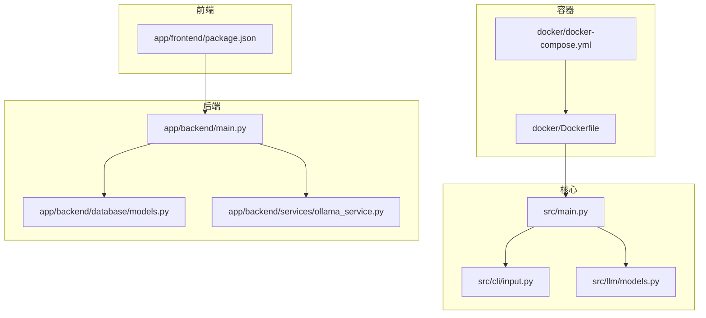
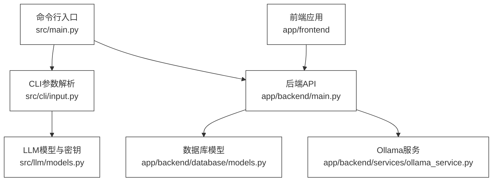
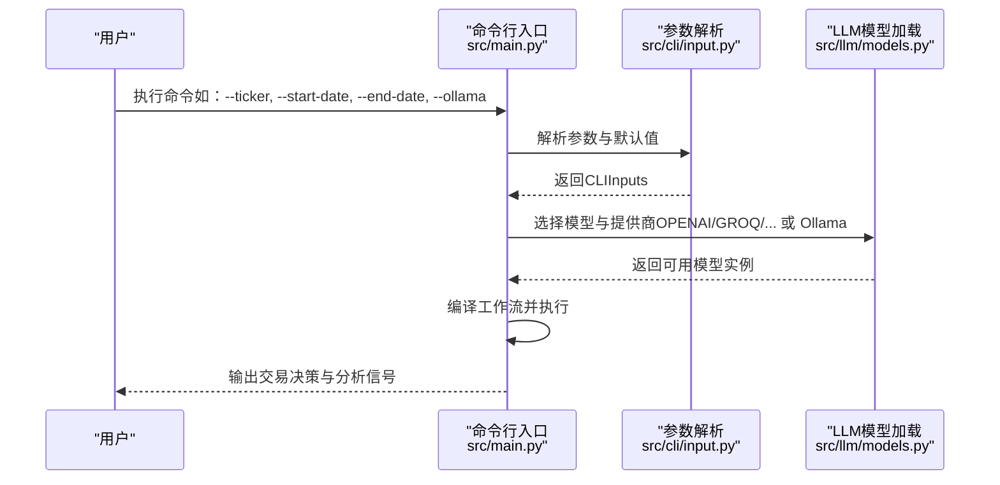
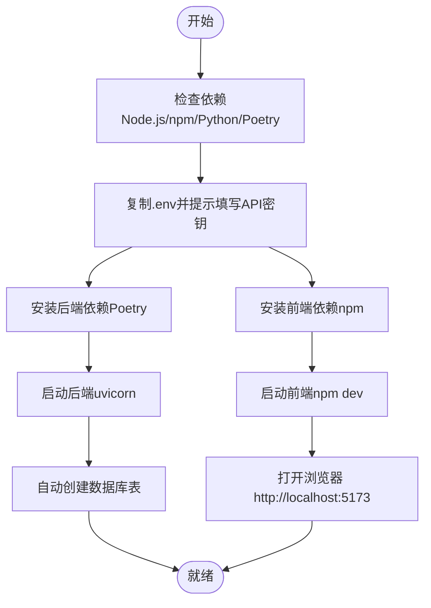
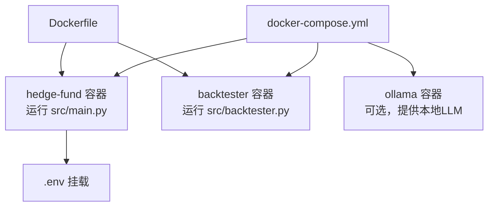
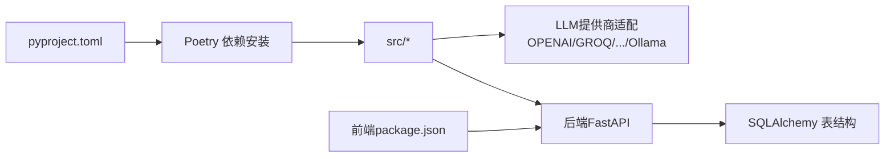

# 快速开始

<cite>
**本文引用的文件**
- [README.md](file://README.md)
- [pyproject.toml](file://pyproject.toml)
- [src/main.py](file://src/main.py)
- [src/cli/input.py](file://src/cli/input.py)
- [src/llm/models.py](file://src/llm/models.py)
- [src/utils/api_key.py](file://src/utils/api_key.py)
- [app/backend/main.py](file://app/backend/main.py)
- [app/backend/database/models.py](file://app/backend/database/models.py)
- [app/backend/services/ollama_service.py](file://app/backend/services/ollama_service.py)
- [app/frontend/package.json](file://app/frontend/package.json)
- [app/run.sh](file://app/run.sh)
- [docker/docker-compose.yml](file://docker/docker-compose.yml)
- [docker/Dockerfile](file://docker/Dockerfile)
</cite>

## 目录
1. [简介](#简介)
2. [项目结构](#项目结构)
3. [核心组件](#核心组件)
4. [架构总览](#架构总览)
5. [详细组件分析](#详细组件分析)
6. [依赖关系分析](#依赖关系分析)
7. [性能注意事项](#性能注意事项)
8. [故障排除指南](#故障排除指南)
9. [结论](#结论)
10. [附录](#附录)

## 简介
本指南面向首次接触“AI对冲基金”项目的用户，帮助你在约30分钟内完成从环境准备到成功运行项目的全流程。你将学到：
- 如何准备系统环境与依赖（Python、Poetry、Node.js/npm）
- 如何配置OPENAI_API_KEY、FINANCIAL_DATASETS_API_KEY等关键API密钥
- 如何使用命令行界面（CLI）或Web应用两种方式启动系统
- 如何通过Docker进行容器化运行
- 常见问题与排错方法

## 项目结构
该项目采用多模块分层设计：
- 核心逻辑位于 src/，包含命令行入口、CLI参数解析、LLM模型选择与调用、交易决策图编排等
- Web后端位于 app/backend/，基于FastAPI提供REST接口与数据库表结构定义
- Web前端位于 app/frontend/，基于React/Vite构建可视化界面
- 容器化运行位于 docker/，提供Dockerfile与docker-compose.yml
- 测试与示例位于 tests/ 与 v2/

图表来源
- [src/main.py:1-180](file://src/main.py#L1-L180)
- [src/cli/input.py:1-289](file://src/cli/input.py#L1-L289)
- [src/llm/models.py:1-200](file://src/llm/models.py#L1-L200)
- [app/backend/main.py:1-56](file://app/backend/main.py#L1-L56)
- [app/backend/database/models.py:1-115](file://app/backend/database/models.py#L1-L115)
- [app/backend/services/ollama_service.py:1-519](file://app/backend/services/ollama_service.py#L1-L519)
- [app/frontend/package.json:1-56](file://app/frontend/package.json#L1-L56)
- [docker/Dockerfile:1-23](file://docker/Dockerfile#L1-L23)
- [docker/docker-compose.yml:1-95](file://docker/docker-compose.yml#L1-L95)

章节来源
- [README.md:54-158](file://README.md#L54-L158)
- [pyproject.toml:1-62](file://pyproject.toml#L1-L62)

## 核心组件
- 命令行入口与工作流编排：负责解析参数、构建分析员节点图、执行风险与组合管理流程
- CLI输入解析：支持股票池、日期范围、分析师选择、模型选择、是否使用本地Ollama等
- LLM模型与API密钥：统一加载OPENAI/GROQ/ANTHROPIC/DEEPSEEK/GOOGLE等提供商的密钥与模型
- Web后端：FastAPI服务、CORS、数据库初始化、Ollama状态检查
- Web前端：React生态依赖、开发服务器、UI组件与设置页
- 容器化：Dockerfile与Compose，一键拉起后端、可选Ollama服务

章节来源
- [src/main.py:45-180](file://src/main.py#L45-L180)
- [src/cli/input.py:16-289](file://src/cli/input.py#L16-L289)
- [src/llm/models.py:142-200](file://src/llm/models.py#L142-L200)
- [app/backend/main.py:15-56](file://app/backend/main.py#L15-L56)
- [app/frontend/package.json:11-56](file://app/frontend/package.json#L11-L56)
- [docker/docker-compose.yml:1-95](file://docker/docker-compose.yml#L1-L95)

## 架构总览
下图展示了从CLI/Web到后端、数据库与外部LLM服务的整体交互。

图表来源
- [src/main.py:133-180](file://src/main.py#L133-L180)
- [src/cli/input.py:227-289](file://src/cli/input.py#L227-L289)
- [src/llm/models.py:142-200](file://src/llm/models.py#L142-L200)
- [app/backend/main.py:15-56](file://app/backend/main.py#L15-L56)
- [app/backend/database/models.py:6-115](file://app/backend/database/models.py#L6-L115)
- [app/backend/services/ollama_service.py:34-151](file://app/backend/services/ollama_service.py#L34-L151)
- [app/frontend/package.json:11-56](file://app/frontend/package.json#L11-L56)

## 详细组件分析

### 命令行界面（CLI）启动流程
- 安装Poetry并安装Python依赖
- 创建 .env 文件并填写至少一个LLM提供商的API密钥
- 运行主程序，传入股票池、日期范围、是否使用Ollama等参数
- 可选：启用推理展示与生成代理图

图表来源
- [src/main.py:133-180](file://src/main.py#L133-L180)
- [src/cli/input.py:227-289](file://src/cli/input.py#L227-L289)
- [src/llm/models.py:142-200](file://src/llm/models.py#L142-L200)

章节来源
- [README.md:94-124](file://README.md#L94-L124)
- [src/main.py:133-180](file://src/main.py#L133-L180)
- [src/cli/input.py:227-289](file://src/cli/input.py#L227-L289)

### Web应用启动流程（自动脚本）
- 自动检测Node.js、npm、Python、Poetry
- 从 .env.example 复制 .env 并提示填写API密钥
- 安装后端（Poetry）与前端（npm）依赖
- 后端：uvicorn在127.0.0.1:8000启动，自动创建数据库表
- 前端：npm run dev在127.0.0.1:5173启动
- 自动打开浏览器并指向前端地址

图表来源
- [app/run.sh:69-333](file://app/run.sh#L69-L333)
- [app/backend/main.py:15-56](file://app/backend/main.py#L15-L56)

章节来源
- [app/run.sh:69-333](file://app/run.sh#L69-L333)
- [app/backend/main.py:15-56](file://app/backend/main.py#L15-L56)

### 容器化运行（Docker）
- 使用Dockerfile安装Poetry并以非虚拟环境模式安装依赖
- docker-compose.yml提供后端服务与可选Ollama服务
- 支持通过命令行参数覆盖默认行为（如启用推理、使用Ollama）

图表来源
- [docker/docker-compose.yml:18-91](file://docker/docker-compose.yml#L18-L91)
- [docker/Dockerfile:1-23](file://docker/Dockerfile#L1-L23)

章节来源
- [docker/docker-compose.yml:1-95](file://docker/docker-compose.yml#L1-L95)
- [docker/Dockerfile:1-23](file://docker/Dockerfile#L1-L23)

## 依赖关系分析
- Python与Poetry：通过pyproject.toml声明依赖，使用Poetry安装；提供脚本别名用于回测
- LLM提供商：统一在src/llm/models.py中按提供商加载API密钥或本地URL
- 数据库：后端启动时自动创建表；前端设置页支持管理API密钥
- 前端依赖：React、Vite、Radix UI、Tailwind等

图表来源
- [pyproject.toml:13-47](file://pyproject.toml#L13-L47)
- [src/llm/models.py:142-200](file://src/llm/models.py#L142-L200)
- [app/backend/database/models.py:6-115](file://app/backend/database/models.py#L6-L115)
- [app/frontend/package.json:11-56](file://app/frontend/package.json#L11-L56)

章节来源
- [pyproject.toml:1-62](file://pyproject.toml#L1-L62)
- [src/llm/models.py:142-200](file://src/llm/models.py#L142-L200)
- [app/backend/database/models.py:6-115](file://app/backend/database/models.py#L6-L115)
- [app/frontend/package.json:11-56](file://app/frontend/package.json#L11-L56)

## 性能注意事项
- 本地Ollama模型下载与推理会占用CPU/GPU资源，建议在有足够内存与显存的机器上运行
- 避免同时开启过多并发分析周期，合理设置日期范围与股票池规模
- 在容器环境中，建议为Ollama分配独立卷与端口映射，避免冲突

## 故障排除指南
- 未设置任一LLM API密钥
  - 现象：运行时报错提示缺少OPENAI/GROQ/ANTHROPIC/DEEPSEEK等密钥
  - 处理：在根目录创建 .env 并填入至少一个LLM提供商的API密钥
- Ollama未安装或未运行
  - 现象：后端启动日志提示未安装或未运行
  - 处理：安装Ollama并启动服务，或在前端设置页中下载所需模型
- 端口被占用
  - 现象：uvicorn或Vite无法绑定端口
  - 处理：关闭占用端口的进程或修改端口
- Docker网络或卷权限问题
  - 现象：容器内无法读取 .env 或Ollama无法持久化
  - 处理：确认挂载路径正确、权限充足；必要时调整卷与环境变量

章节来源
- [README.md:65-83](file://README.md#L65-L83)
- [app/backend/main.py:32-56](file://app/backend/main.py#L32-L56)
- [app/backend/services/ollama_service.py:34-151](file://app/backend/services/ollama_service.py#L34-L151)
- [docker/docker-compose.yml:24-29](file://docker/docker-compose.yml#L24-L29)

## 结论
按照本指南，你可以快速完成环境准备、依赖安装、API密钥配置与两种运行方式（CLI与Web）的启动。若遇到问题，请优先检查 .env 中的API密钥与Ollama状态，或参考“故障排除指南”。

## 附录

### 环境准备与依赖安装
- 安装Poetry（如未安装）
- 安装Python依赖（Poetry）
- 安装Node.js与npm（用于Web应用）

章节来源
- [README.md:94-102](file://README.md#L94-L102)
- [app/run.sh:90-129](file://app/run.sh#L90-L129)

### API密钥配置
- 在项目根目录创建 .env 并填入以下至少一项：
  - OPENAI_API_KEY
  - GROQ_API_KEY
  - ANTHROPIC_API_KEY
  - DEEPSEEK_API_KEY
  - FINANCIAL_DATASETS_API_KEY
- 后端数据库表结构中包含API密钥存储模型，便于在Web界面中管理

章节来源
- [README.md:67-83](file://README.md#L67-L83)
- [app/backend/database/models.py:97-115](file://app/backend/database/models.py#L97-L115)

### 命令行界面（CLI）启动
- 运行主程序并指定股票池与日期范围
- 可选：--ollama 使用本地Ollama模型
- 可选：--show-reasoning 展示各分析员推理过程
- 可选：--show-agent-graph 生成代理图

章节来源
- [README.md:104-131](file://README.md#L104-L131)
- [src/main.py:133-180](file://src/main.py#L133-L180)
- [src/cli/input.py:227-289](file://src/cli/input.py#L227-L289)

### Web应用启动
- 自动脚本会检查并安装依赖，启动后端与前端，并在浏览器中打开前端页面
- 访问地址：前端 http://localhost:5173，后端 http://localhost:8000，文档 http://localhost:8000/docs

章节来源
- [app/run.sh:300-314](file://app/run.sh#L300-L314)
- [app/backend/main.py:15-56](file://app/backend/main.py#L15-L56)

### 容器化运行
- 使用docker-compose一键拉起后端与可选Ollama服务
- 默认命令会运行主程序并传入示例股票池

章节来源
- [docker/docker-compose.yml:18-91](file://docker/docker-compose.yml#L18-L91)
- [docker/Dockerfile:1-23](file://docker/Dockerfile#L1-L23)