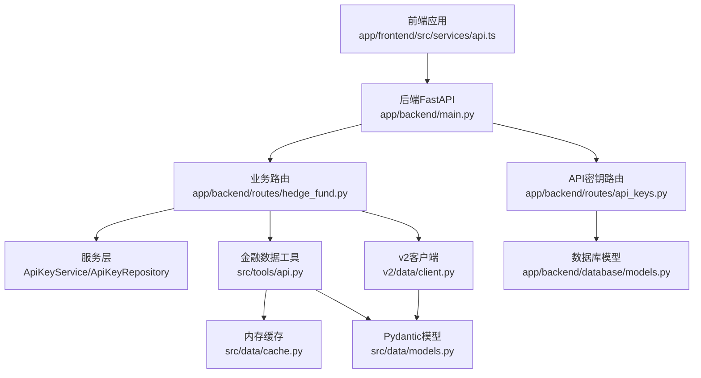
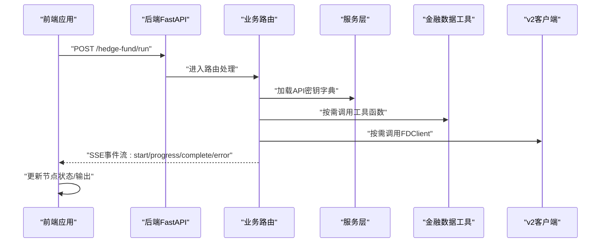
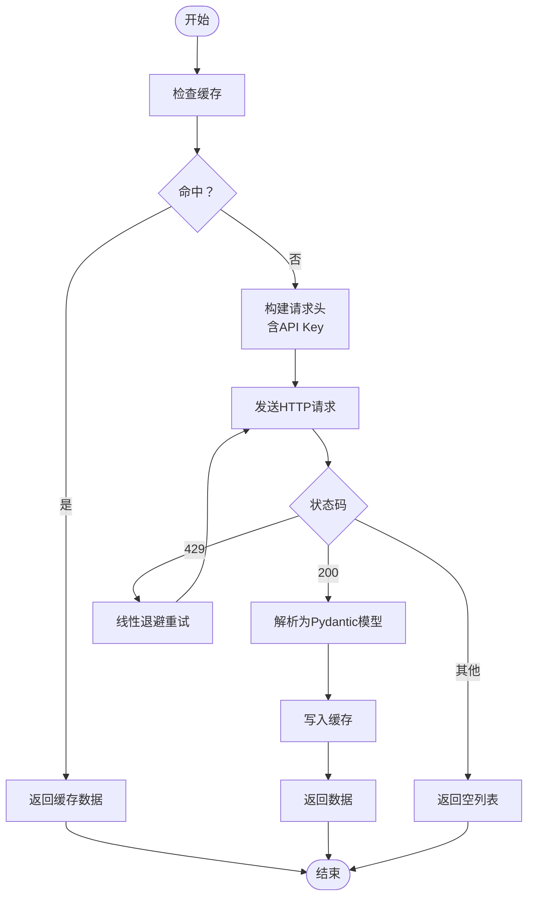
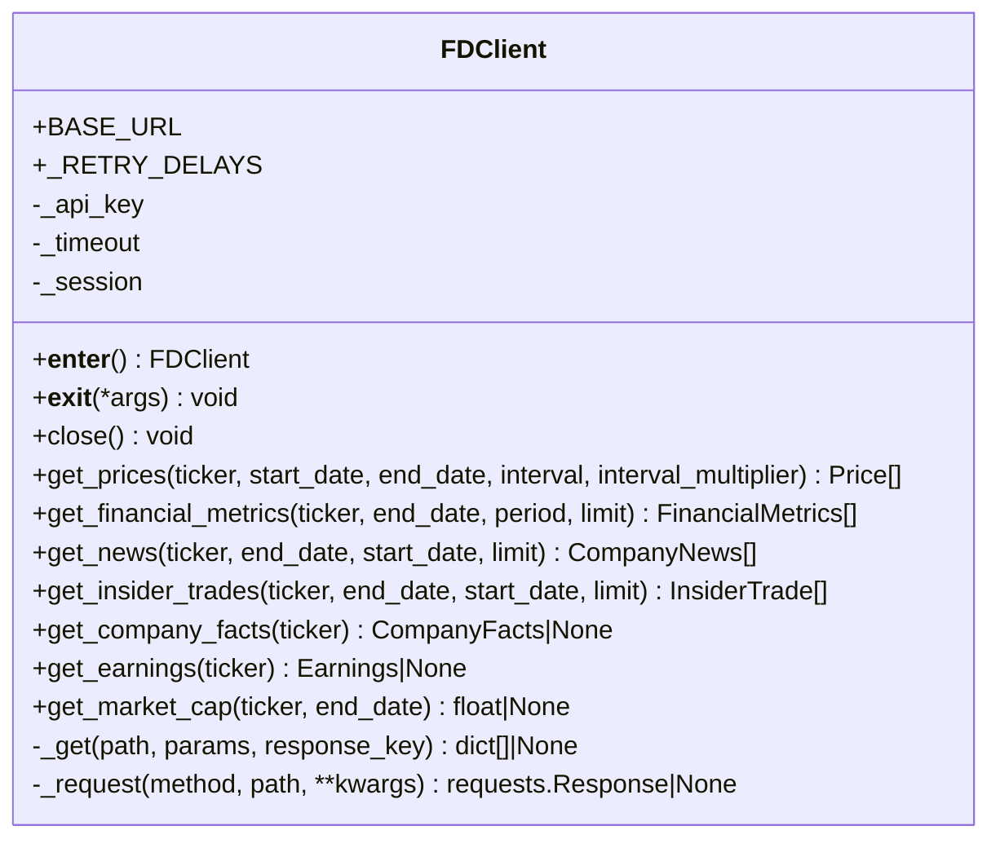
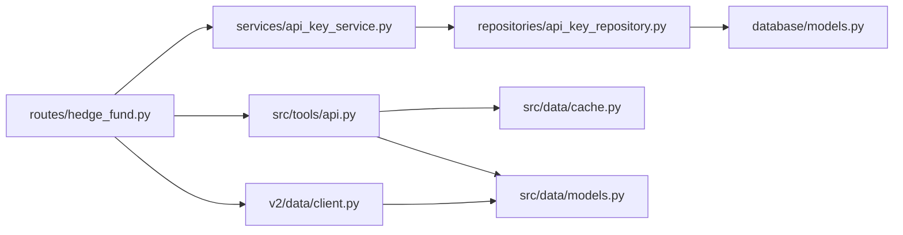

# API集成

<cite>
**本文引用的文件**
- [src/tools/api.py](file://src/tools/api.py)
- [src/utils/api_key.py](file://src/utils/api_key.py)
- [app/backend/services/api_key_service.py](file://app/backend/services/api_key_service.py)
- [app/backend/repositories/api_key_repository.py](file://app/backend/repositories/api_key_repository.py)
- [app/backend/database/models.py](file://app/backend/database/models.py)
- [app/backend/routes/api_keys.py](file://app/backend/routes/api_keys.py)
- [v2/data/client.py](file://v2/data/client.py)
- [src/data/cache.py](file://src/data/cache.py)
- [src/data/models.py](file://src/data/models.py)
- [tests/test_api_rate_limiting.py](file://tests/test_api_rate_limiting.py)
- [app/backend/routes/hedge_fund.py](file://app/backend/routes/hedge_fund.py)
- [app/backend/main.py](file://app/backend/main.py)
- [app/frontend/src/services/api.ts](file://app/frontend/src/services/api.ts)
- [app/frontend/src/services/api-keys-api.ts](file://app/frontend/src/services/api-keys-api.ts)
</cite>

## 目录
1. [简介](#简介)
2. [项目结构](#项目结构)
3. [核心组件](#核心组件)
4. [架构总览](#架构总览)
5. [详细组件分析](#详细组件分析)
6. [依赖分析](#依赖分析)
7. [性能考量](#性能考量)
8. [故障排除指南](#故障排除指南)
9. [结论](#结论)
10. [附录](#附录)

## 简介
本文件系统性梳理本项目中金融数据API的集成方案，覆盖API客户端设计、请求构建与响应解析、密钥管理与认证、速率限制与重试策略、超时与连接池、数据转换与格式标准化、异常处理、监控与性能跟踪以及故障排除等。文档同时给出v2版本FDClient的类图与序列图，并总结前后端交互流程与最佳实践。

## 项目结构
项目采用前后端分离架构，后端使用FastAPI提供REST接口与SSE流式输出；前端通过fetch与SSE消费后端事件；金融数据API封装在Python工具模块与v2客户端中，统一通过缓存与模型进行数据转换。

图表来源
- [app/backend/main.py:15-31](file://app/backend/main.py#L15-L31)
- [app/backend/routes/hedge_fund.py:16-155](file://app/backend/routes/hedge_fund.py#L16-L155)
- [app/backend/routes/api_keys.py:16-201](file://app/backend/routes/api_keys.py#L16-L201)
- [src/tools/api.py:63-366](file://src/tools/api.py#L63-L366)
- [v2/data/client.py:23-227](file://v2/data/client.py#L23-L227)
- [src/data/cache.py:1-72](file://src/data/cache.py#L1-L72)
- [src/data/models.py:4-175](file://src/data/models.py#L4-L175)
- [app/backend/database/models.py:97-115](file://app/backend/database/models.py#L97-L115)

章节来源
- [app/backend/main.py:15-31](file://app/backend/main.py#L15-L31)
- [app/backend/routes/hedge_fund.py:16-155](file://app/backend/routes/hedge_fund.py#L16-L155)
- [app/backend/routes/api_keys.py:16-201](file://app/backend/routes/api_keys.py#L16-L201)
- [src/tools/api.py:63-366](file://src/tools/api.py#L63-L366)
- [v2/data/client.py:23-227](file://v2/data/client.py#L23-L227)
- [src/data/cache.py:1-72](file://src/data/cache.py#L1-L72)
- [src/data/models.py:4-175](file://src/data/models.py#L4-L175)
- [app/backend/database/models.py:97-115](file://app/backend/database/models.py#L97-L115)

## 核心组件
- 金融数据工具（src/tools/api.py）
  - 提供价格、财务指标、新闻、高管交易、公司事实等查询函数
  - 内置速率限制处理与指数退避重试
  - 使用全局缓存与Pydantic模型进行数据转换
- v2客户端（v2/data/client.py）
  - 面向对象的FDClient，内置会话复用、超时配置、固定次数重试与日志记录
  - 统一的GET/通用请求封装与错误处理
- 缓存（src/data/cache.py）
  - 基于内存的键值缓存，支持去重合并
- 数据模型（src/data/models.py）
  - 使用Pydantic定义响应模型，确保字段类型与可选性一致
- API密钥管理（后端）
  - 路由：增删改查、批量更新、停用、最后使用时间更新
  - 服务层：从数据库加载密钥字典或单个密钥
  - 仓储层：ORM操作与状态维护
  - 数据库模型：ApiKey表结构
- 前端API封装（app/frontend/src/services/api.ts、api-keys-api.ts）
  - SSE事件流消费与节点状态映射
  - API密钥管理的REST调用封装

章节来源
- [src/tools/api.py:29-60](file://src/tools/api.py#L29-L60)
- [src/tools/api.py:63-366](file://src/tools/api.py#L63-L366)
- [v2/data/client.py:23-227](file://v2/data/client.py#L23-L227)
- [src/data/cache.py:1-72](file://src/data/cache.py#L1-L72)
- [src/data/models.py:4-175](file://src/data/models.py#L4-L175)
- [app/backend/routes/api_keys.py:19-201](file://app/backend/routes/api_keys.py#L19-L201)
- [app/backend/services/api_key_service.py:6-23](file://app/backend/services/api_key_service.py#L6-L23)
- [app/backend/repositories/api_key_repository.py:9-131](file://app/backend/repositories/api_key_repository.py#L9-L131)
- [app/backend/database/models.py:97-115](file://app/backend/database/models.py#L97-L115)
- [app/frontend/src/services/api.ts:12-309](file://app/frontend/src/services/api.ts#L12-L309)
- [app/frontend/src/services/api-keys-api.ts:42-158](file://app/frontend/src/services/api-keys-api.ts#L42-L158)

## 架构总览
后端通过FastAPI暴露两类接口：
- 业务执行接口：SSE流式返回分析进度与最终结果
- API密钥管理接口：对密钥进行增删改查与批量更新

前端通过fetch发起POST请求触发执行，随后读取SSE事件流并更新节点状态；同时通过独立的密钥管理API维护密钥。

图表来源
- [app/backend/routes/hedge_fund.py:26-155](file://app/backend/routes/hedge_fund.py#L26-L155)
- [app/backend/services/api_key_service.py:12-23](file://app/backend/services/api_key_service.py#L12-L23)
- [src/tools/api.py:63-366](file://src/tools/api.py#L63-L366)
- [v2/data/client.py:63-174](file://v2/data/client.py#L63-L174)
- [app/frontend/src/services/api.ts:87-309](file://app/frontend/src/services/api.ts#L87-L309)

## 详细组件分析

### 金融数据工具（src/tools/api.py）
- 设计要点
  - 每个数据类型提供独立函数，参数明确，返回Pydantic模型列表
  - 请求前先查缓存，命中则直接返回
  - 未命中时构造URL与头部（支持环境变量注入API Key），调用统一请求函数
  - 统一请求函数对429进行线性退避重试，其他错误直接返回
  - 解析失败时记录警告并返回空列表，保证上层健壮性
- 关键流程（速率限制与重试）

图表来源
- [src/tools/api.py:29-60](file://src/tools/api.py#L29-L60)
- [src/tools/api.py:63-96](file://src/tools/api.py#L63-L96)
- [src/tools/api.py:99-138](file://src/tools/api.py#L99-L138)
- [src/tools/api.py:141-181](file://src/tools/api.py#L141-L181)
- [src/tools/api.py:183-246](file://src/tools/api.py#L183-L246)
- [src/tools/api.py:249-312](file://src/tools/api.py#L249-L312)
- [src/tools/api.py:315-348](file://src/tools/api.py#L315-L348)

章节来源
- [src/tools/api.py:29-60](file://src/tools/api.py#L29-L60)
- [src/tools/api.py:63-366](file://src/tools/api.py#L63-L366)
- [tests/test_api_rate_limiting.py:7-246](file://tests/test_api_rate_limiting.py#L7-L246)

### v2客户端（v2/data/client.py）
- 设计要点
  - 使用requests.Session复用连接，减少握手开销
  - 固定三次重试延迟（5s、15s、30s），超过后放弃
  - 统一的_request方法处理异常、429与错误码
  - 各功能方法仅负责参数拼装与响应提取
- 类图

图表来源
- [v2/data/client.py:23-227](file://v2/data/client.py#L23-L227)

章节来源
- [v2/data/client.py:23-227](file://v2/data/client.py#L23-L227)

### 缓存与数据模型
- 缓存（src/data/cache.py）
  - 支持价格、财务指标、行项目、高管交易、新闻五类数据
  - 合并策略基于关键字段去重，避免重复数据
- 数据模型（src/data/models.py）
  - 使用Pydantic BaseModel定义字段类型与可选性
  - 便于统一解析与校验，降低上游处理复杂度

章节来源
- [src/data/cache.py:1-72](file://src/data/cache.py#L1-L72)
- [src/data/models.py:4-175](file://src/data/models.py#L4-L175)

### API密钥管理（后端）
- 路由（app/backend/routes/api_keys.py）
  - 创建/更新、查询、按provider查询、更新、删除、停用、批量更新、更新最后使用时间
- 服务层（app/backend/services/api_key_service.py）
  - 将数据库中的活跃密钥转为字典，便于注入到下游请求
- 仓储层（app/backend/repositories/api_key_repository.py）
  - 提供增删改查、批量更新、停用、最后使用时间更新等操作
- 数据库模型（app/backend/database/models.py）
  - ApiKey表包含provider唯一索引、密钥值、激活状态、描述与最后使用时间

章节来源
- [app/backend/routes/api_keys.py:19-201](file://app/backend/routes/api_keys.py#L19-L201)
- [app/backend/services/api_key_service.py:6-23](file://app/backend/services/api_key_service.py#L6-L23)
- [app/backend/repositories/api_key_repository.py:9-131](file://app/backend/repositories/api_key_repository.py#L9-L131)
- [app/backend/database/models.py:97-115](file://app/backend/database/models.py#L97-L115)

### 前端API封装
- 业务执行（app/frontend/src/services/api.ts）
  - 通过POST触发后端执行，读取SSE事件流，映射到节点状态与输出
  - 支持手动中断（AbortController）
- API密钥管理（app/frontend/src/services/api-keys-api.ts）
  - 对应后端路由的REST封装，支持批量更新与停用

章节来源
- [app/frontend/src/services/api.ts:12-309](file://app/frontend/src/services/api.ts#L12-L309)
- [app/frontend/src/services/api-keys-api.ts:42-158](file://app/frontend/src/services/api-keys-api.ts#L42-L158)

## 依赖分析
- 后端路由依赖服务层，服务层依赖仓储层，仓储层依赖数据库模型
- 业务路由在执行前自动拉取API密钥字典，避免显式传参
- 金融数据工具与v2客户端分别提供两种数据访问路径，前者面向旧逻辑，后者面向新架构

图表来源
- [app/backend/routes/hedge_fund.py:26-31](file://app/backend/routes/hedge_fund.py#L26-L31)
- [app/backend/services/api_key_service.py:9-10](file://app/backend/services/api_key_service.py#L9-L10)
- [app/backend/repositories/api_key_repository.py:12-13](file://app/backend/repositories/api_key_repository.py#L12-L13)
- [app/backend/database/models.py:97-115](file://app/backend/database/models.py#L97-L115)
- [src/tools/api.py:25-26](file://src/tools/api.py#L25-L26)
- [v2/data/client.py:42-43](file://v2/data/client.py#L42-L43)
- [src/data/cache.py:65-71](file://src/data/cache.py#L65-L71)
- [src/data/models.py:4-175](file://src/data/models.py#L4-L175)

章节来源
- [app/backend/routes/hedge_fund.py:26-31](file://app/backend/routes/hedge_fund.py#L26-L31)
- [app/backend/services/api_key_service.py:9-10](file://app/backend/services/api_key_service.py#L9-L10)
- [app/backend/repositories/api_key_repository.py:12-13](file://app/backend/repositories/api_key_repository.py#L12-L13)
- [app/backend/database/models.py:97-115](file://app/backend/database/models.py#L97-L115)
- [src/tools/api.py:25-26](file://src/tools/api.py#L25-L26)
- [v2/data/client.py:42-43](file://v2/data/client.py#L42-L43)
- [src/data/cache.py:65-71](file://src/data/cache.py#L65-L71)
- [src/data/models.py:4-175](file://src/data/models.py#L4-L175)

## 性能考量
- 连接复用
  - v2客户端使用Session复用TCP连接，减少握手开销
- 速率限制与重试
  - 工具函数采用线性退避重试，避免集中冲击
  - v2客户端采用固定次数重试与超时控制，防止长时间阻塞
- 缓存策略
  - 内存缓存按精确键匹配，避免重复请求；合并策略避免重复数据
- 数据转换
  - 使用Pydantic模型统一解析，减少后续字段判断成本
- SSE流式输出
  - 后端以SSE推送事件，前端边接收边渲染，降低首屏等待

章节来源
- [v2/data/client.py:42-43](file://v2/data/client.py#L42-L43)
- [src/tools/api.py:29-60](file://src/tools/api.py#L29-L60)
- [src/data/cache.py:11-22](file://src/data/cache.py#L11-L22)
- [src/data/models.py:4-175](file://src/data/models.py#L4-L175)
- [app/backend/routes/hedge_fund.py:63-155](file://app/backend/routes/hedge_fund.py#L63-L155)

## 故障排除指南
- 速率限制（429）
  - 工具函数：线性退避重试，最多重试若干次
  - v2客户端：固定三次重试，超限后返回None
  - 建议：结合缓存与限速策略，避免频繁触发
- 请求异常
  - 工具函数：捕获非429错误直接返回
  - v2客户端：记录warning并返回None
- 解析失败
  - 工具函数：记录警告并返回空列表
- 前端SSE断连
  - 前端使用AbortController中断，后端检测disconnect事件取消任务
- 密钥问题
  - 后端路由提供密钥管理接口，前端提供密钥管理API封装

章节来源
- [src/tools/api.py:29-60](file://src/tools/api.py#L29-L60)
- [v2/data/client.py:191-226](file://v2/data/client.py#L191-L226)
- [tests/test_api_rate_limiting.py:7-246](file://tests/test_api_rate_limiting.py#L7-L246)
- [app/frontend/src/services/api.ts:87-309](file://app/frontend/src/services/api.ts#L87-L309)
- [app/backend/routes/api_keys.py:19-201](file://app/backend/routes/api_keys.py#L19-L201)

## 结论
本项目在API集成方面形成了“后端路由—服务层—仓储层”的清晰分层，配合金融数据工具与v2客户端实现多路径访问；通过缓存与Pydantic模型提升性能与稳定性；前端以SSE实现流式体验。建议在生产环境中：
- 引入连接池与更细粒度的并发控制
- 增加统一的监控埋点与告警
- 完善密钥轮换与审计日志
- 对高频接口增加本地限流与熔断

## 附录
- 最佳实践
  - 优先使用v2客户端，统一超时与重试策略
  - 所有外部请求均走缓存，避免重复调用
  - 使用Pydantic模型进行强类型解析
  - SSE断连时及时清理资源与状态
  - 密钥管理通过后端路由与前端API封装统一治理