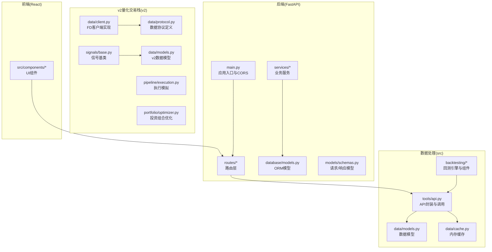
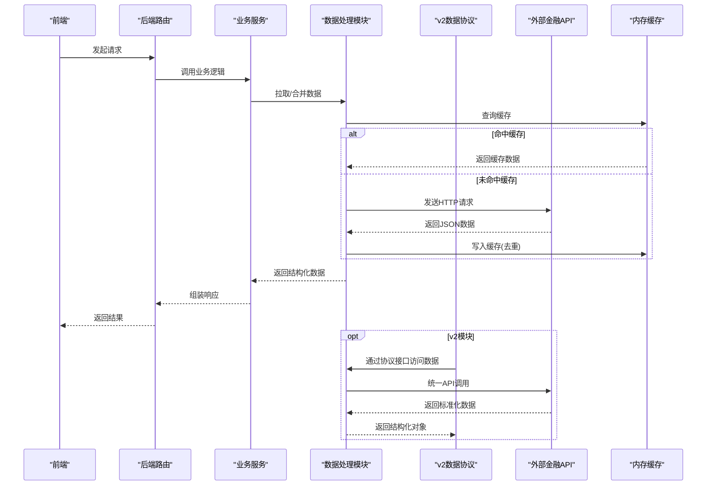
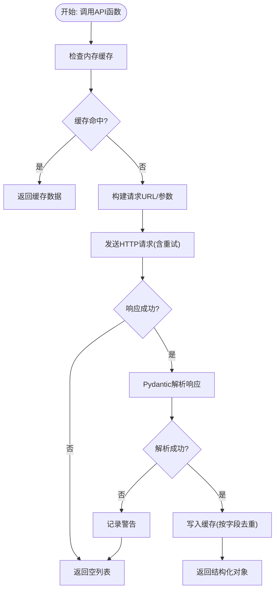
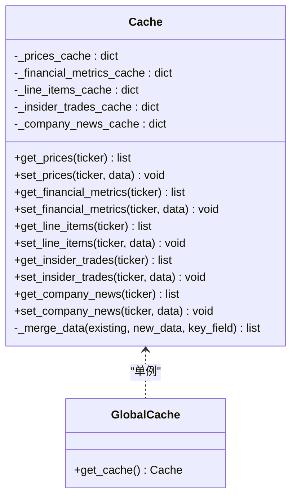
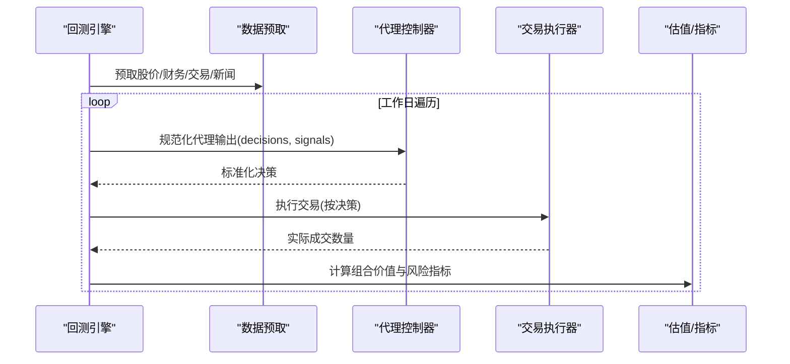
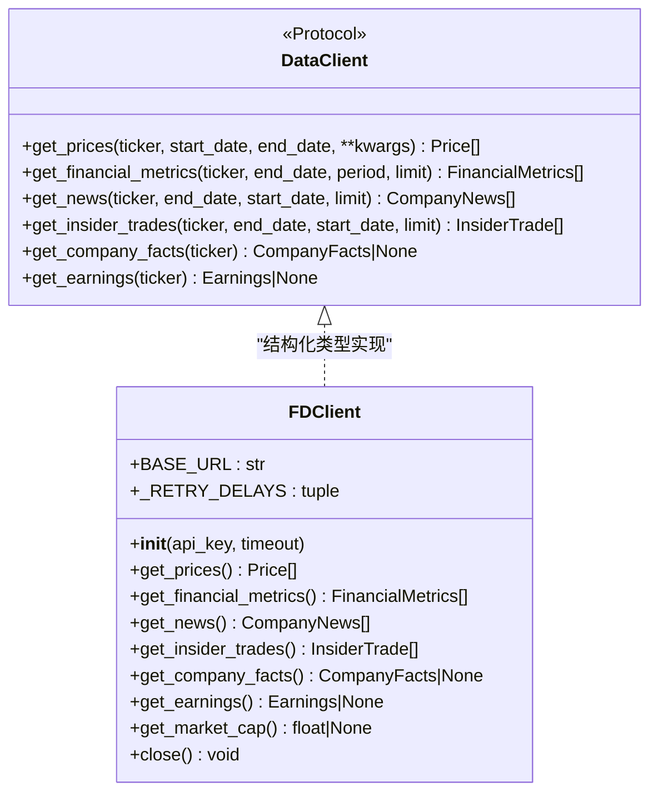
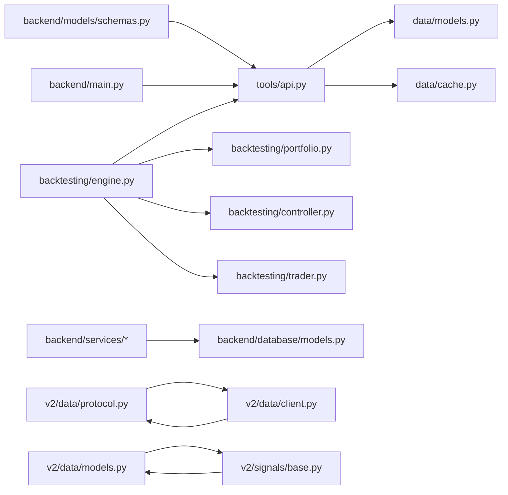

# 数据处理系统

<cite>
**本文档引用的文件**
- [src/data/models.py](file://src/data/models.py)
- [src/data/cache.py](file://src/data/cache.py)
- [src/tools/api.py](file://src/tools/api.py)
- [src/backtesting/engine.py](file://src/backtesting/engine.py)
- [src/backtesting/controller.py](file://src/backtesting/controller.py)
- [src/backtesting/portfolio.py](file://src/backtesting/portfolio.py)
- [src/backtesting/trader.py](file://src/backtesting/trader.py)
- [app/backend/database/models.py](file://app/backend/database/models.py)
- [app/backend/models/schemas.py](file://app/backend/models/schemas.py)
- [app/backend/main.py](file://app/backend/main.py)
- [app/backend/repositories/flow_repository.py](file://app/backend/repositories/flow_repository.py)
- [app/backend/services/portfolio.py](file://app/backend/services/portfolio.py)
- [src/utils/api_key.py](file://src/utils/api_key.py)
- [tests/test_cache.py](file://tests/test_cache.py)
- [tests/test_api_rate_limiting.py](file://tests/test_api_rate_limiting.py)
- [v2/data/protocol.py](file://v2/data/protocol.py)
- [v2/data/client.py](file://v2/data/client.py)
- [v2/data/models.py](file://v2/data/models.py)
- [v2/data/__init__.py](file://v2/data/__init__.py)
- [v2/data/test_client.py](file://v2/data/test_client.py)
- [v2/models.py](file://v2/models.py)
- [v2/__init__.py](file://v2/__init__.py)
- [v2/README.md](file://v2/README.md)
- [v2/signals/base.py](file://v2/signals/base.py)
- [v2/backtesting/engine.py](file://v2/backtesting/engine.py)
- [v2/pipeline/execution.py](file://v2/pipeline/execution.py)
- [v2/portfolio/optimizer.py](file://v2/portfolio/optimizer.py)
</cite>

## 更新摘要
**所做更改**
- 新增v2数据协议基础设施章节，包括协议定义、客户端实现和初始化模块
- 更新架构总览图，反映v2量化交易栈的新架构
- 新增数据协议与客户端模式章节，说明结构化类型系统
- 更新依赖关系分析，包含v2模块的集成
- 新增v2模块的性能考虑和故障排除指南

## 目录
1. [简介](#简介)
2. [项目结构](#项目结构)
3. [核心组件](#核心组件)
4. [架构总览](#架构总览)
5. [详细组件分析](#详细组件分析)
6. [v2数据协议基础设施](#v2数据协议基础设施)
7. [依赖关系分析](#依赖关系分析)
8. [性能考虑](#性能考虑)
9. [故障排除指南](#故障排除指南)
10. [结论](#结论)
11. [附录](#附录)

## 简介
本文件面向"AI对冲基金"项目中的数据处理系统，系统围绕金融数据获取、缓存与预处理展开，覆盖股价数据、财务指标、新闻情感、大股东交易等多源数据的集成与处理流程。文档重点阐述：
- API工具封装与调用策略（含速率限制与重试）
- 数据模型定义与验证规则
- 缓存策略与去重机制
- 数据生命周期管理与存储优化
- 查询性能调优建议
- 数据安全、隐私与访问控制
- 数据质量监控、完整性检查与一致性保证
- 最佳实践与故障排除

**更新** 新增v2量化交易栈的数据协议基础设施，提供结构化类型系统和协议驱动的客户端实现。

## 项目结构
后端采用FastAPI提供REST接口，数据库使用SQLAlchemy，前端为React/Vite应用。数据处理相关的核心代码集中在src目录下的tools、data、backtesting子模块，并通过后端路由与服务层进行整合。v2模块提供全新的量化交易栈，包含数据协议、信号生成、特征工程等功能模块。

**图表来源**
- [app/backend/main.py:1-56](file://app/backend/main.py#L1-L56)
- [src/tools/api.py:1-367](file://src/tools/api.py#L1-L367)
- [src/data/models.py:1-175](file://src/data/models.py#L1-L175)
- [src/data/cache.py:1-72](file://src/data/cache.py#L1-L72)
- [src/backtesting/engine.py:1-195](file://src/backtesting/engine.py#L1-L195)
- [v2/data/protocol.py:1-74](file://v2/data/protocol.py#L1-L74)
- [v2/data/client.py:1-227](file://v2/data/client.py#L1-L227)
- [v2/data/models.py:1-262](file://v2/data/models.py#L1-L262)
- [v2/signals/base.py:1-82](file://v2/signals/base.py#L1-L82)

**章节来源**
- [app/backend/main.py:1-56](file://app/backend/main.py#L1-L56)
- [src/tools/api.py:1-367](file://src/tools/api.py#L1-L367)
- [src/data/models.py:1-175](file://src/data/models.py#L1-L175)
- [src/data/cache.py:1-72](file://src/data/cache.py#L1-L72)
- [src/backtesting/engine.py:1-195](file://src/backtesting/engine.py#L1-L195)
- [v2/README.md:1-46](file://v2/README.md#L1-L46)

## 核心组件
- API工具封装：统一处理HTTP请求、速率限制、重试、解析与缓存写入，支持股价、财务指标、新闻、大股东交易等多类接口。
- 数据模型：基于Pydantic定义强类型数据结构，确保输入输出一致性与可验证性。
- 内存缓存：按键合并去重，避免重复拉取与重复入库。
- 回测引擎：协调数据预取、交易执行、估值与指标计算，形成闭环的数据驱动决策流程。
- 后端模型与路由：定义请求/响应模型、数据库表结构与API路由，支撑前后端交互。
- **v2数据协议基础设施**：基于结构化类型（structural typing）的协议定义，提供类型安全的数据客户端接口。

**章节来源**
- [src/tools/api.py:29-367](file://src/tools/api.py#L29-L367)
- [src/data/models.py:4-175](file://src/data/models.py#L4-L175)
- [src/data/cache.py:1-72](file://src/data/cache.py#L1-L72)
- [src/backtesting/engine.py:27-195](file://src/backtesting/engine.py#L27-L195)
- [app/backend/models/schemas.py:1-292](file://app/backend/models/schemas.py#L1-L292)
- [app/backend/database/models.py:6-115](file://app/backend/database/models.py#L6-L115)
- [v2/data/protocol.py:1-74](file://v2/data/protocol.py#L1-L74)

## 架构总览
系统采用"前端-后端-外部API-缓存-数据库"的分层架构。前端通过后端路由发起请求，后端服务层调用数据处理模块，数据处理模块对接外部金融API并写入本地缓存；回测引擎在内存中完成数据预取与交易模拟；最终结果通过后端路由返回给前端。v2模块提供独立的量化交易栈，通过数据协议实现松耦合的数据访问。

**图表来源**
- [src/tools/api.py:29-367](file://src/tools/api.py#L29-L367)
- [src/data/cache.py:11-62](file://src/data/cache.py#L11-L62)
- [app/backend/models/schemas.py:61-141](file://app/backend/models/schemas.py#L61-L141)
- [v2/data/protocol.py:32-74](file://v2/data/protocol.py#L32-L74)
- [v2/data/client.py:23-227](file://v2/data/client.py#L23-L227)

## 详细组件分析

### API工具封装与调用策略
- 统一请求函数：支持GET/POST，自动处理429速率限制，线性退避重试，最多重试若干次。
- 多数据源接口：
  - 股价：按日期区间拉取日线数据，转换为DataFrame。
  - 财务指标：按报告期与周期查询，支持TTM等。
  - 新闻：按时间范围分页拉取，支持情感字段。
  - 大股东交易：按时间范围分页拉取，支持去重。
  - 公司概况：按股票代码查询基本信息。
- 解析与校验：使用Pydantic模型解析响应，失败时记录警告并返回空集合。
- 缓存写入：将解析后的字典写入内存缓存，按不同键字段去重。

**图表来源**
- [src/tools/api.py:29-367](file://src/tools/api.py#L29-L367)
- [src/data/models.py:13-175](file://src/data/models.py#L13-L175)
- [src/data/cache.py:11-62](file://src/data/cache.py#L11-L62)

**章节来源**
- [src/tools/api.py:29-367](file://src/tools/api.py#L29-L367)
- [src/data/models.py:13-175](file://src/data/models.py#L13-L175)
- [src/data/cache.py:11-62](file://src/data/cache.py#L11-L62)

### 数据模型定义与验证规则
- 股价模型：包含开盘、收盘、最高、最低、成交量与时间字段。
- 财务指标模型：覆盖估值、盈利能力、运营效率、流动性、杠杆、增长与股利等多维度指标，部分字段允许为空。
- 行项目模型：动态扩展额外字段，便于灵活适配不同报表项。
- 大股东交易模型：包含交易人、职位、交易数量、价格、持股变化等字段。
- 新闻模型：标题、作者、来源、日期、URL与情感标签。
- 公司概况模型：名称、行业、市值、员工数、网站等。
- 投资组合与分析模型：用于回测与策略输出。

**章节来源**
- [src/data/models.py:4-175](file://src/data/models.py#L4-L175)

### 缓存策略与去重机制
- 缓存键设计：将关键参数拼接为唯一键，如"股票+开始日期+结束日期"，确保精确匹配。
- 去重策略：按关键字段（时间、报告期、公告日期等）去重，保留原有值，避免覆盖。
- 存储结构：按数据类型维护独立字典，键为股票代码或复合键，值为列表。
- 单例全局缓存：提供全局实例，减少重复初始化开销。

**图表来源**
- [src/data/cache.py:1-72](file://src/data/cache.py#L1-L72)

**章节来源**
- [src/data/cache.py:1-72](file://src/data/cache.py#L1-L72)
- [tests/test_cache.py:1-159](file://tests/test_cache.py#L1-L159)

### 回测引擎与数据预取
- 预取策略：在回测窗口前一年统一预取股价、财务指标、大股东交易与新闻，提升运行时性能。
- 日内循环：按工作日遍历，获取前一日到当日的股价序列，若缺失则跳过该日。
- 决策与执行：通过控制器规范化代理输出，交易执行器根据动作与数量执行买卖/做空/平仓。
- 估值与指标：计算组合价值、多头/空头敞口、净敞口、最大回撤等指标。

**图表来源**
- [src/backtesting/engine.py:81-195](file://src/backtesting/engine.py#L81-L195)
- [src/backtesting/controller.py:9-68](file://src/backtesting/controller.py#L9-L68)
- [src/backtesting/trader.py:7-40](file://src/backtesting/trader.py#L7-L40)
- [src/backtesting/portfolio.py:9-196](file://src/backtesting/portfolio.py#L9-L196)

**章节来源**
- [src/backtesting/engine.py:81-195](file://src/backtesting/engine.py#L81-L195)
- [src/backtesting/controller.py:9-68](file://src/backtesting/controller.py#L9-L68)
- [src/backtesting/trader.py:7-40](file://src/backtesting/trader.py#L7-L40)
- [src/backtesting/portfolio.py:9-196](file://src/backtesting/portfolio.py#L9-L196)

### 后端模型与路由
- 数据库模型：定义流程、流程运行、运行周期与API密钥表，支持JSON字段存储复杂状态。
- 请求/响应模型：统一输入输出格式，包含字段校验（如交易价格必须为正）。
- 应用入口：配置CORS、初始化数据库表、注册路由。

**章节来源**
- [app/backend/database/models.py:6-115](file://app/backend/database/models.py#L6-L115)
- [app/backend/models/schemas.py:1-292](file://app/backend/models/schemas.py#L1-L292)
- [app/backend/main.py:1-56](file://app/backend/main.py#L1-L56)

### API密钥管理与访问控制
- 密钥来源：从状态对象中提取指定API密钥，支持在运行时注入。
- 后端密钥表：提供统一的密钥存储与启用/禁用管理，便于集中控制与审计。

**章节来源**
- [src/utils/api_key.py:3-9](file://src/utils/api_key.py#L3-L9)
- [app/backend/database/models.py:97-115](file://app/backend/database/models.py#L97-L115)

## v2数据协议基础设施

### 数据协议定义
v2模块引入了基于结构化类型（structural typing）的数据协议系统，通过`DataClient`协议定义统一的数据访问接口。该协议无需继承即可实现，Python的结构化类型系统自动验证实现类是否满足协议要求。

**图表来源**
- [v2/data/protocol.py:32-74](file://v2/data/protocol.py#L32-L74)
- [v2/data/client.py:23-227](file://v2/data/client.py#L23-L227)

### FD客户端实现
FDClient提供了完整的Financial Datasets API客户端实现，支持所有主要的金融数据获取功能：

- **HTTP会话管理**：使用`requests.Session()`实现连接复用和API密钥注入
- **速率限制处理**：内置指数退避重试机制，支持多次重试
- **上下文管理**：实现`__enter__`和`__exit__`方法，确保资源正确释放
- **数据获取方法**：提供股价、财务指标、新闻、大股东交易、公司事实和收益数据的获取接口

### v2数据模型
v2模块的数据模型基于Pydantic，提供类型安全的数据结构：

- **价格模型**：OHLCV数据结构，包含开盘、收盘、最高、最低、成交量和时间戳
- **财务指标模型**：涵盖估值、盈利能力、运营效率、流动性、杠杆、增长和每股指标
- **新闻模型**：文章标题、来源、日期和URL等字段
- **公司事实模型**：公司元数据，包括活跃状态、名称、行业分类等
- **收益数据模型**：季度和年度收益的详细财务信息

### v2模块初始化
v2模块通过`__init__.py`文件提供统一的导入接口，导出所有公共API：

- **数据客户端**：FDClient用于外部API调用
- **数据协议**：DataClient协议定义数据访问接口
- **数据模型**：各种金融数据的Pydantic模型
- **信号基础类**：BaseSignal抽象基类，定义信号生成接口

**章节来源**
- [v2/data/protocol.py:1-74](file://v2/data/protocol.py#L1-L74)
- [v2/data/client.py:1-227](file://v2/data/client.py#L1-L227)
- [v2/data/models.py:1-262](file://v2/data/models.py#L1-L262)
- [v2/data/__init__.py:1-30](file://v2/data/__init__.py#L1-L30)
- [v2/models.py:1-68](file://v2/models.py#L1-L68)

## 依赖关系分析
- 组件耦合：
  - 数据处理模块依赖缓存与数据模型，对外部API进行统一封装。
  - 回测引擎依赖数据处理模块提供的数据获取函数。
  - 后端服务层依赖数据库模型与请求/响应模型。
  - **v2模块**独立于主系统，通过协议接口实现松耦合集成。
- 可能的循环依赖：当前结构清晰，未发现循环导入。
- 外部依赖：requests、pandas、sqlalchemy、pydantic等。

**图表来源**
- [src/tools/api.py:10-23](file://src/tools/api.py#L10-L23)
- [src/data/models.py:1-23](file://src/data/models.py#L1-L23)
- [src/data/cache.py:1-10](file://src/data/cache.py#L1-L10)
- [src/backtesting/engine.py:18-24](file://src/backtesting/engine.py#L18-L24)
- [app/backend/models/schemas.py:1-7](file://app/backend/models/schemas.py#L1-L7)
- [app/backend/main.py:6-30](file://app/backend/main.py#L6-L30)
- [v2/data/protocol.py:18-29](file://v2/data/protocol.py#L18-L29)
- [v2/data/client.py:11-18](file://v2/data/client.py#L11-L18)
- [v2/data/models.py:9,233](file://v2/data/models.py#L9,L233)
- [v2/signals/base.py:10](file://v2/signals/base.py#L10)

## 性能考虑
- 缓存命中率：通过精确缓存键与按字段去重，减少重复网络请求与解析成本。
- 预取策略：回测前统一拉取所需历史数据，降低运行时延迟。
- 数据类型优化：使用数值型列与索引，便于快速筛选与排序。
- 分页与限流：合理设置分页大小与退避策略，避免触发速率限制。
- 并发与批处理：在满足一致性前提下，可考虑批量拉取与并发请求以提升吞吐。
- **v2模块性能优化**：
  - 结构化类型检查在运行时进行，避免编译时开销
  - FDClient使用HTTP会话复用，减少连接建立成本
  - 内置速率限制处理，避免API调用失败
  - Pydantic模型提供快速数据验证和序列化

## 故障排除指南
- 速率限制问题：
  - 现象：出现429错误。
  - 排查：检查重试次数与退避间隔是否合理，确认API密钥有效。
  - 处理：增加重试上限或降低请求频率。
- 解析失败：
  - 现象：响应无法解析为Pydantic模型。
  - 排查：查看日志警告，确认响应格式与字段是否符合预期。
  - 处理：更新模型定义或调整请求参数。
- 缓存不一致：
  - 现象：同一键返回旧数据。
  - 排查：确认缓存键是否包含所有关键参数，检查去重逻辑。
  - 处理：修正缓存键或清理缓存。
- 数据缺失：
  - 现象：某日股价为空导致跳过。
  - 排查：检查目标日期是否存在交易日，确认API可用性。
  - 处理：扩大预取时间窗或补充缺失数据。
- **v2模块故障排除**：
  - 协议实现检查：确认自定义数据客户端是否正确实现所有协议方法
  - API密钥配置：验证FINANCIAL_DATASETS_API_KEY环境变量设置
  - 连接超时：调整FDClient的timeout参数以适应网络条件
  - 数据验证：检查Pydantic模型字段是否与API响应匹配

**章节来源**
- [tests/test_api_rate_limiting.py:1-249](file://tests/test_api_rate_limiting.py#L1-L249)
- [tests/test_cache.py:1-159](file://tests/test_cache.py#L1-L159)
- [v2/data/client.py:191-227](file://v2/data/client.py#L191-L227)
- [v2/data/protocol.py:32-74](file://v2/data/protocol.py#L32-L74)

## 结论
本数据处理系统通过统一的API封装、强类型的模型定义、高效的内存缓存与合理的回测流程，实现了金融多源数据的稳定获取与高效利用。结合速率限制处理、数据验证与去重策略，系统在性能与可靠性方面具备良好表现。

**更新** 新增的v2量化交易栈提供了更加现代化的架构设计，通过结构化类型协议实现松耦合的数据访问，支持更灵活的扩展和集成。v2模块专注于量化交易的核心流程，包括数据获取、信号生成、特征工程、投资组合优化和风险管理等环节，为构建完整的量化交易系统奠定了坚实基础。

建议后续在生产环境中引入持久化缓存与分布式锁、完善数据质量监控与告警机制，并持续优化查询与批处理策略。同时可以考虑将v2模块逐步集成到主系统中，利用其结构化类型系统和协议驱动的设计理念提升整体架构的可维护性和扩展性。

## 附录
- 数据生命周期管理建议：
  - 清晰的缓存键设计与定期清理策略。
  - 对历史数据进行归档与压缩，降低内存占用。
  - **v2模块数据管理**：利用Pydantic模型的自动验证和序列化功能，简化数据生命周期管理。
- 存储优化：
  - 使用分区表或时间序列存储，加速范围查询。
  - 对高频字段建立索引，减少扫描成本。
  - **v2模块存储优化**：通过结构化类型协议确保数据的一致性和完整性。
- 查询性能调优：
  - 合理设置分页大小与并发度。
  - 使用向量化操作与惰性求值，减少中间对象创建。
  - **v2模块性能优化**：利用NumPy和Pandas进行高效的数据处理和计算。
- 数据安全与隐私：
  - 密钥存储加密与最小权限原则。
  - 审计日志记录敏感操作与访问轨迹。
  - **v2模块安全**：通过协议接口实现数据访问控制，确保API调用的安全性。
- 数据质量监控：
  - 建立完整性检查清单（字段非空、范围校验、趋势合理性）。
  - 一致性校验（跨数据源字段对齐、时间戳一致性）。
  - **v2模块质量监控**：利用Pydantic的自动验证功能确保数据质量。
- 最佳实践：
  - 将外部API调用抽象为可替换的适配器，便于切换与测试。
  - 在关键路径加入超时与熔断机制，增强鲁棒性。
  - **v2模块最佳实践**：遵循协议驱动的设计原则，确保系统的可扩展性和可维护性。