# 数据模型定义

<cite>
**本文档引用的文件**
- [models.py](file://app/backend/database/models.py)
- [schemas.py](file://app/backend/models/schemas.py)
- [models.py](file://src/data/models.py)
- [models.py](file://v2/data/models.py)
- [client.py](file://v2/data/client.py)
- [protocol.py](file://v2/data/protocol.py)
- [models.py](file://v2/models.py)
- [types.py](file://src/backtesting/types.py)
- [state.py](file://src/graph/state.py)
- [news_sentiment.py](file://src/agents/news_sentiment.py)
- [sentiment.py](file://src/agents/sentiment.py)
- [valuation.py](file://src/agents/valuation.py)
- [1b1feba3d897_add_data_column_to_hedge_fund_flows.py](file://app/backend/alembic/versions/1b1feba3d897_add_data_column_to_hedge_fund_flows.py)
- [5274886e5bee_add_hedgefundflow_table.py](file://app/backend/alembic/versions/5274886e5bee_add_hedgefundflow_table.py)
</cite>

## 更新摘要
**变更内容**
- 新增v2数据协议系统(DataClient协议)架构
- 添加FDClient金融数据API客户端实现
- 扩展数据模型到v2版本，包含新的财务数据结构
- 更新数据管道架构以支持协议驱动的数据源

## 目录
1. [简介](#简介)
2. [项目结构](#项目结构)
3. [核心数据模型](#核心数据模型)
4. [架构概览](#架构概览)
5. [详细组件分析](#详细组件分析)
6. [v2数据协议系统](#v2数据协议系统)
7. [依赖关系分析](#依赖关系分析)
8. [性能考虑](#性能考虑)
9. [故障排除指南](#故障排除指南)
10. [结论](#结论)
11. [附录](#附录)

## 简介

本文件详细阐述了AI对冲基金项目中的数据模型设计，涵盖了金融数据实体的建模设计和字段定义。文档重点说明了股价数据模型、财务指标模型、新闻情感模型等核心数据结构，解释了数据类型选择、字段约束和验证规则。同时包含了主键/外键关系设计、索引策略和性能优化建议，提供了数据模型的使用示例和最佳实践，以及数据继承关系、复合模型和嵌套结构的设计模式。

**更新** 新增了v2数据协议系统，引入了DataClient协议和FDClient实现，为数据获取提供了更加灵活和可扩展的架构。

## 项目结构

该项目采用分层架构设计，主要包含以下数据模型层次：

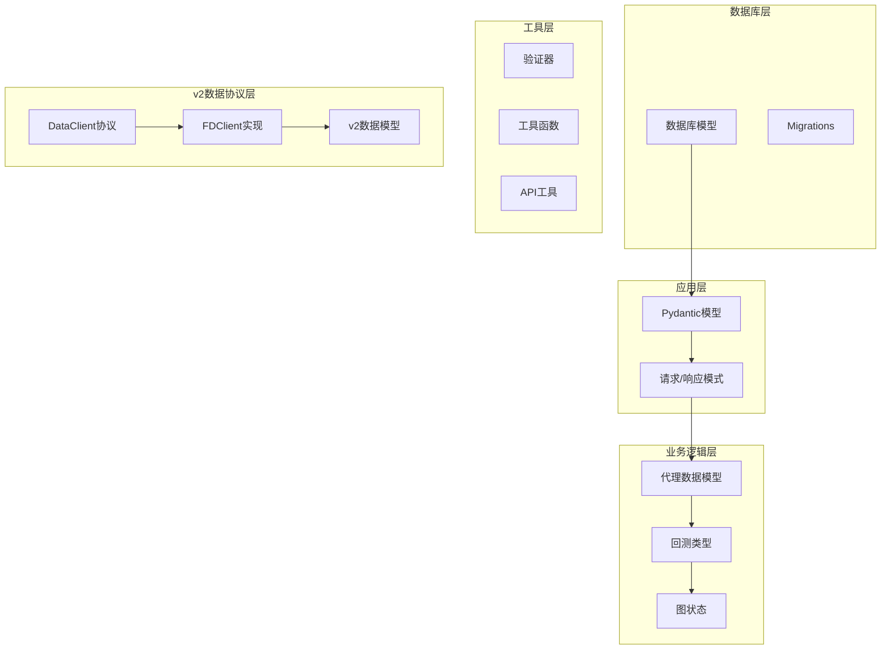

**图表来源**
- [models.py:1-115](file://app/backend/database/models.py#L1-L115)
- [schemas.py:1-292](file://app/backend/models/schemas.py#L1-L292)
- [protocol.py:32-74](file://v2/data/protocol.py#L32-L74)
- [client.py:23-227](file://v2/data/client.py#L23-L227)

**章节来源**
- [models.py:1-115](file://app/backend/database/models.py#L1-L115)
- [schemas.py:1-292](file://app/backend/models/schemas.py#L1-L292)
- [protocol.py:32-74](file://v2/data/protocol.py#L32-L74)
- [client.py:23-227](file://v2/data/client.py#L23-L227)

## 核心数据模型

### 股价数据模型

股价数据模型采用简洁高效的结构设计，支持OHLCV（开盘价、最高价、最低价、收盘价、成交量）数据的完整表示。

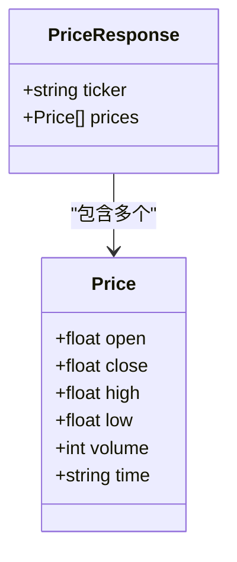

**图表来源**
- [models.py:4-16](file://src/data/models.py#L4-L16)

股价数据模型的关键特性：
- **数据完整性**：包含完整的OHLCV数据集，确保技术分析需求
- **时间序列**：支持多时间维度的价格数据存储
- **JSON序列化**：便于与前端和外部系统集成

**章节来源**
- [models.py:4-16](file://src/data/models.py#L4-L16)

### 财务指标模型

财务指标模型采用分组分类的方式，将复杂的财务比率和指标进行逻辑分组：

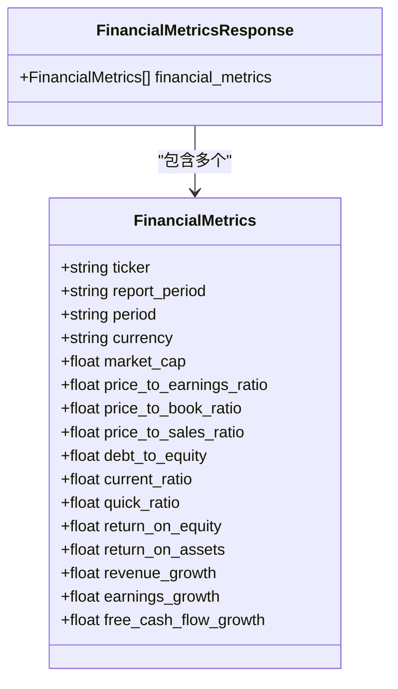

**图表来源**
- [models.py:18-66](file://src/data/models.py#L18-L66)

财务指标模型的设计特点：
- **分组组织**：按估值、盈利能力、效率、流动性、杠杆、增长、每股指标等维度分组
- **可扩展性**：支持动态字段添加，适应新的财务指标需求
- **空值处理**：所有数值型字段支持None值，便于处理缺失数据

**章节来源**
- [models.py:18-66](file://src/data/models.py#L18-L66)

### 新闻情感模型

新闻情感模型结合了结构化数据和自然语言处理结果：

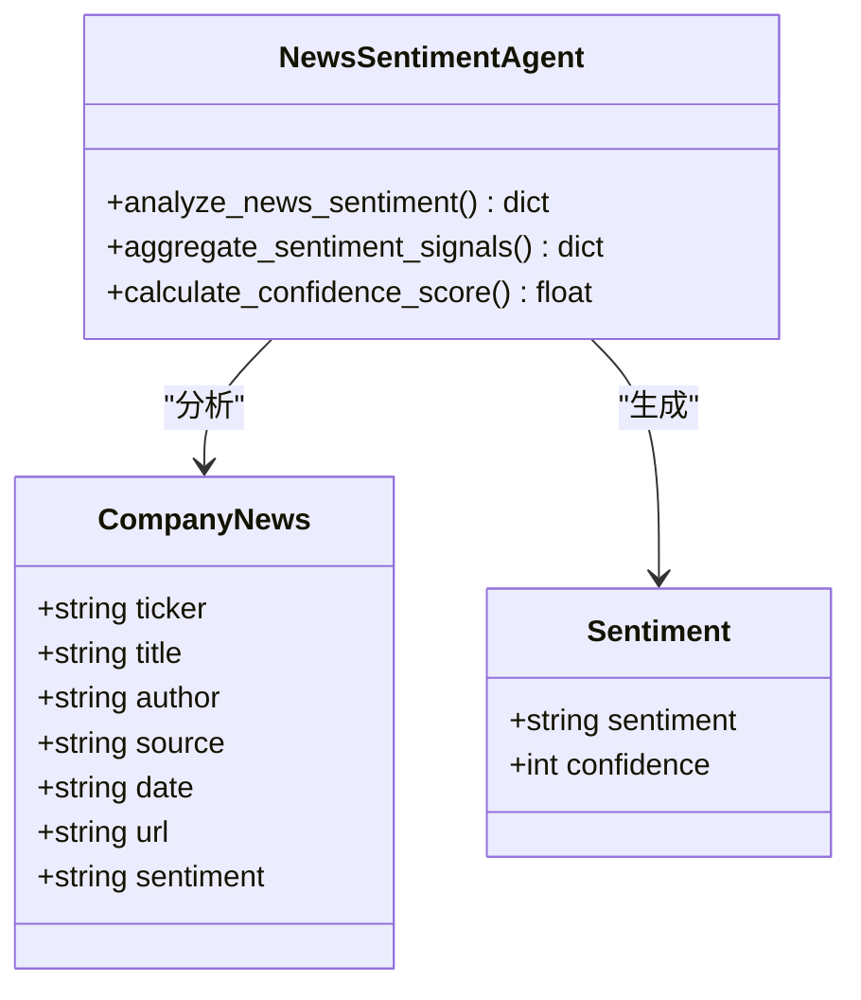

**图表来源**
- [models.py:102-114](file://src/data/models.py#L102-L114)
- [news_sentiment.py:18-23](file://src/agents/news_sentiment.py#L18-L23)

新闻情感模型的核心功能：
- **情感分类**：支持积极、消极、中性三种情感分类
- **置信度评估**：提供情感判断的置信度分数
- **聚合分析**：支持多篇文章的情感综合分析

**章节来源**
- [models.py:102-114](file://src/data/models.py#L102-L114)
- [news_sentiment.py:18-23](file://src/agents/news_sentiment.py#L18-L23)

### 组合投资模型

组合投资模型支持复杂的投资组合管理需求：

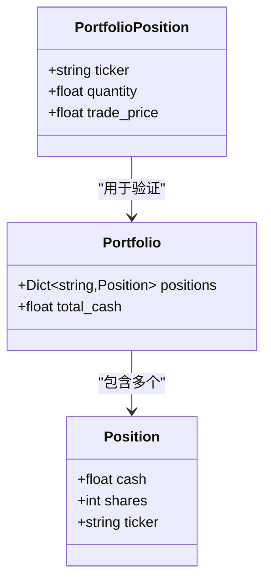

**图表来源**
- [models.py:141-150](file://src/data/models.py#L141-L150)
- [schemas.py:22-26](file://app/backend/models/schemas.py#L22-L26)

组合投资模型的设计要点：
- **嵌套结构**：支持多层级的投资组合嵌套
- **类型安全**：通过Pydantic验证器确保数据完整性
- **灵活性**：支持现金和股票的混合投资组合

**章节来源**
- [models.py:141-150](file://src/data/models.py#L141-L150)
- [schemas.py:22-26](file://app/backend/models/schemas.py#L22-L26)

## 架构概览

### 数据流架构

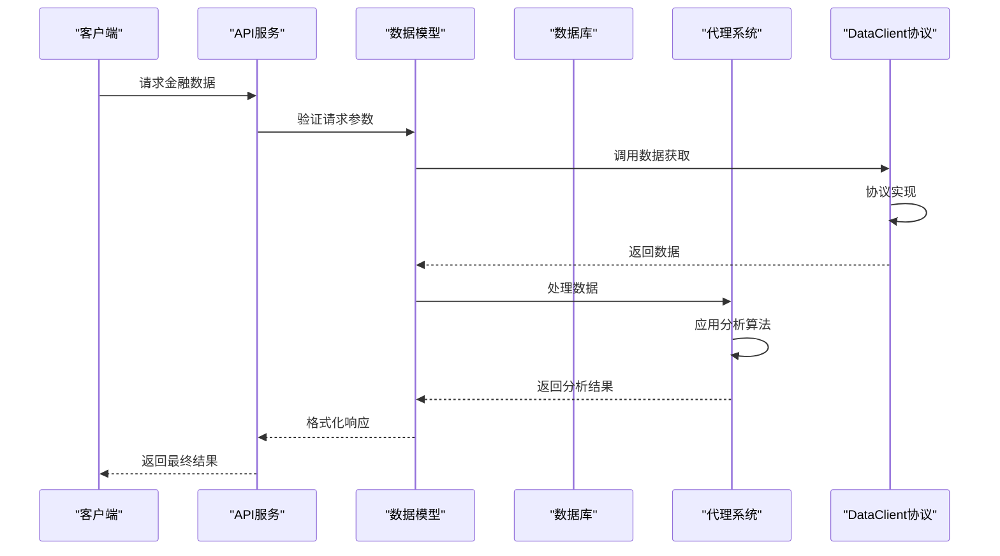

**图表来源**
- [schemas.py:61-92](file://app/backend/models/schemas.py#L61-L92)
- [models.py:1-175](file://src/data/models.py#L1-L175)
- [protocol.py:32-74](file://v2/data/protocol.py#L32-L74)

### 数据验证流程

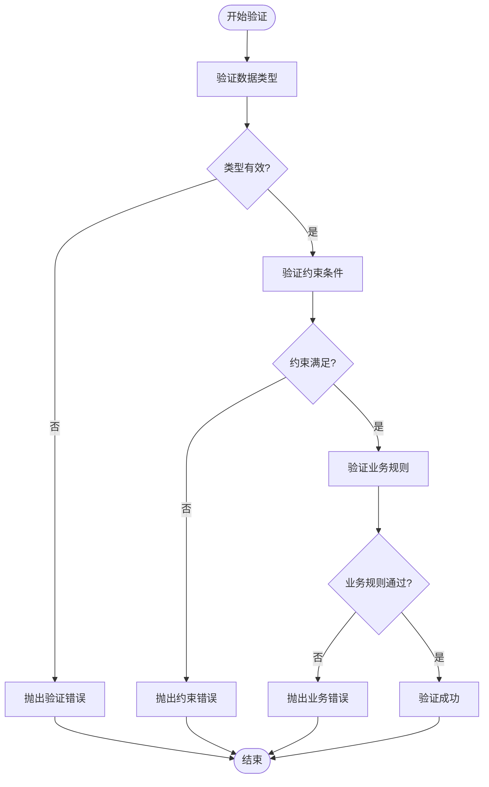

**图表来源**
- [schemas.py:27-32](file://app/backend/models/schemas.py#L27-L32)
- [models.py:18-66](file://src/data/models.py#L18-L66)

## 详细组件分析

### 数据库模型分析

数据库层采用SQLAlchemy ORM设计，实现了完整的金融数据存储方案：

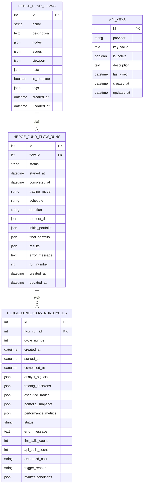

**图表来源**
- [models.py:6-115](file://app/backend/database/models.py#L6-L115)

数据库模型的关键设计原则：
- **主键设计**：所有表都包含自增主键，确保唯一性
- **外键关系**：明确的父子关系设计，支持级联查询
- **索引策略**：为常用查询字段建立索引，提升查询性能
- **JSON字段**：灵活存储非结构化数据，支持动态扩展

**章节来源**
- [models.py:6-115](file://app/backend/database/models.py#L6-L115)

### Pydantic模型分析

应用层采用Pydantic模型实现数据验证和序列化：

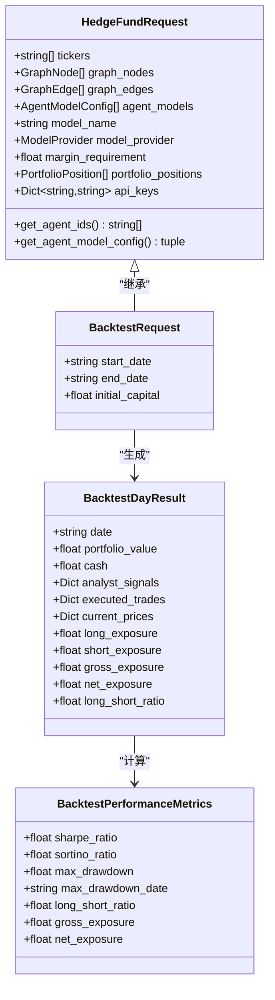

**图表来源**
- [schemas.py:61-134](file://app/backend/models/schemas.py#L61-L134)
- [schemas.py:100-123](file://app/backend/models/schemas.py#L100-L123)

Pydantic模型的设计优势：
- **自动验证**：运行时自动验证数据类型和格式
- **字段验证器**：支持自定义验证逻辑，如价格正数验证
- **类型注解**：提供完整的类型信息，增强IDE支持
- **序列化**：自动处理JSON序列化和反序列化

**章节来源**
- [schemas.py:61-134](file://app/backend/models/schemas.py#L61-L134)
- [schemas.py:100-123](file://app/backend/models/schemas.py#L100-L123)

### 回测类型系统

回测系统采用TypedDict实现强类型的数据结构：

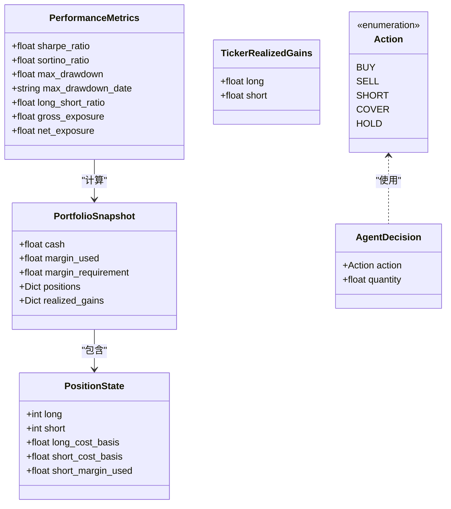

**图表来源**
- [types.py:10-16](file://src/backtesting/types.py#L10-L16)
- [types.py:21-50](file://src/backtesting/types.py#L21-L50)
- [types.py:90-104](file://src/backtesting/types.py#L90-L104)

回测类型系统的特点：
- **强类型保证**：通过TypedDict确保数据结构的正确性
- **向后兼容**：支持现有字典结构，便于渐进式重构
- **性能优化**：避免不必要的对象创建和类型检查
- **灵活性**：支持可选字段，适应不同的回测场景

**章节来源**
- [types.py:10-16](file://src/backtesting/types.py#L10-L16)
- [types.py:21-50](file://src/backtesting/types.py#L21-L50)
- [types.py:90-104](file://src/backtesting/types.py#L90-L104)

## v2数据协议系统

### DataClient协议架构

v2版本引入了全新的数据协议系统，通过Python的结构化类型系统实现了灵活的数据源抽象：

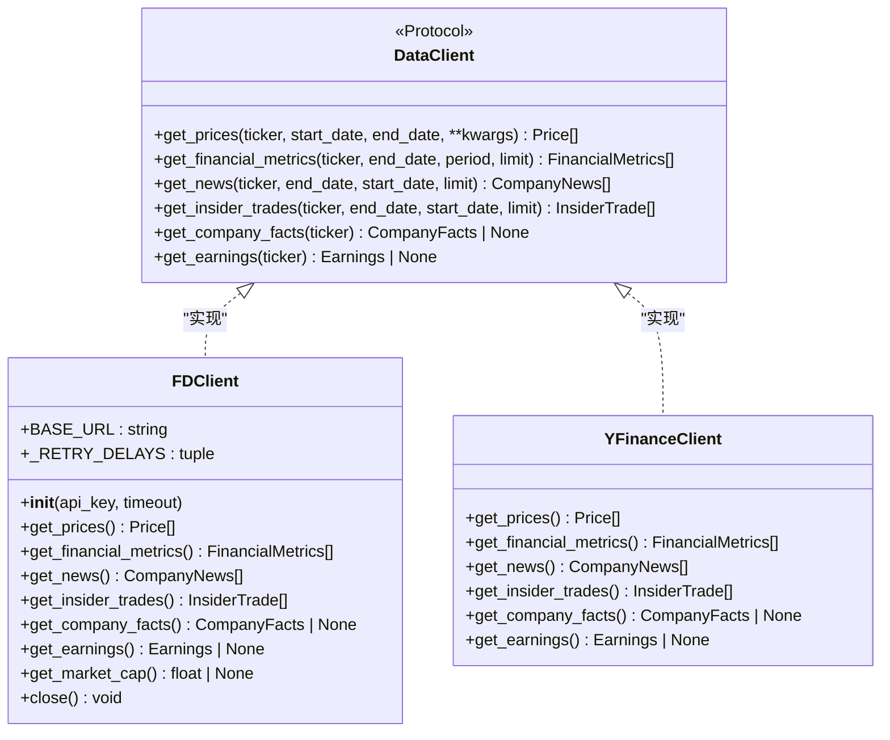

**图表来源**
- [protocol.py:32-74](file://v2/data/protocol.py#L32-L74)
- [client.py:23-227](file://v2/data/client.py#L23-L227)

DataClient协议的设计特点：
- **结构化类型**：使用Python的结构化类型系统，无需显式继承
- **统一接口**：所有数据提供者都必须实现相同的接口方法
- **错误处理**：方法在失败时返回空列表或None，从不抛出异常
- **灵活性**：支持额外的关键字参数，适应不同数据源的需求

**章节来源**
- [protocol.py:32-74](file://v2/data/protocol.py#L32-L74)

### FDClient实现详解

FDClient是DataClient协议的具体实现，提供了与Financial Datasets API的直接集成：

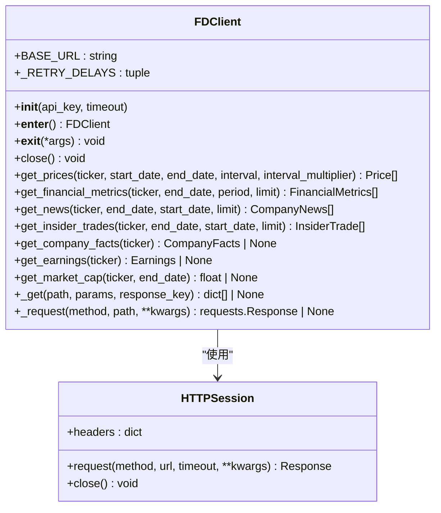

**图表来源**
- [client.py:23-227](file://v2/data/client.py#L23-L227)

FDClient的核心功能：
- **API集成**：直接连接到Financial Datasets API
- **重试机制**：内置的指数退避重试逻辑
- **错误处理**：优雅处理网络异常和API错误
- **资源管理**：实现上下文管理器接口，自动管理HTTP会话

**章节来源**
- [client.py:23-227](file://v2/data/client.py#L23-L227)

### v2数据模型扩展

v2版本的数据模型相比v1版本有了显著扩展，增加了更多专业的财务数据结构：

```mermaid
classDiagram
class Price {
+open : float
+close : float
+high : float
+low : float
+volume : int
+time : string
}
class FinancialMetrics {
+ticker : string
+report_period : string
+period : string
+currency : string | None
+valuation_fields...
+profitability_fields...
+efficiency_fields...
+liquidity_fields...
+leverage_fields...
+growth_fields...
+per_share_fields...
}
class InsiderTrade {
+ticker : string
+name : string
+filing_date : string
+is_board_director : bool
+transaction_fields...
}
class CompanyNews {
+ticker : string
+title : string
+source : string
+date : string | None
+url : string | None
}
class CompanyFacts {
+ticker : string
+is_active : bool
+company_info_fields...
+sector_industry_fields...
+exchange_location_fields...
}
class EarningsData {
+ticker : string
+report_period : string
+fiscal_period : string | None
+currency : string | None
+actuals_vs_estimates_fields...
+income_statement_fields...
+balance_sheet_fields...
+cash_flow_fields...
+change_fields...
}
class Earnings {
+ticker : string
+report_period : string
+fiscal_period : string | None
+currency : string | None
+quarterly : EarningsData | None
+annual : EarningsData | None
}
class Filing {
+ticker : string | None
+cik : string | None
+accession_number : string | None
+filing_type : string | None
+filing_date : string | None
+report_period : string | None
+document_count : int | None
+is_xbrl : bool | None
+url : string | None
}
class AnalystEstimate {
+fiscal_period : string | None
+period : string | None
+revenue : int | None
+earnings_per_share : float | None
}
```

**图表来源**
- [models.py:19-262](file://v2/data/models.py#L19-L262)

v2数据模型的扩展特点：
- **专业性增强**：增加了更多专业的财务分析字段
- **结构化设计**：使用嵌套模型组织相关字段
- **向前兼容**：所有字段都是可选的，确保向后兼容
- **类型安全**：使用Pydantic确保数据完整性

**章节来源**
- [models.py:19-262](file://v2/data/models.py#L19-L262)

### v2量化信号模型

v2版本还引入了专门的量化信号和投资组合模型：

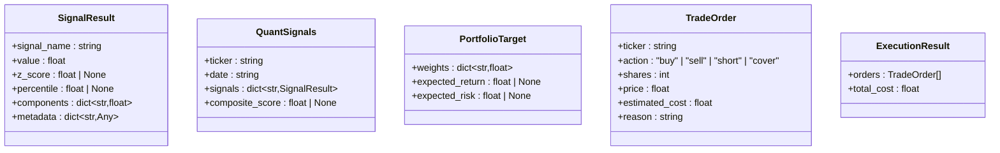

**图表来源**
- [models.py:14-68](file://v2/models.py#L14-L68)

量化信号模型的设计目标：
- **标准化输出**：统一量化信号的输出格式
- **可组合性**：支持多个信号的组合分析
- **执行导向**：直接支持交易执行决策
- **风险管理**：包含预期收益和风险的估计

**章节来源**
- [models.py:14-68](file://v2/models.py#L14-L68)

## 依赖关系分析

### 数据模型依赖图

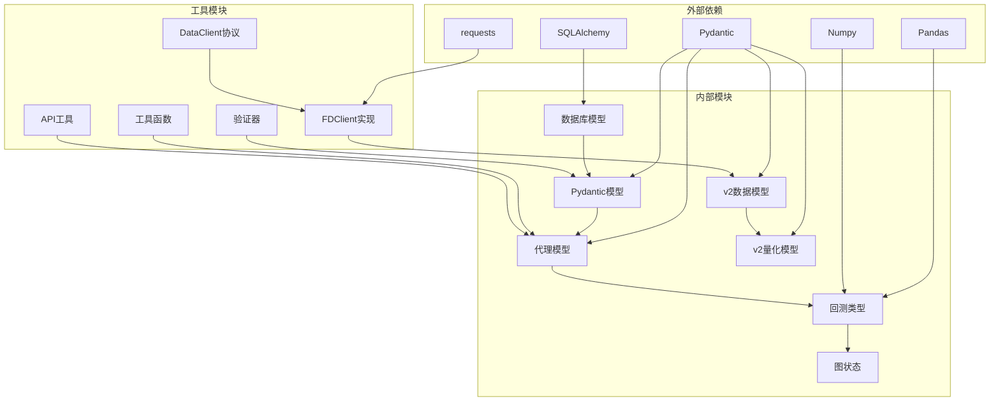

**图表来源**
- [models.py:1-3](file://app/backend/database/models.py#L1-L3)
- [models.py:1-1](file://src/data/models.py#L1-L1)
- [protocol.py:20-29](file://v2/data/protocol.py#L20-L29)
- [client.py:9-18](file://v2/data/client.py#L9-L18)
- [types.py:4-7](file://src/backtesting/types.py#L4-L7)

### 版本兼容性分析

项目采用了多层次的版本兼容性策略：

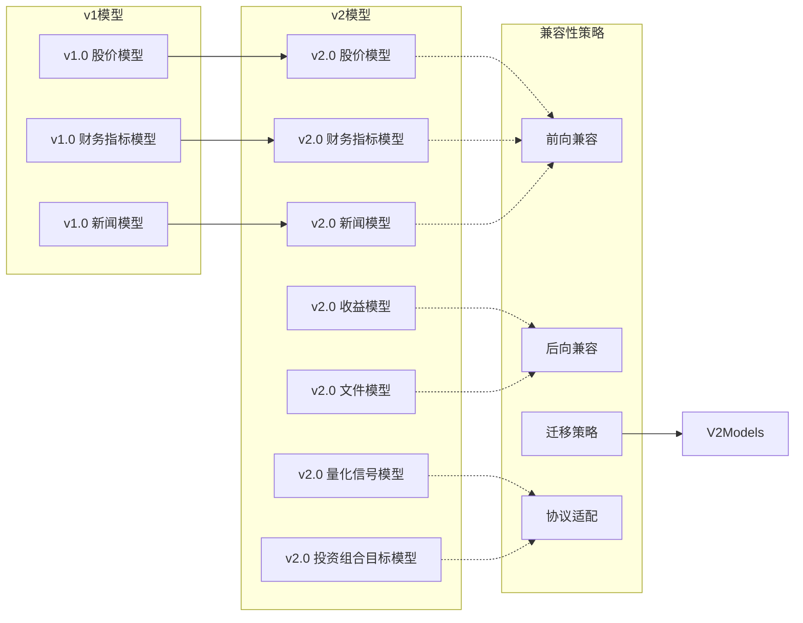

**图表来源**
- [models.py:1-6](file://v2/data/models.py#L1-L6)
- [models.py:1-175](file://src/data/models.py#L1-L175)
- [models.py:14-68](file://v2/models.py#L14-L68)

**章节来源**
- [models.py:1-6](file://v2/data/models.py#L1-L6)
- [models.py:1-175](file://src/data/models.py#L1-L175)
- [models.py:14-68](file://v2/models.py#L14-L68)

## 性能考虑

### 数据库性能优化

1. **索引策略**
   - 主键索引：所有表的主键自动建立索引
   - 外键索引：为外键字段建立索引，支持快速关联查询
   - JSON字段索引：对常用查询的JSON字段建立索引

2. **查询优化**
   - 分页查询：大量数据采用分页机制
   - 条件过滤：支持多条件组合查询
   - 连接优化：合理使用JOIN操作减少查询次数

3. **缓存策略**
   - 频繁访问的数据建立缓存
   - 结果集缓存：避免重复计算
   - 缓存失效策略：基于时间戳的智能更新

### 模型验证性能

1. **延迟验证**
   - 字段级验证：按需验证，避免全量验证
   - 异步验证：大对象验证采用异步方式
   - 批量验证：支持批量数据验证

2. **内存优化**
   - 流式处理：大数据集采用流式处理
   - 对象池：复用常用对象减少内存分配
   - 内存映射：大文件采用内存映射技术

### v2数据协议性能优化

1. **HTTP会话复用**
   - FDClient使用持久化的HTTP会话
   - 减少TCP连接开销
   - 支持连接池复用

2. **重试机制优化**
   - 指数退避重试策略
   - 最大重试次数限制
   - 超时控制防止阻塞

3. **数据序列化优化**
   - Pydantic模型的高效序列化
   - 字段级别的验证跳过
   - 额外字段忽略机制

## 故障排除指南

### 常见数据验证错误

1. **类型不匹配**
   ```python
   # 错误示例
   price = Price(open="invalid", close=100.0)
   # 正确示例
   price = Price(open=95.5, close=100.0)
   ```

2. **范围验证失败**
   ```python
   # 错误示例
   position = PortfolioPosition(trade_price=-50.0)
   # 正确示例
   position = PortfolioPosition(trade_price=50.0)
   ```

3. **约束违反**
   ```python
   # 错误示例
   request = HedgeFundRequest(tickers=[], graph_nodes=[])
   # 正确示例
   request = HedgeFundRequest(tickers=["AAPL"], graph_nodes=[node])
   ```

### v2数据协议故障排除

1. **DataClient协议实现错误**
   ```python
   # 错误示例 - 缺少必需方法
   class IncompleteClient:
       def get_prices(self, ticker, start_date, end_date):
           # 只实现了部分方法
           pass
   
   # 正确示例 - 完整实现协议
   class CompleteClient:
       def get_prices(self, ticker, start_date, end_date, **kwargs):
           # 实现所有协议方法
           return []
       
       def get_financial_metrics(self, ticker, end_date, period="ttm", limit=10):
           return []
   ```

2. **FDClient配置问题**
   ```python
   # 错误示例 - API密钥缺失
   fd = FDClient()
   
   # 正确示例 - 正确配置
   fd = FDClient(api_key="your_api_key_here")
   # 或设置环境变量
   # FINANCIAL_DATASETS_API_KEY=your_key
   ```

3. **网络请求错误**
   ```python
   # 错误示例 - 未处理异常
   prices = fd.get_prices("AAPL", "2024-01-01", "2024-12-31")
   
   # 正确示例 - 错误处理
   try:
       prices = fd.get_prices("AAPL", "2024-01-01", "2024-12-31")
       if not prices:
           print("No data returned")
   except Exception as e:
       print(f"Request failed: {e}")
   ```

### 数据迁移问题

1. **版本升级**
   - 使用Alembic进行数据库迁移
   - 保持向后兼容性
   - 提供降级回滚机制

2. **数据转换**
   - 字段重命名时提供映射
   - 类型转换时处理异常情况
   - 大数据量迁移时分批处理

3. **协议迁移**
   - 逐步替换旧的数据获取方式
   - 保持API接口的向后兼容
   - 提供过渡期的双轨制支持

**章节来源**
- [schemas.py:27-32](file://app/backend/models/schemas.py#L27-L32)
- [protocol.py:32-74](file://v2/data/protocol.py#L32-L74)
- [client.py:23-227](file://v2/data/client.py#L23-L227)
- [1b1feba3d897_add_data_column_to_hedge_fund_flows.py:21-25](file://app/backend/alembic/versions/1b1feba3d897_add_data_column_to_hedge_fund_flows.py#L21-L25)

## 结论

本数据模型设计充分考虑了金融数据的特殊性和复杂性，通过多层次的架构设计实现了高性能、高可用、易维护的数据处理系统。v2版本的引入进一步增强了系统的灵活性和可扩展性。

**更新** 新增的v2数据协议系统通过DataClient协议和FDClient实现，为数据获取提供了更加灵活和可扩展的架构。该系统支持多种数据源的统一接口，实现了协议驱动的数据访问模式。

模型设计遵循了以下核心原则：

1. **类型安全**：通过Pydantic和SQLAlchemy确保数据完整性
2. **可扩展性**：支持动态字段和新功能的快速集成
3. **协议驱动**：通过DataClient协议实现数据源的灵活替换
4. **性能优化**：合理的索引策略和查询优化
5. **版本兼容**：向前向后兼容的版本管理策略
6. **验证机制**：多层次的数据验证确保数据质量

这些设计为AI对冲基金系统的稳定运行奠定了坚实的数据基础，并为未来的功能扩展提供了良好的架构支撑。

## 附录

### 最佳实践指南

1. **数据模型设计**
   - 优先使用分组分类的模型结构
   - 为每个模型定义清晰的职责边界
   - 考虑数据的生命周期和存储策略
   - 在v2版本中充分利用协议驱动的设计

2. **验证规则设计**
   - 定义明确的业务规则和约束条件
   - 提供详细的错误信息和修复建议
   - 支持自定义验证器扩展
   - 利用v2版本的向前兼容性

3. **性能优化建议**
   - 合理使用索引，避免过度索引
   - 优化查询语句，避免N+1查询
   - 实施适当的缓存策略
   - 利用FDClient的HTTP会话复用

4. **版本管理策略**
   - 保持向后兼容性
   - 提供清晰的迁移路径
   - 定期清理过时的模型定义
   - 在协议层面实现平滑迁移

5. **协议实现指南**
   - 确保实现所有必需的方法
   - 处理好错误情况，返回空列表或None
   - 遵循协议的约定和期望
   - 提供适当的超时和重试机制