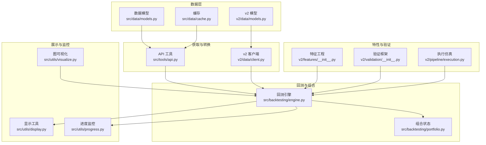
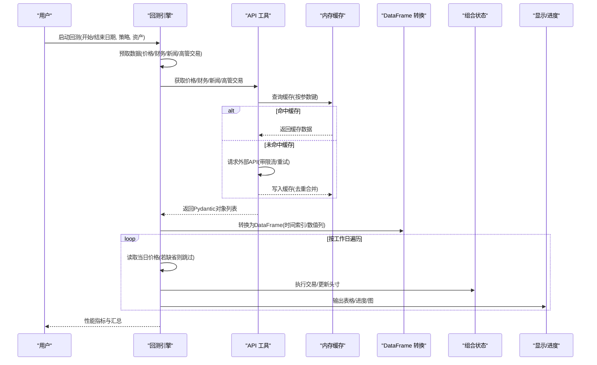
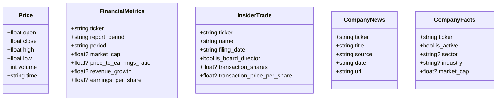
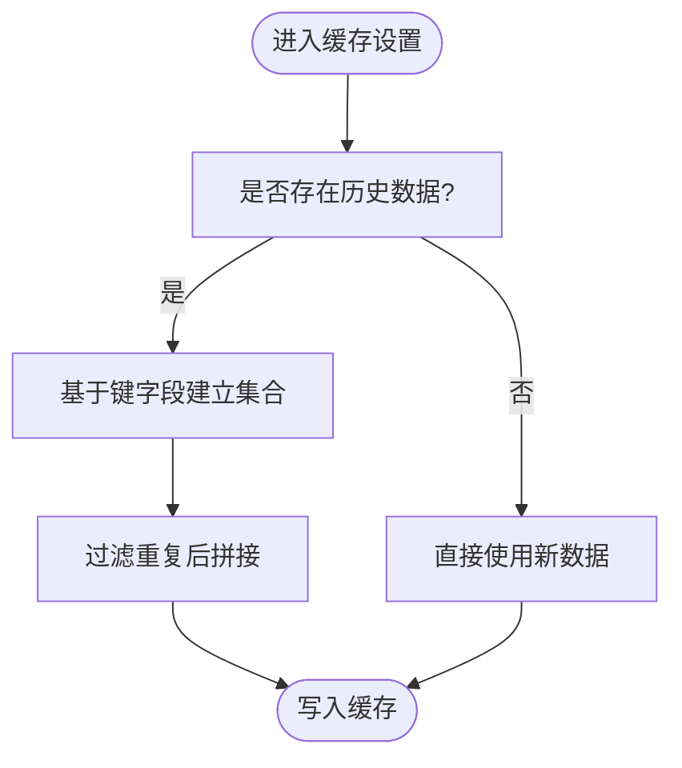
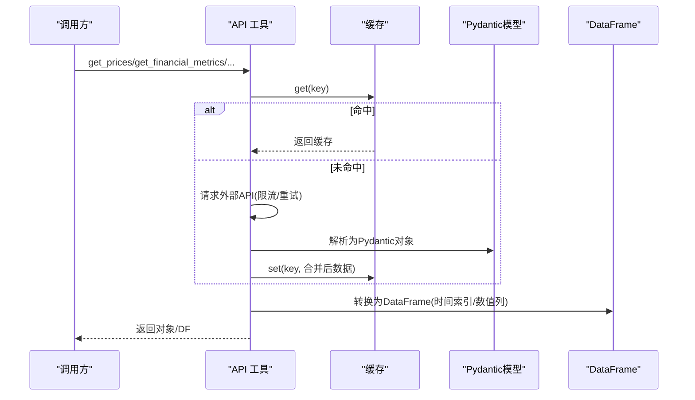
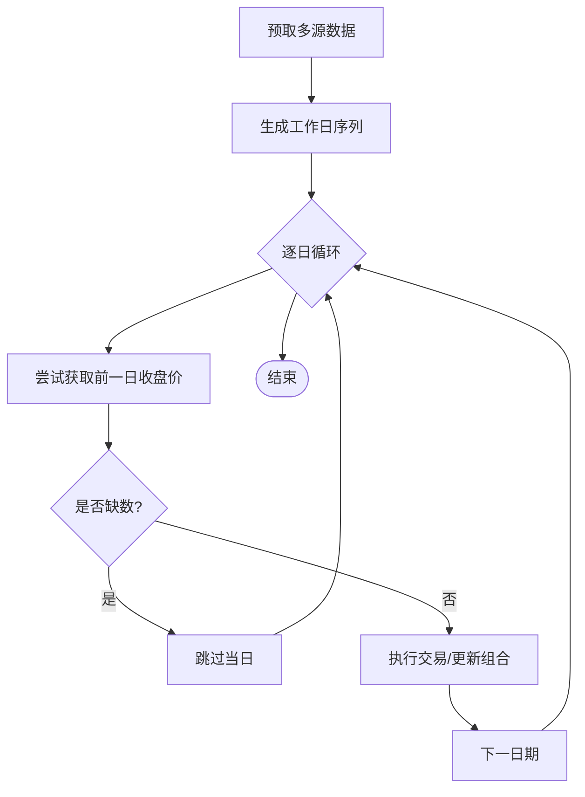
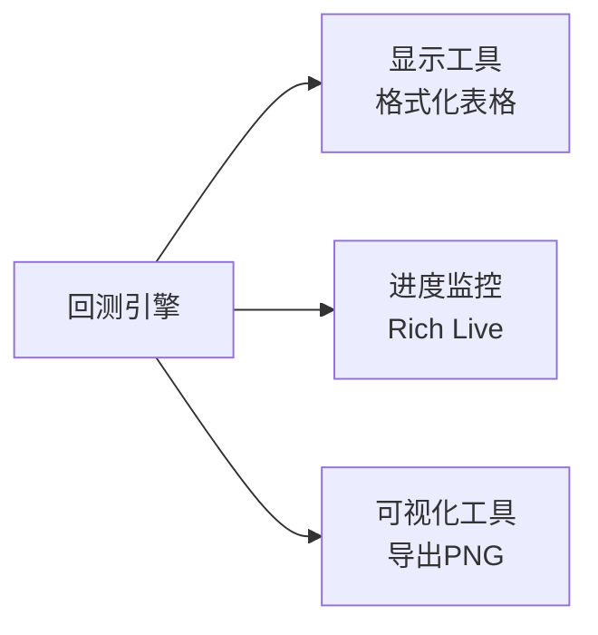
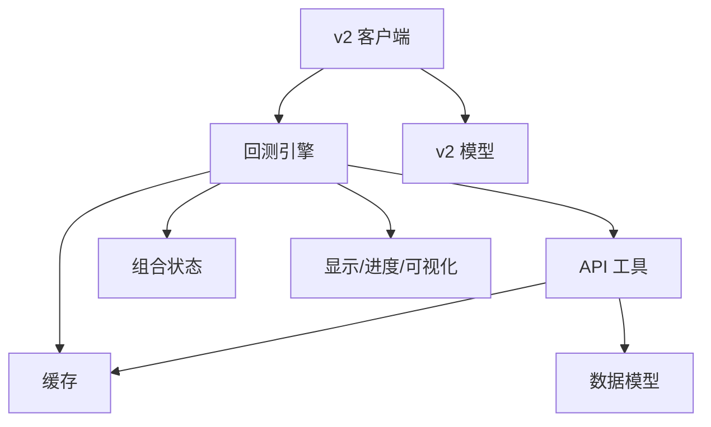

# 数据预处理

<cite>
**本文引用的文件**
- [src/data/models.py](file://src/data/models.py)
- [src/data/cache.py](file://src/data/cache.py)
- [src/tools/api.py](file://src/tools/api.py)
- [src/backtesting/engine.py](file://src/backtesting/engine.py)
- [src/backtesting/portfolio.py](file://src/backtesting/portfolio.py)
- [src/utils/display.py](file://src/utils/display.py)
- [src/utils/progress.py](file://src/utils/progress.py)
- [src/utils/visualize.py](file://src/utils/visualize.py)
- [v2/data/models.py](file://v2/data/models.py)
- [v2/data/client.py](file://v2/data/client.py)
- [v2/features/__init__.py](file://v2/features/__init__.py)
- [v2/validation/__init__.py](file://v2/validation/__init__.py)
- [v2/pipeline/execution.py](file://v2/pipeline/execution.py)
</cite>

## 目录
1. [简介](#简介)
2. [项目结构](#项目结构)
3. [核心组件](#核心组件)
4. [架构总览](#架构总览)
5. [详细组件分析](#详细组件分析)
6. [依赖分析](#依赖分析)
7. [性能考虑](#性能考虑)
8. [故障排查指南](#故障排查指南)
9. [结论](#结论)
10. [附录](#附录)

## 简介
本文件系统性梳理本项目中的“数据预处理”能力与实践，覆盖金融数据清洗、转换与标准化流程；缺失值与异常值处理策略；数据质量评估；时间序列对齐、频率转换与插值方法；特征工程与统计计算；数据可视化、进度监控与结果展示；批量与并发处理及资源管理；数据验证、完整性检查与一致性保障；以及可扩展的数据预处理管道与自定义处理函数。

## 项目结构
围绕数据预处理的关键模块分布如下：
- 数据模型与缓存：定义统一的数据结构与内存缓存，避免重复拉取与去重合并
- 数据获取与转换：封装外部金融数据源的请求、解析与DataFrame化
- 回测引擎与组合：在回测中进行数据预取、时间序列对齐与交易执行
- 可视化与进度：终端表格输出、实时进度条与图结构导出
- v2 新客户端与模型：面向新版本API的类型安全模型与客户端
- 特征工程与验证框架：为后续特征构建与回测验证打基础

图表来源
- [src/data/models.py:1-175](file://src/data/models.py#L1-L175)
- [src/data/cache.py:1-72](file://src/data/cache.py#L1-L72)
- [src/tools/api.py:1-367](file://src/tools/api.py#L1-L367)
- [v2/data/models.py:1-262](file://v2/data/models.py#L1-L262)
- [v2/data/client.py:1-227](file://v2/data/client.py#L1-L227)
- [src/backtesting/engine.py:1-195](file://src/backtesting/engine.py#L1-L195)
- [src/backtesting/portfolio.py:1-196](file://src/backtesting/portfolio.py#L1-L196)
- [src/utils/display.py:1-396](file://src/utils/display.py#L1-L396)
- [src/utils/progress.py:1-117](file://src/utils/progress.py#L1-L117)
- [src/utils/visualize.py:1-9](file://src/utils/visualize.py#L1-L9)
- [v2/features/__init__.py:1-6](file://v2/features/__init__.py#L1-L6)
- [v2/validation/__init__.py:1-6](file://v2/validation/__init__.py#L1-L6)
- [v2/pipeline/execution.py:1-6](file://v2/pipeline/execution.py#L1-L6)

章节来源
- [src/data/models.py:1-175](file://src/data/models.py#L1-L175)
- [src/data/cache.py:1-72](file://src/data/cache.py#L1-L72)
- [src/tools/api.py:1-367](file://src/tools/api.py#L1-L367)
- [v2/data/models.py:1-262](file://v2/data/models.py#L1-L262)
- [v2/data/client.py:1-227](file://v2/data/client.py#L1-L227)
- [src/backtesting/engine.py:1-195](file://src/backtesting/engine.py#L1-L195)
- [src/backtesting/portfolio.py:1-196](file://src/backtesting/portfolio.py#L1-L196)
- [src/utils/display.py:1-396](file://src/utils/display.py#L1-L396)
- [src/utils/progress.py:1-117](file://src/utils/progress.py#L1-L117)
- [src/utils/visualize.py:1-9](file://src/utils/visualize.py#L1-L9)
- [v2/features/__init__.py:1-6](file://v2/features/__init__.py#L1-L6)
- [v2/validation/__init__.py:1-6](file://v2/validation/__init__.py#L1-L6)
- [v2/pipeline/execution.py:1-6](file://v2/pipeline/execution.py#L1-L6)

## 核心组件
- 数据模型与类型安全
  - 使用Pydantic模型定义OHLCV、财务指标、新闻、高管交易等结构，确保字段命名与可空性与后端序列化一致，便于跨模块传递与校验
- 内存缓存与去重
  - 针对价格、财务指标、分项明细、高管交易、公司新闻分别维护缓存，并按关键字段去重合并，减少重复请求与数据冗余
- API获取与转换
  - 统一封装外部金融数据API请求、重试与限流处理；将返回数据解析为Pydantic模型，并转换为DataFrame（时间列为索引、数值列强制类型）
- 回测中的数据预取与对齐
  - 在回测前预取多日价格与财务、新闻、高管交易数据；按工作日循环，按日期窗口提取当日价格，缺失则跳过
- 展示与监控
  - 提供格式化表格输出、实时进度条、Mermaid图导出PNG等能力，便于观测与审计
- v2 新客户端与模型
  - 新版API客户端与模型，支持更丰富的财务与市场数据接口，增强类型安全与向前兼容

章节来源
- [src/data/models.py:1-175](file://src/data/models.py#L1-L175)
- [src/data/cache.py:1-72](file://src/data/cache.py#L1-L72)
- [src/tools/api.py:1-367](file://src/tools/api.py#L1-L367)
- [src/backtesting/engine.py:1-195](file://src/backtesting/engine.py#L1-L195)
- [src/utils/display.py:1-396](file://src/utils/display.py#L1-L396)
- [src/utils/progress.py:1-117](file://src/utils/progress.py#L1-L117)
- [src/utils/visualize.py:1-9](file://src/utils/visualize.py#L1-L9)
- [v2/data/models.py:1-262](file://v2/data/models.py#L1-L262)
- [v2/data/client.py:1-227](file://v2/data/client.py#L1-L227)

## 架构总览
下图展示了从数据获取到回测执行的端到端流程，包括数据预处理、缓存、转换与展示环节。

图表来源
- [src/backtesting/engine.py:81-195](file://src/backtesting/engine.py#L81-L195)
- [src/tools/api.py:63-367](file://src/tools/api.py#L63-L367)
- [src/data/cache.py:11-72](file://src/data/cache.py#L11-L72)
- [src/utils/display.py:17-396](file://src/utils/display.py#L17-L396)
- [src/utils/progress.py:12-117](file://src/utils/progress.py#L12-L117)

## 详细组件分析

### 数据模型与类型安全
- 设计要点
  - 使用Pydantic模型定义OHLCV、财务比率、高管交易、新闻、公司事实等，字段可空性与后端一致，便于跨模块传递
  - v2模型采用“忽略额外字段”的配置，提升向前兼容性
- 关键字段与用途
  - 价格：开盘、收盘、最高、最低、成交量、时间
  - 财务指标：估值、盈利能力、效率、流动性、杠杆、增长、每股指标等
  - 高管交易：交易日期、数量、价格、前后持股等
  - 新闻：标题、来源、日期、链接
  - 公司事实：活跃度、行业、地区、市值等元数据
- 复杂度与性能
  - 模型解析为O(N)（N为记录数），字段访问与序列化开销低，适合高频回测场景

图表来源
- [src/data/models.py:4-139](file://src/data/models.py#L4-L139)
- [v2/data/models.py:19-262](file://v2/data/models.py#L19-L262)

章节来源
- [src/data/models.py:1-175](file://src/data/models.py#L1-L175)
- [v2/data/models.py:1-262](file://v2/data/models.py#L1-L262)

### 缓存与去重合并
- 设计要点
  - 针对不同数据类型维护独立缓存字典，按关键字段去重合并，避免重复请求
  - 缓存键包含关键参数，确保参数变化时命中不同缓存
- 关键方法
  - 价格、财务指标、分项明细、高管交易、公司新闻分别提供get/set方法
  - 合并逻辑基于集合查找实现O(1)去重
- 性能与一致性
  - 时间复杂度O(M+N)，M为现有数据量，N为新增数据量
  - 通过键字段去重保证同一时间点或报告期不重复

图表来源
- [src/data/cache.py:11-22](file://src/data/cache.py#L11-L22)

章节来源
- [src/data/cache.py:1-72](file://src/data/cache.py#L1-L72)

### API获取与转换
- 设计要点
  - 统一请求封装，支持429限流重试与错误日志
  - 将响应解析为Pydantic模型，再转为DataFrame，时间列作为索引，数值列强制类型转换
- 关键流程
  - 价格：按日频获取，缓存键含起止日期
  - 财务指标：按报告期上限与周期限制获取
  - 分项明细：POST查询指定科目
  - 高管交易与新闻：支持分页与日期范围
  - 市值：优先从公司事实获取，否则回退到财务指标
- 转换与标准化
  - DataFrame转换：时间列转datetime、数值列转numeric、排序索引
  - 类型安全：Pydantic自动校验与默认值处理

图表来源
- [src/tools/api.py:29-367](file://src/tools/api.py#L29-L367)
- [src/data/cache.py:24-62](file://src/data/cache.py#L24-L62)

章节来源
- [src/tools/api.py:1-367](file://src/tools/api.py#L1-L367)
- [src/data/cache.py:1-72](file://src/data/cache.py#L1-L72)

### 回测中的数据预取与时间序列对齐
- 预取策略
  - 回测前一年窗口预取价格、财务指标、高管交易与新闻，基准资产SPY用于对比
- 对齐与缺失处理
  - 按工作日生成日期序列，逐日尝试读取前一日收盘价作为当日价格
  - 若任一标的缺数则跳过该日，避免单点异常影响全局
- 交易执行与组合状态
  - 根据决策执行买卖/做空/平仓，更新现金、头寸与已实现损益
  - 支持保证金占用与维持要求

图表来源
- [src/backtesting/engine.py:81-195](file://src/backtesting/engine.py#L81-L195)
- [src/backtesting/portfolio.py:82-196](file://src/backtesting/portfolio.py#L82-L196)

章节来源
- [src/backtesting/engine.py:1-195](file://src/backtesting/engine.py#L1-L195)
- [src/backtesting/portfolio.py:1-196](file://src/backtesting/portfolio.py#L1-L196)

### 特征工程与统计计算
- v2 特征工程概览
  - 包含收益意外特征、KPI动量、跨板块领先-滞后、特征重要性（MDA/MDI/SFI）等方向
- 技术分析与统计
  - 技术分析模块提供RSI、布林带、指数移动平均等指标计算，支持将pandas对象归一化为原生Python类型
- 适用场景
  - 为回测与预测建模提供信号与特征输入

章节来源
- [v2/features/__init__.py:1-6](file://v2/features/__init__.py#L1-L6)
- [src/agents/technicals.py:407-445](file://src/agents/technicals.py#L407-L445)

### 数据可视化、进度监控与结果展示
- 表格输出
  - 格式化打印交易决策、分析师信号、组合汇总与回测结果表格，支持颜色与换行包装
- 实时进度
  - Rich Live表格展示各代理状态、时间戳与分析摘要，支持注册/注销回调
- 图导出
  - 将编译后的图结构导出为PNG图像，便于流程可视化与审计

图表来源
- [src/utils/display.py:17-396](file://src/utils/display.py#L17-L396)
- [src/utils/progress.py:12-117](file://src/utils/progress.py#L12-L117)
- [src/utils/visualize.py:5-9](file://src/utils/visualize.py#L5-L9)

章节来源
- [src/utils/display.py:1-396](file://src/utils/display.py#L1-L396)
- [src/utils/progress.py:1-117](file://src/utils/progress.py#L1-L117)
- [src/utils/visualize.py:1-9](file://src/utils/visualize.py#L1-L9)

### v2 客户端与模型
- 客户端能力
  - 支持价格、财务指标、新闻、高管交易、公司事实、收益、文件等接口
  - 自动重试与会话管理，支持超时与API Key注入
- 模型设计
  - 严格字段定义与可空性标注，支持忽略额外字段以向前兼容
- 适用场景
  - 与回测引擎解耦，便于替换数据源或扩展新接口

章节来源
- [v2/data/client.py:1-227](file://v2/data/client.py#L1-L227)
- [v2/data/models.py:1-262](file://v2/data/models.py#L1-L262)

## 依赖分析
- 组件耦合
  - 回测引擎依赖API工具与缓存，组合状态独立于数据获取
  - 展示与进度模块与业务逻辑弱耦合，便于替换
- 外部依赖
  - requests、pandas、pydantic、rich、colorama、tabulate等
- 潜在风险
  - API限流与失败重试策略需结合实际配额调整
  - DataFrame转换与类型转换在大数据量下需关注内存与性能

图表来源
- [src/backtesting/engine.py:18-24](file://src/backtesting/engine.py#L18-L24)
- [src/tools/api.py:10-23](file://src/tools/api.py#L10-L23)
- [src/data/cache.py:1-72](file://src/data/cache.py#L1-L72)
- [v2/data/client.py:11-18](file://v2/data/client.py#L11-L18)
- [v2/data/models.py:9-262](file://v2/data/models.py#L9-L262)

章节来源
- [src/backtesting/engine.py:1-195](file://src/backtesting/engine.py#L1-L195)
- [src/tools/api.py:1-367](file://src/tools/api.py#L1-L367)
- [src/data/cache.py:1-72](file://src/data/cache.py#L1-L72)
- [v2/data/client.py:1-227](file://v2/data/client.py#L1-L227)
- [v2/data/models.py:1-262](file://v2/data/models.py#L1-L262)

## 性能考虑
- 缓存命中率
  - 参数化缓存键可显著降低重复请求；建议在批处理中复用相同参数
- 数据转换成本
  - DataFrame转换与类型转换为O(N)；建议在回测外层批量预处理，减少重复转换
- 并发与限流
  - API请求具备重试与限流；建议在多标的并行时控制并发度，避免触发429
- 内存管理
  - 大时间序列与多标的DataFrame需注意内存峰值；可按日期切片或分批处理

## 故障排查指南
- API请求失败
  - 检查环境变量API Key、网络连通性与限流状态；查看日志警告信息
- 缺失数据导致跳过
  - 若某日任一标的缺数，回测会跳过该日；确认数据源可用性与日期范围
- 类型转换异常
  - 数值列转换失败时检查原始数据格式；必要时在转换前进行清洗
- 进度与输出问题
  - Rich渲染异常时检查终端支持与字体；导出PNG失败时确认Mermaid API可用

章节来源
- [src/tools/api.py:29-61](file://src/tools/api.py#L29-L61)
- [src/backtesting/engine.py:114-130](file://src/backtesting/engine.py#L114-L130)
- [src/utils/progress.py:12-117](file://src/utils/progress.py#L12-L117)

## 结论
本项目在数据预处理方面形成了“类型安全模型 + 内存缓存 + 统一API封装 + DataFrame转换 + 回测集成”的闭环。通过参数化缓存键、限流重试与缺数跳过策略，有效提升了稳定性与性能。展示与进度模块增强了可观测性，v2客户端与模型为未来扩展提供了坚实基础。建议在生产环境中进一步完善批量并发控制、内存与性能监控，以及更细粒度的数据质量评估与异常报警。

## 附录
- 扩展建议
  - 缺失值处理：引入插补策略（线性/前向填充）与缺失比例阈值
  - 异常值检测：基于分位数或滚动统计的离群点识别
  - 数据质量评估：字段完整性、唯一性、一致性与跨表关联校验
  - 频率转换与对齐：统一到日频或更高频，补齐节假日缺口
  - 特征工程：引入技术指标、宏观因子与跨市场领先滞后特征
  - 验证框架：引入v2中的交叉验证与过拟合概率评估