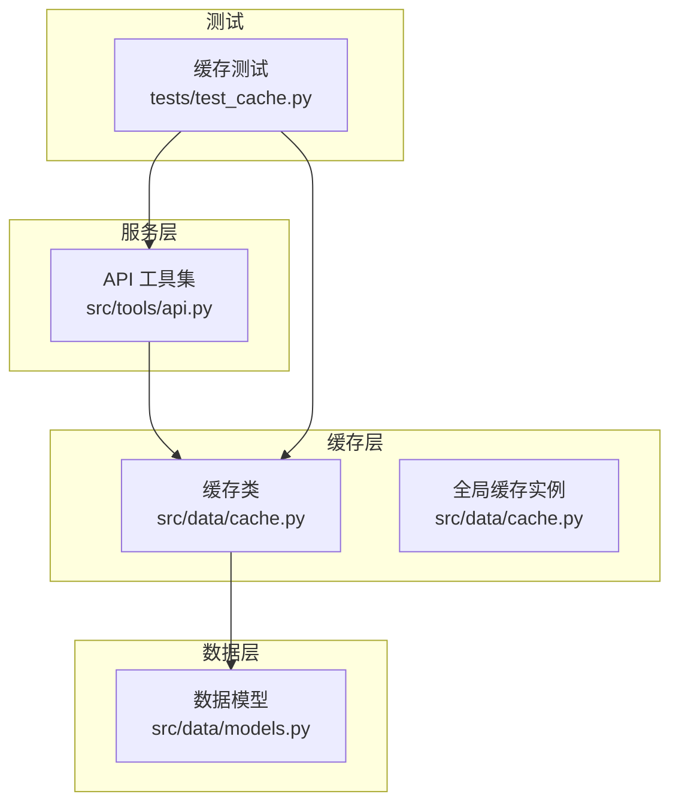
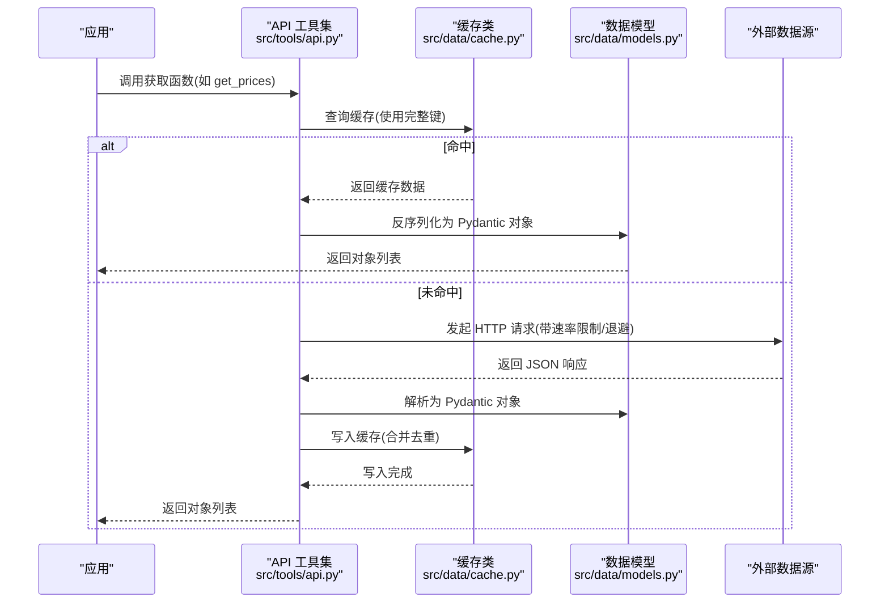
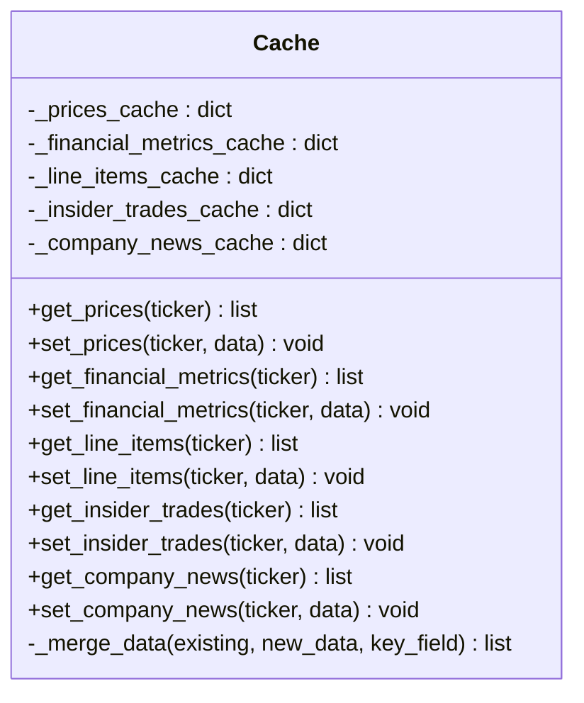
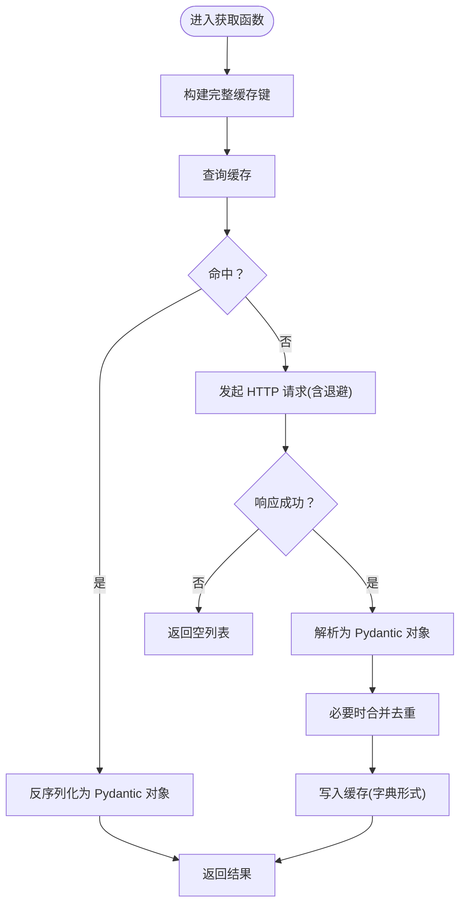
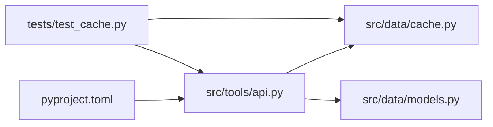

# 缓存系统

<cite>
**本文引用的文件**
- [src/data/cache.py](file://src/data/cache.py)
- [src/tools/api.py](file://src/tools/api.py)
- [src/data/models.py](file://src/data/models.py)
- [tests/test_cache.py](file://tests/test_cache.py)
- [pyproject.toml](file://pyproject.toml)
</cite>

## 目录
1. [简介](#简介)
2. [项目结构](#项目结构)
3. [核心组件](#核心组件)
4. [架构总览](#架构总览)
5. [详细组件分析](#详细组件分析)
6. [依赖分析](#依赖分析)
7. [性能考虑](#性能考虑)
8. [故障排查指南](#故障排查指南)
9. [结论](#结论)
10. [附录](#附录)

## 简介
本文件系统化梳理并解释本项目中的缓存子系统，覆盖数据缓存策略、存储机制、性能优化、键设计、过期策略与内存管理、命中率优化、LRU 实现、失效机制、配置参数、容量限制与清理策略、性能监控与统计、故障诊断，以及分布式缓存、Redis 集成与缓存一致性保障等主题。当前仓库中实现了基于内存的本地缓存，用于存放价格、财务指标、明细项、高管交易与公司新闻等数据，并通过统一的全局实例进行访问；同时在数据获取流程中采用“先查缓存、后查接口”的策略，以提升整体响应速度与稳定性。

## 项目结构
与缓存系统直接相关的模块与文件如下：
- 缓存实现：src/data/cache.py
- 数据模型：src/data/models.py（定义了 Price、FinancialMetrics、LineItem、InsiderTrade、CompanyNews 等）
- 数据获取与缓存集成：src/tools/api.py（封装 API 请求、速率限制、分页拉取、缓存读写）
- 单元测试：tests/test_cache.py（验证缓存初始化、合并去重、各类型数据的读写行为）

图表来源
- [src/data/cache.py:1-72](file://src/data/cache.py#L1-L72)
- [src/tools/api.py:1-367](file://src/tools/api.py#L1-L367)
- [src/data/models.py:1-175](file://src/data/models.py#L1-L175)
- [tests/test_cache.py:1-159](file://tests/test_cache.py#L1-L159)

章节来源
- [src/data/cache.py:1-72](file://src/data/cache.py#L1-L72)
- [src/tools/api.py:1-367](file://src/tools/api.py#L1-L367)
- [src/data/models.py:1-175](file://src/data/models.py#L1-L175)
- [tests/test_cache.py:1-159](file://tests/test_cache.py#L1-L159)

## 核心组件
- 缓存类 Cache：提供多类数据的内存缓存能力，内部维护多个字典映射，分别存储价格、财务指标、明细项、高管交易与公司新闻；支持按主键字段去重合并新旧数据。
- 全局缓存实例：通过 get_cache() 提供单例访问，避免重复实例化。
- API 工具集：在获取数据时优先查询缓存，未命中则调用外部 API，解析响应后写入缓存；对部分长周期数据（如高管交易、公司新闻）支持分页累积拉取。
- 数据模型：使用 Pydantic 模型定义数据结构，便于序列化/反序列化与类型校验。

章节来源
- [src/data/cache.py:1-72](file://src/data/cache.py#L1-L72)
- [src/tools/api.py:63-312](file://src/tools/api.py#L63-L312)
- [src/data/models.py:4-139](file://src/data/models.py#L4-L139)

## 架构总览
下图展示了从应用到缓存再到外部 API 的典型调用链路，以及缓存键的设计思路与数据合并策略。

图表来源
- [src/tools/api.py:63-96](file://src/tools/api.py#L63-L96)
- [src/tools/api.py:183-246](file://src/tools/api.py#L183-L246)
- [src/tools/api.py:249-312](file://src/tools/api.py#L249-L312)
- [src/data/cache.py:24-62](file://src/data/cache.py#L24-L62)
- [src/data/models.py:13-139](file://src/data/models.py#L13-L139)

## 详细组件分析

### 缓存类与数据合并策略
- 存储结构：每个数据类别维护独立的字典，键为业务相关字符串，值为对应数据对象的列表。
- 合并策略：_merge_data 方法根据指定 key_field 对新旧数据进行去重合并，保留原有数据优先，避免覆盖；时间复杂度 O(n)，空间复杂度 O(n)。
- 键设计：不同数据类型的键由函数参数拼接而成，确保完全匹配；例如价格数据键包含股票代码、开始日期、结束日期；高管交易与公司新闻键包含股票代码、起止日期、条数上限等。

图表来源
- [src/data/cache.py:1-72](file://src/data/cache.py#L1-L72)

章节来源
- [src/data/cache.py:11-22](file://src/data/cache.py#L11-L22)
- [src/data/cache.py:24-62](file://src/data/cache.py#L24-L62)

### API 获取与缓存交互
- 速率限制与退避：当遇到 429 时按线性间隔等待并重试，最多尝试固定次数。
- 分页拉取：针对高管交易与公司新闻两类长列表数据，循环请求直至达到上限或无更多数据。
- 缓存写入：成功解析后将原始字典形式写入缓存，键为完整参数组合，便于后续精确命中。

图表来源
- [src/tools/api.py:29-60](file://src/tools/api.py#L29-L60)
- [src/tools/api.py:183-246](file://src/tools/api.py#L183-L246)
- [src/tools/api.py:249-312](file://src/tools/api.py#L249-L312)

章节来源
- [src/tools/api.py:29-60](file://src/tools/api.py#L29-L60)
- [src/tools/api.py:183-246](file://src/tools/api.py#L183-L246)
- [src/tools/api.py:249-312](file://src/tools/api.py#L249-L312)

### 数据模型与序列化
- 使用 Pydantic 模型定义数据结构，便于统一解析与类型约束。
- 在写入缓存前，将对象转换为字典形式；读取时再反序列化为对象，保证类型安全与易用性。

章节来源
- [src/data/models.py:4-139](file://src/data/models.py#L4-L139)
- [src/tools/api.py:84-95](file://src/tools/api.py#L84-L95)
- [src/tools/api.py:126-137](file://src/tools/api.py#L126-L137)

### 单元测试与行为验证
- 初始化：新缓存实例各存储为空。
- 全局实例：get_cache 返回同一实例，确保单例语义。
- 合并去重：_merge_data 在多种边界条件下保持正确性，不修改原列表。
- 各类型数据：价格、财务指标、明细项、高管交易、公司新闻的读写与去重行为均通过测试覆盖。

章节来源
- [tests/test_cache.py:6-27](file://tests/test_cache.py#L6-L27)
- [tests/test_cache.py:29-59](file://tests/test_cache.py#L29-L59)
- [tests/test_cache.py:61-89](file://tests/test_cache.py#L61-L89)
- [tests/test_cache.py:91-106](file://tests/test_cache.py#L91-L106)
- [tests/test_cache.py:108-123](file://tests/test_cache.py#L108-L123)
- [tests/test_cache.py:125-141](file://tests/test_cache.py#L125-L141)
- [tests/test_cache.py:143-159](file://tests/test_cache.py#L143-L159)

## 依赖分析
- 缓存类依赖：仅依赖 Python 内置类型（字典、列表），无第三方依赖。
- API 工具集依赖：依赖 requests、pandas、logging、os 等标准库与第三方库；依赖缓存模块与数据模型模块。
- 测试依赖：pytest 作为测试框架，依赖缓存模块与 API 模块。

图表来源
- [src/tools/api.py:1-27](file://src/tools/api.py#L1-L27)
- [src/data/cache.py:1-72](file://src/data/cache.py#L1-L72)
- [src/data/models.py:1-175](file://src/data/models.py#L1-L175)
- [tests/test_cache.py:1-4](file://tests/test_cache.py#L1-L4)
- [pyproject.toml:13-41](file://pyproject.toml#L13-L41)

章节来源
- [src/tools/api.py:1-27](file://src/tools/api.py#L1-L27)
- [pyproject.toml:13-41](file://pyproject.toml#L13-L41)

## 性能考虑
- 时间复杂度
  - 合并去重：O(n)，其中 n 为新增数据量；查找去重集合 O(1)。
  - 缓存查询：O(1) 平均情况（字典查找）。
- 空间复杂度
  - 每个类别缓存占用 O(m) 空间，m 为该类别累计数据条数；整体随数据增长而线性增长。
- 命中率优化建议
  - 键设计：已采用“参数全量拼接”的键策略，确保精确匹配，降低误命中。
  - 数据合并：对历史数据采用去重合并，减少冗余，提高有效数据密度。
  - 访问模式：高频数据可按时间窗口切片，缩短键长度并提升复用率。
- LRU 与容量限制
  - 当前实现未内置容量限制与淘汰策略；若需控制内存占用，可在 Cache 中引入 OrderedDict/LRU 容器或外部库（如 collections.deque + dict 组合）实现固定容量的 LRU。
- 过期策略
  - 当前未实现 TTL 或基于时间戳的过期逻辑；可通过在缓存值中嵌入时间戳并在读取时判断是否过期的方式实现。
- 清理策略
  - 可增加定期清理任务或懒惰清理（读写时触发）；结合容量阈值与过期时间共同作用。
- 性能监控与统计
  - 可在 Cache 中增加计数器（命中/未命中/写入次数），在 API 层输出日志或导出指标，便于评估命中率与缓存收益。

[本节为通用性能讨论，不直接分析具体文件，故无章节来源]

## 故障排查指南
- 常见问题
  - 缓存未命中：检查键是否与请求参数完全一致；确认缓存键构建逻辑与 API 参数传递是否匹配。
  - 数据重复：确认 _merge_data 的 key_field 是否正确；核对数据模型的唯一标识字段。
  - 速率限制 429：查看退避逻辑是否生效；确认环境变量 API Key 是否正确设置。
  - 解析失败：检查外部接口返回格式是否符合预期；确认 Pydantic 模型字段是否与接口一致。
- 排查步骤
  - 打印缓存键与实际请求参数，比对差异。
  - 在 API 层增加日志记录响应状态码与耗时。
  - 使用单元测试验证合并去重与读写行为。
- 相关实现参考
  - 速率限制与退避：[src/tools/api.py:29-60](file://src/tools/api.py#L29-L60)
  - 缓存读写与合并：[src/data/cache.py:24-62](file://src/data/cache.py#L24-L62)
  - 数据模型解析：[src/tools/api.py:84-95](file://src/tools/api.py#L84-L95)

章节来源
- [src/tools/api.py:29-60](file://src/tools/api.py#L29-L60)
- [src/data/cache.py:24-62](file://src/data/cache.py#L24-L62)
- [src/tools/api.py:84-95](file://src/tools/api.py#L84-L95)

## 结论
本项目的缓存系统以简单高效的内存缓存为核心，通过“精确键设计 + 去重合并 + 分页拉取 + 速率限制退避”实现了稳定的数据获取与复用。当前实现具备良好的可维护性与可测试性，适合中小规模场景下的性能优化。若未来需要支撑更大规模与更高并发，建议引入容量限制与 LRU 淘汰、TTL 过期、清理策略与性能监控指标，以进一步提升稳定性与资源利用率。

[本节为总结性内容，不直接分析具体文件，故无章节来源]

## 附录

### 缓存键设计与过期策略建议
- 键设计
  - 已采用“参数全量拼接”的策略，确保精确匹配；建议在键中显式包含版本号或参数顺序，避免未来接口变更导致的键冲突。
- 过期策略
  - 引入 TTL 字段与过期时间配置；在读取时判断是否过期，过期则触发重建。
- 内存管理
  - 固定容量 LRU：使用有序容器记录访问顺序，超过容量时淘汰最久未使用项。
  - 懒惰清理：在写入新数据时检查容量，逐出旧数据。
- 清理策略
  - 定时任务：后台扫描并清理过期或低频访问项。
  - 主动清理：在写满时批量清理，保证可用空间。

[本节为概念性建议，不直接分析具体文件，故无章节来源]

### 分布式缓存与 Redis 集成
- 集成点
  - 将 Cache 类替换为 Redis 客户端封装，键空间按业务域划分（如 prices:*, metrics:* 等）。
  - 使用 Redis 的过期命令与内存淘汰策略（如 allkeys-lru）实现自动清理。
- 一致性
  - 写路径：先写数据库/接口，再写缓存；读路径：优先缓存，未命中回源并回写。
  - 失效策略：更新时主动删除相关键，避免脏读。
- 注意事项
  - 序列化：使用 JSON 或 msgpack 存储对象；注意字段缺失与类型兼容。
  - 网络抖动：增加超时与重试，避免阻塞主流程。

[本节为概念性建议，不直接分析具体文件，故无章节来源]

### 缓存穿透、雪崩与热点处理
- 缓存穿透
  - 对不存在的键也做缓存，但设置短 TTL；或使用布隆过滤器预判存在性。
- 雪崩效应
  - 为过期时间增加随机抖动；热点键设置互斥锁或只允许一个重建。
- 热点数据
  - 引入多级缓存（本地 + 远程）；对热点键做副本与分片；限流与熔断保护下游。

[本节为概念性建议，不直接分析具体文件，故无章节来源]