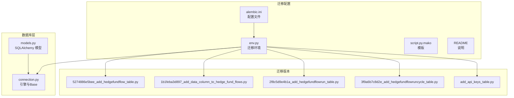
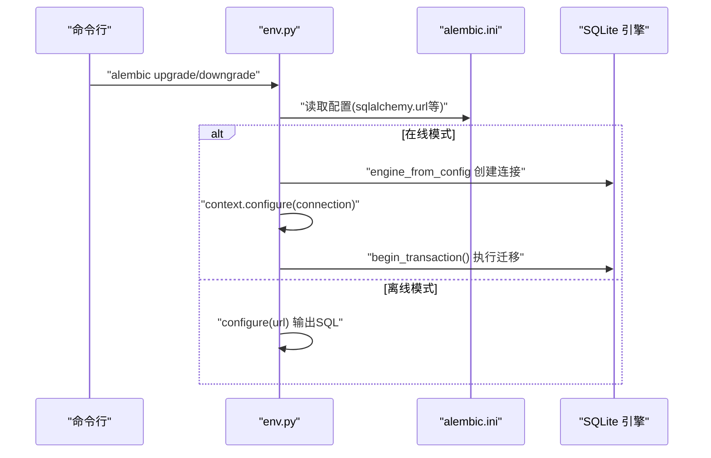
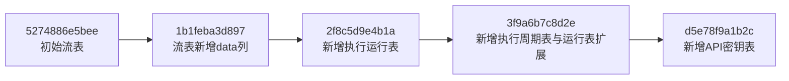
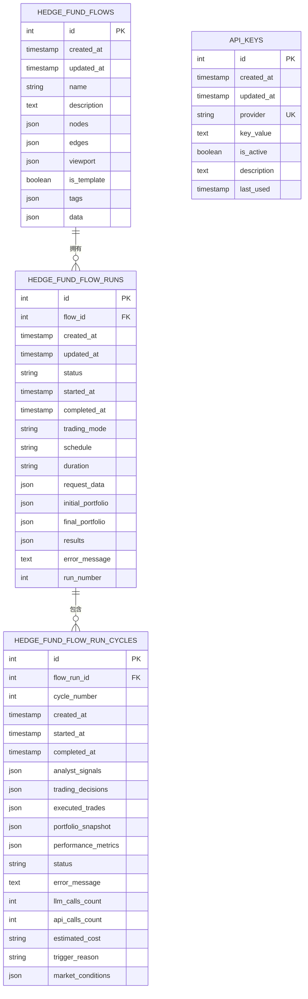

# Alembic迁移管理

<cite>
**本文引用的文件**
- [app/backend/alembic.ini](file://app/backend/alembic.ini)
- [app/backend/alembic/env.py](file://app/backend/alembic/env.py)
- [app/backend/alembic/script.py.mako](file://app/backend/alembic/script.py.mako)
- [app/backend/alembic/README](file://app/backend/alembic/README)
- [app/backend/alembic/versions/5274886e5bee_add_hedgefundflow_table.py](file://app/backend/alembic/versions/5274886e5bee_add_hedgefundflow_table.py)
- [app/backend/alembic/versions/1b1feba3d897_add_data_column_to_hedge_fund_flows.py](file://app/backend/alembic/versions/1b1feba3d897_add_data_column_to_hedge_fund_flows.py)
- [app/backend/alembic/versions/2f8c5d9e4b1a_add_hedgefundflowrun_table.py](file://app/backend/alembic/versions/2f8c5d9e4b1a_add_hedgefundflowrun_table.py)
- [app/backend/alembic/versions/3f9a6b7c8d2e_add_hedgefundflowruncycle_table.py](file://app/backend/alembic/versions/3f9a6b7c8d2e_add_hedgefundflowruncycle_table.py)
- [app/backend/alembic/versions/add_api_keys_table.py](file://app/backend/alembic/versions/add_api_keys_table.py)
- [app/backend/database/models.py](file://app/backend/database/models.py)
- [app/backend/database/connection.py](file://app/backend/database/connection.py)
- [app/backend/main.py](file://app/backend/main.py)
</cite>

## 目录
1. [简介](#简介)
2. [项目结构](#项目结构)
3. [核心组件](#核心组件)
4. [架构总览](#架构总览)
5. [详细组件分析](#详细组件分析)
6. [依赖分析](#依赖分析)
7. [性能考虑](#性能考虑)
8. [故障排查指南](#故障排查指南)
9. [结论](#结论)
10. [附录](#附录)

## 简介
本文件系统性阐述本项目的 Alembic 迁移管理方案，覆盖数据库版本控制与迁移策略、迁移文件命名与版本管理机制、各版本功能与变更内容（表结构、索引、数据迁移）、迁移执行与回滚策略、版本冲突解决、迁移脚本编写指南与最佳实践、开发/测试/生产环境差异、性能优化与长时间运行迁移的应对、迁移监控与错误处理及故障恢复、以及迁移测试与验证机制。

## 项目结构
本项目采用单数据库、多版本迁移文件的组织方式，核心目录与文件如下：
- 配置与环境：alembic.ini、env.py、script.py.mako、README
- 版本文件：versions 下按时间顺序排列的迁移脚本
- 数据库模型与连接：database/models.py、database/connection.py
- 应用入口：main.py（初始化数据库）

图表来源
- [app/backend/alembic.ini:1-120](file://app/backend/alembic.ini#L1-L120)
- [app/backend/alembic/env.py:1-78](file://app/backend/alembic/env.py#L1-L78)
- [app/backend/alembic/script.py.mako:1-29](file://app/backend/alembic/script.py.mako#L1-L29)
- [app/backend/alembic/README:1-1](file://app/backend/alembic/README#L1-L1)
- [app/backend/alembic/versions/5274886e5bee_add_hedgefundflow_table.py:1-47](file://app/backend/alembic/versions/5274886e5bee_add_hedgefundflow_table.py#L1-L47)
- [app/backend/alembic/versions/1b1feba3d897_add_data_column_to_hedge_fund_flows.py:1-33](file://app/backend/alembic/versions/1b1feba3d897_add_data_column_to_hedge_fund_flows.py#L1-L33)
- [app/backend/alembic/versions/2f8c5d9e4b1a_add_hedgefundflowrun_table.py:1-49](file://app/backend/alembic/versions/2f8c5d9e4b1a_add_hedgefundflowrun_table.py#L1-L49)
- [app/backend/alembic/versions/3f9a6b7c8d2e_add_hedgefundflowruncycle_table.py:1-102](file://app/backend/alembic/versions/3f9a6b7c8d2e_add_hedgefundflowruncycle_table.py#L1-L102)
- [app/backend/alembic/versions/add_api_keys_table.py:1-44](file://app/backend/alembic/versions/add_api_keys_table.py#L1-L44)
- [app/backend/database/models.py:1-115](file://app/backend/database/models.py#L1-L115)
- [app/backend/database/connection.py:1-32](file://app/backend/database/connection.py#L1-L32)

章节来源
- [app/backend/alembic.ini:1-120](file://app/backend/alembic.ini#L1-L120)
- [app/backend/alembic/env.py:1-78](file://app/backend/alembic/env.py#L1-L78)
- [app/backend/alembic/script.py.mako:1-29](file://app/backend/alembic/script.py.mako#L1-L29)
- [app/backend/alembic/README:1-1](file://app/backend/alembic/README#L1-L1)

## 核心组件
- 配置与环境
  - alembic.ini：定义脚本位置、路径分隔符、日志级别、SQLAlchemy URL 等
  - env.py：注册目标元数据（基于 models.py 的 Base.metadata），在线/离线迁移入口
  - script.py.mako：迁移脚本模板，生成升级/降级函数与修订标识
- 迁移版本
  - versions 目录下按时间顺序命名的脚本，记录每次结构变更
- 数据库模型与连接
  - models.py：定义 SQLAlchemy 模型（HedgeFundFlow、HedgeFundFlowRun、HedgeFundFlowRunCycle、ApiKey）
  - connection.py：创建 SQLite 引擎与 Base，供 env.py 注册元数据使用
- 应用入口
  - main.py：应用启动时调用 create_all 初始化数据库（开发/测试场景）

章节来源
- [app/backend/alembic.ini:1-120](file://app/backend/alembic.ini#L1-L120)
- [app/backend/alembic/env.py:1-78](file://app/backend/alembic/env.py#L1-L78)
- [app/backend/alembic/script.py.mako:1-29](file://app/backend/alembic/script.py.mako#L1-L29)
- [app/backend/database/models.py:1-115](file://app/backend/database/models.py#L1-L115)
- [app/backend/database/connection.py:1-32](file://app/backend/database/connection.py#L1-L32)
- [app/backend/main.py:1-56](file://app/backend/main.py#L1-L56)

## 架构总览
迁移执行链路分为“在线模式”和“离线模式”，通过 env.py 判定当前运行环境并选择对应迁移路径；迁移目标由 models.py 中的 Base.metadata 提供。

图表来源
- [app/backend/alembic/env.py:28-77](file://app/backend/alembic/env.py#L28-L77)
- [app/backend/alembic.ini:66-66](file://app/backend/alembic.ini#L66-L66)

## 详细组件分析

### 命名规范与版本管理机制
- 文件命名
  - 使用 Alembic 默认模板 %%rev%%_%%slug%%，其中 rev 为修订标识，slug 为描述性短语
  - 可选启用带日期时间前缀的模板以增强可读性
- 版本路径与分隔
  - script_location 指向 alembic 目录
  - version_path_separator 默认使用操作系统分隔符
- 元数据与目标
  - env.py 将 models.py 中的 Base.metadata 注册为目标元数据，确保自动/手动迁移均基于一致的模型定义

章节来源
- [app/backend/alembic.ini:6-55](file://app/backend/alembic.ini#L6-L55)
- [app/backend/alembic/env.py:17-25](file://app/backend/alembic/env.py#L17-L25)
- [app/backend/alembic/script.py.mako:1-29](file://app/backend/alembic/script.py.mako#L1-L29)

### 迁移版本与变更内容

#### 版本 1：初始流表
- 功能：创建 HedgeFundFlow 表，存储 React Flow 配置与元数据
- 结构要点：主键 id、时间戳字段、名称/描述、节点/边/视口 JSON 字段、模板标记与标签 JSON
- 索引：对 id 建立普通索引
- 回滚：删除索引与表

章节来源
- [app/backend/alembic/versions/5274886e5bee_add_hedgefundflow_table.py:1-47](file://app/backend/alembic/versions/5274886e5bee_add_hedgefundflow_table.py#L1-L47)
- [app/backend/database/models.py:6-27](file://app/backend/database/models.py#L6-L27)

#### 版本 2：为流表增加数据列
- 功能：为 hedge_fund_flows 表新增 data JSON 列，用于存储节点内部状态（如代码片段中提到的 tickers、models 等）
- 回滚：删除 data 列

章节来源
- [app/backend/alembic/versions/1b1feba3d897_add_data_column_to_hedge_fund_flows.py:1-33](file://app/backend/alembic/versions/1b1feba3d897_add_data_column_to_hedge_fund_flows.py#L1-L33)

#### 版本 3：新增执行运行表
- 功能：创建 hedge_fund_flow_runs 表，跟踪单次执行运行
- 结构要点：外键 flow_id 关联流表、状态枚举、开始/结束时间、请求参数/结果/错误信息、运行序号等
- 索引：对 id 与 flow_id 建立索引
- 回滚：删除索引与表

章节来源
- [app/backend/alembic/versions/2f8c5d9e4b1a_add_hedgefundflowrun_table.py:1-49](file://app/backend/alembic/versions/2f8c5d9e4b1a_add_hedgefundflowrun_table.py#L1-L49)
- [app/backend/database/models.py:29-57](file://app/backend/database/models.py#L29-L57)

#### 版本 4：新增执行周期表与运行表扩展
- 功能：在运行表基础上新增 trading_mode/schedule/duration/initial_portfolio/final_portfolio 等列；创建 hedge_fund_flow_run_cycles 表，记录单次运行内的分析周期
- 结构要点：周期表包含分析信号、交易决策、已执行交易、组合快照、性能指标、成本统计、触发原因与市场条件等 JSON 字段
- 索引：对 flow_run_id/cycle_number/status/started_at 建立索引
- 回滚：删除索引与表，并回退运行表中的新增列

章节来源
- [app/backend/alembic/versions/3f9a6b7c8d2e_add_hedgefundflowruncycle_table.py:1-102](file://app/backend/alembic/versions/3f9a6b7c8d2e_add_hedgefundflowruncycle_table.py#L1-L102)
- [app/backend/database/models.py:59-95](file://app/backend/database/models.py#L59-L95)

#### 版本 5：新增 API 密钥表
- 功能：创建 api_keys 表，存储服务提供商密钥（唯一约束 provider）
- 结构要点：主键 id、时间戳、提供商、密钥值、激活状态、描述、最后使用时间
- 索引：对 id 与 provider 建立索引
- 回滚：删除索引与表

章节来源
- [app/backend/alembic/versions/add_api_keys_table.py:1-44](file://app/backend/alembic/versions/add_api_keys_table.py#L1-L44)
- [app/backend/database/models.py:97-115](file://app/backend/database/models.py#L97-L115)

### 迁移执行策略与回滚机制
- 执行策略
  - 在线模式：通过 env.py 的在线迁移函数建立连接并开启事务执行迁移
  - 离线模式：仅输出 SQL 脚本，不实际连接数据库
- 回滚机制
  - 每个版本脚本均实现 downgrade 函数，按逆序回滚到上一版本
  - 版本间通过 down_revision/revision 明确依赖关系
- 版本冲突解决
  - 通过明确的修订链（revises）保证线性演进
  - 如需分支，可在模板中设置 branch_labels/depends_on，但当前仓库未使用

章节来源
- [app/backend/alembic/env.py:28-77](file://app/backend/alembic/env.py#L28-L77)
- [app/backend/alembic/versions/5274886e5bee_add_hedgefundflow_table.py:1-47](file://app/backend/alembic/versions/5274886e5bee_add_hedgefundflow_table.py#L1-L47)
- [app/backend/alembic/versions/1b1feba3d897_add_data_column_to_hedge_fund_flows.py:1-33](file://app/backend/alembic/versions/1b1feba3d897_add_data_column_to_hedge_fund_flows.py#L1-L33)
- [app/backend/alembic/versions/2f8c5d9e4b1a_add_hedgefundflowrun_table.py:1-49](file://app/backend/alembic/versions/2f8c5d9e4b1a_add_hedgefundflowrun_table.py#L1-L49)
- [app/backend/alembic/versions/3f9a6b7c8d2e_add_hedgefundflowruncycle_table.py:1-102](file://app/backend/alembic/versions/3f9a6b7c8d2e_add_hedgefundflowruncycle_table.py#L1-L102)
- [app/backend/alembic/versions/add_api_keys_table.py:1-44](file://app/backend/alembic/versions/add_api_keys_table.py#L1-L44)

### 开发/测试/生产环境差异
- 开发环境
  - 使用 SQLite 文件数据库，路径在 backend 目录下
  - 应用启动时可直接调用 create_all 初始化表（非迁移强制要求）
- 测试环境
  - 可复用相同迁移配置，建议使用独立数据库或临时文件
- 生产环境
  - 建议使用在线模式执行迁移，确保连接与事务一致性
  - 日志级别与输出格式已在配置中设定

章节来源
- [app/backend/alembic.ini:66-66](file://app/backend/alembic.ini#L66-L66)
- [app/backend/database/connection.py:7-18](file://app/backend/database/connection.py#L7-L18)
- [app/backend/main.py:17-18](file://app/backend/main.py#L17-L18)

### 迁移脚本编写指南与最佳实践
- 使用模板生成标准结构，保留 upgrade/downgrade 占位
- 为新表/列添加索引时，统一使用 op.f('ix_tablename_col') 形式
- 在升级脚本中进行幂等检查（如存在再添加），避免重复执行失败
- 降级脚本应与升级脚本一一对应，且顺序相反
- 对大表操作建议拆分批次或使用 SQLite 支持的 ALTER TABLE 限制内完成
- 为关键变更添加注释，说明业务背景与影响范围

章节来源
- [app/backend/alembic/script.py.mako:1-29](file://app/backend/alembic/script.py.mako#L1-L29)
- [app/backend/alembic/versions/3f9a6b7c8d2e_add_hedgefundflowruncycle_table.py:18-68](file://app/backend/alembic/versions/3f9a6b7c8d2e_add_hedgefundflowruncycle_table.py#L18-L68)

### 性能优化与长时间运行迁移
- 大表结构变更
  - 优先使用 SQLite 支持的 ALTER TABLE 语法
  - 若需重建表，建议在维护窗口执行，或分批处理
- 索引创建
  - 在大批量数据导入后统一创建索引，减少锁竞争
- 事务与锁
  - 控制单次迁移事务大小，必要时拆分为多个小版本
- 并发与资源
  - 在线迁移时避免高并发写入，降低锁等待

（本节为通用指导，无需特定文件引用）

### 迁移监控、错误处理与故障恢复
- 日志配置
  - alembic.ini 已配置日志器与处理器，便于追踪迁移过程
- 错误处理
  - 在线迁移通过 begin_transaction 包裹，异常时回滚
  - 降级脚本需健壮处理对象不存在的情况
- 故障恢复
  - 通过 downgrade 回退到上一个稳定版本
  - 修复问题后重新执行 upgrade 或生成新版本脚本

章节来源
- [app/backend/alembic.ini:86-120](file://app/backend/alembic.ini#L86-L120)
- [app/backend/alembic/env.py:52-77](file://app/backend/alembic/env.py#L52-L77)
- [app/backend/alembic/versions/3f9a6b7c8d2e_add_hedgefundflowruncycle_table.py:70-102](file://app/backend/alembic/versions/3f9a6b7c8d2e_add_hedgefundflowruncycle_table.py#L70-L102)

### 迁移测试与验证机制
- 单元测试
  - 可在测试环境中执行迁移，验证模型与数据库结构一致性
- 验证步骤
  - 检查目标元数据与实际表结构是否匹配
  - 验证索引存在性与唯一性约束
  - 对关键 JSON 字段进行插入/查询测试
- 自动化
  - 在 CI 中执行 alembic upgrade head 与 downgrade -1，确保双向兼容

（本节为通用指导，无需特定文件引用）

## 依赖分析
迁移版本之间通过修订链形成线性依赖，确保升级/降级顺序正确。

图表来源
- [app/backend/alembic/versions/5274886e5bee_add_hedgefundflow_table.py:3-5](file://app/backend/alembic/versions/5274886e5bee_add_hedgefundflow_table.py#L3-L5)
- [app/backend/alembic/versions/1b1feba3d897_add_data_column_to_hedge_fund_flows.py:3-5](file://app/backend/alembic/versions/1b1feba3d897_add_data_column_to_hedge_fund_flows.py#L3-L5)
- [app/backend/alembic/versions/2f8c5d9e4b1a_add_hedgefundflowrun_table.py:3-5](file://app/backend/alembic/versions/2f8c5d9e4b1a_add_hedgefundflowrun_table.py#L3-L5)
- [app/backend/alembic/versions/3f9a6b7c8d2e_add_hedgefundflowruncycle_table.py:3-5](file://app/backend/alembic/versions/3f9a6b7c8d2e_add_hedgefundflowruncycle_table.py#L3-L5)
- [app/backend/alembic/versions/add_api_keys_table.py:3-5](file://app/backend/alembic/versions/add_api_keys_table.py#L3-L5)

## 性能考虑
- SQLite 场景下的迁移特性
  - ALTER TABLE 支持有限，复杂变更可能需要重建表
  - 建议在低峰期执行大变更
- 索引与锁
  - 避免在迁移过程中频繁写入，减少锁竞争
- 分批迁移
  - 将大改动拆分为多个小版本，降低单次迁移风险与耗时

（本节为通用指导，无需特定文件引用）

## 故障排查指南
- 常见问题
  - 迁移失败：查看日志定位具体语句；必要时使用 downgrade 回退
  - 对象不存在：在脚本中加入存在性检查与容错处理
  - 权限不足：确认数据库文件权限与路径
- 快速恢复
  - 使用 downgrade -1 回退至上一个稳定版本
  - 修复后重新执行 upgrade head

章节来源
- [app/backend/alembic/env.py:52-77](file://app/backend/alembic/env.py#L52-L77)
- [app/backend/alembic/versions/3f9a6b7c8d2e_add_hedgefundflowruncycle_table.py:70-102](file://app/backend/alembic/versions/3f9a6b7c8d2e_add_hedgefundflowruncycle_table.py#L70-L102)

## 结论
本项目采用简洁清晰的 Alembic 迁移体系：以 models.py 为单一真相源，通过 env.py 注册元数据，在 versions 目录下按线性顺序推进版本。结合 SQLite 的特性与幂等检查，能够安全地支持从初始表到执行运行与周期表的完整演进，并为后续扩展（如 API 密钥表）预留空间。建议在 CI 中自动化迁移验证，并在生产环境采用在线模式与严格的回滚策略，确保变更可控、可观测、可恢复。

## 附录
- 数据模型概览（ER 图）

图表来源
- [app/backend/database/models.py:6-115](file://app/backend/database/models.py#L6-L115)