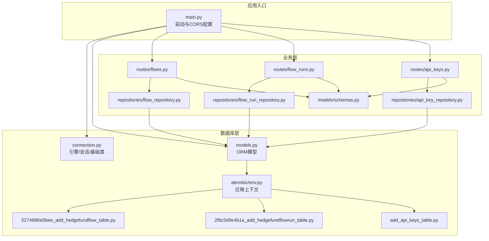
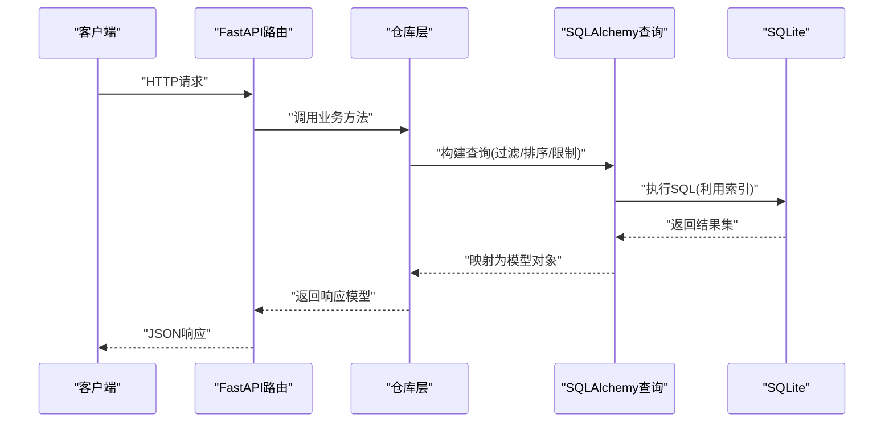
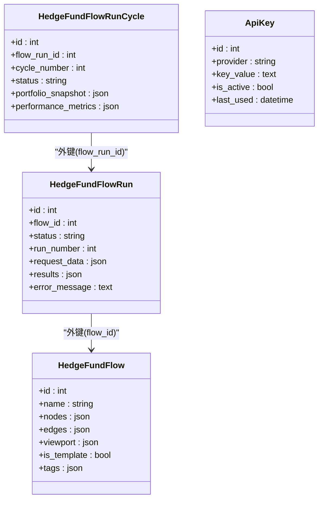
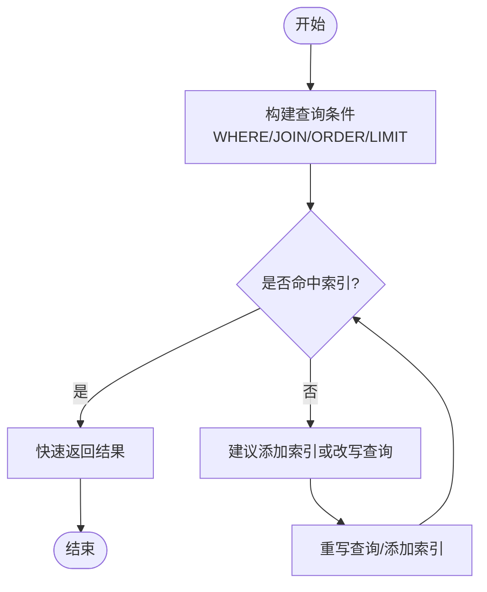
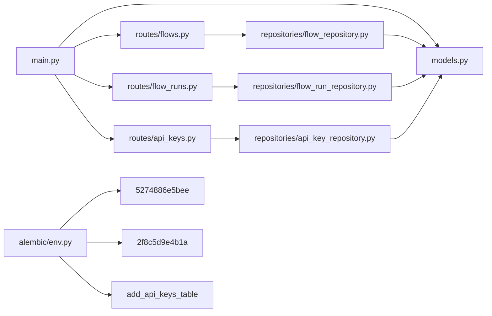

# 性能优化与索引

<cite>
**本文引用的文件**
- [app/backend/database/connection.py](file://app/backend/database/connection.py)
- [app/backend/database/models.py](file://app/backend/database/models.py)
- [app/backend/alembic/env.py](file://app/backend/alembic/env.py)
- [app/backend/alembic/versions/5274886e5bee_add_hedgefundflow_table.py](file://app/backend/alembic/versions/5274886e5bee_add_hedgefundflow_table.py)
- [app/backend/alembic/versions/2f8c5d9e4b1a_add_hedgefundflowrun_table.py](file://app/backend/alembic/versions/2f8c5d9e4b1a_add_hedgefundflowrun_table.py)
- [app/backend/alembic/versions/add_api_keys_table.py](file://app/backend/alembic/versions/add_api_keys_table.py)
- [app/backend/main.py](file://app/backend/main.py)
- [app/backend/repositories/flow_repository.py](file://app/backend/repositories/flow_repository.py)
- [app/backend/repositories/flow_run_repository.py](file://app/backend/repositories/flow_run_repository.py)
- [app/backend/repositories/api_key_repository.py](file://app/backend/repositories/api_key_repository.py)
- [app/backend/routes/flows.py](file://app/backend/routes/flows.py)
- [app/backend/routes/flow_runs.py](file://app/backend/routes/flow_runs.py)
- [app/backend/routes/api_keys.py](file://app/backend/routes/api_keys.py)
- [app/backend/models/schemas.py](file://app/backend/models/schemas.py)
</cite>

## 目录
1. [简介](#简介)
2. [项目结构](#项目结构)
3. [核心组件](#核心组件)
4. [架构总览](#架构总览)
5. [详细组件分析](#详细组件分析)
6. [依赖分析](#依赖分析)
7. [性能考量](#性能考量)
8. [故障排查指南](#故障排查指南)
9. [结论](#结论)
10. [附录](#附录)

## 简介
本文件围绕该AI对冲基金项目的数据库性能优化与索引策略展开，结合现有SQLite+SQLAlchemy实现，系统阐述查询性能优化、索引设计原则、查询优化器与执行计划分析、慢查询识别、连接/子查询/聚合优化技巧、索引维护与统计信息、分区表设计思路、连接池与并发控制、锁机制、内存与磁盘I/O优化、网络延迟优化、监控与容量规划，以及性能测试与压力测试方法。内容以实际代码为依据，辅以可视化图示帮助理解。

## 项目结构
后端采用FastAPI + SQLAlchemy + Alembic，数据库为SQLite（开发环境）。模型定义在ORM层，路由负责HTTP接口，仓库层封装CRUD，服务层承载业务逻辑。迁移脚本记录表结构演进。

**图表来源**
- [app/backend/main.py:1-56](file://app/backend/main.py#L1-L56)
- [app/backend/database/connection.py:1-32](file://app/backend/database/connection.py#L1-L32)
- [app/backend/database/models.py:1-115](file://app/backend/database/models.py#L1-L115)
- [app/backend/alembic/env.py:1-78](file://app/backend/alembic/env.py#L1-L78)
- [app/backend/alembic/versions/5274886e5bee_add_hedgefundflow_table.py:1-47](file://app/backend/alembic/versions/5274886e5bee_add_hedgefundflow_table.py#L1-L47)
- [app/backend/alembic/versions/2f8c5d9e4b1a_add_hedgefundflowrun_table.py:1-49](file://app/backend/alembic/versions/2f8c5d9e4b1a_add_hedgefundflowrun_table.py#L1-L49)
- [app/backend/alembic/versions/add_api_keys_table.py:1-44](file://app/backend/alembic/versions/add_api_keys_table.py#L1-L44)
- [app/backend/routes/flows.py:1-174](file://app/backend/routes/flows.py#L1-L174)
- [app/backend/routes/flow_runs.py:1-303](file://app/backend/routes/flow_runs.py#L1-L303)
- [app/backend/routes/api_keys.py:1-201](file://app/backend/routes/api_keys.py#L1-L201)
- [app/backend/repositories/flow_repository.py:1-103](file://app/backend/repositories/flow_repository.py#L1-L103)
- [app/backend/repositories/flow_run_repository.py:1-133](file://app/backend/repositories/flow_run_repository.py#L1-L133)
- [app/backend/repositories/api_key_repository.py:1-131](file://app/backend/repositories/api_key_repository.py#L1-L131)
- [app/backend/models/schemas.py:1-292](file://app/backend/models/schemas.py#L1-L292)

**章节来源**
- [app/backend/main.py:1-56](file://app/backend/main.py#L1-L56)
- [app/backend/database/connection.py:1-32](file://app/backend/database/connection.py#L1-L32)
- [app/backend/database/models.py:1-115](file://app/backend/database/models.py#L1-L115)
- [app/backend/alembic/env.py:1-78](file://app/backend/alembic/env.py#L1-L78)

## 核心组件
- 数据库引擎与会话：通过SQLAlchemy创建引擎与会话工厂，支持SQLite本地文件存储。
- ORM模型：定义了流、运行、周期与API密钥等核心实体，含主键索引与外键索引。
- 路由与仓库：路由处理HTTP请求，仓库封装查询逻辑，直接使用SQLAlchemy查询API。
- 迁移脚本：记录各表的索引与约束，反映当前索引策略。

**章节来源**
- [app/backend/database/connection.py:1-32](file://app/backend/database/connection.py#L1-L32)
- [app/backend/database/models.py:1-115](file://app/backend/database/models.py#L1-L115)
- [app/backend/repositories/flow_repository.py:1-103](file://app/backend/repositories/flow_repository.py#L1-L103)
- [app/backend/repositories/flow_run_repository.py:1-133](file://app/backend/repositories/flow_run_repository.py#L1-L133)
- [app/backend/repositories/api_key_repository.py:1-131](file://app/backend/repositories/api_key_repository.py#L1-L131)

## 架构总览
下图展示从HTTP请求到数据库查询的整体流程，以及与索引策略的关系。

**图表来源**
- [app/backend/routes/flows.py:18-82](file://app/backend/routes/flows.py#L18-L82)
- [app/backend/repositories/flow_repository.py:30-45](file://app/backend/repositories/flow_repository.py#L30-L45)
- [app/backend/routes/flow_runs.py:62-83](file://app/backend/routes/flow_runs.py#L62-L83)
- [app/backend/repositories/flow_run_repository.py:35-44](file://app/backend/repositories/flow_run_repository.py#L35-L44)
- [app/backend/routes/api_keys.py:27-78](file://app/backend/routes/api_keys.py#L27-L78)
- [app/backend/repositories/api_key_repository.py:48-60](file://app/backend/repositories/api_key_repository.py#L48-L60)

## 详细组件分析

### 组件A：查询路径与索引策略
- 主键索引：所有模型主键均声明为主键，并在迁移中显式创建索引，确保唯一性与快速定位。
- 外键索引：运行表与周期表对外键字段建立索引，支撑多表关联与反向查询。
- 复合索引：当前未见复合索引定义；可按查询热点设计组合索引（如运行表的flow_id+status）。

**图表来源**
- [app/backend/database/models.py:6-115](file://app/backend/database/models.py#L6-L115)
- [app/backend/alembic/versions/2f8c5d9e4b1a_add_hedgefundflowrun_table.py:24-39](file://app/backend/alembic/versions/2f8c5d9e4b1a_add_hedgefundflowrun_table.py#L24-L39)
- [app/backend/alembic/versions/5274886e5bee_add_hedgefundflow_table.py:24-37](file://app/backend/alembic/versions/5274886e5bee_add_hedgefundflow_table.py#L24-L37)
- [app/backend/alembic/versions/add_api_keys_table.py:24-37](file://app/backend/alembic/versions/add_api_keys_table.py#L24-L37)

**章节来源**
- [app/backend/database/models.py:10-115](file://app/backend/database/models.py#L10-L115)
- [app/backend/alembic/versions/2f8c5d9e4b1a_add_hedgefundflowrun_table.py:21-49](file://app/backend/alembic/versions/2f8c5d9e4b1a_add_hedgefundflowrun_table.py#L21-L49)
- [app/backend/alembic/versions/5274886e5bee_add_hedgefundflow_table.py:21-47](file://app/backend/alembic/versions/5274886e5bee_add_hedgefundflow_table.py#L21-L47)
- [app/backend/alembic/versions/add_api_keys_table.py:21-44](file://app/backend/alembic/versions/add_api_keys_table.py#L21-L44)

### 组件B：查询优化与执行计划
- 查询优化器：SQLAlchemy基于SQL表达式生成SQL，SQLite查询优化器会利用索引进行扫描或连接。
- 执行计划分析：可通过SQLite EXPLAIN QUERY PLAN查看查询路径，结合WHERE、ORDER BY、LIMIT等判断是否命中索引。
- 慢查询识别：结合路由层异常处理与日志，定位耗时操作（如大列表分页、复杂JSON字段检索）。

[此图为概念性流程图，不直接对应具体源码文件]

### 组件C：连接查询、子查询与聚合查询优化
- 连接查询：运行表与流表的关联查询应确保外键列有索引，避免全表扫描。
- 子查询：如按flow_id计数或取最大run_number，优先使用索引覆盖的COUNT/MAX。
- 聚合查询：对时间序列字段（created_at/started_at/completed_at）建立合适索引，减少排序成本。

**章节来源**
- [app/backend/repositories/flow_run_repository.py:35-44](file://app/backend/repositories/flow_run_repository.py#L35-L44)
- [app/backend/repositories/flow_run_repository.py:126-133](file://app/backend/repositories/flow_run_repository.py#L126-L133)
- [app/backend/repositories/flow_repository.py:34-45](file://app/backend/repositories/flow_repository.py#L34-L45)

### 组件D：索引维护与统计信息
- 索引维护：新增查询热点字段时，评估是否需要补充单列或复合索引。
- 统计信息：SQLite在INSERT/UPDATE/DELETE后自动维护统计信息，但复杂查询仍需EXPLAIN验证索引使用情况。

**章节来源**
- [app/backend/alembic/versions/2f8c5d9e4b1a_add_hedgefundflowrun_table.py:38-39](file://app/backend/alembic/versions/2f8c5d9e4b1a_add_hedgefundflowrun_table.py#L38-L39)
- [app/backend/alembic/versions/add_api_keys_table.py:36-37](file://app/backend/alembic/versions/add_api_keys_table.py#L36-L37)

### 组件E：分区表设计（思路）
- 当前为SQLite单文件，不支持在线分区；可考虑按时间维度拆分多个数据库文件或表组，配合应用层路由选择。
- 对高频查询字段（如flow_id/status）建立索引，降低跨分区扫描成本。

[本节为概念性说明，不直接对应具体源码文件]

### 组件F：连接池、并发控制与锁机制
- 连接池：当前使用SQLAlchemy默认连接池参数；生产环境建议根据QPS与并发线程数调整。
- 并发控制：SQLite在写入时使用文件级锁，高并发写入可能成为瓶颈；可考虑读写分离或异步队列。
- 锁机制：避免长事务与大范围扫描，减少共享锁持有时间。

**章节来源**
- [app/backend/database/connection.py:15-21](file://app/backend/database/connection.py#L15-L21)

### 组件G：内存、磁盘I/O与网络延迟优化
- 内存：合理使用LIMIT/OFFSET分页，避免一次性加载大结果集；对JSON字段按需解析。
- 磁盘I/O：减少不必要的SELECT *，仅取必要列；对大JSON字段考虑外部存储或压缩。
- 网络延迟：前端与后端在同一主机部署，减少跨网络开销；API响应尽量轻量。

[本节为通用优化建议，不直接对应具体源码文件]

### 组件H：监控指标、瓶颈识别与容量规划
- 指标采集：记录慢查询SQL、执行耗时、错误率、连接池等待时间。
- 瓶颈识别：结合EXPLAIN与日志，定位索引缺失、全表扫描、锁竞争。
- 容量规划：估算表增长趋势，提前规划索引与分表策略。

[本节为通用优化建议，不直接对应具体源码文件]

### 组件I：性能测试、基准测试与压力测试
- 单元测试：针对仓库层查询方法编写测试，覆盖不同WHERE条件与排序场景。
- 基准测试：固定数据规模，对比不同索引下的查询耗时。
- 压力测试：模拟高并发请求，观察连接池饱和、锁等待与错误率。

[本节为通用测试建议，不直接对应具体源码文件]

## 依赖分析
- 路由依赖仓库层，仓库层依赖SQLAlchemy ORM与模型。
- 迁移脚本依赖Alembic与SQLAlchemy DDL。
- 应用入口初始化数据库表结构与CORS。

**图表来源**
- [app/backend/routes/flows.py:1-174](file://app/backend/routes/flows.py#L1-L174)
- [app/backend/routes/flow_runs.py:1-303](file://app/backend/routes/flow_runs.py#L1-L303)
- [app/backend/routes/api_keys.py:1-201](file://app/backend/routes/api_keys.py#L1-L201)
- [app/backend/repositories/flow_repository.py:1-103](file://app/backend/repositories/flow_repository.py#L1-L103)
- [app/backend/repositories/flow_run_repository.py:1-133](file://app/backend/repositories/flow_run_repository.py#L1-L133)
- [app/backend/repositories/api_key_repository.py:1-131](file://app/backend/repositories/api_key_repository.py#L1-L131)
- [app/backend/database/models.py:1-115](file://app/backend/database/models.py#L1-L115)
- [app/backend/main.py:1-56](file://app/backend/main.py#L1-L56)
- [app/backend/alembic/env.py:1-78](file://app/backend/alembic/env.py#L1-L78)
- [app/backend/alembic/versions/5274886e5bee_add_hedgefundflow_table.py:1-47](file://app/backend/alembic/versions/5274886e5bee_add_hedgefundflow_table.py#L1-L47)
- [app/backend/alembic/versions/2f8c5d9e4b1a_add_hedgefundflowrun_table.py:1-49](file://app/backend/alembic/versions/2f8c5d9e4b1a_add_hedgefundflowrun_table.py#L1-L49)
- [app/backend/alembic/versions/add_api_keys_table.py:1-44](file://app/backend/alembic/versions/add_api_keys_table.py#L1-L44)

**章节来源**
- [app/backend/main.py:17-18](file://app/backend/main.py#L17-L18)
- [app/backend/alembic/env.py:19-20](file://app/backend/alembic/env.py#L19-L20)

## 性能考量
- 索引策略
  - 主键索引：已为所有主键创建索引，保证唯一性与快速定位。
  - 外键索引：运行表与周期表的外键列已建索引，有利于JOIN与反查。
  - 复合索引：建议针对高频过滤组合（如flow_id+status）设计复合索引。
- 查询优化
  - 使用LIMIT/OFFSET分页，避免全表扫描。
  - 避免SELECT *，仅取必要列。
  - 对JSON字段的过滤尽量在应用侧完成，减少数据库侧解析成本。
- 连接池与并发
  - 生产环境建议调整连接池大小与超时参数，避免连接争用。
  - 写入操作合并提交，减少锁持有时间。
- 监控与测试
  - 使用EXPLAIN与日志记录慢查询，持续优化索引与SQL。
  - 建立基准测试与压力测试流程，定期评估性能变化。

[本节为通用优化建议，不直接对应具体源码文件]

## 故障排查指南
- 常见问题
  - 查询缓慢：检查WHERE条件是否命中索引，是否存在全表扫描。
  - 分页错乱：确认ORDER BY字段有索引，避免对无索引列排序。
  - 锁等待：减少长事务，合并写入操作。
- 排查步骤
  - 记录慢查询SQL与耗时。
  - 使用EXPLAIN分析执行计划。
  - 检查索引是否缺失或冗余。
  - 观察连接池状态与错误日志。

**章节来源**
- [app/backend/routes/flows.py:52-59](file://app/backend/routes/flows.py#L52-L59)
- [app/backend/routes/flow_runs.py:67-83](file://app/backend/routes/flow_runs.py#L67-L83)
- [app/backend/routes/api_keys.py:49-56](file://app/backend/routes/api_keys.py#L49-L56)

## 结论
本项目基于SQLite+SQLAlchemy实现，已具备良好的索引基础（主键与外键索引）。后续可在高频查询路径上引入复合索引、优化分页与JSON处理、完善连接池与并发控制，并建立系统化的监控与测试体系，以持续提升查询性能与整体稳定性。

## 附录
- 关键实现位置参考
  - 引擎与会话：[app/backend/database/connection.py:15-21](file://app/backend/database/connection.py#L15-L21)
  - 模型定义与索引：[app/backend/database/models.py:10-115](file://app/backend/database/models.py#L10-L115)
  - 迁移脚本（索引创建）：[app/backend/alembic/versions/2f8c5d9e4b1a_add_hedgefundflowrun_table.py:38-39](file://app/backend/alembic/versions/2f8c5d9e4b1a_add_hedgefundflowrun_table.py#L38-L39)、[app/backend/alembic/versions/add_api_keys_table.py:36-37](file://app/backend/alembic/versions/add_api_keys_table.py#L36-L37)
  - 路由与仓库查询：[app/backend/routes/flows.py:52-59](file://app/backend/routes/flows.py#L52-L59)、[app/backend/repositories/flow_repository.py:34-45](file://app/backend/repositories/flow_repository.py#L34-L45)、[app/backend/routes/flow_runs.py:67-83](file://app/backend/routes/flow_runs.py#L67-L83)、[app/backend/repositories/flow_run_repository.py:35-44](file://app/backend/repositories/flow_run_repository.py#L35-L44)、[app/backend/routes/api_keys.py:49-56](file://app/backend/routes/api_keys.py#L49-L56)、[app/backend/repositories/api_key_repository.py:55-60](file://app/backend/repositories/api_key_repository.py#L55-L60)