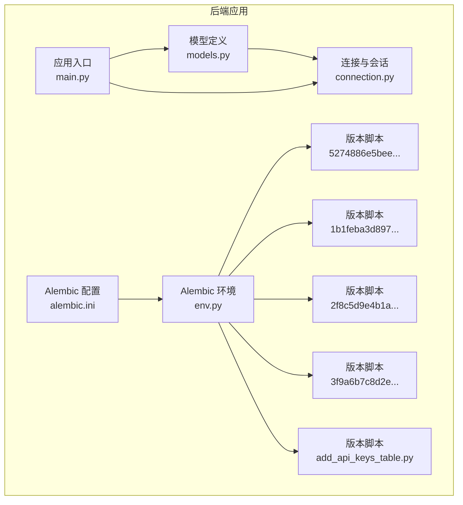
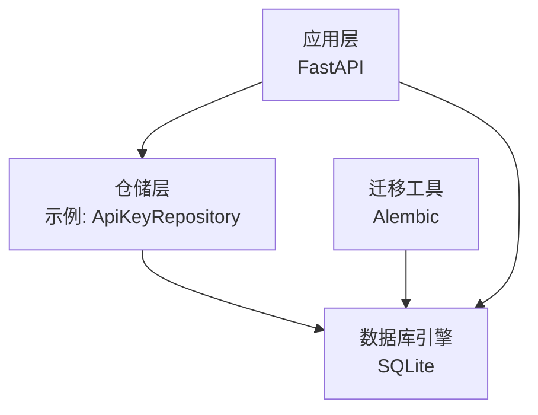
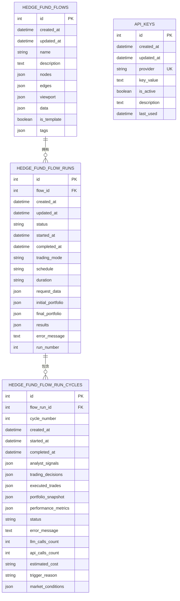
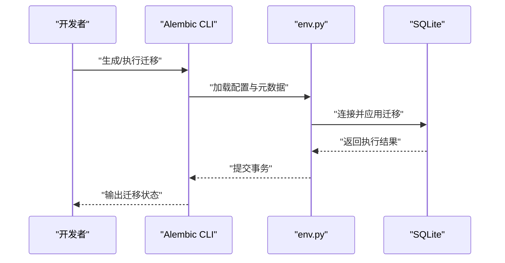
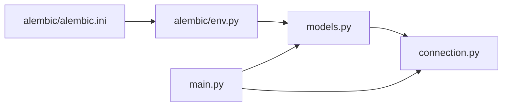

# 数据库设计

<cite>
**本文引用的文件**
- [app/backend/database/models.py](file://app/backend/database/models.py)
- [app/backend/database/connection.py](file://app/backend/database/connection.py)
- [app/backend/alembic/env.py](file://app/backend/alembic/env.py)
- [app/backend/alembic.ini](file://app/backend/alembic.ini)
- [app/backend/alembic/versions/5274886e5bee_add_hedgefundflow_table.py](file://app/backend/alembic/versions/5274886e5bee_add_hedgefundflow_table.py)
- [app/backend/alembic/versions/1b1feba3d897_add_data_column_to_hedge_fund_flows.py](file://app/backend/alembic/versions/1b1feba3d897_add_data_column_to_hedge_fund_flows.py)
- [app/backend/alembic/versions/2f8c5d9e4b1a_add_hedgefundflowrun_table.py](file://app/backend/alembic/versions/2f8c5d9e4b1a_add_hedgefundflowrun_table.py)
- [app/backend/alembic/versions/3f9a6b7c8d2e_add_hedgefundflowruncycle_table.py](file://app/backend/alembic/versions/3f9a6b7c8d2e_add_hedgefundflowruncycle_table.py)
- [app/backend/alembic/versions/add_api_keys_table.py](file://app/backend/alembic/versions/add_api_keys_table.py)
- [app/backend/main.py](file://app/backend/main.py)
- [app/backend/repositories/api_key_repository.py](file://app/backend/repositories/api_key_repository.py)
- [docker/docker-compose.yml](file://docker/docker-compose.yml)
</cite>

## 目录
1. [简介](#简介)
2. [项目结构](#项目结构)
3. [核心组件](#核心组件)
4. [架构总览](#架构总览)
5. [详细组件分析](#详细组件分析)
6. [依赖分析](#依赖分析)
7. [性能考虑](#性能考虑)
8. [故障排查指南](#故障排查指南)
9. [结论](#结论)
10. [附录](#附录)

## 简介
本文件系统化梳理本项目的数据库设计与实现，覆盖表结构、关系映射、主键/外键/索引/约束设计原则；基于 Alembic 的迁移管理、版本控制与数据库演进策略；查询优化与性能调优建议；数据验证与完整性约束；备份与灾难恢复；数据安全与访问控制；迁移路径与向后兼容；以及监控、性能分析与维护指南。内容以实际代码为依据，确保可追溯与可落地。

## 项目结构
数据库相关的核心位置集中在后端应用中：
- 模型定义：位于数据库层，使用 SQLAlchemy ORM 映射到 SQLite 文件数据库。
- 连接与会话：集中于连接模块，提供引擎与依赖注入。
- 迁移与版本：通过 Alembic 管理，版本脚本位于 versions 目录。
- 启动初始化：FastAPI 应用启动时自动创建表（幂等）。
- 容器编排：Docker Compose 提供服务编排，但数据库持久化未在 compose 中显式挂载卷。

图表来源
- [app/backend/database/models.py:1-115](file://app/backend/database/models.py#L1-L115)
- [app/backend/database/connection.py:1-32](file://app/backend/database/connection.py#L1-L32)
- [app/backend/alembic/env.py:1-78](file://app/backend/alembic/env.py#L1-L78)
- [app/backend/alembic.ini:1-120](file://app/backend/alembic.ini#L1-L120)
- [app/backend/alembic/versions/5274886e5bee_add_hedgefundflow_table.py:1-47](file://app/backend/alembic/versions/5274886e5bee_add_hedgefundflow_table.py#L1-L47)
- [app/backend/alembic/versions/1b1feba3d897_add_data_column_to_hedge_fund_flows.py:1-33](file://app/backend/alembic/versions/1b1feba3d897_add_data_column_to_hedge_fund_flows.py#L1-L33)
- [app/backend/alembic/versions/2f8c5d9e4b1a_add_hedgefundflowrun_table.py:1-49](file://app/backend/alembic/versions/2f8c5d9e4b1a_add_hedgefundflowrun_table.py#L1-L49)
- [app/backend/alembic/versions/3f9a6b7c8d2e_add_hedgefundflowruncycle_table.py:1-102](file://app/backend/alembic/versions/3f9a6b7c8d2e_add_hedgefundflowruncycle_table.py#L1-L102)
- [app/backend/alembic/versions/add_api_keys_table.py:1-44](file://app/backend/alembic/versions/add_api_keys_table.py#L1-L44)
- [app/backend/main.py:1-56](file://app/backend/main.py#L1-L56)

章节来源
- [app/backend/database/models.py:1-115](file://app/backend/database/models.py#L1-L115)
- [app/backend/database/connection.py:1-32](file://app/backend/database/connection.py#L1-L32)
- [app/backend/alembic/env.py:1-78](file://app/backend/alembic/env.py#L1-L78)
- [app/backend/alembic.ini:1-120](file://app/backend/alembic.ini#L1-L120)
- [app/backend/main.py:17-18](file://app/backend/main.py#L17-L18)

## 核心组件
- 数据库引擎与会话
  - 使用 SQLAlchemy 创建引擎与会话工厂，SQLite 路径为相对后端目录的本地文件。
  - 提供 FastAPI 依赖注入函数用于请求生命周期内获取数据库会话。
- 模型层
  - 定义四张核心表：流配置表、运行记录表、运行周期表、API 密钥表。
  - 所有表均包含时间戳字段，支持自动创建与更新时间记录。
- Alembic 迁移
  - 通过 env.py 指定目标元数据，从配置文件读取数据库 URL。
  - 版本脚本按顺序演进，覆盖表创建、列增删、索引创建与下钻。

章节来源
- [app/backend/database/connection.py:1-32](file://app/backend/database/connection.py#L1-L32)
- [app/backend/database/models.py:6-115](file://app/backend/database/models.py#L6-L115)
- [app/backend/alembic/env.py:19-20](file://app/backend/alembic/env.py#L19-L20)
- [app/backend/alembic.ini:66](file://app/backend/alembic.ini#L66)

## 架构总览
数据库层采用“模型-迁移-连接”三层协作：
- 模型定义描述数据结构与约束；
- Alembic 基于模型元数据生成迁移脚本并执行；
- 连接模块提供引擎与会话，供应用层使用；
- 应用启动时自动创建所有表（幂等）。

图表来源
- [app/backend/main.py:17-18](file://app/backend/main.py#L17-L18)
- [app/backend/repositories/api_key_repository.py:1-46](file://app/backend/repositories/api_key_repository.py#L1-L46)
- [app/backend/database/connection.py:15-24](file://app/backend/database/connection.py#L15-L24)

## 详细组件分析

### 表结构与关系映射
- HedgeFundFlow（流配置）
  - 主键：自增整数 id
  - 字段：名称、描述、React Flow 状态（节点、边、视口）、扩展数据、模板标记、标签等
  - 索引：id
- HedgeFundFlowRun（运行记录）
  - 外键：flow_id 指向 HedgeFundFlow.id
  - 字段：状态、开始/结束时间、交易模式、调度、持续期、请求参数、初始/最终投资组合、结果、错误信息、运行序号
  - 索引：id、flow_id
- HedgeFundFlowRunCycle（运行周期）
  - 外键：flow_run_id 指向 HedgeFundFlowRun.id
  - 字段：周期号、时间线、分析信号、交易决策、已执行交易、投资组合快照、性能指标、状态、错误信息、调用计数、估算成本、触发原因、市场条件
  - 索引：flow_run_id、cycle_number、status、started_at
- ApiKey（API 密钥）
  - 主键：自增整数 id
  - 字段：提供商标识（唯一）、密钥值、启用状态、描述、最后使用时间
  - 索引：id、provider（唯一）

图表来源
- [app/backend/database/models.py:6-115](file://app/backend/database/models.py#L6-L115)
- [app/backend/alembic/versions/5274886e5bee_add_hedgefundflow_table.py:24-37](file://app/backend/alembic/versions/5274886e5bee_add_hedgefundflow_table.py#L24-L37)
- [app/backend/alembic/versions/1b1feba3d897_add_data_column_to_hedge_fund_flows.py:24](file://app/backend/alembic/versions/1b1feba3d897_add_data_column_to_hedge_fund_flows.py#L24)
- [app/backend/alembic/versions/2f8c5d9e4b1a_add_hedgefundflowrun_table.py:24-39](file://app/backend/alembic/versions/2f8c5d9e4b1a_add_hedgefundflowrun_table.py#L24-L39)
- [app/backend/alembic/versions/3f9a6b7c8d2e_add_hedgefundflowruncycle_table.py:41-67](file://app/backend/alembic/versions/3f9a6b7c8d2e_add_hedgefundflowruncycle_table.py#L41-L67)
- [app/backend/alembic/versions/add_api_keys_table.py:24-37](file://app/backend/alembic/versions/add_api_keys_table.py#L24-L37)

章节来源
- [app/backend/database/models.py:6-115](file://app/backend/database/models.py#L6-L115)
- [app/backend/alembic/versions/5274886e5bee_add_hedgefundflow_table.py:24-37](file://app/backend/alembic/versions/5274886e5bee_add_hedgefundflow_table.py#L24-L37)
- [app/backend/alembic/versions/1b1feba3d897_add_data_column_to_hedge_fund_flows.py:24](file://app/backend/alembic/versions/1b1feba3d897_add_data_column_to_hedge_fund_flows.py#L24)
- [app/backend/alembic/versions/2f8c5d9e4b1a_add_hedgefundflowrun_table.py:24-39](file://app/backend/alembic/versions/2f8c5d9e4b1a_add_hedgefundflowrun_table.py#L24-L39)
- [app/backend/alembic/versions/3f9a6b7c8d2e_add_hedgefundflowruncycle_table.py:41-67](file://app/backend/alembic/versions/3f9a6b7c8d2e_add_hedgefundflowruncycle_table.py#L41-L67)
- [app/backend/alembic/versions/add_api_keys_table.py:24-37](file://app/backend/alembic/versions/add_api_keys_table.py#L24-L37)

### 设计原则与约束
- 主键
  - 所有表均使用自增整数主键，保证全局唯一性与简单性。
- 外键
  - 运行记录与运行周期分别通过 flow_id、flow_run_id 引用上游表，形成清晰的层级关系。
- 索引
  - 模型层与迁移脚本均对常用查询字段建立索引，包括 id、flow_id、cycle_number、status、started_at 等。
- 约束
  - provider 在 ApiKey 表中设置唯一约束；
  - 多处字段设置非空默认值或服务器默认时间戳，确保数据一致性。

章节来源
- [app/backend/database/models.py:10, 34, 64, 106:10-10](file://app/backend/database/models.py#L10-L10)
- [app/backend/database/models.py:34, 64:34-34](file://app/backend/database/models.py#L34-L34)
- [app/backend/alembic/versions/add_api_keys_table.py:34](file://app/backend/alembic/versions/add_api_keys_table.py#L34)
- [app/backend/alembic/versions/2f8c5d9e4b1a_add_hedgefundflowrun_table.py:39](file://app/backend/alembic/versions/2f8c5d9e4b1a_add_hedgefundflowrun_table.py#L39)
- [app/backend/alembic/versions/3f9a6b7c8d2e_add_hedgefundflowruncycle_table.py:63-67](file://app/backend/alembic/versions/3f9a6b7c8d2e_add_hedgefundflowruncycle_table.py#L63-L67)

### Alembic 迁移管理与演进策略
- 元数据与环境
  - env.py 将模型 Base.metadata 作为目标元数据，确保迁移脚本与当前模型保持一致。
  - alembic.ini 指定脚本位置与数据库 URL，便于离线/在线迁移。
- 版本演进
  - 初始版本创建流配置表；
  - 后续版本增加 data 列、运行记录表、运行周期表及 API 密钥表；
  - 运行周期版本对既有表进行增量列添加与新表创建，同时创建相应索引。
- 幂等与回滚
  - 迁移脚本包含升级与降级逻辑，支持回退到上一版本；
  - 对新增列与索引的创建采用存在性检查，避免重复执行导致失败。

图表来源
- [app/backend/alembic/env.py:52-77](file://app/backend/alembic/env.py#L52-L77)
- [app/backend/alembic.ini:66](file://app/backend/alembic.ini#L66)

章节来源
- [app/backend/alembic/env.py:19-20](file://app/backend/alembic/env.py#L19-L20)
- [app/backend/alembic/versions/5274886e5bee_add_hedgefundflow_table.py:21-46](file://app/backend/alembic/versions/5274886e5bee_add_hedgefundflow_table.py#L21-L46)
- [app/backend/alembic/versions/1b1feba3d897_add_data_column_to_hedge_fund_flows.py:21-32](file://app/backend/alembic/versions/1b1feba3d897_add_data_column_to_hedge_fund_flows.py#L21-L32)
- [app/backend/alembic/versions/2f8c5d9e4b1a_add_hedgefundflowrun_table.py:21-48](file://app/backend/alembic/versions/2f8c5d9e4b1a_add_hedgefundflowrun_table.py#L21-L48)
- [app/backend/alembic/versions/3f9a6b7c8d2e_add_hedgefundflowruncycle_table.py:18-101](file://app/backend/alembic/versions/3f9a6b7c8d2e_add_hedgefundflowruncycle_table.py#L18-L101)
- [app/backend/alembic/versions/add_api_keys_table.py:21-44](file://app/backend/alembic/versions/add_api_keys_table.py#L21-L44)

### 查询优化与索引策略
- 建议索引
  - HedgeFundFlowRun.status、HedgeFundFlowRun.started_at：用于筛选运行状态与时间范围；
  - HedgeFundFlowRunCycle.status、HedgeFundFlowRunCycle.started_at：用于周期状态与时间范围；
  - HedgeFundFlowRun.flow_id、HedgeFundFlowRunCycle.flow_run_id：用于按运行实例聚合；
  - ApiKey.provider：用于按提供商快速检索。
- 查询模式
  - 按状态/时间过滤：优先利用索引扫描；
  - 关联查询：先按父表 id 过滤，再关联子表；
  - JSON 字段：如需检索可考虑将关键字段抽取为关系型列或使用虚拟列（需评估成本）。
- 性能注意事项
  - SQLite 在大数据量下排序/分页较慢，建议限制返回条数与使用分页；
  - 避免 SELECT *，仅选择必要列；
  - 对频繁更新的表定期执行分析统计（SQLite 无统计信息收集，可结合应用侧缓存）。

章节来源
- [app/backend/alembic/versions/2f8c5d9e4b1a_add_hedgefundflowrun_table.py:39](file://app/backend/alembic/versions/2f8c5d9e4b1a_add_hedgefundflowrun_table.py#L39)
- [app/backend/alembic/versions/3f9a6b7c8d2e_add_hedgefundflowruncycle_table.py:63-67](file://app/backend/alembic/versions/3f9a6b7c8d2e_add_hedgefundflowruncycle_table.py#L63-L67)
- [app/backend/alembic/versions/add_api_keys_table.py:36-37](file://app/backend/alembic/versions/add_api_keys_table.py#L36-L37)

### 数据验证规则与完整性约束
- 字段约束
  - 非空：名称、节点/边/视口/数据等关键字段；
  - 默认值：状态、运行序号、计数器等；
  - 唯一：提供商标识。
- 业务规则
  - 运行模式与调度/持续期的组合约束（可在应用层校验）；
  - 周期状态机：进行中、完成、错误三态转换；
  - 投资组合与性能指标为 JSON 结构，建议在入库前做结构校验。
- 参考实现
  - ApiKeyRepository 提供创建/更新逻辑，若存在则更新，否则新建，体现幂等写入。

章节来源
- [app/backend/database/models.py:15-26, 39-56, 68-94, 106-112:15-26](file://app/backend/database/models.py#L15-L26)
- [app/backend/repositories/api_key_repository.py:15-46](file://app/backend/repositories/api_key_repository.py#L15-L46)

### 数据安全、访问控制与权限管理
- 存储安全
  - API 密钥以明文存储，生产环境应加密存储并在传输中保护；
  - 建议引入密钥管理服务（KMS）或环境变量注入。
- 访问控制
  - 当前未见数据库级用户/角色/权限配置；
  - 建议在应用层实现鉴权与授权，数据库层面通过最小权限原则限制连接来源。
- 日志与审计
  - Alembic/SQLAlchemy 日志级别可调整，便于问题定位；
  - 建议对敏感操作（密钥变更、删除）增加审计日志。

章节来源
- [app/backend/alembic.ini:101-109](file://app/backend/alembic.ini#L101-L109)
- [app/backend/database/models.py:106-107](file://app/backend/database/models.py#L106-L107)

### 数据迁移路径、版本管理与向后兼容
- 迁移路径
  - 从创建流配置表开始，逐步增加运行记录与周期表，最终引入 API 密钥表；
  - 运行周期版本对既有表进行增量列添加，保持向后兼容。
- 版本管理
  - 使用 Alembic 版本化管理，每个版本脚本明确 up/down；
  - 建议每次功能迭代均配套迁移脚本，避免手动修改数据库。
- 向后兼容
  - 新增列采用存在性检查与默认值，避免破坏旧数据；
  - 降级脚本清理索引与列，确保可回退。

章节来源
- [app/backend/alembic/versions/5274886e5bee_add_hedgefundflow_table.py:21-46](file://app/backend/alembic/versions/5274886e5bee_add_hedgefundflow_table.py#L21-L46)
- [app/backend/alembic/versions/3f9a6b7c8d2e_add_hedgefundflowruncycle_table.py:18-101](file://app/backend/alembic/versions/3f9a6b7c8d2e_add_hedgefundflowruncycle_table.py#L18-L101)

### 备份、恢复与灾难恢复
- 备份策略
  - SQLite 为单文件数据库，可直接复制 hedge_fund.db 文件进行备份；
  - 建议在应用停机窗口或只读备份期间进行复制，避免并发写入导致损坏。
- 恢复流程
  - 使用备份文件替换当前数据库文件；
  - 如需回滚到特定版本，使用 Alembic 降级至目标版本。
- 灾难恢复
  - 建立多版本备份与异地存放；
  - 验证恢复流程，确保能在规定 RTO/RPO 内完成恢复。

章节来源
- [app/backend/database/connection.py:9](file://app/backend/database/connection.py#L9)
- [app/backend/alembic/versions/3f9a6b7c8d2e_add_hedgefundflowruncycle_table.py:70-101](file://app/backend/alembic/versions/3f9a6b7c8d2e_add_hedgefundflowruncycle_table.py#L70-L101)

### 监控、性能分析与维护
- 监控
  - 启用 SQLAlchemy/Alembic 日志，关注慢查询与异常；
  - 应用层记录关键操作耗时与错误率。
- 性能分析
  - 使用 EXPLAIN QUERY PLAN 分析复杂查询；
  - 观察索引使用情况，必要时调整索引策略。
- 维护
  - 定期检查数据库文件大小与碎片；
  - 对大 JSON 字段进行归档或拆分，降低单行体积。

章节来源
- [app/backend/alembic.ini:86-120](file://app/backend/alembic.ini#L86-L120)

## 依赖分析
- 模块耦合
  - 模型依赖连接模块提供的 Base；
  - Alembic 依赖模型元数据与配置文件；
  - 应用启动时依赖模型与连接模块创建表。
- 外部依赖
  - SQLAlchemy、Alembic、SQLite；
  - Docker Compose 提供服务编排，但数据库持久化未显式挂载卷。

图表来源
- [app/backend/database/models.py:3](file://app/backend/database/models.py#L3)
- [app/backend/database/connection.py:24](file://app/backend/database/connection.py#L24)
- [app/backend/alembic/env.py:19](file://app/backend/alembic/env.py#L19)
- [app/backend/alembic.ini:6](file://app/backend/alembic.ini#L6)
- [app/backend/main.py:7-8](file://app/backend/main.py#L7-L8)

章节来源
- [app/backend/database/models.py:1-4](file://app/backend/database/models.py#L1-L4)
- [app/backend/database/connection.py:1-4](file://app/backend/database/connection.py#L1-L4)
- [app/backend/alembic/env.py:1-6](file://app/backend/alembic/env.py#L1-L6)
- [app/backend/alembic.ini:4-6](file://app/backend/alembic.ini#L4-L6)
- [app/backend/main.py:6-8](file://app/backend/main.py#L6-L8)

## 性能考虑
- 索引策略
  - 为高频过滤与排序字段建立索引；
  - 避免过度索引导致写入性能下降。
- 查询优化
  - 使用 LIMIT 与分页；
  - 减少 JSON 字段的深度遍历，必要时预处理为关系型列。
- 存储与并发
  - SQLite 单文件并发写入受限，建议在高并发场景迁移到关系型数据库；
  - 采用连接池与异步 I/O（如适用）提升吞吐。

章节来源
- [app/backend/alembic/versions/2f8c5d9e4b1a_add_hedgefundflowrun_table.py:39](file://app/backend/alembic/versions/2f8c5d9e4b1a_add_hedgefundflowrun_table.py#L39)
- [app/backend/alembic/versions/3f9a6b7c8d2e_add_hedgefundflowruncycle_table.py:63-67](file://app/backend/alembic/versions/3f9a6b7c8d2e_add_hedgefundflowruncycle_table.py#L63-L67)

## 故障排查指南
- 迁移失败
  - 检查 Alembic 配置与元数据是否匹配；
  - 查看日志输出，确认数据库 URL 与权限。
- 表不存在或字段缺失
  - 确认应用启动时已执行建表逻辑；
  - 检查迁移脚本是否正确执行，必要时手动执行 up/down。
- 性能问题
  - 使用 EXPLAIN QUERY PLAN 分析；
  - 评估索引覆盖与查询路径。
- 数据安全
  - 生产环境禁用明文存储密钥；
  - 严格控制数据库文件访问权限。

章节来源
- [app/backend/alembic/env.py:28-49](file://app/backend/alembic/env.py#L28-L49)
- [app/backend/alembic/versions/3f9a6b7c8d2e_add_hedgefundflowruncycle_table.py:18-101](file://app/backend/alembic/versions/3f9a6b7c8d2e_add_hedgefundflowruncycle_table.py#L18-L101)
- [app/backend/alembic.ini:86-120](file://app/backend/alembic.ini#L86-L120)

## 结论
本项目数据库设计以 SQLAlchemy + Alembic 实现，具备清晰的表结构、外键关系与索引策略，迁移脚本完整覆盖了从流配置到运行周期再到 API 密钥的演进过程。建议在生产环境中强化数据安全（密钥加密）、完善访问控制与审计、评估并发与性能瓶颈，并制定严格的备份与灾难恢复流程，以保障系统的稳定性与可靠性。

## 附录
- 快速参考
  - 数据库文件路径：相对后端目录的本地 SQLite 文件；
  - 迁移命令：使用 Alembic CLI 执行升级/降级；
  - 启动建表：应用启动时自动创建所有表（幂等）。

章节来源
- [app/backend/database/connection.py:9](file://app/backend/database/connection.py#L9)
- [app/backend/alembic/env.py:52-77](file://app/backend/alembic/env.py#L52-L77)
- [app/backend/main.py:17-18](file://app/backend/main.py#L17-L18)