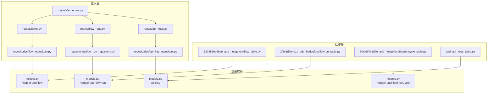
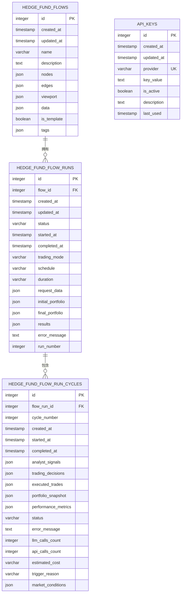
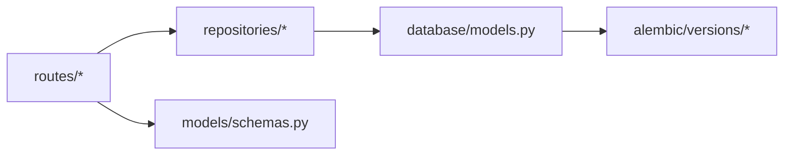

# 数据模型定义

<cite>
**本文引用的文件**
- [models.py](file://app/backend/database/models.py)
- [connection.py](file://app/backend/database/connection.py)
- [schemas.py](file://app/backend/models/schemas.py)
- [flow_repository.py](file://app/backend/repositories/flow_repository.py)
- [flow_run_repository.py](file://app/backend/repositories/flow_run_repository.py)
- [api_key_repository.py](file://app/backend/repositories/api_key_repository.py)
- [flows.py](file://app/backend/routes/flows.py)
- [flow_runs.py](file://app/backend/routes/flow_runs.py)
- [api_keys.py](file://app/backend/routes/api_keys.py)
- [5274886e5bee_add_hedgefundflow_table.py](file://app/backend/alembic/versions/5274886e5bee_add_hedgefundflow_table.py)
- [2f8c5d9e4b1a_add_hedgefundflowrun_table.py](file://app/backend/alembic/versions/2f8c5d9e4b1a_add_hedgefundflowrun_table.py)
- [3f9a6b7c8d2e_add_hedgefundflowruncycle_table.py](file://app/backend/alembic/versions/3f9a6b7c8d2e_add_hedgefundflowruncycle_table.py)
- [add_api_keys_table.py](file://app/backend/alembic/versions/add_api_keys_table.py)
</cite>

## 目录
1. [简介](#简介)
2. [项目结构](#项目结构)
3. [核心组件](#核心组件)
4. [架构总览](#架构总览)
5. [详细组件分析](#详细组件分析)
6. [依赖分析](#依赖分析)
7. [性能考虑](#性能考虑)
8. [故障排查指南](#故障排查指南)
9. [结论](#结论)
10. [附录](#附录)

## 简介
本文件系统性梳理后端数据模型定义，聚焦以下核心模型：HedgeFundFlow、HedgeFundFlowRun、HedgeFundFlowRunCycle 和 ApiKey。内容覆盖字段定义、数据类型与约束、主外键设计原则、JSON 字段使用场景、时间戳自动管理机制、模型间关系图与实体关系说明、字段验证规则与业务约束、以及序列化与反序列化处理方式。

## 项目结构
后端采用 SQLAlchemy ORM 定义模型，Alembic 迁移管理数据库演进；FastAPI 路由层通过仓库层访问数据库；Pydantic 模型用于请求/响应的序列化与校验。

图表来源
- [models.py:6-115](file://app/backend/database/models.py#L6-L115)
- [5274886e5bee_add_hedgefundflow_table.py:24-36](file://app/backend/alembic/versions/5274886e5bee_add_hedgefundflow_table.py#L24-L36)
- [2f8c5d9e4b1a_add_hedgefundflowrun_table.py:24-37](file://app/backend/alembic/versions/2f8c5d9e4b1a_add_hedgefundflowrun_table.py#L24-L37)
- [3f9a6b7c8d2e_add_hedgefundflowruncycle_table.py:41-61](file://app/backend/alembic/versions/3f9a6b7c8d2e_add_hedgefundflowruncycle_table.py#L41-L61)
- [add_api_keys_table.py:24-35](file://app/backend/alembic/versions/add_api_keys_table.py#L24-L35)
- [routes/flows.py:18-42](file://app/backend/routes/flows.py#L18-L42)
- [routes/flow_runs.py:20-51](file://app/backend/routes/flow_runs.py#L20-L51)
- [routes/api_keys.py:19-39](file://app/backend/routes/api_keys.py#L19-L39)
- [repositories/flow_repository.py:12-28](file://app/backend/repositories/flow_repository.py#L12-L28)
- [repositories/flow_run_repository.py:15-29](file://app/backend/repositories/flow_run_repository.py#L15-L29)
- [repositories/api_key_repository.py:15-46](file://app/backend/repositories/api_key_repository.py#L15-L46)
- [models/schemas.py:144-178](file://app/backend/models/schemas.py#L144-L178)

章节来源
- [models.py:1-115](file://app/backend/database/models.py#L1-L115)
- [connection.py:1-32](file://app/backend/database/connection.py#L1-L32)

## 核心组件
本节从数据库模型出发，逐项解析字段、类型、约束与用途，并结合迁移脚本与仓库层行为说明其在系统中的作用。

- HedgeFundFlow（流程模板）
  - 主键：id（整数，自增）
  - 时间戳：created_at、updated_at（自动维护）
  - 元数据：name（字符串，非空）、description（文本，可空）
  - React Flow 状态：nodes、edges、viewport、data（均为 JSON，用于存储节点、边、视口与内部状态）
  - 其他：is_template（布尔，默认 False）、tags（JSON，标签数组）

- HedgeFundFlowRun（单次执行）
  - 主键：id（整数，自增）
  - 外键：flow_id → HedgeFundFlow.id（索引）
  - 时间戳：created_at、updated_at、started_at、completed_at（自动维护或按状态更新）
  - 执行状态：status（字符串枚举，IDLE/IN_PROGRESS/COMPLETE/ERROR，默认 IDLE）
  - 配置：trading_mode（字符串，默认 one-time）、schedule、duration（连续模式的时间粒度）
  - 数据：request_data、initial_portfolio、final_portfolio、results（JSON）
  - 错误：error_message（文本）
  - 元数据：run_number（整数，默认 1，按流递增）

- HedgeFundFlowRunCycle（单次执行内的分析周期）
  - 主键：id（整数，自增）
  - 外键：flow_run_id → HedgeFundFlowRun.id（索引）
  - 周期编号：cycle_number（整数）
  - 时间：created_at、started_at、completed_at（自动维护）
  - 结果：analyst_signals、trading_decisions、executed_trades、portfolio_snapshot、performance_metrics（JSON）
  - 状态：status（字符串枚举，默认 IN_PROGRESS）
  - 成本：llm_calls_count、api_calls_count（整数，默认 0）、estimated_cost（字符串）
  - 元数据：trigger_reason（字符串）、market_conditions（JSON）

- ApiKey（服务密钥）
  - 主键：id（整数，自增）
  - 时间戳：created_at、updated_at（自动维护）
  - 唯一索引：provider（字符串，唯一）
  - 内容：key_value（文本，非空）、is_active（布尔，默认 True）
  - 元数据：description（文本，可空）、last_used（时间戳，可空）

章节来源
- [models.py:6-115](file://app/backend/database/models.py#L6-L115)
- [5274886e5bee_add_hedgefundflow_table.py:24-36](file://app/backend/alembic/versions/5274886e5bee_add_hedgefundflow_table.py#L24-L36)
- [2f8c5d9e4b1a_add_hedgefundflowrun_table.py:24-37](file://app/backend/alembic/versions/2f8c5d9e4b1a_add_hedgefundflowrun_table.py#L24-L37)
- [3f9a6b7c8d2e_add_hedgefundflowruncycle_table.py:41-61](file://app/backend/alembic/versions/3f9a6b7c8d2e_add_hedgefundflowruncycle_table.py#L41-L61)
- [add_api_keys_table.py:24-35](file://app/backend/alembic/versions/add_api_keys_table.py#L24-L35)

## 架构总览
下图展示四个核心模型的实体关系与外键约束，以及与迁移版本的对应关系。

图表来源
- [models.py:6-115](file://app/backend/database/models.py#L6-L115)
- [5274886e5bee_add_hedgefundflow_table.py:24-36](file://app/backend/alembic/versions/5274886e5bee_add_hedgefundflow_table.py#L24-L36)
- [2f8c5d9e4b1a_add_hedgefundflowrun_table.py:24-37](file://app/backend/alembic/versions/2f8c5d9e4b1a_add_hedgefundflowrun_table.py#L24-L37)
- [3f9a6b7c8d2e_add_hedgefundflowruncycle_table.py:41-61](file://app/backend/alembic/versions/3f9a6b7c8d2e_add_hedgefundflowruncycle_table.py#L41-L61)
- [add_api_keys_table.py:24-35](file://app/backend/alembic/versions/add_api_keys_table.py#L24-L35)

## 详细组件分析

### HedgeFundFlow（流程模板）
- 字段与约束
  - id：主键，自增
  - name：非空，长度限制见迁移脚本
  - nodes/edges/viewport/data：JSON 字段，用于存储 React Flow 的节点、边、视口与内部状态
  - is_template：布尔，标记是否为模板
  - tags：JSON，存储标签数组
  - created_at/updated_at：自动维护
- 设计要点
  - JSON 字段承载前端可视化配置，便于灵活扩展
  - is_template 支持复用与派生
- 使用场景
  - 流程创建、复制、搜索、列表展示
- 关系映射
  - 与 HedgeFundFlowRun 一对多

章节来源
- [models.py:6-27](file://app/backend/database/models.py#L6-L27)
- [5274886e5bee_add_hedgefundflow_table.py:24-36](file://app/backend/alembic/versions/5274886e5bee_add_hedgefundflow_table.py#L24-L36)
- [flows.py:18-42](file://app/backend/routes/flows.py#L18-L42)
- [flow_repository.py:12-28](file://app/backend/repositories/flow_repository.py#L12-L28)

### HedgeFundFlowRun（单次执行）
- 字段与约束
  - flow_id：外键关联 HedgeFundFlow，索引优化查询
  - status：枚举，驱动时序与 UI 状态
  - trading_mode/schedule/duration：控制执行策略（一次性/连续/顾问）
  - request_data/initial_portfolio/final_portfolio/results：JSON 存储请求参数、初始/最终投资组合与结果
  - run_number：按流递增，确保顺序性
  - created_at/updated_at/started_at/completed_at：按状态自动更新
- 设计要点
  - run_number 通过仓库层计算，避免并发冲突
  - status 变更联动时间戳，简化生命周期管理
- 使用场景
  - 创建执行、查询最新/活跃执行、更新状态与结果
- 关系映射
  - 与 HedgeFundFlowRunCycle 一对多

章节来源
- [models.py:29-57](file://app/backend/database/models.py#L29-L57)
- [2f8c5d9e4b1a_add_hedgefundflowrun_table.py:24-37](file://app/backend/alembic/versions/2f8c5d9e4b1a_add_hedgefundflowrun_table.py#L24-L37)
- [flow_runs.py:20-51](file://app/backend/routes/flow_runs.py#L20-L51)
- [flow_run_repository.py:15-29](file://app/backend/repositories/flow_run_repository.py#L15-L29)

### HedgeFundFlowRunCycle（执行周期）
- 字段与约束
  - flow_run_id：外键关联 HedgeFundFlowRun，索引加速查询
  - cycle_number：周期序号
  - 时间：created_at/started_at/completed_at
  - 结果：analyst_signals/trading_decisions/executed_trades/portfolio_snapshot/performance_metrics（JSON）
  - 状态：status（默认 IN_PROGRESS），错误信息 error_message
  - 成本：llm_calls_count/api_calls_count（默认 0）、estimated_cost
  - 元数据：trigger_reason/market_conditions（JSON）
- 设计要点
  - JSON 字段承载多源异构数据，便于扩展
  - 成本统计支持资源消耗追踪
- 使用场景
  - 记录每次分析周期的信号、决策、交易与收益指标

章节来源
- [models.py:59-95](file://app/backend/database/models.py#L59-L95)
- [3f9a6b7c8d2e_add_hedgefundflowruncycle_table.py:41-61](file://app/backend/alembic/versions/3f9a6b7c8d2e_add_hedgefundflowruncycle_table.py#L41-L61)

### ApiKey（服务密钥）
- 字段与约束
  - provider：唯一索引，标识服务提供商
  - key_value：敏感信息，仓库层负责更新时间戳
  - is_active：启用/禁用开关
  - description/last_used：元数据与使用追踪
  - created_at/updated_at：自动维护
- 设计要点
  - 唯一性约束保证同一提供商仅存一个密钥记录
  - last_used 用于审计与告警
- 使用场景
  - 创建/更新/查询/批量更新/停用/删除密钥

章节来源
- [models.py:97-115](file://app/backend/database/models.py#L97-L115)
- [add_api_keys_table.py:24-35](file://app/backend/alembic/versions/add_api_keys_table.py#L24-L35)
- [api_keys.py:19-39](file://app/backend/routes/api_keys.py#L19-L39)
- [api_key_repository.py:15-46](file://app/backend/repositories/api_key_repository.py#L15-L46)

### 时间戳与服务器默认值
- 自动维护
  - created_at：服务器默认值（迁移脚本与模型中均设置）
  - updated_at：onupdate 或手动赋值（模型与仓库层均有体现）
- 生命周期联动
  - HedgeFundFlowRun：status 切换到 IN_PROGRESS/COMPLETE/ERROR 时联动 started_at/completed_at
- 时区与格式
  - 字段声明含时区支持，建议前后端统一以 ISO 8601 表示

章节来源
- [models.py:11-12](file://app/backend/database/models.py#L11-L12)
- [models.py:35-36](file://app/backend/database/models.py#L35-L36)
- [models.py:68-70](file://app/backend/database/models.py#L68-L70)
- [models.py:102-103](file://app/backend/database/models.py#L102-L103)
- [2f8c5d9e4b1a_add_hedgefundflowrun_table.py:27-29](file://app/backend/alembic/versions/2f8c5d9e4b1a_add_hedgefundflowrun_table.py#L27-L29)
- [3f9a6b7c8d2e_add_hedgefundflowruncycle_table.py:46-47](file://app/backend/alembic/versions/3f9a6b7c8d2e_add_hedgefundflowruncycle_table.py#L46-L47)
- [add_api_keys_table.py:26-27](file://app/backend/alembic/versions/add_api_keys_table.py#L26-L27)
- [flow_run_repository.py:82-86](file://app/backend/repositories/flow_run_repository.py#L82-L86)

### JSON 字段的使用与数据结构
- 使用场景
  - HedgeFundFlow：nodes/edges/viewport/data 存储 React Flow 配置与内部状态
  - HedgeFundFlowRun：request_data/initial_portfolio/final_portfolio/results 存储运行参数、投资组合与结果
  - HedgeFundFlowRunCycle：analyst_signals/trading_decisions/executed_trades/portfolio_snapshot/performance_metrics/market_conditions 存储分析与交易相关 JSON 数据
  - ApiKey：无直接 JSON 字段，但可作为外部配置的键值载体
- 数据结构设计
  - 采用 JSON 存储复杂嵌套结构，便于前端渲染与后端扩展
  - 建议在写入前进行结构校验与最小字段集约束，避免冗余
- 注意事项
  - JSON 字段不参与 SQL 层索引，查询需谨慎；必要时可拆分或增加物化列

章节来源
- [models.py:19-22](file://app/backend/database/models.py#L19-L22)
- [models.py:49-53](file://app/backend/database/models.py#L49-L53)
- [models.py:73-94](file://app/backend/database/models.py#L73-L94)

### 字段验证规则与业务约束
- Pydantic 层（请求/响应）
  - FlowCreateRequest/FlowUpdateRequest：name 长度限制、可选字段、tags 数组
  - FlowRunUpdateRequest：status 为枚举 FlowRunStatus，results/error_message 可选
  - ApiKeyCreateRequest/ApiKeyUpdateRequest：provider 长度限制、key_value 非空
- 数据库层（模型与迁移）
  - 非空约束：name、nodes、edges、viewport（部分）、key_value、status 默认值
  - 唯一约束：provider
  - 默认值：run_number、trading_mode、status、llm_calls_count、api_calls_count
- 业务逻辑约束
  - run_number 递增：仓库层查询最大值并加一
  - status → 时间戳联动：开始与结束时间仅在状态切换时写入
  - 复制流程：is_template 强制设为 False，保留其他元数据

章节来源
- [schemas.py:144-178](file://app/backend/models/schemas.py#L144-L178)
- [schemas.py:198-241](file://app/backend/models/schemas.py#L198-L241)
- [schemas.py:244-257](file://app/backend/models/schemas.py#L244-L257)
- [flow_run_repository.py:126-133](file://app/backend/repositories/flow_run_repository.py#L126-L133)
- [flow_repository.py:86-103](file://app/backend/repositories/flow_repository.py#L86-L103)

### 序列化与反序列化处理
- ORM ↔ Pydantic
  - 路由返回模型使用 from_orm 将 ORM 对象转为 Pydantic 响应对象
  - 请求体使用 Pydantic 模型进行校验与反序列化
- 字段映射
  - 时间戳：created_at/updated_at/started_at/completed_at 映射为 datetime
  - 枚举：status 映射为字符串枚举
  - JSON：原样传递，前端负责渲染
- 性能建议
  - 列表接口使用摘要响应（如 FlowSummaryResponse）减少传输体积

章节来源
- [flows.py:40-57](file://app/backend/routes/flows.py#L40-L57)
- [flow_runs.py:79-79](file://app/backend/routes/flow_runs.py#L79-L79)
- [api_keys.py:54-54](file://app/backend/routes/api_keys.py#L54-L54)
- [schemas.py:179-181](file://app/backend/models/schemas.py#L179-L181)
- [schemas.py:224-226](file://app/backend/models/schemas.py#L224-L226)
- [schemas.py:269-271](file://app/backend/models/schemas.py#L269-L271)
- [schemas.py:285-287](file://app/backend/models/schemas.py#L285-L287)

## 依赖分析
- 组件耦合
  - 路由层依赖仓库层，仓库层依赖模型层
  - 模型层仅依赖 SQLAlchemy 基类与类型，低耦合
- 外部依赖
  - SQLAlchemy（ORM/类型/默认值）
  - Alembic（迁移）
  - FastAPI（路由）
  - Pydantic（序列化/校验）
- 潜在风险
  - JSON 字段缺乏结构约束，需在应用层加强校验
  - run_number 递增依赖查询最大值，高并发下建议引入原子操作或队列

图表来源
- [routes/flows.py:1-174](file://app/backend/routes/flows.py#L1-L174)
- [routes/flow_runs.py:1-303](file://app/backend/routes/flow_runs.py#L1-L303)
- [routes/api_keys.py:1-201](file://app/backend/routes/api_keys.py#L1-L201)
- [repositories/flow_repository.py:1-103](file://app/backend/repositories/flow_repository.py#L1-L103)
- [repositories/flow_run_repository.py:1-133](file://app/backend/repositories/flow_run_repository.py#L1-L133)
- [repositories/api_key_repository.py:1-131](file://app/backend/repositories/api_key_repository.py#L1-L131)
- [models.py:1-115](file://app/backend/database/models.py#L1-L115)
- [schemas.py:1-292](file://app/backend/models/schemas.py#L1-L292)

## 性能考虑
- 索引策略
  - HedgeFundFlowRun.flow_id、HedgeFundFlowRunCycle.flow_run_id、ApiKey.provider 建有索引，提升查询效率
- 查询优化
  - 列表接口使用摘要模型，减少字段传输
  - 分页参数（limit/offset）控制返回量
- 写入优化
  - created_at/updated_at 由服务器默认值维护，减少应用层赋值开销
  - run_number 通过原子查询+加一，避免竞争条件

章节来源
- [2f8c5d9e4b1a_add_hedgefundflowrun_table.py:38-39](file://app/backend/alembic/versions/2f8c5d9e4b1a_add_hedgefundflowrun_table.py#L38-L39)
- [3f9a6b7c8d2e_add_hedgefundflowruncycle_table.py:63-67](file://app/backend/alembic/versions/3f9a6b7c8d2e_add_hedgefundflowruncycle_table.py#L63-L67)
- [add_api_keys_table.py:36-37](file://app/backend/alembic/versions/add_api_keys_table.py#L36-L37)
- [flow_runs.py:62-79](file://app/backend/routes/flow_runs.py#L62-L79)

## 故障排查指南
- 常见问题
  - 外键约束失败：确认父表记录存在且 flow_id 正确
  - 唯一冲突：provider 已存在时需先更新而非重复插入
  - JSON 结构异常：检查前端导出/导入的数据结构一致性
  - 时间戳未更新：确认状态变更逻辑是否触发 started_at/completed_at 更新
- 排查步骤
  - 查看路由层抛出的 HTTP 状态码与错误详情
  - 核对仓库层日志与数据库当前状态
  - 使用 Alembic 版本回滚定位变更范围
- 相关实现位置
  - 外键与唯一约束：迁移脚本与模型定义
  - 状态联动：仓库层状态更新逻辑
  - 错误返回：路由层捕获异常并返回标准错误模型

章节来源
- [2f8c5d9e4b1a_add_hedgefundflowrun_table.py:34-35](file://app/backend/alembic/versions/2f8c5d9e4b1a_add_hedgefundflowrun_table.py#L34-L35)
- [add_api_keys_table.py:34-34](file://app/backend/alembic/versions/add_api_keys_table.py#L34-L34)
- [flow_runs.py:184-210](file://app/backend/routes/flow_runs.py#L184-L210)
- [api_keys.py:190-198](file://app/backend/routes/api_keys.py#L190-L198)

## 结论
本数据模型围绕“流程模板—执行—周期—密钥”四层结构展开，采用 JSON 字段承载前端可视化与运行期动态数据，配合 Alembic 迁移与仓库层业务逻辑，实现了清晰的职责分离与良好的扩展性。建议后续在 JSON 结构约束、并发安全与索引策略上持续优化，以支撑更大规模的生产环境。

## 附录
- 运行时初始化
  - 应用启动时创建所有表（幂等），确保数据库结构与模型一致
- 数据库连接
  - 使用 SQLite 文件数据库，绝对路径确保部署一致性

章节来源
- [connection.py:11-24](file://app/backend/database/connection.py#L11-L24)
- [main.py:17-18](file://app/backend/main.py#L17-L18)