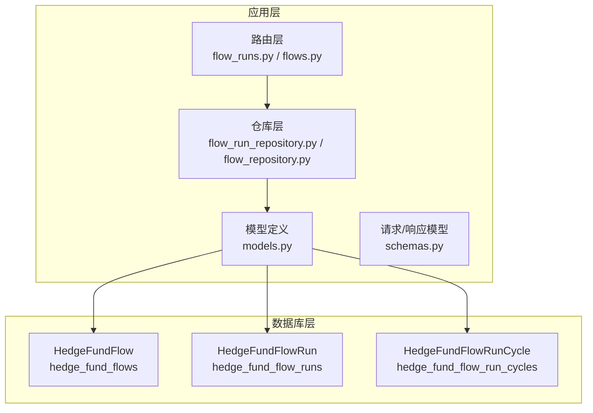
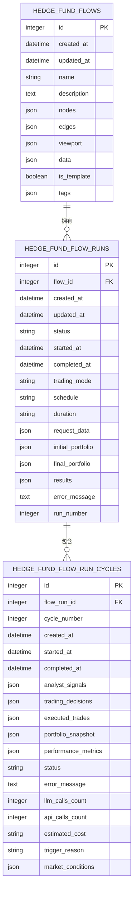
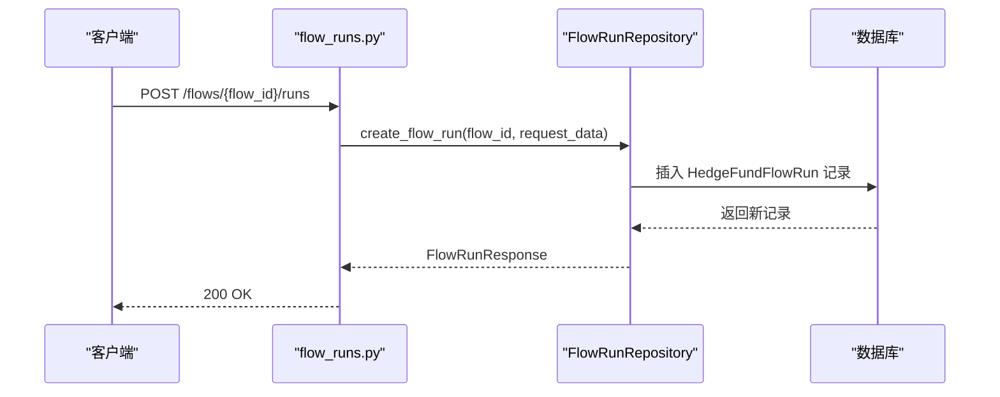
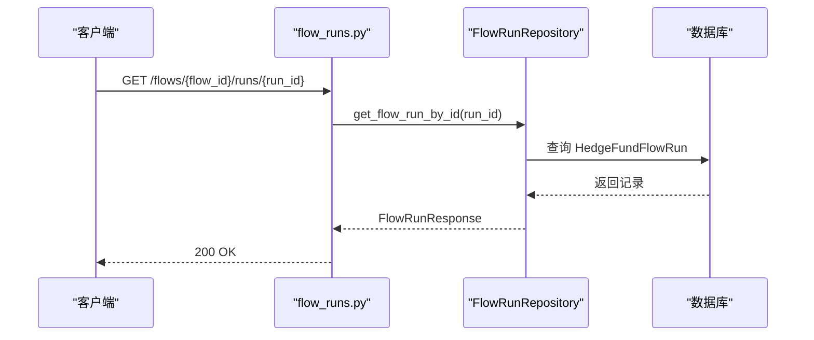
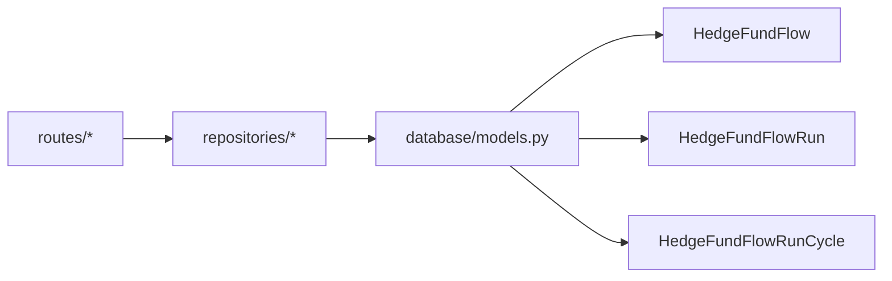

# 表关系映射

<cite>
**本文档引用的文件**
- [models.py](file://app/backend/database/models.py)
- [connection.py](file://app/backend/database/connection.py)
- [flow_repository.py](file://app/backend/repositories/flow_repository.py)
- [flow_run_repository.py](file://app/backend/repositories/flow_run_repository.py)
- [flow_runs.py](file://app/backend/routes/flow_runs.py)
- [flows.py](file://app/backend/routes/flows.py)
- [schemas.py](file://app/backend/models/schemas.py)
- [5274886e5bee_add_hedgefundflow_table.py](file://app/backend/alembic/versions/5274886e5bee_add_hedgefundflow_table.py)
- [2f8c5d9e4b1a_add_hedgefundflowrun_table.py](file://app/backend/alembic/versions/2f8c5d9e4b1a_add_hedgefundflowrun_table.py)
- [3f9a6b7c8d2e_add_hedgefundflowruncycle_table.py](file://app/backend/alembic/versions/3f9a6b7c8d2e_add_hedgefundflowruncycle_table.py)
- [1b1feba3d897_add_data_column_to_hedge_fund_flows.py](file://app/backend/alembic/versions/1b1feba3d897_add_data_column_to_hedge_fund_flows.py)
</cite>

## 目录
1. [简介](#简介)
2. [项目结构](#项目结构)
3. [核心组件](#核心组件)
4. [架构总览](#架构总览)
5. [详细组件分析](#详细组件分析)
6. [依赖分析](#依赖分析)
7. [性能考量](#性能考量)
8. [故障排查指南](#故障排查指南)
9. [结论](#结论)
10. [附录](#附录)

## 简介
本文件系统性梳理数据库表之间的关联关系与外键约束，重点解释以下关系：
- HedgeFundFlowRun 与 HedgeFundFlow 的父子关系映射（一对多）
- HedgeFundFlowRunCycle 与 HedgeFundFlowRun 的一对多关系设计
- 级联删除、更新行为与参照完整性约束
- ER 图与实体关系图展示表间连接方式
- 查询优化中的连接策略与索引使用
- 关系查询最佳实践与性能考虑
- 数据一致性保证机制与事务处理策略
- 关系变更的影响分析与迁移策略

## 项目结构
后端采用 SQLAlchemy ORM 定义模型，Alembic 迁移管理数据库演进，FastAPI 路由层提供 REST 接口，仓库层封装数据访问逻辑。

图表来源
- [models.py:6-95](file://app/backend/database/models.py#L6-L95)
- [flow_runs.py:1-303](file://app/backend/routes/flow_runs.py#L1-L303)
- [flows.py:1-174](file://app/backend/routes/flows.py#L1-L174)
- [flow_run_repository.py:1-133](file://app/backend/repositories/flow_run_repository.py#L1-L133)
- [flow_repository.py:1-103](file://app/backend/repositories/flow_repository.py#L1-L103)

章节来源
- [models.py:1-115](file://app/backend/database/models.py#L1-L115)
- [connection.py:1-32](file://app/backend/database/connection.py#L1-L32)

## 核心组件
- HedgeFundFlow：存储 React Flow 配置（节点、边、视口）及模板元数据，主键为 id。
- HedgeFundFlowRun：跟踪单次执行运行，外键 flow_id 指向 HedgeFundFlow，形成一对多关系；包含运行状态、时间戳、交易模式等字段。
- HedgeFundFlowRunCycle：单次运行内的分析周期记录，外键 flow_run_id 指向 HedgeFundFlowRun，形成一对多关系；包含周期编号、分析结果、交易决策、成本统计等字段。

章节来源
- [models.py:6-95](file://app/backend/database/models.py#L6-L95)

## 架构总览
下图展示三张表的实体关系与外键约束，以及迁移脚本中创建的索引。

图表来源
- [models.py:6-95](file://app/backend/database/models.py#L6-L95)
- [2f8c5d9e4b1a_add_hedgefundflowrun_table.py:24-39](file://app/backend/alembic/versions/2f8c5d9e4b1a_add_hedgefundflowrun_table.py#L24-L39)
- [3f9a6b7c8d2e_add_hedgefundflowruncycle_table.py:41-67](file://app/backend/alembic/versions/3f9a6b7c8d2e_add_hedgefundflowruncycle_table.py#L41-L67)

## 详细组件分析

### HedgeFundFlow 与 HedgeFundFlowRun 的父子关系映射
- 外键约束：HedgeFundFlowRun.flow_id 引用 HedgeFundFlow.id。
- 约束性质：未在迁移脚本中显式声明 ON DELETE/ON UPDATE 行为，默认遵循数据库方言默认值（SQLite 默认不启用外键约束，除非开启 pragma）。当前项目使用 SQLite，且未在连接配置中启用外键检查，因此不存在自动级联删除/更新。
- 查询策略：通过 flow_id 进行过滤，配合索引 ix_hedge_fund_flow_runs_flow_id 提升性能。
- 业务语义：一个 HedgeFundFlow 可对应多个 HedgeFundFlowRun，每个运行有独立的状态、时间戳与运行号。

图表来源
- [flow_runs.py:20-52](file://app/backend/routes/flow_runs.py#L20-L52)
- [flow_run_repository.py:15-29](file://app/backend/repositories/flow_run_repository.py#L15-L29)
- [2f8c5d9e4b1a_add_hedgefundflowrun_table.py:24-39](file://app/backend/alembic/versions/2f8c5d9e4b1a_add_hedgefundflowrun_table.py#L24-L39)

章节来源
- [models.py:29-56](file://app/backend/database/models.py#L29-L56)
- [flow_run_repository.py:15-29](file://app/backend/repositories/flow_run_repository.py#L15-L29)
- [flow_runs.py:20-52](file://app/backend/routes/flow_runs.py#L20-L52)

### HedgeFundFlowRunCycle 与 HedgeFundFlowRun 的一对多关系设计
- 外键约束：HedgeFundFlowRunCycle.flow_run_id 引用 HedgeFundFlowRun.id。
- 约束性质：同样未在迁移脚本中显式声明 ON DELETE/ON UPDATE 行为，受 SQLite 默认外键策略影响。
- 查询策略：按 flow_run_id 过滤，配合索引 ix_hedge_fund_flow_run_cycles_flow_run_id；同时可按 cycle_number、status、started_at 等字段建立复合查询。
- 业务语义：一次运行可包含多个分析周期，每个周期记录独立的信号、决策、交易与成本。

图表来源
- [flow_runs.py:140-167](file://app/backend/routes/flow_runs.py#L140-L167)
- [flow_run_repository.py:31-33](file://app/backend/repositories/flow_run_repository.py#L31-L33)

章节来源
- [models.py:59-95](file://app/backend/database/models.py#L59-L95)
- [flow_run_repository.py:35-44](file://app/backend/repositories/flow_run_repository.py#L35-L44)

### 级联删除、更新行为与参照完整性约束
- 当前实现：迁移脚本未显式声明 ON DELETE/ON UPDATE 子句，且 SQLite 默认不强制外键约束。
- 影响：删除父记录（HedgeFundFlow）不会自动删除子记录（HedgeFundFlowRun），也不会自动更新子记录的 flow_id；同理，更新父记录 id 不会级联更新子记录。
- 建议：若需要强一致性和自动清理，可在迁移脚本中显式添加外键约束（例如 ON DELETE CASCADE），并在 SQLite 中启用外键检查（PRAGMA foreign_keys=ON）。

章节来源
- [2f8c5d9e4b1a_add_hedgefundflowrun_table.py:24-39](file://app/backend/alembic/versions/2f8c5d9e4b1a_add_hedgefundflowrun_table.py#L24-L39)
- [3f9a6b7c8d2e_add_hedgefundflowruncycle_table.py:41-67](file://app/backend/alembic/versions/3f9a6b7c8d2e_add_hedgefundflowruncycle_table.py#L41-L67)
- [connection.py:15-18](file://app/backend/database/connection.py#L15-L18)

### 查询优化中的连接策略与索引使用
- 已创建索引：
  - HedgeFundFlow：ix_hedge_fund_flows_id
  - HedgeFundFlowRun：ix_hedge_fund_flow_runs_id、ix_hedge_fund_flow_runs_flow_id
  - HedgeFundFlowRunCycle：ix_hedge_fund_flow_run_cycles_flow_run_id、ix_hedge_fund_flow_run_cycles_cycle_number、ix_hedge_fund_flow_run_cycles_status、ix_hedge_fund_flow_run_cycles_started_at
- 连接策略建议：
  - 使用 flow_id 或 flow_run_id 进行过滤时优先利用现有索引。
  - 对于分页查询（limit/offset），确保排序列（如 created_at）与过滤列在同一索引上以避免回表。
  - 复合条件查询（如 status、started_at）可考虑创建复合索引以提升性能。

章节来源
- [2f8c5d9e4b1a_add_hedgefundflowrun_table.py:38-39](file://app/backend/alembic/versions/2f8c5d9e4b1a_add_hedgefundflowrun_table.py#L38-L39)
- [3f9a6b7c8d2e_add_hedgefundflowruncycle_table.py:63-67](file://app/backend/alembic/versions/3f9a6b7c8d2e_add_hedgefundflowruncycle_table.py#L63-L67)

### 关系查询的最佳实践与性能考虑
- 最佳实践：
  - 在路由层先校验父资源存在性，再进行子资源查询，避免无效查询。
  - 使用仓库层统一封装查询逻辑，减少重复 SQL。
  - 对高频查询字段（flow_id、status、started_at）保持索引覆盖。
- 性能考虑：
  - 分页参数限制（如 limit 100）防止过度扫描。
  - 使用 select-in（批量查询）减少多次往返。
  - 对 JSON 字段的查询尽量避免全表扫描，必要时拆分为结构化字段或增加辅助索引。

章节来源
- [flow_runs.py:62-83](file://app/backend/routes/flow_runs.py#L62-L83)
- [flow_run_repository.py:35-44](file://app/backend/repositories/flow_run_repository.py#L35-L44)

### 数据一致性保证机制与事务处理策略
- 事务边界：路由层调用仓库层，仓库层在单个操作中提交（commit），适合简单 CRUD；复杂业务需在仓库层或服务层包裹事务。
- 一致性保障：
  - 通过外键约束（未来启用）与业务校验（路由层先查父资源）共同保证参照完整性。
  - 对于运行号（run_number）等序列化字段，使用查询最大值后再加一的方式生成，避免并发冲突。
- 错误处理：路由层捕获异常并返回标准化错误响应。

章节来源
- [flow_runs.py:34-51](file://app/backend/routes/flow_runs.py#L34-L51)
- [flow_run_repository.py:126-133](file://app/backend/repositories/flow_run_repository.py#L126-L133)

### 关系变更的影响分析与迁移策略
- 影响分析：
  - 删除父表记录：当前无级联删除，子表记录保留但失去有效父引用。
  - 修改父表主键：当前无级联更新，子表引用失效。
  - 新增字段：通过迁移脚本增量添加，避免破坏现有数据。
- 迁移策略：
  - 使用 Alembic 版本化迁移，先检查字段/表是否存在再添加，避免重复执行失败。
  - 添加外键约束时，先迁移数据（填充缺失引用），再启用约束与级联行为。
  - 对于索引变更，评估查询模式后再决定创建/删除复合索引。

章节来源
- [3f9a6b7c8d2e_add_hedgefundflowruncycle_table.py:18-67](file://app/backend/alembic/versions/3f9a6b7c8d2e_add_hedgefundflowruncycle_table.py#L18-L67)
- [1b1feba3d897_add_data_column_to_hedge_fund_flows.py:21-25](file://app/backend/alembic/versions/1b1feba3d897_add_data_column_to_hedge_fund_flows.py#L21-L25)

## 依赖分析
- 模型依赖：HedgeFundFlowRun 依赖 HedgeFundFlow；HedgeFundFlowRunCycle 依赖 HedgeFundFlowRun。
- 路由依赖：flow_runs.py 依赖 FlowRepository 与 FlowRunRepository；flows.py 依赖 FlowRepository。
- 仓库依赖：FlowRunRepository 依赖 SQLAlchemy Session 与 HedgeFundFlowRun 模型。

图表来源
- [flow_runs.py:1-303](file://app/backend/routes/flow_runs.py#L1-L303)
- [flows.py:1-174](file://app/backend/routes/flows.py#L1-L174)
- [flow_run_repository.py:1-133](file://app/backend/repositories/flow_run_repository.py#L1-L133)
- [flow_repository.py:1-103](file://app/backend/repositories/flow_repository.py#L1-L103)
- [models.py:6-95](file://app/backend/database/models.py#L6-L95)

章节来源
- [flow_runs.py:1-303](file://app/backend/routes/flow_runs.py#L1-L303)
- [flows.py:1-174](file://app/backend/routes/flows.py#L1-L174)
- [flow_run_repository.py:1-133](file://app/backend/repositories/flow_run_repository.py#L1-L133)
- [flow_repository.py:1-103](file://app/backend/repositories/flow_repository.py#L1-L103)
- [models.py:6-95](file://app/backend/database/models.py#L6-L95)

## 性能考量
- 索引覆盖：确保高频过滤与排序字段（flow_id、status、started_at、cycle_number）有相应索引。
- 查询模式：针对“最近运行”、“活跃运行”等场景，优先使用索引列进行排序与过滤。
- 批量操作：对大量删除（如删除某 Flow 的所有运行）使用批量 delete 以减少往返。
- JSON 字段：尽量避免对 JSON 字段进行复杂查询，必要时拆分到结构化列或使用虚拟列。

## 故障排查指南
- 常见问题：
  - “找不到 Flow 或 Run”：确认父资源存在，路由层已做校验；检查 flow_id 是否正确。
  - “查询性能差”：确认是否命中索引；避免对 JSON 字段进行复杂过滤。
  - “数据不一致”：当前 SQLite 默认不强制外键，建议在迁移脚本中显式添加约束，并在连接时启用外键检查。
- 排查步骤：
  - 查看 Alembic 迁移版本是否完整应用。
  - 检查索引是否存在（ix_hedge_fund_flow_runs_flow_id、ix_hedge_fund_flow_run_cycles_*）。
  - 使用路由层提供的接口验证 CRUD 流程。

章节来源
- [flow_runs.py:34-51](file://app/backend/routes/flow_runs.py#L34-L51)
- [flow_run_repository.py:108-116](file://app/backend/repositories/flow_run_repository.py#L108-L116)

## 结论
本项目通过三层模型清晰表达了“流程-运行-周期”的层次关系，借助 Alembic 进行版本化迁移与索引管理。当前 SQLite 默认不强制外键，建议在迁移脚本中显式添加外键约束与级联行为，并在连接时启用外键检查，以获得更强的数据一致性与自动清理能力。通过合理的索引与查询策略，可显著提升关系查询性能。

## 附录
- 迁移脚本摘要：
  - 创建 HedgeFundFlow 表与索引
  - 创建 HedgeFundFlowRun 表与索引
  - 向 HedgeFundFlowRun 增加交易模式、调度、持续期、初始/最终投资组合等字段
  - 创建 HedgeFundFlowRunCycle 表与多字段索引
  - 为 HedgeFundFlow 增加 data 字段

章节来源
- [5274886e5bee_add_hedgefundflow_table.py:21-38](file://app/backend/alembic/versions/5274886e5bee_add_hedgefundflow_table.py#L21-L38)
- [2f8c5d9e4b1a_add_hedgefundflowrun_table.py:21-40](file://app/backend/alembic/versions/2f8c5d9e4b1a_add_hedgefundflowrun_table.py#L21-L40)
- [3f9a6b7c8d2e_add_hedgefundflowruncycle_table.py:18-67](file://app/backend/alembic/versions/3f9a6b7c8d2e_add_hedgefundflowruncycle_table.py#L18-L67)
- [1b1feba3d897_add_data_column_to_hedge_fund_flows.py:21-25](file://app/backend/alembic/versions/1b1feba3d897_add_data_column_to_hedge_fund_flows.py#L21-L25)