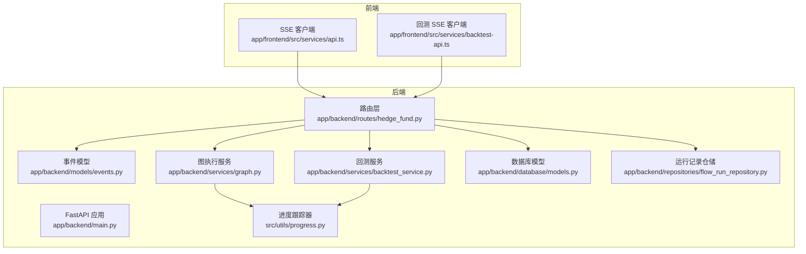
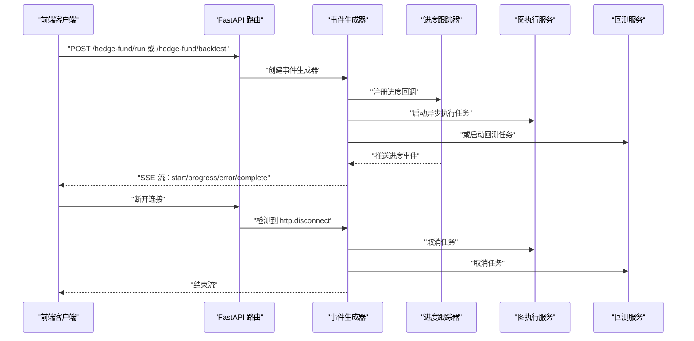
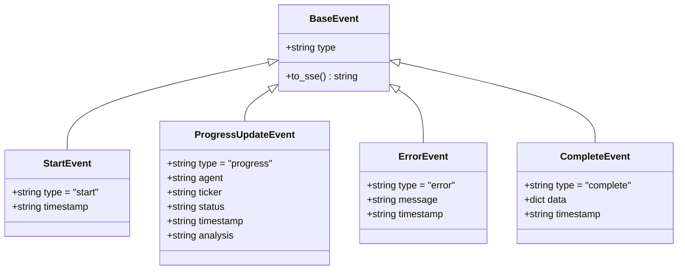
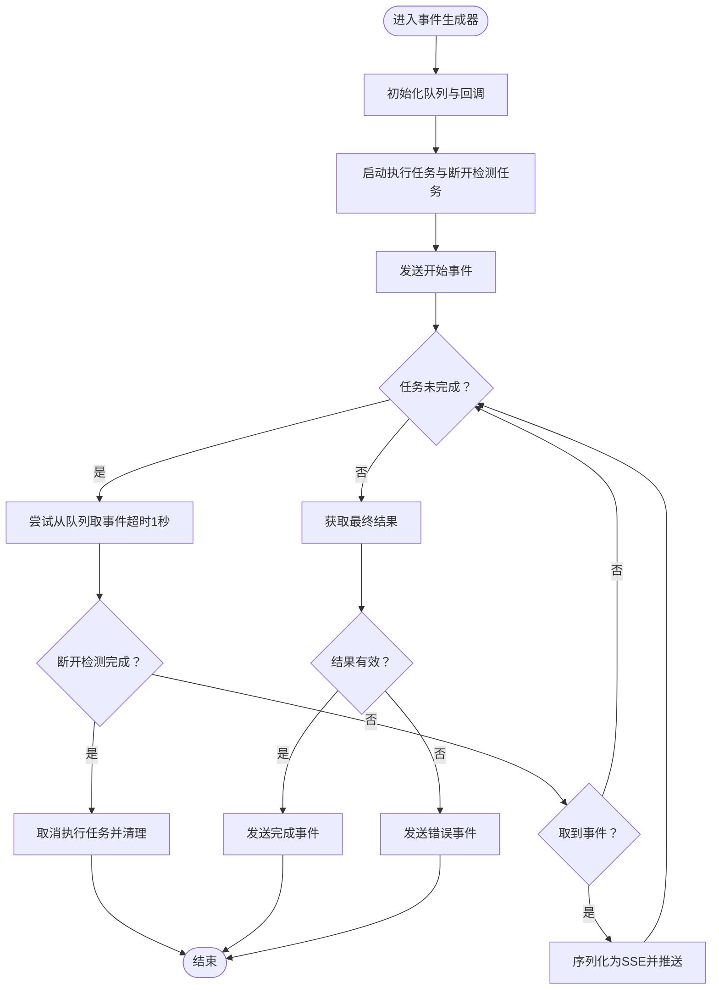
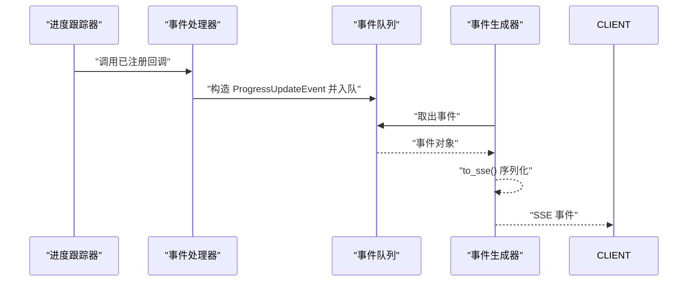
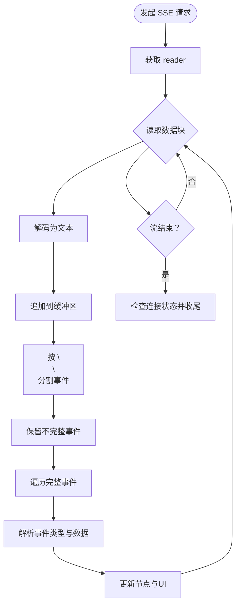
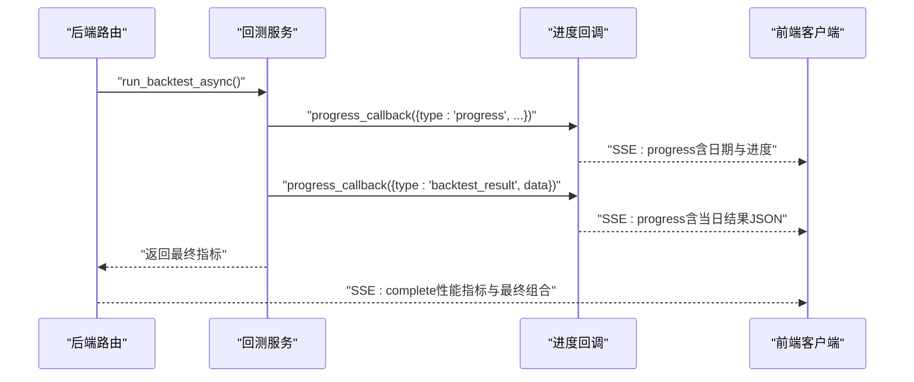
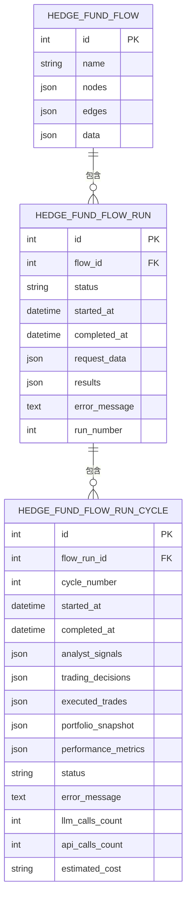
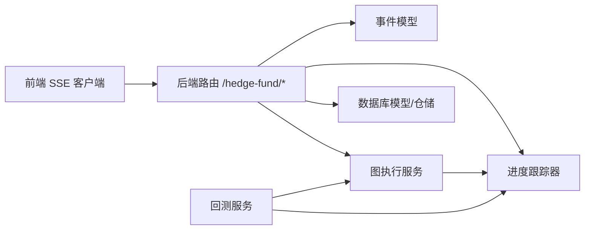

# 事件驱动架构

<cite>
**本文引用的文件**
- [app/backend/models/events.py](file://app/backend/models/events.py)
- [app/backend/routes/hedge_fund.py](file://app/backend/routes/hedge_fund.py)
- [app/backend/services/graph.py](file://app/backend/services/graph.py)
- [src/utils/progress.py](file://src/utils/progress.py)
- [app/backend/services/backtest_service.py](file://app/backend/services/backtest_service.py)
- [app/backend/models/schemas.py](file://app/backend/models/schemas.py)
- [app/backend/repositories/flow_run_repository.py](file://app/backend/repositories/flow_run_repository.py)
- [app/backend/database/models.py](file://app/backend/database/models.py)
- [app/backend/main.py](file://app/backend/main.py)
- [app/frontend/src/services/api.ts](file://app/frontend/src/services/api.ts)
- [app/frontend/src/services/backtest-api.ts](file://app/frontend/src/services/backtest-api.ts)
</cite>

## 目录
1. [简介](#简介)
2. [项目结构](#项目结构)
3. [核心组件](#核心组件)
4. [架构总览](#架构总览)
5. [详细组件分析](#详细组件分析)
6. [依赖分析](#依赖分析)
7. [性能考虑](#性能考虑)
8. [故障排查指南](#故障排查指南)
9. [结论](#结论)
10. [附录](#附录)

## 简介
本文件系统性阐述基于 FastAPI 的事件驱动架构与 Server-Sent Events（SSE）流式响应实现，聚焦于实时交易执行场景下的事件模型、事件发布与订阅、错误处理、客户端断开检测与重连策略、事件序列化与传输协议以及性能优化。文档同时给出事件监听器与事件处理器的设计思路、异步处理模式及实际应用场景与调试技巧。

## 项目结构
后端采用 FastAPI 提供 REST 与 SSE 接口，前端通过 fetch + ReadableStream 实现 SSE 客户端；事件数据模型统一由 Pydantic 定义，事件序列化遵循 SSE 协议格式；进度更新通过全局进度跟踪器分发到事件队列，最终以流式事件推送给前端。

**图表来源**
- [app/backend/main.py:1-56](file://app/backend/main.py#L1-L56)
- [app/backend/routes/hedge_fund.py:1-353](file://app/backend/routes/hedge_fund.py#L1-L353)
- [app/backend/models/events.py:1-46](file://app/backend/models/events.py#L1-L46)
- [app/backend/services/graph.py:1-193](file://app/backend/services/graph.py#L1-L193)
- [src/utils/progress.py:1-117](file://src/utils/progress.py#L1-L117)
- [app/backend/services/backtest_service.py:1-539](file://app/backend/services/backtest_service.py#L1-L539)
- [app/backend/database/models.py:1-115](file://app/backend/database/models.py#L1-L115)
- [app/backend/repositories/flow_run_repository.py:1-133](file://app/backend/repositories/flow_run_repository.py#L1-L133)
- [app/frontend/src/services/api.ts:80-309](file://app/frontend/src/services/api.ts#L80-L309)
- [app/frontend/src/services/backtest-api.ts:29-72](file://app/frontend/src/services/backtest-api.ts#L29-L72)

**章节来源**
- [app/backend/main.py:1-56](file://app/backend/main.py#L1-L56)
- [app/backend/routes/hedge_fund.py:1-353](file://app/backend/routes/hedge_fund.py#L1-L353)
- [app/backend/models/events.py:1-46](file://app/backend/models/events.py#L1-L46)
- [app/backend/services/graph.py:1-193](file://app/backend/services/graph.py#L1-L193)
- [src/utils/progress.py:1-117](file://src/utils/progress.py#L1-L117)
- [app/backend/services/backtest_service.py:1-539](file://app/backend/services/backtest_service.py#L1-L539)
- [app/backend/database/models.py:1-115](file://app/backend/database/models.py#L1-L115)
- [app/backend/repositories/flow_run_repository.py:1-133](file://app/backend/repositories/flow_run_repository.py#L1-L133)
- [app/frontend/src/services/api.ts:80-309](file://app/frontend/src/services/api.ts#L80-L309)
- [app/frontend/src/services/backtest-api.ts:29-72](file://app/frontend/src/services/backtest-api.ts#L29-L72)

## 核心组件
- 事件模型与序列化：定义基础事件类与具体事件类型，并提供 SSE 序列化方法，确保事件以“event”和“data”字段输出。
- SSE 路由与事件生成器：在路由中启动异步任务执行业务逻辑，使用队列收集进度事件并通过事件生成器持续推送。
- 进度跟踪与事件分发：全局进度跟踪器注册多个回调处理器，将 agent 状态变化转换为 ProgressUpdateEvent 并入队。
- 前端 SSE 客户端：使用 fetch + ReadableStream 解析服务端事件，按双换行符拆分事件块，解析 JSON 并更新 UI。
- 回测服务：封装回测流程，周期性向进度回调发送中间结果，前端以事件形式展示每日回测详情。
- 数据持久化：运行记录与状态写入数据库，支持查询、更新与统计。

**章节来源**
- [app/backend/models/events.py:5-46](file://app/backend/models/events.py#L5-L46)
- [app/backend/routes/hedge_fund.py:63-155](file://app/backend/routes/hedge_fund.py#L63-L155)
- [src/utils/progress.py:22-64](file://src/utils/progress.py#L22-L64)
- [app/frontend/src/services/api.ts:108-309](file://app/frontend/src/services/api.ts#L108-L309)
- [app/backend/services/backtest_service.py:285-512](file://app/backend/services/backtest_service.py#L285-L512)
- [app/backend/repositories/flow_run_repository.py:15-96](file://app/backend/repositories/flow_run_repository.py#L15-L96)

## 架构总览
下图展示了从请求到事件流推送的端到端流程，包括客户端断开检测、异常处理与资源清理。

**图表来源**
- [app/backend/routes/hedge_fund.py:51-155](file://app/backend/routes/hedge_fund.py#L51-L155)
- [src/utils/progress.py:22-64](file://src/utils/progress.py#L22-L64)
- [app/backend/services/graph.py:132-177](file://app/backend/services/graph.py#L132-L177)
- [app/backend/services/backtest_service.py:285-512](file://app/backend/services/backtest_service.py#L285-L512)

## 详细组件分析

### 事件模型与序列化
- 基础事件类提供统一的事件类型与 JSON 序列化接口，最终转换为 SSE 文本帧。
- 具体事件类型包括开始、进度更新、错误与完成，分别用于不同阶段的状态通知。
- 事件序列化遵循“event: 类型\n\ndata: JSON\n\n”的格式，便于前端按块解析。

**图表来源**
- [app/backend/models/events.py:5-46](file://app/backend/models/events.py#L5-L46)

**章节来源**
- [app/backend/models/events.py:5-46](file://app/backend/models/events.py#L5-L46)

### SSE 路由与事件生成器
- 路由接收请求参数，构建投资组合与图结构，编译为可执行图。
- 启动异步执行任务与断开检测任务，使用队列收集进度事件。
- 事件生成器在循环中等待队列事件或超时，遇到断开则取消任务并返回。
- 最终根据执行结果发送完成事件，否则发送错误事件。

**图表来源**
- [app/backend/routes/hedge_fund.py:63-155](file://app/backend/routes/hedge_fund.py#L63-L155)

**章节来源**
- [app/backend/routes/hedge_fund.py:26-160](file://app/backend/routes/hedge_fund.py#L26-L160)

### 进度跟踪与事件分发
- 全局进度跟踪器维护各 agent 的状态、时间戳与分析信息。
- 支持注册/注销回调处理器，每次状态更新触发回调，回调将事件入队供 SSE 生成器消费。
- 前端可据此实时显示每个 agent 的进展与分析摘要。

**图表来源**
- [src/utils/progress.py:22-64](file://src/utils/progress.py#L22-L64)
- [app/backend/routes/hedge_fund.py:70-75](file://app/backend/routes/hedge_fund.py#L70-L75)

**章节来源**
- [src/utils/progress.py:12-117](file://src/utils/progress.py#L12-L117)
- [app/backend/routes/hedge_fund.py:63-155](file://app/backend/routes/hedge_fund.py#L63-L155)

### 前端 SSE 客户端
- 使用 fetch 发起 POST 请求，读取 response.body 的 ReadableStream。
- 通过 TextDecoder 逐步解码字节块，按双换行符切分完整事件。
- 解析事件类型与数据，更新节点状态与 UI；捕获连接错误并标记所有 agent 为错误状态。

**图表来源**
- [app/frontend/src/services/api.ts:108-309](file://app/frontend/src/services/api.ts#L108-L309)
- [app/frontend/src/services/backtest-api.ts:29-72](file://app/frontend/src/services/backtest-api.ts#L29-L72)

**章节来源**
- [app/frontend/src/services/api.ts:80-309](file://app/frontend/src/services/api.ts#L80-L309)
- [app/frontend/src/services/backtest-api.ts:29-72](file://app/frontend/src/services/backtest-api.ts#L29-L72)

### 回测服务与事件推送
- 回测服务在每个交易日结束后通过进度回调发送中间结果事件，前端以事件形式展示当日回测详情。
- 回测完成后汇总性能指标并发送完成事件。

**图表来源**
- [app/backend/routes/hedge_fund.py:220-331](file://app/backend/routes/hedge_fund.py#L220-L331)
- [app/backend/services/backtest_service.py:285-512](file://app/backend/services/backtest_service.py#L285-L512)

**章节来源**
- [app/backend/routes/hedge_fund.py:170-336](file://app/backend/routes/hedge_fund.py#L170-L336)
- [app/backend/services/backtest_service.py:285-512](file://app/backend/services/backtest_service.py#L285-L512)

### 数据模型与持久化
- 运行记录表记录每次执行的状态、时间戳、请求与结果，支持查询活跃运行与最新运行。
- 数据库模型与仓储层提供创建、更新、删除与计数等操作，保障运行历史可追溯。

**图表来源**
- [app/backend/database/models.py:29-95](file://app/backend/database/models.py#L29-L95)
- [app/backend/repositories/flow_run_repository.py:15-124](file://app/backend/repositories/flow_run_repository.py#L15-L124)

**章节来源**
- [app/backend/database/models.py:6-115](file://app/backend/database/models.py#L6-L115)
- [app/backend/repositories/flow_run_repository.py:9-133](file://app/backend/repositories/flow_run_repository.py#L9-L133)

## 依赖分析
- 路由依赖事件模型与图执行服务，通过异步任务与队列实现事件驱动。
- 前端依赖后端 SSE 接口，负责解析与渲染事件。
- 进度跟踪器作为跨模块的事件源，被路由与回测服务共同使用。
- 数据层支撑运行记录的持久化与查询。

**图表来源**
- [app/backend/routes/hedge_fund.py:1-353](file://app/backend/routes/hedge_fund.py#L1-L353)
- [app/backend/models/events.py:1-46](file://app/backend/models/events.py#L1-L46)
- [app/backend/services/graph.py:1-193](file://app/backend/services/graph.py#L1-L193)
- [src/utils/progress.py:1-117](file://src/utils/progress.py#L1-L117)
- [app/backend/services/backtest_service.py:1-539](file://app/backend/services/backtest_service.py#L1-L539)
- [app/backend/database/models.py:1-115](file://app/backend/database/models.py#L1-L115)

**章节来源**
- [app/backend/routes/hedge_fund.py:1-353](file://app/backend/routes/hedge_fund.py#L1-L353)
- [app/backend/models/events.py:1-46](file://app/backend/models/events.py#L1-L46)
- [app/backend/services/graph.py:1-193](file://app/backend/services/graph.py#L1-L193)
- [src/utils/progress.py:1-117](file://src/utils/progress.py#L1-L117)
- [app/backend/services/backtest_service.py:1-539](file://app/backend/services/backtest_service.py#L1-L539)
- [app/backend/database/models.py:1-115](file://app/backend/database/models.py#L1-L115)

## 性能考虑
- 异步执行与线程池：图执行在独立线程执行，避免阻塞事件循环，提升并发能力。
- 队列与超时：事件生成器以 1 秒超时轮询队列，平衡延迟与 CPU 占用。
- 断开检测：通过底层请求消息检测客户端断开，及时取消任务，释放资源。
- 前端缓冲与增量解析：按块解析事件，避免一次性加载大段数据，降低内存压力。
- 数据预取：回测服务在开始前预取所需数据，减少运行期 IO 等待。

**章节来源**
- [app/backend/services/graph.py:132-138](file://app/backend/services/graph.py#L132-L138)
- [app/backend/routes/hedge_fund.py:98-116](file://app/backend/routes/hedge_fund.py#L98-L116)
- [app/frontend/src/services/api.ts:128-149](file://app/frontend/src/services/api.ts#L128-L149)
- [app/backend/services/backtest_service.py:225-291](file://app/backend/services/backtest_service.py#L225-L291)

## 故障排查指南
- 客户端断开检测
  - 后端通过等待断开任务判断连接状态，断开后取消执行任务并清理资源。
  - 前端在读取流过程中捕获异常，标记所有 agent 为错误状态并更新连接状态。
- 错误事件与降级
  - 当执行失败或结果为空时，后端发送错误事件；前端收到错误事件后更新 UI。
- 日志与状态
  - 后端启动时检查外部服务可用性；路由层捕获异常并返回统一错误响应。
- 数据一致性
  - 运行记录状态与时间戳自动更新，便于问题定位与审计。

**章节来源**
- [app/backend/routes/hedge_fund.py:98-153](file://app/backend/routes/hedge_fund.py#L98-L153)
- [app/frontend/src/services/api.ts:242-295](file://app/frontend/src/services/api.ts#L242-L295)
- [app/backend/main.py:32-56](file://app/backend/main.py#L32-L56)
- [app/backend/repositories/flow_run_repository.py:66-96](file://app/backend/repositories/flow_run_repository.py#L66-L96)

## 结论
该事件驱动架构通过 SSE 将后端的实时计算过程以事件形式推送到前端，结合断开检测、错误事件与资源清理，实现了稳定可靠的实时交易执行体验。事件模型、进度跟踪器与异步执行的组合，既保证了系统的可观测性，也为扩展更多分析 agent 与复杂回测提供了清晰的扩展点。

## 附录
- 实际应用场景
  - 实时交易执行：前端订阅 SSE，逐条接收 agent 进度与最终决策。
  - 连续回测：前端订阅每日回测结果事件，可视化组合价值与暴露指标。
- 调试技巧
  - 后端：开启日志，观察断开检测与任务取消路径；检查事件序列化是否符合预期。
  - 前端：打印事件块与解析结果，确认缓冲区拼接逻辑；测试手动中断与网络异常场景。
  - 数据：核对运行记录状态与时间戳，定位执行耗时与失败原因。