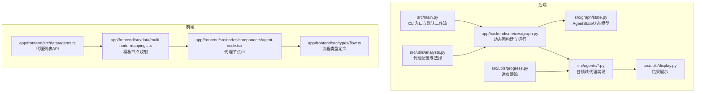
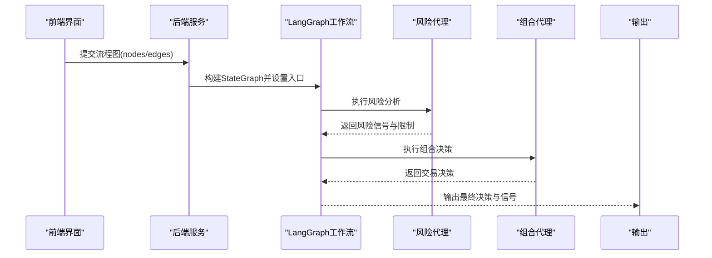
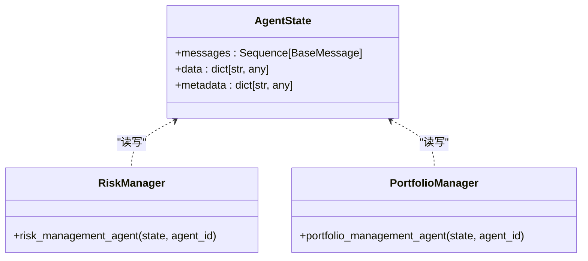
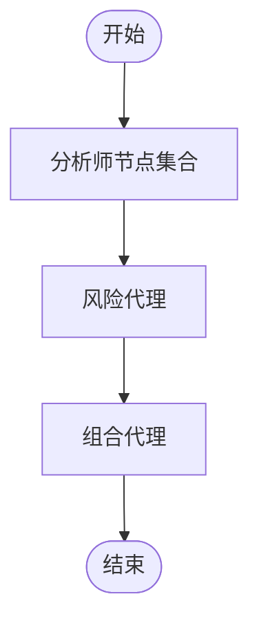
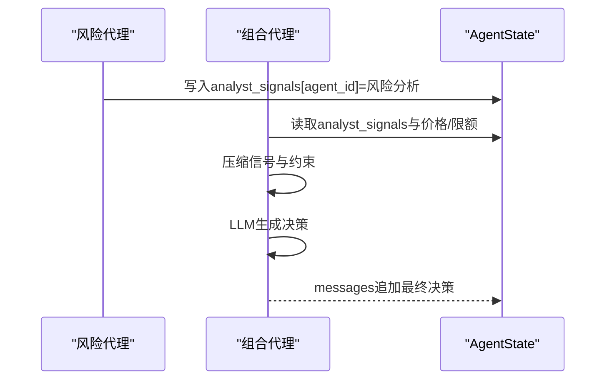
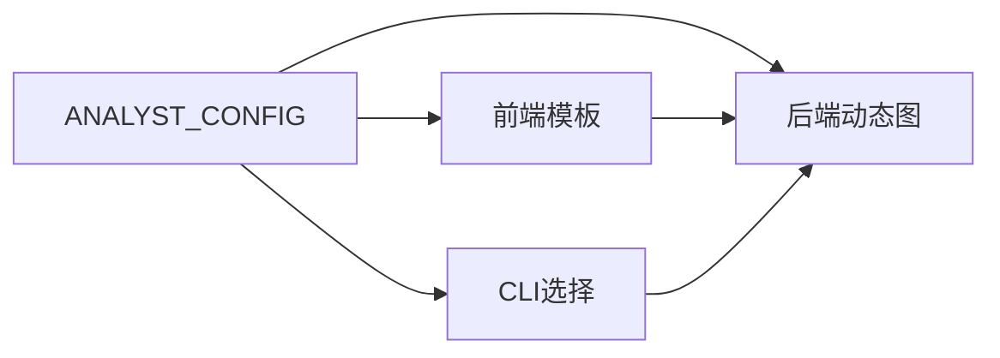
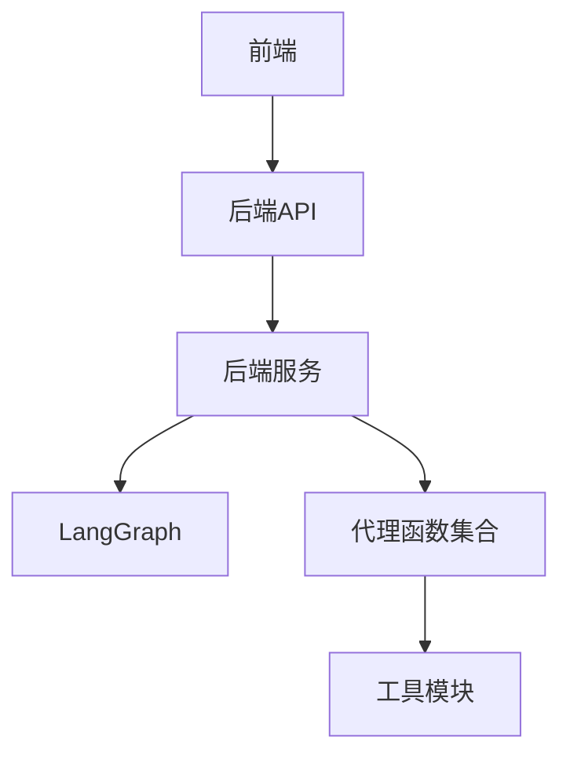

# 多代理协作机制

<cite>
**本文引用的文件**
- [src/graph/state.py](file://src/graph/state.py)
- [src/main.py](file://src/main.py)
- [app/backend/services/graph.py](file://app/backend/services/graph.py)
- [app/backend/services/agent_service.py](file://app/backend/services/agent_service.py)
- [src/agents/risk_manager.py](file://src/agents/risk_manager.py)
- [src/agents/portfolio_manager.py](file://src/agents/portfolio_manager.py)
- [src/agents/fundamentals.py](file://src/agents/fundamentals.py)
- [src/agents/technicals.py](file://src/agents/technicals.py)
- [src/utils/analysts.py](file://src/utils/analysts.py)
- [src/utils/display.py](file://src/utils/display.py)
- [src/utils/progress.py](file://src/utils/progress.py)
- [app/frontend/src/data/agents.ts](file://app/frontend/src/data/agents.ts)
- [app/frontend/src/data/multi-node-mappings.ts](file://app/frontend/src/data/multi-node-mappings.ts)
- [app/frontend/src/nodes/components/agent-node.tsx](file://app/frontend/src/nodes/components/agent-node.tsx)
- [app/frontend/src/types/flow.ts](file://app/frontend/src/types/flow.ts)
</cite>

## 目录
1. [引言](#引言)
2. [项目结构](#项目结构)
3. [核心组件](#核心组件)
4. [架构总览](#架构总览)
5. [详细组件分析](#详细组件分析)
6. [依赖关系分析](#依赖关系分析)
7. [性能考量](#性能考量)
8. [故障排查指南](#故障排查指南)
9. [结论](#结论)
10. [附录](#附录)

## 引言
本文件系统化阐述基于LangGraph的多代理工作流编排系统，重点围绕以下目标展开：
- 深入解释AgentState状态管理机制：消息传递、数据共享与状态同步。
- 阐述代理节点的动态创建与连接过程，分析代理间依赖关系与执行顺序。
- 解释组合管理代理（组合经理）与风险管理代理在决策流程中的作用。
- 覆盖代理配置管理、动态选择机制与扩展性设计。
- 提供可操作的代理协作示例与最佳实践。

## 项目结构
该项目采用前后端分离架构，后端以Python为主，使用LangGraph构建多代理工作流；前端基于React+TypeScript，通过可视化编辑器定义代理节点与连线，并支持动态运行。

**图表来源**
- [src/main.py:46-130](file://src/main.py#L46-L130)
- [app/backend/services/graph.py:36-129](file://app/backend/services/graph.py#L36-L129)
- [src/graph/state.py:15-18](file://src/graph/state.py#L15-L18)
- [src/utils/analysts.py:24-186](file://src/utils/analysts.py#L24-L186)
- [src/utils/display.py:17-255](file://src/utils/display.py#L17-L255)
- [src/utils/progress.py:12-117](file://src/utils/progress.py#L12-L117)
- [app/frontend/src/data/agents.ts:18-30](file://app/frontend/src/data/agents.ts#L18-L30)
- [app/frontend/src/data/multi-node-mappings.ts:14-77](file://app/frontend/src/data/multi-node-mappings.ts#L14-L77)
- [app/frontend/src/nodes/components/agent-node.tsx:18-148](file://app/frontend/src/nodes/components/agent-node.tsx#L18-L148)
- [app/frontend/src/types/flow.ts:1-13](file://app/frontend/src/types/flow.ts#L1-L13)

**章节来源**
- [src/main.py:46-130](file://src/main.py#L46-L130)
- [app/backend/services/graph.py:36-129](file://app/backend/services/graph.py#L36-L129)
- [src/graph/state.py:15-18](file://src/graph/state.py#L15-L18)
- [src/utils/analysts.py:24-186](file://src/utils/analysts.py#L24-L186)
- [src/utils/display.py:17-255](file://src/utils/display.py#L17-L255)
- [src/utils/progress.py:12-117](file://src/utils/progress.py#L12-L117)
- [app/frontend/src/data/agents.ts:18-30](file://app/frontend/src/data/agents.ts#L18-L30)
- [app/frontend/src/data/multi-node-mappings.ts:14-77](file://app/frontend/src/data/multi-node-mappings.ts#L14-L77)
- [app/frontend/src/nodes/components/agent-node.tsx:18-148](file://app/frontend/src/nodes/components/agent-node.tsx#L18-L148)
- [app/frontend/src/types/flow.ts:1-13](file://app/frontend/src/types/flow.ts#L1-L13)

## 核心组件
- AgentState状态模型：统一承载消息队列、共享数据与元信息，支持合并策略与序列化输出。
- 代理函数：每个代理接收AgentState并返回更新后的状态字典，实现链式数据流转。
- 工作流编排：通过LangGraph构建有向无环图（DAG），定义节点与边，控制执行顺序与数据汇聚。
- 动态图构建：根据前端或配置生成节点与边，支持多实例（同一代理类型不同ID）与风险-组合管理闭环。
- 展示与进度：统一格式化输出交易决策与各代理推理摘要，实时进度可视化。

**章节来源**
- [src/graph/state.py:15-18](file://src/graph/state.py#L15-L18)
- [src/agents/risk_manager.py:11-219](file://src/agents/risk_manager.py#L11-L219)
- [src/agents/portfolio_manager.py:25-93](file://src/agents/portfolio_manager.py#L25-L93)
- [app/backend/services/graph.py:36-129](file://app/backend/services/graph.py#L36-L129)
- [src/utils/display.py:17-255](file://src/utils/display.py#L17-L255)
- [src/utils/progress.py:12-117](file://src/utils/progress.py#L12-L117)

## 架构总览
系统采用“前端可视化配置 + 后端LangGraph编排”的模式。前端负责定义节点与连线，后端将其转换为LangGraph工作流，按拓扑顺序执行各代理，最终由组合管理代理汇总决策并输出。

**图表来源**
- [app/backend/services/graph.py:36-129](file://app/backend/services/graph.py#L36-L129)
- [src/agents/risk_manager.py:11-219](file://src/agents/risk_manager.py#L11-L219)
- [src/agents/portfolio_manager.py:25-93](file://src/agents/portfolio_manager.py#L25-L93)
- [src/utils/display.py:17-255](file://src/utils/display.py#L17-L255)

## 详细组件分析

### AgentState状态管理机制
- 数据结构
  - messages：消息队列，使用加法合并策略，确保历史消息累积。
  - data：共享数据字典，用于跨代理共享市场数据、分析师信号等。
  - metadata：元信息字典，包含模型参数、请求上下文、推理开关等。
- 状态同步
  - 每个代理通过返回新的状态字典更新messages与data，LangGraph自动传播到下游节点。
  - show_agent_reasoning提供统一的JSON序列化与美化打印，便于调试与审计。
- 复杂度与优化
  - 合并策略为O(n)附加，适合中等规模消息队列。
  - 建议避免在data中存放超大对象，优先传递轻量键值或引用。

**图表来源**
- [src/graph/state.py:15-18](file://src/graph/state.py#L15-L18)
- [src/agents/risk_manager.py:11-219](file://src/agents/risk_manager.py#L11-L219)
- [src/agents/portfolio_manager.py:25-93](file://src/agents/portfolio_manager.py#L25-L93)

**章节来源**
- [src/graph/state.py:15-18](file://src/graph/state.py#L15-L18)
- [src/graph/state.py:21-52](file://src/graph/state.py#L21-L52)

### 代理节点的动态创建与连接
- 动态节点创建
  - 后端从配置中解析可用代理，结合前端传入的节点ID生成唯一代理节点。
  - 使用偏函数包装代理函数，注入agent_id，使同类型代理可多实例并行。
- 连接规则
  - 默认所有分析师节点先于风险代理，风险代理再连接到组合代理。
  - 组合代理完成后结束流程，输出最终决策。
- 扩展性
  - 新增代理只需在配置中注册，即可被动态纳入工作流。

**图表来源**
- [app/backend/services/graph.py:36-129](file://app/backend/services/graph.py#L36-L129)
- [app/backend/services/agent_service.py:5-13](file://app/backend/services/agent_service.py#L5-L13)
- [src/utils/analysts.py:24-186](file://src/utils/analysts.py#L24-L186)

**章节来源**
- [app/backend/services/graph.py:36-129](file://app/backend/services/graph.py#L36-L129)
- [app/backend/services/agent_service.py:5-13](file://app/backend/services/agent_service.py#L5-L13)
- [src/utils/analysts.py:24-186](file://src/utils/analysts.py#L24-L186)

### 组合管理代理与风险管理代理的决策流程
- 风险管理代理
  - 输入：组合、时间窗口、分析师信号。
  - 处理：计算波动率、相关性、头寸限额，输出每只股票的风险调整后限额与理由。
  - 输出：将风险分析写入data.analyst_signals，供组合代理聚合。
- 组合管理代理
  - 输入：分析师信号、价格、限额、当前持仓。
  - 处理：压缩信号、确定允许动作、调用LLM生成最终决策。
  - 输出：交易决策（动作、数量、置信度、理由）。

**图表来源**
- [src/agents/risk_manager.py:11-219](file://src/agents/risk_manager.py#L11-L219)
- [src/agents/portfolio_manager.py:25-93](file://src/agents/portfolio_manager.py#L25-L93)
- [src/agents/portfolio_manager.py:177-263](file://src/agents/portfolio_manager.py#L177-L263)

**章节来源**
- [src/agents/risk_manager.py:11-219](file://src/agents/risk_manager.py#L11-L219)
- [src/agents/portfolio_manager.py:25-93](file://src/agents/portfolio_manager.py#L25-L93)
- [src/agents/portfolio_manager.py:177-263](file://src/agents/portfolio_manager.py#L177-L263)

### 代理配置管理与动态选择机制
- 配置中心
  - ANALYST_CONFIG集中定义代理键、显示名、描述、投资风格、顺序与函数。
  - 支持API导出代理列表，前端按顺序渲染。
- 动态选择
  - CLI与后端均支持选择特定分析师，未选择时默认启用全部。
  - 前端模板（如“价值投资者”、“数据巫师”）预设节点与连线，一键生成工作流。

**图表来源**
- [src/utils/analysts.py:24-186](file://src/utils/analysts.py#L24-L186)
- [app/frontend/src/data/multi-node-mappings.ts:14-77](file://app/frontend/src/data/multi-node-mappings.ts#L14-L77)
- [app/frontend/src/data/agents.ts:18-30](file://app/frontend/src/data/agents.ts#L18-L30)

**章节来源**
- [src/utils/analysts.py:24-186](file://src/utils/analysts.py#L24-L186)
- [app/frontend/src/data/multi-node-mappings.ts:14-77](file://app/frontend/src/data/multi-node-mappings.ts#L14-L77)
- [app/frontend/src/data/agents.ts:18-30](file://app/frontend/src/data/agents.ts#L18-L30)

### 具体代理协作示例与最佳实践
- 示例一：技术面与基本面双因子
  - 节点：技术分析师 → 基本面分析师 → 风险代理 → 组合代理。
  - 最佳实践：先做独立信号，再由风险代理统一限额，最后由组合代理做权衡与决策。
- 示例二：多风格组合（价值/成长/宏观）
  - 节点：多风格分析师 → 风险代理 → 组合代理。
  - 最佳实践：确保组合代理能处理多源信号冲突，必要时引入信号权重或阈值过滤。
- 最佳实践清单
  - 明确边界：每个代理专注单一视角，避免重复计算。
  - 限额先行：风险代理必须在组合代理之前完成限额计算。
  - 可解释性：开启show_reasoning，记录关键推理步骤。
  - 可观测性：使用进度跟踪与统一输出格式，便于问题定位。

**章节来源**
- [src/agents/technicals.py:35-157](file://src/agents/technicals.py#L35-L157)
- [src/agents/fundamentals.py:11-164](file://src/agents/fundamentals.py#L11-L164)
- [src/agents/risk_manager.py:11-219](file://src/agents/risk_manager.py#L11-L219)
- [src/agents/portfolio_manager.py:25-93](file://src/agents/portfolio_manager.py#L25-L93)
- [src/utils/display.py:17-255](file://src/utils/display.py#L17-L255)
- [src/utils/progress.py:12-117](file://src/utils/progress.py#L12-L117)

## 依赖关系分析
- 后端
  - 后端服务依赖LangGraph进行图构建与执行，依赖代理函数实现具体业务逻辑。
  - 代理函数依赖工具模块（API、进度、LLM调用）与AgentState进行状态读写。
- 前端
  - 前端通过API获取代理列表与模板，渲染节点与连线，驱动后端执行。

**图表来源**
- [app/backend/services/graph.py:36-129](file://app/backend/services/graph.py#L36-L129)
- [src/agents/risk_manager.py:11-219](file://src/agents/risk_manager.py#L11-L219)
- [src/agents/portfolio_manager.py:25-93](file://src/agents/portfolio_manager.py#L25-L93)
- [app/frontend/src/data/agents.ts:18-30](file://app/frontend/src/data/agents.ts#L18-L30)

**章节来源**
- [app/backend/services/graph.py:36-129](file://app/backend/services/graph.py#L36-L129)
- [src/agents/risk_manager.py:11-219](file://src/agents/risk_manager.py#L11-L219)
- [src/agents/portfolio_manager.py:25-93](file://src/agents/portfolio_manager.py#L25-L93)
- [app/frontend/src/data/agents.ts:18-30](file://app/frontend/src/data/agents.ts#L18-L30)

## 性能考量
- 并行化
  - 分析师代理之间无直接依赖，可在LangGraph中并行执行以缩短总时延。
- I/O优化
  - 对外部API（行情、财务）进行缓存与去重，减少重复请求。
- Prompt与输出
  - 控制输入长度与字段，避免LLM上下文溢出；仅输出必要字段。
- 状态体积
  - 避免在data中存储大对象，必要时仅保留键或路径。

## 故障排查指南
- JSON解析错误
  - 当响应无法解析为JSON时，会打印错误日志与原始响应，便于定位上游异常。
- 状态一致性
  - 若发现某代理未产生预期输出，检查其是否正确写入analyst_signals或messages。
- 进度与可视化
  - 使用进度跟踪查看各代理状态与时间戳，快速定位卡顿或失败节点。
- 前端交互
  - 确认节点与连线正确提交至后端，模板选择是否匹配预期。

**章节来源**
- [app/backend/services/graph.py:180-193](file://app/backend/services/graph.py#L180-L193)
- [src/utils/progress.py:44-64](file://src/utils/progress.py#L44-L64)
- [src/utils/display.py:17-255](file://src/utils/display.py#L17-L255)

## 结论
该系统通过LangGraph实现了高内聚、低耦合的多代理协作框架。AgentState作为统一状态载体，配合动态图构建与标准化输出，既保证了可扩展性，又提升了可观测性与可维护性。通过明确的风控前置与组合代理汇总，系统在复杂多变的市场环境中具备稳健的决策能力。

## 附录
- 前端节点与流程类型
  - 代理节点UI支持状态展示与模型选择，流程类型定义包含节点、连线与元数据。
- 后端运行接口
  - 支持异步执行与同步封装，便于集成到Web服务或批处理任务。

**章节来源**
- [app/frontend/src/nodes/components/agent-node.tsx:18-148](file://app/frontend/src/nodes/components/agent-node.tsx#L18-L148)
- [app/frontend/src/types/flow.ts:1-13](file://app/frontend/src/types/flow.ts#L1-L13)
- [app/backend/services/graph.py:132-178](file://app/backend/services/graph.py#L132-L178)