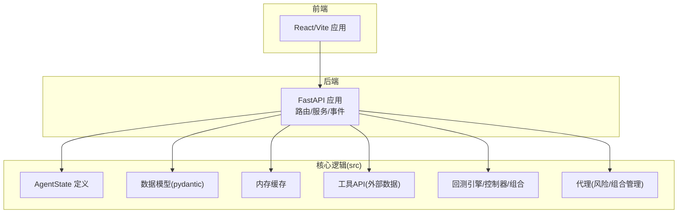
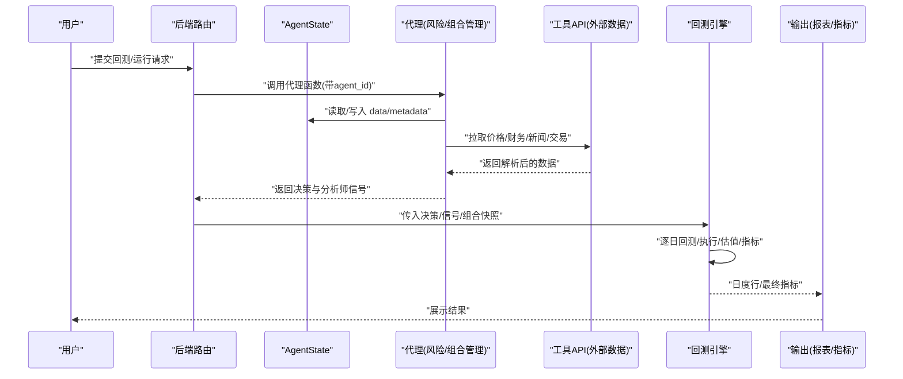
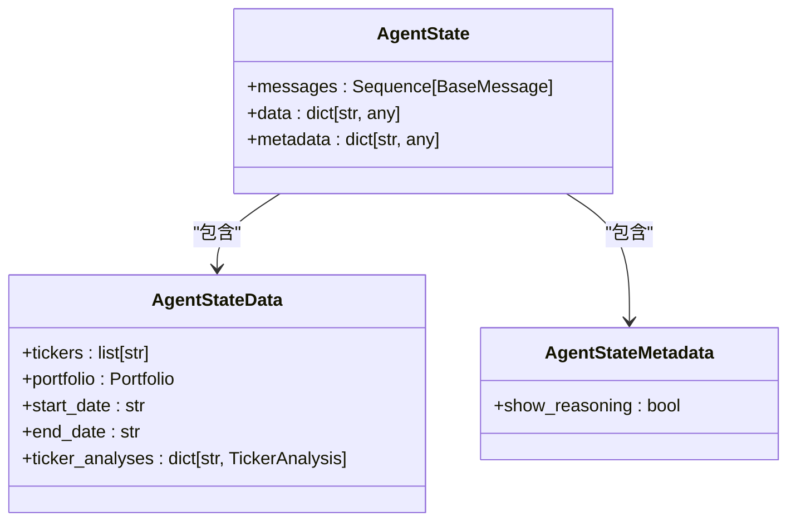
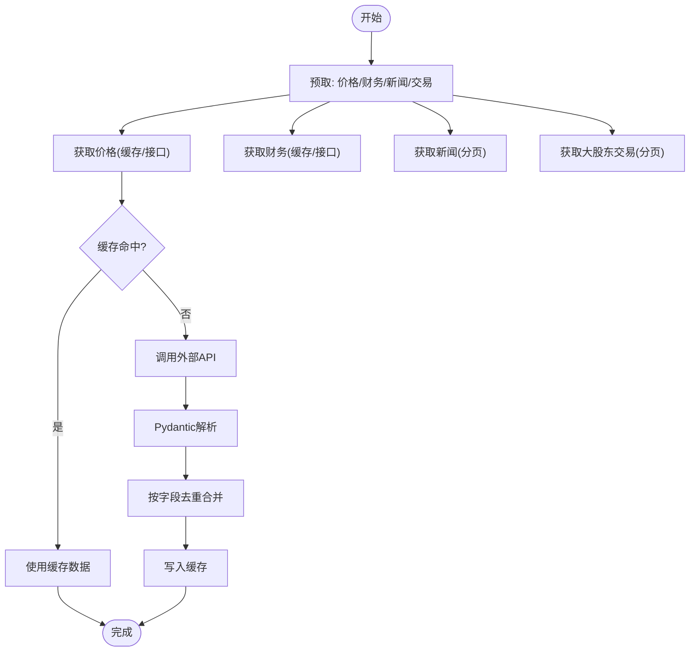
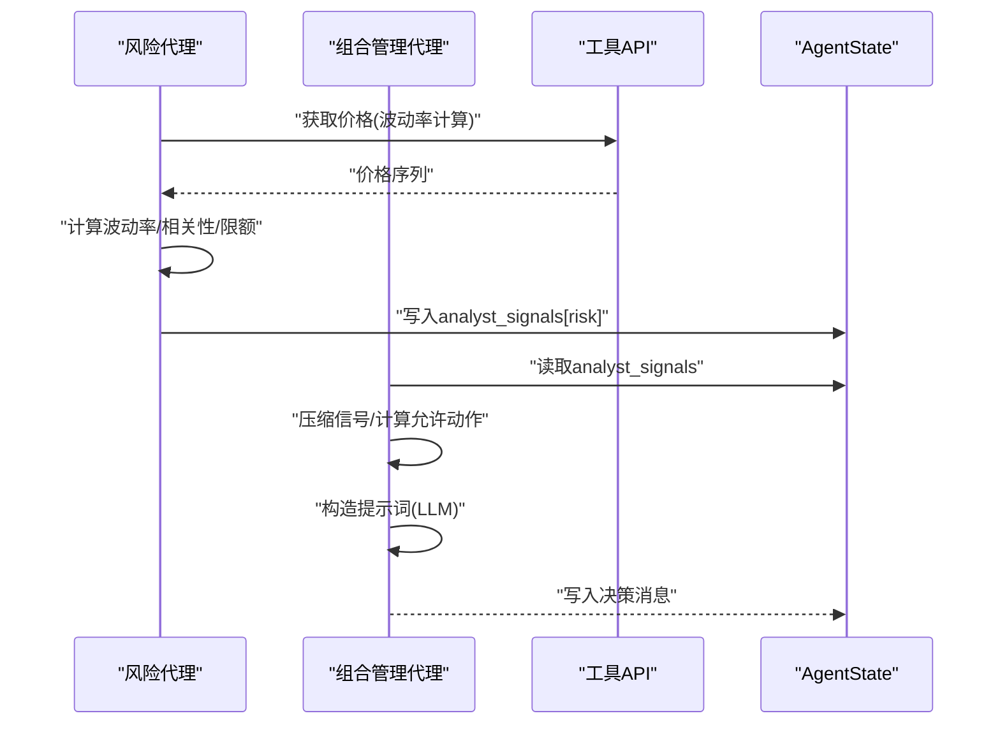
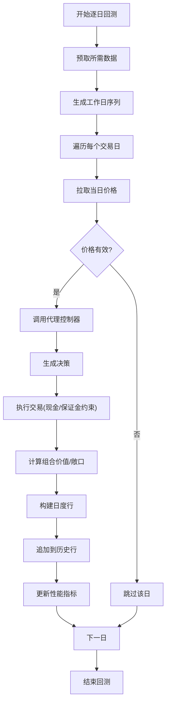
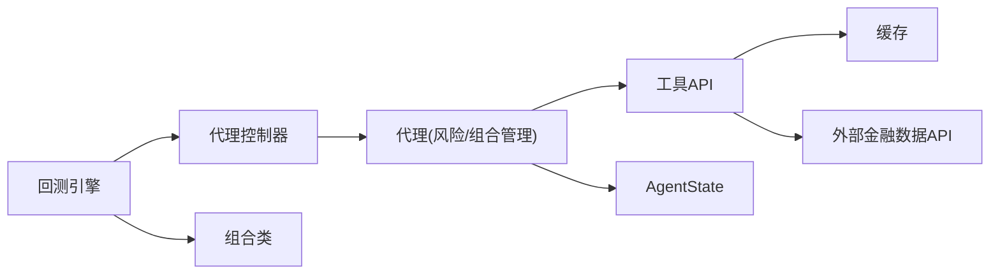

# 数据流设计

<cite>
**本文引用的文件**
- [src/graph/state.py](file://src/graph/state.py)
- [src/data/models.py](file://src/data/models.py)
- [src/data/cache.py](file://src/data/cache.py)
- [src/tools/api.py](file://src/tools/api.py)
- [src/backtesting/engine.py](file://src/backtesting/engine.py)
- [src/backtesting/controller.py](file://src/backtesting/controller.py)
- [src/backtesting/portfolio.py](file://src/backtesting/portfolio.py)
- [src/backtesting/types.py](file://src/backtesting/types.py)
- [src/agents/risk_manager.py](file://src/agents/risk_manager.py)
- [src/agents/portfolio_manager.py](file://src/agents/portfolio_manager.py)
- [app/backend/models/schemas.py](file://app/backend/models/schemas.py)
- [app/backend/models/events.py](file://app/backend/models/events.py)
- [app/backend/services/agent_service.py](file://app/backend/services/agent_service.py)
- [app/backend/main.py](file://app/backend/main.py)
- [src/utils/api_key.py](file://src/utils/api_key.py)
</cite>

## 目录
1. [引言](#引言)
2. [项目结构](#项目结构)
3. [核心组件](#核心组件)
4. [架构总览](#架构总览)
5. [详细组件分析](#详细组件分析)
6. [依赖分析](#依赖分析)
7. [性能考虑](#性能考虑)
8. [故障排查指南](#故障排查指南)
9. [结论](#结论)
10. [附录](#附录)

## 引言
本设计文档聚焦于AI对冲基金系统中的“数据流”设计，覆盖从用户输入到最终输出的完整数据路径：数据采集（价格、财务、新闻、大股东交易）、预处理（缓存与去重）、AI分析（风险与多分析师信号聚合）、决策生成（组合管理与头寸限制）、结果展示（回测报表与性能指标）。文档还深入解析AgentState中的数据结构设计（消息队列、分析师信号收集、组合状态管理），并给出数据缓存策略、数据验证规则与一致性保障方案，以及性能优化与调试方法。

## 项目结构
后端采用FastAPI提供REST接口；前端为React/Vite应用；核心逻辑位于src目录，包含图状态、数据模型、缓存、工具API、回测引擎与代理实现；app/backend提供数据库模型、路由与事件定义。

**图表来源**
- [app/backend/main.py:1-56](file://app/backend/main.py#L1-L56)
- [src/graph/state.py:1-52](file://src/graph/state.py#L1-L52)
- [src/data/models.py:1-175](file://src/data/models.py#L1-L175)
- [src/data/cache.py:1-72](file://src/data/cache.py#L1-L72)
- [src/tools/api.py:1-367](file://src/tools/api.py#L1-L367)
- [src/backtesting/engine.py:1-195](file://src/backtesting/engine.py#L1-L195)
- [src/backtesting/controller.py:1-68](file://src/backtesting/controller.py#L1-L68)
- [src/backtesting/portfolio.py:1-196](file://src/backtesting/portfolio.py#L1-L196)
- [src/agents/risk_manager.py:1-318](file://src/agents/risk_manager.py#L1-L318)
- [src/agents/portfolio_manager.py:1-263](file://src/agents/portfolio_manager.py#L1-L263)

**章节来源**
- [app/backend/main.py:1-56](file://app/backend/main.py#L1-L56)

## 核心组件
- AgentState：统一承载消息、数据与元数据的TypedDict，支持消息拼接与字典合并，作为LangGraph代理间传递的核心载体。
- 数据模型：使用Pydantic定义价格、财务、新闻、交易等数据结构，并提供Portfolio/TickerAnalysis/AnalystSignal等组合状态模型。
- 缓存：基于内存的简单键值缓存，按字段去重合并，避免重复请求与重复写入。
- 工具API：封装外部数据源访问，含重试、限流退避、分页拉取与响应解析。
- 回测引擎：协调代理输出、交易执行、估值与指标计算，驱动每日循环。
- 代理：风险代理计算波动率与相关性调整后的头寸限额；组合管理代理在约束下生成交易决策。

**章节来源**
- [src/graph/state.py:14-19](file://src/graph/state.py#L14-L19)
- [src/data/models.py:164-175](file://src/data/models.py#L164-L175)
- [src/data/cache.py:1-72](file://src/data/cache.py#L1-L72)
- [src/tools/api.py:29-61](file://src/tools/api.py#L29-L61)
- [src/backtesting/engine.py:27-94](file://src/backtesting/engine.py#L27-L94)
- [src/agents/risk_manager.py:10-219](file://src/agents/risk_manager.py#L10-L219)
- [src/agents/portfolio_manager.py:24-94](file://src/agents/portfolio_manager.py#L24-L94)

## 架构总览
下图展示从用户请求到最终输出的关键数据路径：请求进入后端路由，经由代理函数包装器进入LangGraph代理链路，代理通过工具API拉取外部数据并写入AgentState，随后由组合管理代理生成最终决策，回测引擎消费这些决策进行交易执行与估值，最后输出报表与性能指标。

**图表来源**
- [app/backend/services/agent_service.py:5-13](file://app/backend/services/agent_service.py#L5-L13)
- [src/agents/risk_manager.py:10-219](file://src/agents/risk_manager.py#L10-L219)
- [src/agents/portfolio_manager.py:24-94](file://src/agents/portfolio_manager.py#L24-L94)
- [src/tools/api.py:63-96](file://src/tools/api.py#L63-L96)
- [src/backtesting/engine.py:96-194](file://src/backtesting/engine.py#L96-L194)

## 详细组件分析

### AgentState 数据结构设计
- 结构组成
  - messages：消息序列，支持拼接合并，用于记录代理对话与中间结果。
  - data：字典型数据，支持深度合并，承载组合、标的列表、分析结果等。
  - metadata：字典型元数据，支持扩展，包含是否显示推理、请求上下文等。
- 设计要点
  - 使用Annotated与operator.add/operator.merge_dicts确保消息与字典的可合并性，便于LangGraph在节点间传递时保持累积状态。
  - 提供show_agent_reasoning辅助调试，将复杂对象转为JSON可序列化格式并打印，便于观察中间推理与信号。

**图表来源**
- [src/graph/state.py:14-19](file://src/graph/state.py#L14-L19)
- [src/data/models.py:164-175](file://src/data/models.py#L164-L175)

**章节来源**
- [src/graph/state.py:14-52](file://src/graph/state.py#L14-L52)
- [src/data/models.py:164-175](file://src/data/models.py#L164-L175)

### 数据采集与预处理
- 采集范围
  - 价格：日线OHLCV，用于回测与估值。
  - 财务：关键财务比率与增长指标，用于基本面分析。
  - 新闻：标题、作者、来源、时间、情感倾向，用于情绪分析。
  - 大股东交易：披露日期、交易数量、价格、持股变化，用于内鬼交易监控。
- 预处理
  - 缓存：以参数组合为键，按关键字段去重合并，避免重复请求与重复写入。
  - 解析：Pydantic模型校验与反序列化，异常时记录告警并返回空集。
  - 分页：新闻与大股东交易按时间边界迭代拉取，直至达到上限或无更多数据。
  - 限流：429时线性退避重试，降低外部API压力。

**图表来源**
- [src/backtesting/engine.py:81-94](file://src/backtesting/engine.py#L81-L94)
- [src/tools/api.py:63-96](file://src/tools/api.py#L63-L96)
- [src/tools/api.py:99-138](file://src/tools/api.py#L99-L138)
- [src/tools/api.py:183-246](file://src/tools/api.py#L183-L246)
- [src/tools/api.py:249-312](file://src/tools/api.py#L249-L312)
- [src/data/cache.py:11-22](file://src/data/cache.py#L11-L22)

**章节来源**
- [src/backtesting/engine.py:81-94](file://src/backtesting/engine.py#L81-L94)
- [src/tools/api.py:29-61](file://src/tools/api.py#L29-L61)
- [src/tools/api.py:63-96](file://src/tools/api.py#L63-L96)
- [src/tools/api.py:99-138](file://src/tools/api.py#L99-L138)
- [src/tools/api.py:183-246](file://src/tools/api.py#L183-L246)
- [src/tools/api.py:249-312](file://src/tools/api.py#L249-L312)
- [src/data/cache.py:11-22](file://src/data/cache.py#L11-L22)

### AI分析与决策生成
- 风险代理
  - 输入：组合状态、标的列表、起止日期、API密钥。
  - 过程：拉取价格、计算波动率与年化波动、计算与活跃头寸的相关性倍数、结合组合总值与当前头寸计算剩余头寸限额。
  - 输出：每个标的的头寸限额、当前价格、波动率与相关性指标、推理摘要。
  - 写入：将风险分析结果写入AgentState.data.analyst_signals[agent_id]。
- 组合管理代理
  - 输入：组合状态、分析师信号、标的列表、当前价格、头寸上限。
  - 过程：压缩信号为(sig, conf)，计算允许动作与最大数量，构建最小提示词，调用LLM生成决策，对无法交易的标的填充持有决策。
  - 输出：每个标的的交易动作与数量、置信度与简要理由。
  - 写入：将决策作为消息追加至messages，同时保留data不变。

**图表来源**
- [src/agents/risk_manager.py:10-219](file://src/agents/risk_manager.py#L10-L219)
- [src/agents/portfolio_manager.py:24-94](file://src/agents/portfolio_manager.py#L24-L94)
- [src/utils/api_key.py:3-9](file://src/utils/api_key.py#L3-L9)

**章节来源**
- [src/agents/risk_manager.py:10-219](file://src/agents/risk_manager.py#L10-L219)
- [src/agents/portfolio_manager.py:24-94](file://src/agents/portfolio_manager.py#L24-L94)
- [src/utils/api_key.py:3-9](file://src/utils/api_key.py#L3-L9)

### 回测执行与结果存储
- 执行循环
  - 预取：一年回看窗口的价格与财务数据，基准SPY用于对比。
  - 逐日：拉取当日价格，若缺失则跳过；调用代理控制器规范化输出；执行交易；计算组合价值与敞口；构建日度行与累计历史；更新性能指标。
- 中间结果存储
  - 日度行：包含日期、决策、已执行交易、当前价格、组合价值与各类敞口。
  - 组合价值序列：用于指标计算。
  - 性能指标：夏普、索提诺、最大回撤、多空比率、总/净敞口等。
- 一致性保证
  - 规范化：将代理输出映射为标准动作枚举与数值类型，缺失值归一为持有/零量。
  - 现金与保证金约束：交易前检查可用现金与保证金占用，避免超限。

**图表来源**
- [src/backtesting/engine.py:96-194](file://src/backtesting/engine.py#L96-L194)
- [src/backtesting/controller.py:12-65](file://src/backtesting/controller.py#L12-L65)
- [src/backtesting/portfolio.py:82-194](file://src/backtesting/portfolio.py#L82-L194)

**章节来源**
- [src/backtesting/engine.py:96-194](file://src/backtesting/engine.py#L96-L194)
- [src/backtesting/controller.py:12-65](file://src/backtesting/controller.py#L12-L65)
- [src/backtesting/portfolio.py:82-194](file://src/backtesting/portfolio.py#L82-L194)

### 数据验证与一致性
- 请求与响应验证
  - 后端请求模型对交易价格、模型配置、时间窗口等进行校验，确保输入合法。
  - 回测响应模型严格定义日度结果与性能指标字段，保证输出一致。
- 代理输出规范化
  - 将动作字符串映射为枚举值，数量强制转换为浮点，缺失默认为持有/零量。
- 组合状态约束
  - 买入/卖出/做空/平仓均受可用现金与保证金占用限制，避免负值与超限。

**章节来源**
- [app/backend/models/schemas.py:27-32](file://app/backend/models/schemas.py#L27-L32)
- [app/backend/models/schemas.py:94-141](file://app/backend/models/schemas.py#L94-L141)
- [src/backtesting/controller.py:40-65](file://src/backtesting/controller.py#L40-L65)
- [src/backtesting/portfolio.py:82-194](file://src/backtesting/portfolio.py#L82-L194)

## 依赖分析
- 组件耦合
  - 代理依赖工具API与AgentState；工具API依赖缓存；回测引擎依赖代理控制器与组合类。
- 外部依赖
  - 外部金融数据API，需处理429与分页；本地Ollama服务用于模型推理。
- 潜在环路
  - 当前模块间为单向依赖，未见明显环路。

**图表来源**
- [src/agents/risk_manager.py:10-219](file://src/agents/risk_manager.py#L10-L219)
- [src/agents/portfolio_manager.py:24-94](file://src/agents/portfolio_manager.py#L24-L94)
- [src/tools/api.py:63-96](file://src/tools/api.py#L63-L96)
- [src/data/cache.py:1-72](file://src/data/cache.py#L1-L72)
- [src/backtesting/engine.py:27-68](file://src/backtesting/engine.py#L27-L68)
- [src/backtesting/controller.py:12-40](file://src/backtesting/controller.py#L12-L40)
- [src/backtesting/portfolio.py:9-42](file://src/backtesting/portfolio.py#L9-L42)

**章节来源**
- [src/agents/risk_manager.py:10-219](file://src/agents/risk_manager.py#L10-L219)
- [src/agents/portfolio_manager.py:24-94](file://src/agents/portfolio_manager.py#L24-L94)
- [src/tools/api.py:63-96](file://src/tools/api.py#L63-L96)
- [src/data/cache.py:1-72](file://src/data/cache.py#L1-L72)
- [src/backtesting/engine.py:27-68](file://src/backtesting/engine.py#L27-L68)
- [src/backtesting/controller.py:12-40](file://src/backtesting/controller.py#L12-L40)
- [src/backtesting/portfolio.py:9-42](file://src/backtesting/portfolio.py#L9-L42)

## 性能考虑
- 缓存策略
  - 以参数组合为键，按关键字段去重合并，显著减少重复请求与解析开销。
- 并发与批处理
  - 在回测预取阶段批量拉取多个标的与指标，减少往返次数。
- 降本提示
  - 对LLM提示词进行最小化，仅传递必要字段，减少token消耗。
- 限流与退避
  - 429时线性退避，避免触发外部限流导致整体阻塞。
- 数值稳定性
  - 对波动率与相关性计算设置下界与边界，避免极端值影响限额。

[本节为通用性能建议，不直接分析具体文件]

## 故障排查指南
- 外部API错误
  - 现象：返回非200或解析失败。
  - 排查：检查环境变量API密钥、网络连通性、限流退避日志；确认分页参数与边界。
- 代理输出异常
  - 现象：动作非法或数量不可解析。
  - 排查：查看代理规范化逻辑，确认动作枚举映射与数值转换；检查LLM输出格式。
- 回测中断
  - 现象：某日价格缺失导致跳过。
  - 排查：确认价格拉取是否成功；检查日期边界与节假日；必要时扩大回看窗口。
- 显示推理
  - 现象：调试信息未显示。
  - 排查：确认AgentState.metadata.show_reasoning为True；检查代理中show_agent_reasoning调用。

**章节来源**
- [src/tools/api.py:29-61](file://src/tools/api.py#L29-L61)
- [src/backtesting/controller.py:40-65](file://src/backtesting/controller.py#L40-L65)
- [src/backtesting/engine.py:114-130](file://src/backtesting/engine.py#L114-L130)
- [src/graph/state.py:21-52](file://src/graph/state.py#L21-L52)

## 结论
本系统通过清晰的AgentState数据结构、严格的Pydantic模型与缓存机制，实现了从外部数据采集到AI分析与决策生成的闭环数据流。回测引擎在规范化代理输出的基础上，严格执行现金与保证金约束，稳定产出日度行与性能指标。建议持续完善缓存键设计与外部API限流策略，进一步提升吞吐与稳定性。

## 附录
- 事件模型：后端定义了SSE事件类型（开始、进度、错误、完成），可用于实时反馈处理状态。
- API封装：代理函数包装器将通用代理函数适配为LangGraph可调用签名，简化集成。

**章节来源**
- [app/backend/models/events.py:16-46](file://app/backend/models/events.py#L16-L46)
- [app/backend/services/agent_service.py:5-13](file://app/backend/services/agent_service.py#L5-L13)