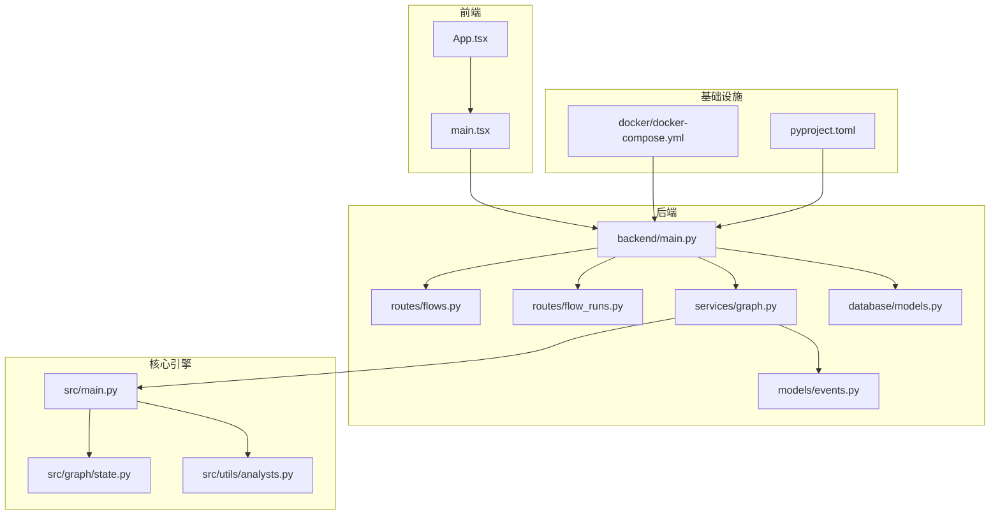
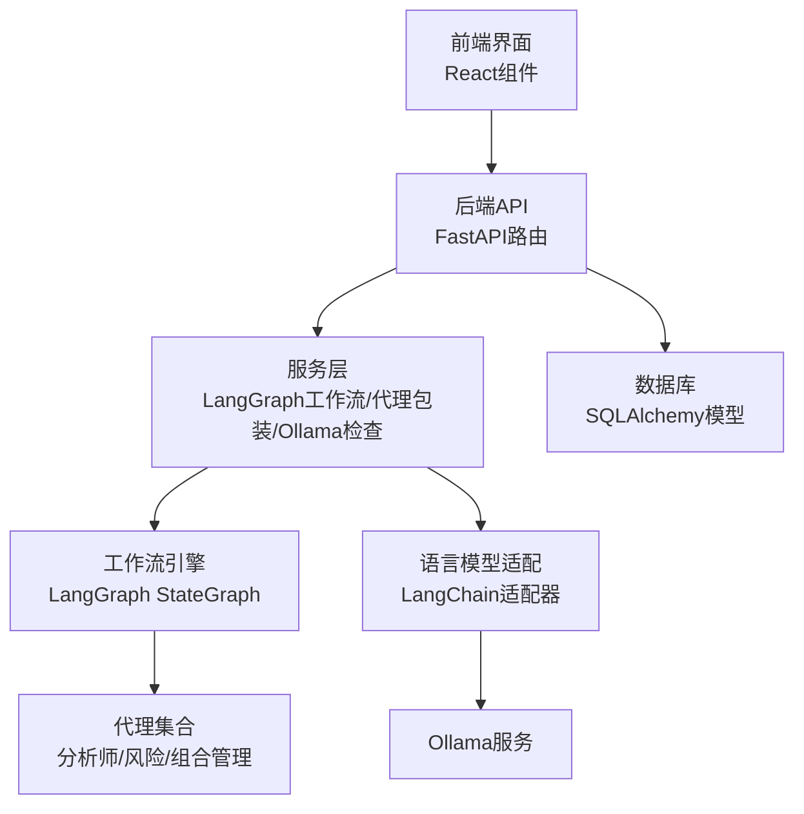
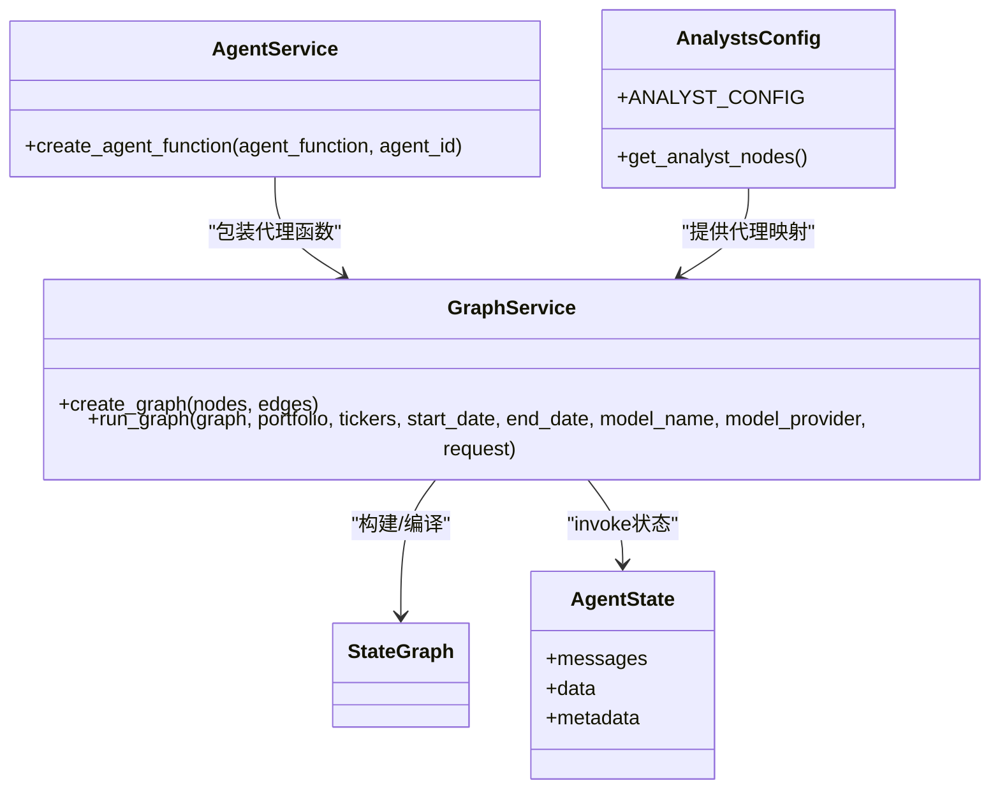
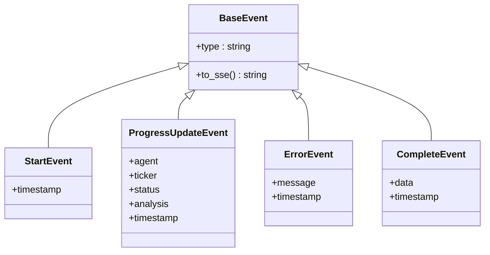
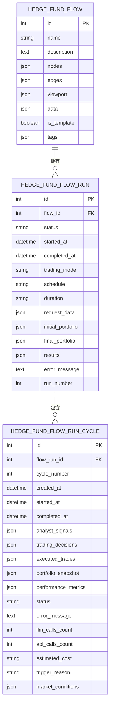
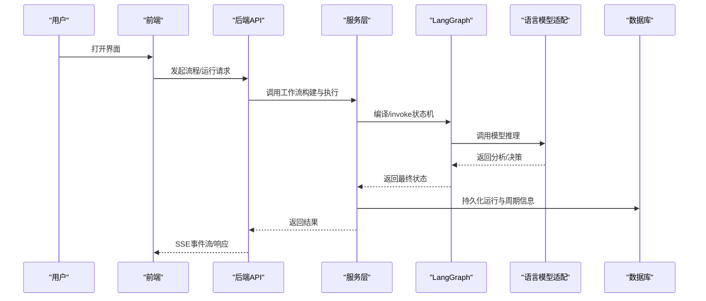
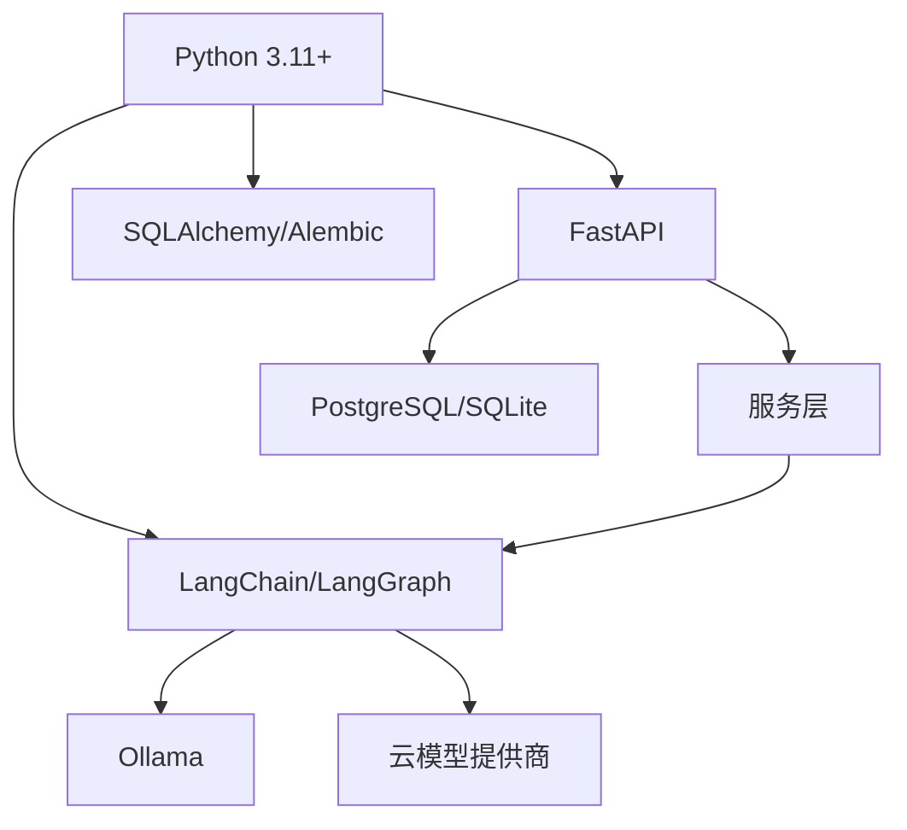

# 核心架构

<cite>
**本文引用的文件**
- [app/backend/main.py](file://app/backend/main.py)
- [app/backend/__init__.py](file://app/backend/__init__.py)
- [app/backend/routes/flows.py](file://app/backend/routes/flows.py)
- [app/backend/routes/flow_runs.py](file://app/backend/routes/flow_runs.py)
- [app/backend/routes/health.py](file://app/backend/routes/health.py)
- [app/backend/routes/language_models.py](file://app/backend/routes/language_models.py)
- [app/backend/routes/ollama.py](file://app/backend/routes/ollama.py)
- [app/backend/routes/storage.py](file://app/backend/routes/storage.py)
- [app/backend/routes/hedge_fund.py](file://app/backend/routes/hedge_fund.py)
- [app/backend/services/graph.py](file://app/backend/services/graph.py)
- [app/backend/services/agent_service.py](file://app/backend/services/agent_service.py)
- [app/backend/models/events.py](file://app/backend/models/events.py)
- [app/backend/database/models.py](file://app/backend/database/models.py)
- [app/backend/database/connection.py](file://app/backend/database/connection.py)
- [src/graph/state.py](file://src/graph/state.py)
- [src/utils/analysts.py](file://src/utils/analysts.py)
- [src/main.py](file://src/main.py)
- [docker/docker-compose.yml](file://docker/docker-compose.yml)
- [pyproject.toml](file://pyproject.toml)
- [app/frontend/src/App.tsx](file://app/frontend/src/App.tsx)
- [app/frontend/src/main.tsx](file://app/frontend/src/main.tsx)
</cite>

## 目录
1. [引言](#引言)
2. [项目结构](#项目结构)
3. [核心组件](#核心组件)
4. [架构总览](#架构总览)
5. [详细组件分析](#详细组件分析)
6. [依赖分析](#依赖分析)
7. [性能考量](#性能考量)
8. [故障排查指南](#故障排查指南)
9. [结论](#结论)
10. [附录](#附录)

## 引言
本文件为“AI对冲基金系统”的核心架构文档，面向技术与非技术读者，系统化阐述分层架构（表现层、业务逻辑层、数据访问层）、多代理协作（基于LangGraph的工作流编排）、事件驱动与SSE流式响应、系统边界与组件关系、数据流向、技术决策与权衡、基础设施与可扩展性、以及部署拓扑。目标是帮助读者快速理解系统如何通过“前端可视化+后端API+本地/云端大模型+数据库+工作流引擎”协同完成从策略编排到执行决策的全链路。

## 项目结构
系统采用前后端分离与多模块并行的组织方式：
- 后端：FastAPI应用，路由按功能域划分，服务层封装工作流与工具调用，数据库使用SQLAlchemy模型与Alembic迁移。
- 前端：React应用，提供流程图可视化编辑器与运行结果面板。
- 核心引擎：LangGraph工作流在src目录下定义状态与执行逻辑，支持CLI与后端API两种入口。
- 基础设施：Docker Compose提供Ollama本地推理服务与主应用容器；Poetry管理Python依赖。

图表来源
- [app/backend/main.py:1-56](file://app/backend/main.py#L1-L56)
- [app/backend/routes/flows.py:1-174](file://app/backend/routes/flows.py#L1-L174)
- [app/backend/routes/flow_runs.py:1-303](file://app/backend/routes/flow_runs.py#L1-L303)
- [app/backend/services/graph.py:1-193](file://app/backend/services/graph.py#L1-L193)
- [app/backend/models/events.py:1-46](file://app/backend/models/events.py#L1-L46)
- [app/backend/database/models.py:1-115](file://app/backend/database/models.py#L1-L115)
- [src/main.py:1-180](file://src/main.py#L1-L180)
- [src/graph/state.py:1-52](file://src/graph/state.py#L1-L52)
- [src/utils/analysts.py:1-201](file://src/utils/analysts.py#L1-L201)
- [docker/docker-compose.yml:1-95](file://docker/docker-compose.yml#L1-L95)
- [pyproject.toml:1-62](file://pyproject.toml#L1-L62)

章节来源
- [app/backend/main.py:1-56](file://app/backend/main.py#L1-L56)
- [docker/docker-compose.yml:1-95](file://docker/docker-compose.yml#L1-L95)
- [pyproject.toml:1-62](file://pyproject.toml#L1-L62)

## 核心组件
- 表现层（前端）
  - React应用负责流程图编辑、节点配置、运行结果展示与调试输出。
  - 入口文件负责主题与上下文注入，确保组件树具备统一状态与外观。
- 业务逻辑层（后端）
  - 路由层：提供流程与运行实例的CRUD、查询与统计接口。
  - 服务层：封装LangGraph工作流构建与执行、代理函数包装、Ollama状态检查等。
  - 模型与事件：定义SSE事件格式与后端ORM模型，支撑流式输出与持久化。
- 数据访问层（数据库）
  - 使用SQLAlchemy定义三张核心表：流程配置、运行实例、运行周期（含分析信号、交易决策、成本与性能指标）。
- 核心引擎（LangGraph）
  - 定义AgentState状态结构，支持消息、数据与元数据合并。
  - 分析师代理配置集中管理，支持动态选择分析师与风险/组合管理代理编排。

章节来源
- [app/frontend/src/App.tsx:1-12](file://app/frontend/src/App.tsx#L1-L12)
- [app/frontend/src/main.tsx:1-19](file://app/frontend/src/main.tsx#L1-L19)
- [app/backend/routes/flows.py:1-174](file://app/backend/routes/flows.py#L1-L174)
- [app/backend/routes/flow_runs.py:1-303](file://app/backend/routes/flow_runs.py#L1-L303)
- [app/backend/services/graph.py:1-193](file://app/backend/services/graph.py#L1-L193)
- [app/backend/models/events.py:1-46](file://app/backend/models/events.py#L1-L46)
- [app/backend/database/models.py:1-115](file://app/backend/database/models.py#L1-L115)
- [src/graph/state.py:1-52](file://src/graph/state.py#L1-L52)
- [src/utils/analysts.py:1-201](file://src/utils/analysts.py#L1-L201)

## 架构总览
系统采用分层与事件驱动结合的架构：
- 分层架构
  - 表现层：React组件与UI上下文。
  - 业务逻辑层：FastAPI路由与服务，封装工作流编排与外部服务集成。
  - 数据访问层：SQLAlchemy ORM与Alembic迁移。
- 多代理协作
  - 基于LangGraph的状态机工作流，支持分析师代理、风险代理与组合管理代理的编排。
- 事件驱动与SSE
  - SSE事件模型抽象，后端以事件流形式推送开始、进度、错误与完成事件，前端实时渲染。
- 系统边界
  - 外部依赖：Ollama本地推理服务、第三方语言模型API（通过LangChain适配器接入）。
  - 内部边界：前端仅消费后端API；后端不直接暴露模型细节，通过服务层解耦。

图表来源
- [app/backend/main.py:1-56](file://app/backend/main.py#L1-L56)
- [app/backend/services/graph.py:1-193](file://app/backend/services/graph.py#L1-L193)
- [src/main.py:1-180](file://src/main.py#L1-L180)
- [docker/docker-compose.yml:1-95](file://docker/docker-compose.yml#L1-L95)

## 详细组件分析

### 组件A：工作流编排与多代理协作（LangGraph）
- 设计要点
  - AgentState定义消息、数据与元数据三段式状态，支持消息累积与字典合并。
  - 代理函数包装：通过服务层将具体代理函数绑定唯一agent_id，供LangGraph调用。
  - 动态图构建：根据前端传入的节点与边，解析分析师键值，生成起始节点、风险代理与组合管理代理之间的连接。
  - 执行入口：同步/异步执行器，将输入参数（股票池、时间窗、模型名与提供商）注入状态并触发执行。
- 关键流程
  - 图构建：遍历节点与边，识别分析师、组合管理与风险代理，建立从分析师到风险代理再到组合管理的流水线。
  - 执行：invoke入口注入HumanMessage与初始data/metadata，最终聚合各代理信号并产出决策。
- 可扩展性
  - 新增分析师：在分析师配置中注册新键值与函数映射，无需修改图构建逻辑。
  - 运行模式：支持一次性与持续运行模式，配合数据库记录周期性分析与执行结果。

图表来源
- [src/graph/state.py:1-52](file://src/graph/state.py#L1-L52)
- [app/backend/services/agent_service.py:1-13](file://app/backend/services/agent_service.py#L1-L13)
- [app/backend/services/graph.py:1-193](file://app/backend/services/graph.py#L1-L193)
- [src/utils/analysts.py:1-201](file://src/utils/analysts.py#L1-L201)

章节来源
- [src/graph/state.py:1-52](file://src/graph/state.py#L1-L52)
- [app/backend/services/agent_service.py:1-13](file://app/backend/services/agent_service.py#L1-L13)
- [app/backend/services/graph.py:1-193](file://app/backend/services/graph.py#L1-L193)
- [src/utils/analysts.py:1-201](file://src/utils/analysts.py#L1-L201)

### 组件B：事件驱动与SSE流式响应
- 事件模型
  - BaseEvent定义通用事件类型与SSE转换方法；StartEvent、ProgressUpdateEvent、ErrorEvent、CompleteEvent覆盖典型生命周期事件。
- 后端集成
  - SSE事件可通过服务层在执行过程中逐步推送，前端订阅并渲染。
- 实现建议
  - 在工作流执行期间，将每个代理的分析结果与状态变化转化为ProgressUpdateEvent，最终CompleteEvent携带汇总结果。
  - 错误场景统一包装为ErrorEvent，便于前端提示与日志追踪。

图表来源
- [app/backend/models/events.py:1-46](file://app/backend/models/events.py#L1-L46)

章节来源
- [app/backend/models/events.py:1-46](file://app/backend/models/events.py#L1-L46)

### 组件C：API路由与运行实例管理
- 流程管理
  - 提供流程的创建、查询、更新、删除、复制与搜索接口，返回标准化响应模型。
- 运行实例
  - 支持创建、查询（全部/最新/活跃）、更新、删除与计数；运行状态包含IDLE/IN_PROGRESS/COMPLETE/ERROR。
  - 运行周期记录单次会话内的分析信号、交易决策、执行结果、成本与性能指标。
- 数据模型
  - HedgeFundFlow：保存React Flow的节点、边、视口与内部数据。
  - HedgeFundFlowRun：跟踪一次或连续运行的配置、状态与结果。
  - HedgeFundFlowRunCycle：单次运行内的分析周期快照与度量。

图表来源
- [app/backend/database/models.py:1-115](file://app/backend/database/models.py#L1-L115)

章节来源
- [app/backend/routes/flows.py:1-174](file://app/backend/routes/flows.py#L1-L174)
- [app/backend/routes/flow_runs.py:1-303](file://app/backend/routes/flow_runs.py#L1-L303)
- [app/backend/database/models.py:1-115](file://app/backend/database/models.py#L1-L115)

### 组件D：启动与环境集成
- 后端启动
  - 初始化数据库表、配置CORS、挂载路由；启动时检查Ollama可用性并记录日志。
- 前端入口
  - 注入主题与节点上下文，保证组件树具备一致的UI与状态能力。
- CLI与容器
  - Pyproject脚本提供回测器入口；Docker Compose定义Ollama与主应用容器，支持不同运行模式（推理/回测/本地/云端）。

图表来源
- [app/backend/main.py:1-56](file://app/backend/main.py#L1-L56)
- [app/backend/services/graph.py:1-193](file://app/backend/services/graph.py#L1-L193)
- [src/main.py:1-180](file://src/main.py#L1-L180)
- [docker/docker-compose.yml:1-95](file://docker/docker-compose.yml#L1-L95)

章节来源
- [app/backend/main.py:1-56](file://app/backend/main.py#L1-L56)
- [app/frontend/src/App.tsx:1-12](file://app/frontend/src/App.tsx#L1-L12)
- [app/frontend/src/main.tsx:1-19](file://app/frontend/src/main.tsx#L1-L19)
- [docker/docker-compose.yml:1-95](file://docker/docker-compose.yml#L1-L95)
- [pyproject.toml:1-62](file://pyproject.toml#L1-L62)

## 依赖分析
- 语言与框架
  - Python 3.11+，FastAPI、SQLAlchemy、Alembic、LangChain/LangGraph。
- 大模型与推理
  - 通过LangChain适配器接入OpenAI、Anthropic、Groq、Google等；同时支持Ollama本地推理。
- 前后端交互
  - 前端通过REST API与SSE事件与后端交互；后端通过服务层屏蔽模型细节。
- 外部服务
  - Ollama服务作为可选本地推理后端；其他模型提供商通过API密钥管理与路由层解耦。

图表来源
- [pyproject.toml:1-62](file://pyproject.toml#L1-L62)
- [docker/docker-compose.yml:1-95](file://docker/docker-compose.yml#L1-L95)

章节来源
- [pyproject.toml:1-62](file://pyproject.toml#L1-L62)
- [docker/docker-compose.yml:1-95](file://docker/docker-compose.yml#L1-L95)

## 性能考量
- 工作流并发
  - 使用异步执行器避免阻塞事件循环；长耗时任务应拆分为多个周期（RunCycle）以便断点续跑与成本控制。
- 数据库写入
  - 周期性写入（RunCycle）降低单事务压力；批量插入与索引优化（如flow_id、run_number）提升查询效率。
- 推理成本
  - 通过元数据记录LLM与API调用次数与估算成本；在Ollama与云端模型间切换以平衡延迟与质量。
- 前端渲染
  - 将SSE事件流与本地状态合并，避免频繁重渲染；对分析结果进行节流与缓存。

## 故障排查指南
- Ollama不可用
  - 后端启动时会检查Ollama安装与运行状态；若未安装或未运行，可在设置页或手动启动服务。
- API错误
  - 路由层统一捕获异常并返回HTTP错误码与错误详情；前端应显示错误事件并允许重试。
- 工作流卡滞
  - 检查图构建逻辑是否正确连接分析师→风险→组合管理；确认唯一agent_id后缀规则与基础键匹配。
- 数据不一致
  - 核对Run与RunCycle的外键关系与状态流转；必要时清理模板与历史运行以释放空间。

章节来源
- [app/backend/main.py:32-56](file://app/backend/main.py#L32-L56)
- [app/backend/routes/flows.py:18-42](file://app/backend/routes/flows.py#L18-L42)
- [app/backend/routes/flow_runs.py:20-51](file://app/backend/routes/flow_runs.py#L20-L51)
- [app/backend/services/graph.py:36-129](file://app/backend/services/graph.py#L36-L129)

## 结论
该系统通过清晰的分层架构与LangGraph工作流，实现了从策略编排到执行决策的自动化闭环；SSE事件驱动使前端能够实时感知执行进度与结果。依托SQLAlchemy与Alembic，系统具备良好的数据持久化与演进能力；通过LangChain适配器与Docker Compose，兼顾了本地推理与云端模型的灵活切换。未来可在工作流并行化、成本预算与告警、以及多租户隔离方面进一步增强。

## 附录
- 部署拓扑
  - 单机开发：Docker Compose一键拉起Ollama与主应用；前端通过本地端口访问。
  - 生产建议：将后端与数据库容器化并配置健康检查；使用反向代理与SSL；按需启用多副本与负载均衡。
- 技术决策与权衡
  - 选择LangGraph而非传统状态机，以获得更强的可扩展性与可视化能力。
  - 采用SSE而非轮询，降低带宽与延迟，提升用户体验。
  - 将代理函数与配置解耦，便于快速迭代与A/B测试。