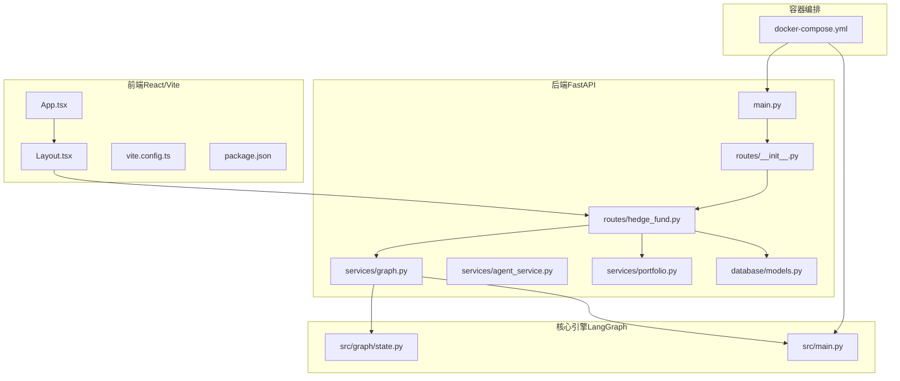
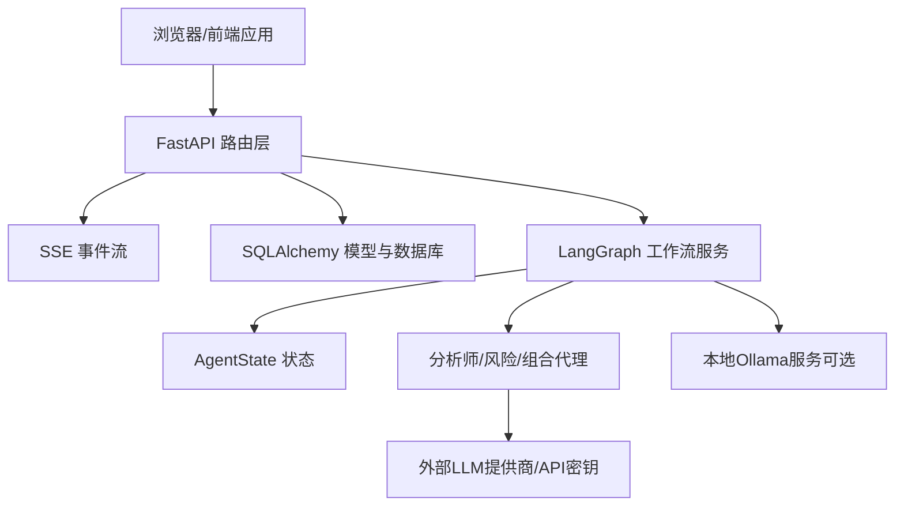
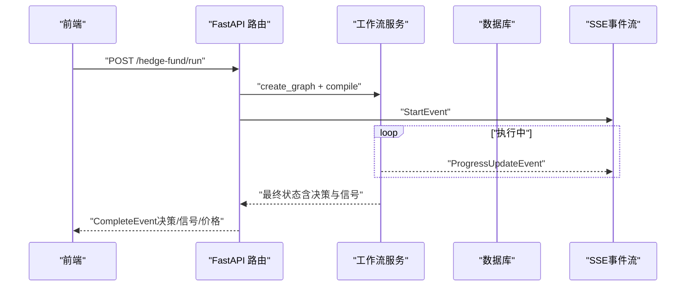
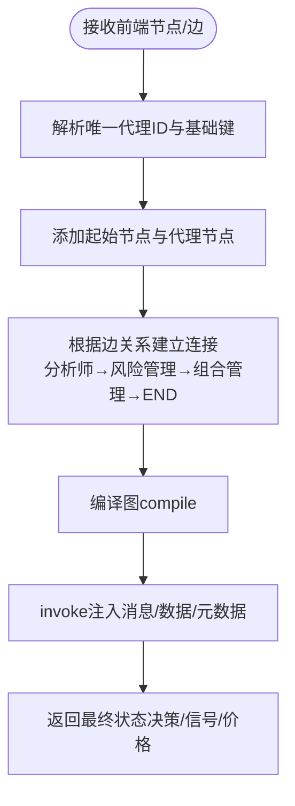
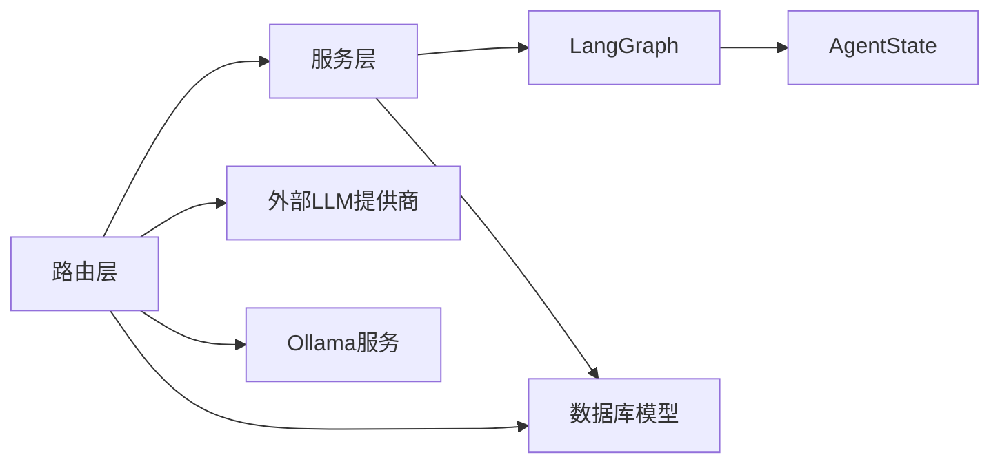

# 系统架构总览

<cite>
**本文档引用的文件**
- [app/backend/main.py](file://app/backend/main.py)
- [app/backend/routes/__init__.py](file://app/backend/routes/__init__.py)
- [app/backend/routes/hedge_fund.py](file://app/backend/routes/hedge_fund.py)
- [app/backend/services/graph.py](file://app/backend/services/graph.py)
- [app/backend/services/agent_service.py](file://app/backend/services/agent_service.py)
- [app/backend/services/portfolio.py](file://app/backend/services/portfolio.py)
- [app/backend/database/models.py](file://app/backend/database/models.py)
- [src/graph/state.py](file://src/graph/state.py)
- [src/main.py](file://src/main.py)
- [app/frontend/src/App.tsx](file://app/frontend/src/App.tsx)
- [app/frontend/src/components/Layout.tsx](file://app/frontend/src/components/Layout.tsx)
- [app/frontend/vite.config.ts](file://app/frontend/vite.config.ts)
- [app/frontend/package.json](file://app/frontend/package.json)
- [docker/docker-compose.yml](file://docker/docker-compose.yml)
- [pyproject.toml](file://pyproject.toml)
</cite>

## 目录
1. [引言](#引言)
2. [项目结构](#项目结构)
3. [核心组件](#核心组件)
4. [架构总览](#架构总览)
5. [详细组件分析](#详细组件分析)
6. [依赖关系分析](#依赖关系分析)
7. [性能考量](#性能考量)
8. [故障排除指南](#故障排除指南)
9. [结论](#结论)
10. [附录](#附录)

## 引言
本系统是一个基于多智能体协作的AI对冲基金平台，采用前后端分离架构：后端使用FastAPI提供REST API与事件流（Server-Sent Events），前端使用React + Vite构建可视化工作流编辑器与控制面板。系统通过LangGraph实现工作流编排，支持实时交易执行与回测分析，并具备数据库持久化能力以记录流程配置、运行历史与周期性分析结果。

## 项目结构
系统采用模块化分层组织：
- 后端（FastAPI）：路由聚合、业务服务、数据访问层（SQLAlchemy）、模型与数据库迁移
- 前端（React/Vite）：可视化编辑器（React Flow）、布局与侧边栏、标签页管理、UI组件库
- 核心引擎（LangGraph）：状态驱动的工作流编排，连接多个分析代理与风险管理代理
- 数据与工具：分析师代理集合、回测引擎、CLI入口、Docker编排

**图表来源**
- [app/backend/main.py:1-56](file://app/backend/main.py#L1-L56)
- [app/backend/routes/__init__.py:1-24](file://app/backend/routes/__init__.py#L1-L24)
- [app/backend/routes/hedge_fund.py:1-353](file://app/backend/routes/hedge_fund.py#L1-L353)
- [app/backend/services/graph.py:1-193](file://app/backend/services/graph.py#L1-L193)
- [app/backend/services/agent_service.py:1-13](file://app/backend/services/agent_service.py#L1-L13)
- [app/backend/services/portfolio.py:1-52](file://app/backend/services/portfolio.py#L1-L52)
- [app/backend/database/models.py:1-115](file://app/backend/database/models.py#L1-L115)
- [src/graph/state.py:1-52](file://src/graph/state.py#L1-L52)
- [src/main.py:1-180](file://src/main.py#L1-L180)
- [app/frontend/src/App.tsx:1-12](file://app/frontend/src/App.tsx#L1-L12)
- [app/frontend/src/components/Layout.tsx:1-201](file://app/frontend/src/components/Layout.tsx#L1-L201)
- [app/frontend/vite.config.ts:1-14](file://app/frontend/vite.config.ts#L1-L14)
- [app/frontend/package.json:1-56](file://app/frontend/package.json#L1-L56)
- [docker/docker-compose.yml:1-95](file://docker/docker-compose.yml#L1-L95)

**章节来源**
- [app/backend/main.py:1-56](file://app/backend/main.py#L1-L56)
- [app/backend/routes/__init__.py:1-24](file://app/backend/routes/__init__.py#L1-L24)
- [app/frontend/src/App.tsx:1-12](file://app/frontend/src/App.tsx#L1-L12)
- [app/frontend/src/components/Layout.tsx:1-201](file://app/frontend/src/components/Layout.tsx#L1-L201)
- [docker/docker-compose.yml:1-95](file://docker/docker-compose.yml#L1-L95)

## 核心组件
- 表现层（前端）
  - 使用React + Vite构建，集成React Flow用于可视化工作流编辑；提供顶部工具栏、左右侧边栏、底部面板与标签页系统，支持键盘快捷键与动态布局。
  - 入口组件负责装配布局与全局上下文（Flow、Tabs、Layout等）。
- 业务逻辑层（后端）
  - FastAPI应用作为统一入口，注册CORS策略，初始化数据库表，挂载各子路由。
  - 核心路由/hedge-fund提供交易执行与回测接口，支持SSE流式输出进度与最终结果。
  - 工作流服务基于LangGraph，根据前端传递的节点/边结构动态构建图，编译后执行。
  - 组合服务负责组合投资组合结构，供执行与回测使用。
- 数据访问层（后端）
  - SQLAlchemy模型定义三类表：流程配置表、流程运行表、运行周期表，以及API密钥表，支撑流程模板、执行追踪与成本统计。
- 核心引擎（LangGraph）
  - 定义AgentState状态结构，包含消息、数据与元数据三部分，支持序列化与调试输出。
  - CLI入口提供默认工作流编排，支持选择分析师代理、风险与组合管理代理的连接关系。

**章节来源**
- [app/frontend/src/App.tsx:1-12](file://app/frontend/src/App.tsx#L1-L12)
- [app/frontend/src/components/Layout.tsx:1-201](file://app/frontend/src/components/Layout.tsx#L1-L201)
- [app/backend/main.py:1-56](file://app/backend/main.py#L1-L56)
- [app/backend/routes/hedge_fund.py:1-353](file://app/backend/routes/hedge_fund.py#L1-L353)
- [app/backend/services/graph.py:1-193](file://app/backend/services/graph.py#L1-L193)
- [app/backend/services/portfolio.py:1-52](file://app/backend/services/portfolio.py#L1-L52)
- [app/backend/database/models.py:1-115](file://app/backend/database/models.py#L1-L115)
- [src/graph/state.py:1-52](file://src/graph/state.py#L1-L52)
- [src/main.py:1-180](file://src/main.py#L1-L180)

## 架构总览
系统采用分层架构与前后端分离设计：
- 分层架构
  - 表现层：React前端负责用户交互与可视化编辑，通过HTTP与SSE与后端通信。
  - 业务逻辑层：FastAPI路由处理请求，调用工作流服务与组合服务，返回SSE事件流。
  - 数据访问层：SQLAlchemy模型与数据库迁移脚本，持久化流程配置、运行记录与周期结果。
- 前后端交互
  - 前端通过REST接口提交流程图结构与参数，后端编译LangGraph并执行，期间通过SSE推送进度事件，完成后发送最终结果。
- 多代理协作
  - LangGraph工作流以AgentState为状态载体，连接多个分析师代理、风险代理与组合管理代理，形成闭环决策链路。
- 系统边界
  - 边界内：FastAPI后端、React前端、LangGraph工作流、数据库。
  - 边界外：外部LLM提供商（通过API密钥管理）、本地Ollama服务（可选）。

**图表来源**
- [app/backend/routes/hedge_fund.py:18-156](file://app/backend/routes/hedge_fund.py#L18-L156)
- [app/backend/services/graph.py:36-129](file://app/backend/services/graph.py#L36-L129)
- [src/graph/state.py:15-19](file://src/graph/state.py#L15-L19)
- [app/backend/database/models.py:6-115](file://app/backend/database/models.py#L6-L115)
- [docker/docker-compose.yml:2-16](file://docker/docker-compose.yml#L2-L16)

## 详细组件分析

### 后端主入口与路由聚合
- 应用初始化：设置日志、创建数据库表、配置CORS允许前端开发服务器访问。
- 路由聚合：将健康检查、存储、流程、流程运行、Ollama、语言模型、API密钥等子路由统一挂载到主路由器。
- 启动事件：在启动时检查Ollama可用性，便于本地推理模型的集成提示。

**章节来源**
- [app/backend/main.py:1-56](file://app/backend/main.py#L1-L56)
- [app/backend/routes/__init__.py:1-24](file://app/backend/routes/__init__.py#L1-L24)

### 交易执行与回测API（SSE）
- /hedge-fund/run
  - 接收前端传入的流程节点/边、标的列表、初始资金、模型名称与提供商等参数。
  - 动态构建LangGraph并编译，使用SSE推送开始、进度与错误事件，最终发送完成事件与决策结果。
  - 支持客户端断开检测，优雅取消后台任务。
- /hedge-fund/backtest
  - 提供连续回测能力，按日期窗口推进，通过回调函数将每日结果转为SSE事件流。
  - 返回最终绩效指标与最终投资组合快照。
- /hedge-fund/agents
  - 返回可用代理列表，供前端选择与渲染。

**图表来源**
- [app/backend/routes/hedge_fund.py:18-156](file://app/backend/routes/hedge_fund.py#L18-L156)
- [app/backend/services/graph.py:141-177](file://app/backend/services/graph.py#L141-L177)

**章节来源**
- [app/backend/routes/hedge_fund.py:1-353](file://app/backend/routes/hedge_fund.py#L1-L353)

### LangGraph工作流编排
- 图构建
  - 从前端传入的节点/边提取唯一代理ID，解析基础代理键，区分组合管理代理并为其生成对应的风险管理代理。
  - 自动建立起始节点到无入边代理节点的连接，分析师到组合管理的直接连接通过对应风险管理代理中转，最后组合管理代理指向结束节点。
- 执行
  - 将输入参数注入AgentState的消息、数据与元数据字段，调用graph.invoke执行。
  - 提供异步包装run_graph_async，避免阻塞事件循环。
- 状态模型
  - AgentState包含消息队列、数据字典与元数据字典，支持序列化与调试打印。

**图表来源**
- [app/backend/services/graph.py:36-129](file://app/backend/services/graph.py#L36-L129)
- [src/graph/state.py:15-19](file://src/graph/state.py#L15-L19)

**章节来源**
- [app/backend/services/graph.py:1-193](file://app/backend/services/graph.py#L1-L193)
- [src/graph/state.py:1-52](file://src/graph/state.py#L1-L52)

### 投资组合服务
- 输入：初始现金、保证金要求、标的列表与可选的历史头寸。
- 输出：标准化的投资组合结构，包含现金、头寸明细（多空数量与成本基础）、已实现损益与总保证金占用。
- 支持从历史头寸填充初始状态，计算短期保证金占用并累计到总占用。

**章节来源**
- [app/backend/services/portfolio.py:1-52](file://app/backend/services/portfolio.py#L1-L52)

### 数据模型与持久化
- HedgeFundFlow：保存React Flow配置（节点、边、视口、内部状态与标签等），支持模板标记与时间戳。
- HedgeFundFlowRun：单次或连续运行的执行跟踪，记录状态、调度信息、请求参数、初始/最终投资组合、结果与错误信息。
- HedgeFundFlowRunCycle：单次运行内的分析周期，记录周期号、时间线、分析信号、交易决策、已执行交易、投资组合快照、绩效指标、错误与成本统计。
- ApiKey：集中管理外部服务API密钥，支持启用/禁用与使用追踪。

**章节来源**
- [app/backend/database/models.py:1-115](file://app/backend/database/models.py#L1-L115)

### 前端布局与交互
- 布局组件提供VSCode风格的顶部工具栏、左右侧边栏、底部面板与标签页区域，支持折叠/展开与宽度调整。
- 通过上下文（Flow/Tabs/Layout）协调React Flow实例、标签页状态与侧边栏状态，结合键盘快捷键提升操作效率。
- 入口组件装配所有Provider，确保全局状态一致。

**章节来源**
- [app/frontend/src/components/Layout.tsx:1-201](file://app/frontend/src/components/Layout.tsx#L1-L201)
- [app/frontend/src/App.tsx:1-12](file://app/frontend/src/App.tsx#L1-L12)

### 技术栈与容器编排
- 后端依赖：FastAPI、SQLAlchemy、Alembic、LangChain/LangGraph、HTTPX等。
- 前端依赖：React、Vite、React Flow、Radix UI、TailwindCSS等。
- 容器编排：docker-compose提供Ollama服务与多个命令示例，支持本地推理与回测演示。

**章节来源**
- [pyproject.toml:1-62](file://pyproject.toml#L1-L62)
- [app/frontend/package.json:1-56](file://app/frontend/package.json#L1-L56)
- [docker/docker-compose.yml:1-95](file://docker/docker-compose.yml#L1-L95)

## 依赖关系分析
- 组件耦合
  - 路由层与服务层解耦：路由仅负责参数校验与SSE流封装，具体执行委托给工作流服务。
  - 工作流服务与核心引擎解耦：通过AgentState与代理函数接口抽象，便于扩展新代理。
  - 前端与后端通过HTTP/SSE解耦，前端无需关心后端内部实现。
- 外部依赖
  - LLM提供商与API密钥：通过ApiKeyService集中管理，路由层可自动补全。
  - Ollama：后端启动时探测可用性，前端可配置本地推理。
- 循环依赖
  - 当前结构未见循环导入；LangGraph状态与代理函数通过函数式接口传递，避免强耦合。

**图表来源**
- [app/backend/routes/hedge_fund.py:1-353](file://app/backend/routes/hedge_fund.py#L1-L353)
- [app/backend/services/graph.py:1-193](file://app/backend/services/graph.py#L1-L193)
- [src/graph/state.py:1-52](file://src/graph/state.py#L1-L52)
- [app/backend/database/models.py:1-115](file://app/backend/database/models.py#L1-L115)

**章节来源**
- [app/backend/routes/hedge_fund.py:1-353](file://app/backend/routes/hedge_fund.py#L1-L353)
- [app/backend/services/graph.py:1-193](file://app/backend/services/graph.py#L1-L193)

## 性能考量
- 异步执行与SSE
  - 使用asyncio与run_in_executor避免阻塞事件循环，SSE流式推送降低前端等待时间。
- 并发与资源
  - 客户端断连检测与任务取消，防止僵尸进程与资源泄漏。
- 数据库写入
  - 运行记录与周期结果采用JSON字段存储中间结果，注意索引与查询优化。
- LLM调用成本
  - 周期表包含LLM调用计数与估算成本字段，建议在生产环境启用加密存储与限额策略。

[本节为通用指导，不直接分析具体文件]

## 故障排除指南
- Ollama不可用
  - 后端启动日志会提示安装/运行状态；可在设置页面或手动启动服务。
- SSE连接中断
  - 路由层内置断连检测，断开后会取消后台任务；检查网络与跨域配置。
- JSON解析失败
  - 工作流服务提供响应解析器，捕获异常并返回错误事件；检查代理输出格式是否符合预期。
- 数据库初始化
  - 首次启动会自动创建表；如出现权限问题，检查数据库连接与权限配置。

**章节来源**
- [app/backend/main.py:32-56](file://app/backend/main.py#L32-L56)
- [app/backend/routes/hedge_fund.py:52-156](file://app/backend/routes/hedge_fund.py#L52-L156)
- [app/backend/services/graph.py:180-193](file://app/backend/services/graph.py#L180-L193)

## 结论
该系统通过清晰的分层架构与前后端分离设计，实现了可配置、可观测、可扩展的AI对冲基金管理平台。LangGraph作为核心编排引擎，将多代理协作与风险管理有机整合；FastAPI提供稳定的API与SSE流式体验；React前端则提供了强大的可视化工作流编辑能力。技术选型兼顾易用性与可维护性，适合在本地或容器环境中快速部署与迭代。

## 附录
- 系统边界与集成点
  - 内部：FastAPI、React、LangGraph、数据库
  - 外部：LLM提供商（通过API密钥）、本地Ollama
- 关键流程路径
  - 前端编辑流程 → 后端编译图并执行 → SSE推送进度 → 返回最终决策
- 最佳实践
  - 在生产环境启用API密钥加密存储与访问控制
  - 对SSE事件进行幂等处理与重试策略
  - 对大体量JSON字段建立索引并定期清理历史数据