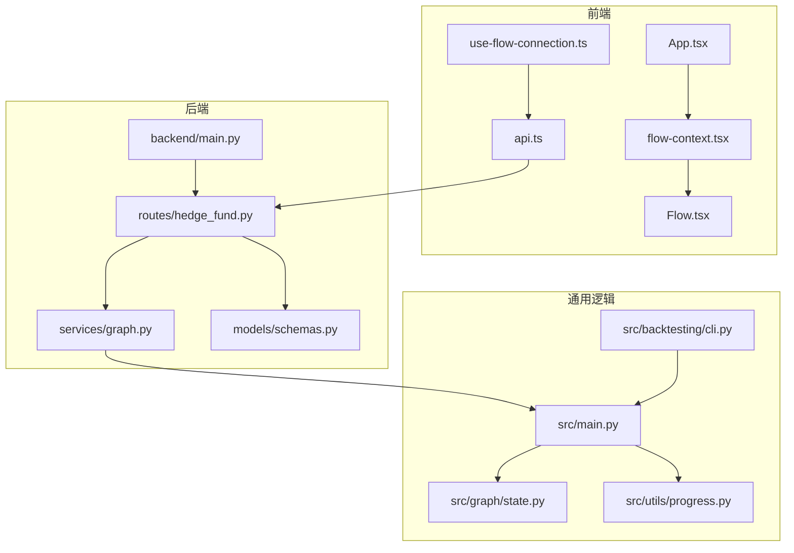
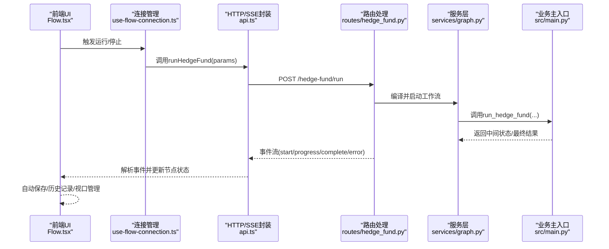
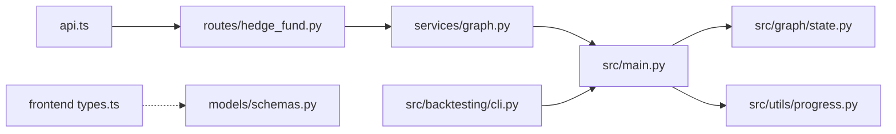

# 组件交互关系

<cite>
**本文引用的文件**
- [app/backend/main.py](file://app/backend/main.py)
- [app/backend/routes/hedge_fund.py](file://app/backend/routes/hedge_fund.py)
- [app/backend/services/graph.py](file://app/backend/services/graph.py)
- [app/backend/models/schemas.py](file://app/backend/models/schemas.py)
- [src/main.py](file://src/main.py)
- [src/graph/state.py](file://src/graph/state.py)
- [src/utils/progress.py](file://src/utils/progress.py)
- [app/frontend/src/services/api.ts](file://app/frontend/src/services/api.ts)
- [app/frontend/src/hooks/use-flow-connection.ts](file://app/frontend/src/hooks/use-flow-connection.ts)
- [app/frontend/src/contexts/flow-context.tsx](file://app/frontend/src/contexts/flow-context.tsx)
- [app/frontend/src/components/Flow.tsx](file://app/frontend/src/components/Flow.tsx)
- [app/frontend/src/App.tsx](file://app/frontend/src/App.tsx)
- [app/frontend/src/services/types.ts](file://app/frontend/src/services/types.ts)
- [src/backtesting/cli.py](file://src/backtesting/cli.py)
</cite>

## 目录
1. [简介](#简介)
2. [项目结构](#项目结构)
3. [核心组件](#核心组件)
4. [架构总览](#架构总览)
5. [详细组件分析](#详细组件分析)
6. [依赖关系分析](#依赖关系分析)
7. [性能考虑](#性能考虑)
8. [故障排查指南](#故障排查指南)
9. [结论](#结论)
10. [附录](#附录)

## 简介
本文件聚焦于AI对冲基金系统中的组件交互关系，系统由三部分组成：前端React可视化编辑器与交互界面、后端FastAPI服务（提供REST与SSE）、以及通用业务逻辑与CLI工具。本文将详细说明：
- 前端与后端通过HTTP请求、SSE事件流进行实时通信；
- CLI工具、Web界面与API服务共享统一的调用接口与数据契约；
- 组件间依赖关系、接口契约与错误传播机制；
- 生命周期管理、状态同步与并发控制策略。

## 项目结构
系统采用前后端分离与模块化组织：
- 后端FastAPI应用负责路由、数据库初始化、CORS配置与SSE事件流；
- 前端React应用负责流程图编辑、节点状态管理、SSE事件解析与UI更新；
- 通用业务逻辑位于src目录，CLI工具通过统一入口函数调用业务执行；
- 数据契约在后端模型与前端类型中保持一致，确保跨层一致性。

图表来源
- [app/frontend/src/App.tsx:1-12](file://app/frontend/src/App.tsx#L1-L12)
- [app/frontend/src/components/Flow.tsx:1-313](file://app/frontend/src/components/Flow.tsx#L1-L313)
- [app/frontend/src/hooks/use-flow-connection.ts:1-268](file://app/frontend/src/hooks/use-flow-connection.ts#L1-L268)
- [app/frontend/src/services/api.ts:1-309](file://app/frontend/src/services/api.ts#L1-L309)
- [app/frontend/src/contexts/flow-context.tsx:1-358](file://app/frontend/src/contexts/flow-context.tsx#L1-L358)
- [app/backend/main.py:1-56](file://app/backend/main.py#L1-L56)
- [app/backend/routes/hedge_fund.py:1-353](file://app/backend/routes/hedge_fund.py#L1-L353)
- [app/backend/services/graph.py:1-193](file://app/backend/services/graph.py#L1-L193)
- [app/backend/models/schemas.py:1-292](file://app/backend/models/schemas.py#L1-L292)
- [src/main.py:1-180](file://src/main.py#L1-L180)
- [src/graph/state.py:1-52](file://src/graph/state.py#L1-L52)
- [src/utils/progress.py:1-117](file://src/utils/progress.py#L1-L117)
- [src/backtesting/cli.py:1-173](file://src/backtesting/cli.py#L1-L173)

章节来源
- [app/backend/main.py:1-56](file://app/backend/main.py#L1-L56)
- [app/backend/routes/hedge_fund.py:1-353](file://app/backend/routes/hedge_fund.py#L1-L353)
- [app/backend/services/graph.py:1-193](file://app/backend/services/graph.py#L1-L193)
- [app/backend/models/schemas.py:1-292](file://app/backend/models/schemas.py#L1-L292)
- [src/main.py:1-180](file://src/main.py#L1-L180)
- [src/graph/state.py:1-52](file://src/graph/state.py#L1-L52)
- [src/utils/progress.py:1-117](file://src/utils/progress.py#L1-L117)
- [app/frontend/src/services/api.ts:1-309](file://app/frontend/src/services/api.ts#L1-L309)
- [app/frontend/src/hooks/use-flow-connection.ts:1-268](file://app/frontend/src/hooks/use-flow-connection.ts#L1-L268)
- [app/frontend/src/contexts/flow-context.tsx:1-358](file://app/frontend/src/contexts/flow-context.tsx#L1-L358)
- [app/frontend/src/components/Flow.tsx:1-313](file://app/frontend/src/components/Flow.tsx#L1-L313)
- [app/frontend/src/App.tsx:1-12](file://app/frontend/src/App.tsx#L1-L12)
- [app/frontend/src/services/types.ts:1-83](file://app/frontend/src/services/types.ts#L1-L83)
- [src/backtesting/cli.py:1-173](file://src/backtesting/cli.py#L1-L173)

## 核心组件
- 前端React组件
  - 流程图编辑器与节点渲染：Flow.tsx负责节点/边状态、自动保存与历史快照。
  - 连接状态管理：use-flow-connection.ts维护每个flow的连接状态机（idle/connecting/connected/error/completed），并协调SSE读取与节点状态更新。
  - API封装：api.ts封装HTTP与SSE调用，解析事件类型并驱动节点状态变更。
  - 上下文与持久化：flow-context.tsx负责flow级状态隔离、节点内部状态恢复与视口管理；App.tsx作为根组件承载全局提示与布局。
- 后端FastAPI服务
  - 应用入口：main.py配置CORS、数据库表初始化与启动事件检查Ollama状态。
  - 路由层：routes/hedge_fund.py提供/hedge-fund/run与/hedge-fund/backtest两个SSE端点，负责参数校验、进度回调注册、客户端断连检测与事件生成。
  - 服务层：services/graph.py构建LangGraph工作流、异步执行与结果解析。
  - 数据契约：models/schemas.py定义请求/响应模型与枚举，保证前后端一致性。
- 通用业务逻辑
  - 入口函数：src/main.py定义run_hedge_fund与create_workflow，串联分析师代理、风险管理与组合管理。
  - 状态模型：src/graph/state.py定义AgentState与序列化辅助方法。
  - 进度追踪：src/utils/progress.py提供全局进度跟踪与回调分发。
  - CLI工具：src/backtesting/cli.py提供命令行回测入口，复用run_hedge_fund作为引擎。

章节来源
- [app/frontend/src/components/Flow.tsx:1-313](file://app/frontend/src/components/Flow.tsx#L1-L313)
- [app/frontend/src/hooks/use-flow-connection.ts:1-268](file://app/frontend/src/hooks/use-flow-connection.ts#L1-L268)
- [app/frontend/src/services/api.ts:1-309](file://app/frontend/src/services/api.ts#L1-L309)
- [app/frontend/src/contexts/flow-context.tsx:1-358](file://app/frontend/src/contexts/flow-context.tsx#L1-L358)
- [app/frontend/src/App.tsx:1-12](file://app/frontend/src/App.tsx#L1-L12)
- [app/backend/main.py:1-56](file://app/backend/main.py#L1-L56)
- [app/backend/routes/hedge_fund.py:1-353](file://app/backend/routes/hedge_fund.py#L1-L353)
- [app/backend/services/graph.py:1-193](file://app/backend/services/graph.py#L1-L193)
- [app/backend/models/schemas.py:1-292](file://app/backend/models/schemas.py#L1-L292)
- [src/main.py:1-180](file://src/main.py#L1-L180)
- [src/graph/state.py:1-52](file://src/graph/state.py#L1-L52)
- [src/utils/progress.py:1-117](file://src/utils/progress.py#L1-L117)
- [src/backtesting/cli.py:1-173](file://src/backtesting/cli.py#L1-L173)

## 架构总览
系统采用“前端可视化编辑 + 后端SSE流式计算”的交互模式：
- 前端通过POST请求触发后端SSE事件流，后端以StartEvent开始，持续发送ProgressUpdateEvent，最终以CompleteEvent或ErrorEvent结束。
- 后端在后台任务中执行LangGraph工作流，使用全局进度追踪器将中间状态广播给前端。
- CLI工具与Web界面共享同一套业务逻辑入口，实现统一的调用接口与数据契约。

图表来源
- [app/frontend/src/components/Flow.tsx:1-313](file://app/frontend/src/components/Flow.tsx#L1-L313)
- [app/frontend/src/hooks/use-flow-connection.ts:1-268](file://app/frontend/src/hooks/use-flow-connection.ts#L1-L268)
- [app/frontend/src/services/api.ts:1-309](file://app/frontend/src/services/api.ts#L1-L309)
- [app/backend/routes/hedge_fund.py:1-353](file://app/backend/routes/hedge_fund.py#L1-L353)
- [app/backend/services/graph.py:1-193](file://app/backend/services/graph.py#L1-L193)
- [src/main.py:1-180](file://src/main.py#L1-L180)

## 详细组件分析

### 前端组件：Flow.tsx（流程图与自动保存）
- 负责节点/边状态管理、主题适配、自动保存与历史快照。
- 对节点位置变化与边移除等关键变更进行去抖动自动保存，避免频繁写入。
- 初始化时捕获视口信息，加载时恢复节点、边与视口，确保用户体验连续性。

章节来源
- [app/frontend/src/components/Flow.tsx:1-313](file://app/frontend/src/components/Flow.tsx#L1-L313)

### 前端组件：use-flow-connection.ts（连接状态机与SSE编排）
- 定义FlowConnectionState状态机，支持idle/connecting/connected/error/completed。
- 提供runFlow/runBacktest/stopFlow/recoverFlowState等动作，统一调度SSE事件与节点状态更新。
- 通过AbortController中断SSE连接，清理队列与回调，防止资源泄漏。
- 在流完成或异常时，自动重置节点状态或标记错误，保证UI一致性。

章节来源
- [app/frontend/src/hooks/use-flow-connection.ts:1-268](file://app/frontend/src/hooks/use-flow-connection.ts#L1-L268)

### 前端组件：api.ts（HTTP与SSE封装）
- GET /hedge-fund/agents 获取可用代理列表。
- POST /hedge-fund/run 发起SSE事件流，解析start/progress/complete/error事件，驱动节点状态更新与输出节点数据存储。
- 支持手动abort中断SSE，清理连接状态与节点状态。

章节来源
- [app/frontend/src/services/api.ts:1-309](file://app/frontend/src/services/api.ts#L1-L309)

### 后端组件：routes/hedge_fund.py（SSE事件生成与断连检测）
- 参数校验与API密钥注入：若未提供则从数据库拉取。
- 构建LangGraph工作流并异步执行，注册全局进度回调，将中间状态转换为ProgressUpdateEvent。
- 使用request.receive()检测客户端断连，及时取消后台任务，释放资源。
- 事件类型：StartEvent、ProgressUpdateEvent、CompleteEvent、ErrorEvent。

章节来源
- [app/backend/routes/hedge_fund.py:1-353](file://app/backend/routes/hedge_fund.py#L1-L353)

### 后端组件：services/graph.py（工作流构建与执行）
- 将前端React Flow结构映射到LangGraph，动态创建代理节点与风险/组合管理节点。
- 通过唯一节点ID与基础键映射，确保前后端节点标识一致。
- 异步包装run_graph，避免阻塞事件循环。

章节来源
- [app/backend/services/graph.py:1-193](file://app/backend/services/graph.py#L1-L193)

### 通用组件：src/main.py（业务主入口）
- run_hedge_fund：根据选择的分析师构建工作流，编译并执行，返回决策与信号。
- create_workflow：按用户选择连接分析师节点至风险管理，再至组合管理，最终结束。

章节来源
- [src/main.py:1-180](file://src/main.py#L1-L180)

### 通用组件：src/utils/progress.py（进度追踪与回调）
- 注册/注销进度回调，统一推送agent名称、股票、状态、分析与时间戳。
- CLI与SSE均通过该进度追踪器获取中间状态，保证一致性。

章节来源
- [src/utils/progress.py:1-117](file://src/utils/progress.py#L1-L117)

### CLI工具：src/backtesting/cli.py（统一调用接口）
- 解析命令行参数，选择分析师与模型，构造BacktestEngine并调用run_hedge_fund作为引擎。
- 输出最小化终端结果，便于批处理与自动化。

章节来源
- [src/backtesting/cli.py:1-173](file://src/backtesting/cli.py#L1-L173)

### 数据契约：app/backend/models/schemas.py（接口契约）
- 定义HedgeFundRequest/BacktestRequest、Graph节点/边、AgentModelConfig、PortfolioPosition等。
- 提供agent模型配置查询与唯一ID映射辅助，确保前后端一致。

章节来源
- [app/backend/models/schemas.py:1-292](file://app/backend/models/schemas.py#L1-L292)

### 前端类型：app/frontend/src/services/types.ts（接口契约）
- 与后端模型一一对应，确保TS类型安全与IDE提示。

章节来源
- [app/frontend/src/services/types.ts:1-83](file://app/frontend/src/services/types.ts#L1-L83)

### 应用入口：app/backend/main.py（CORS与启动检查）
- 配置CORS允许前端开发地址访问。
- 启动事件中检查Ollama可用性，打印状态日志。

章节来源
- [app/backend/main.py:1-56](file://app/backend/main.py#L1-L56)

## 依赖关系分析
- 前端依赖后端SSE事件流，后端依赖LangGraph工作流与进度追踪器。
- CLI工具直接复用src/main.py的run_hedge_fund，形成统一的业务执行路径。
- 数据契约在两端保持一致，降低耦合与错误传播风险。

图表来源
- [app/frontend/src/services/api.ts:1-309](file://app/frontend/src/services/api.ts#L1-L309)
- [app/backend/routes/hedge_fund.py:1-353](file://app/backend/routes/hedge_fund.py#L1-L353)
- [app/backend/services/graph.py:1-193](file://app/backend/services/graph.py#L1-L193)
- [src/main.py:1-180](file://src/main.py#L1-L180)
- [src/graph/state.py:1-52](file://src/graph/state.py#L1-L52)
- [src/utils/progress.py:1-117](file://src/utils/progress.py#L1-L117)
- [src/backtesting/cli.py:1-173](file://src/backtesting/cli.py#L1-L173)
- [app/backend/models/schemas.py:1-292](file://app/backend/models/schemas.py#L1-L292)
- [app/frontend/src/services/types.ts:1-83](file://app/frontend/src/services/types.ts#L1-L83)

## 性能考虑
- SSE事件流采用异步生成与队列分发，避免阻塞主线程。
- 断连检测通过request.receive()主动感知，及时取消后台任务，减少资源浪费。
- 前端自动保存采用去抖动策略，降低I/O压力。
- LangGraph执行通过线程池异步包装，避免事件循环阻塞。

## 故障排查指南
- SSE连接失败
  - 检查后端CORS配置与前端API_URL环境变量。
  - 查看后端启动日志中Ollama状态提示。
- 节点状态不更新
  - 确认use-flow-connection.ts中连接状态机是否正确切换至connected。
  - 检查api.ts中SSE事件解析逻辑与节点ID映射。
- 断连未终止
  - 确认后端断连检测任务已启动且未被提前取消。
  - 检查AbortController是否被正确传递与调用。
- CLI执行异常
  - 确认模型与Ollama配置正确，必要时重新选择模型并确保Ollama服务运行。

章节来源
- [app/backend/main.py:32-56](file://app/backend/main.py#L32-L56)
- [app/frontend/src/hooks/use-flow-connection.ts:114-148](file://app/frontend/src/hooks/use-flow-connection.ts#L114-L148)
- [app/frontend/src/services/api.ts:87-309](file://app/frontend/src/services/api.ts#L87-L309)
- [app/backend/routes/hedge_fund.py:51-155](file://app/backend/routes/hedge_fund.py#L51-L155)
- [src/backtesting/cli.py:75-103](file://src/backtesting/cli.py#L75-L103)

## 结论
本系统通过统一的数据契约与调用接口，实现了前端可视化编辑、后端SSE流式计算与CLI批处理的一体化协同。连接状态机、断连检测与自动保存策略共同保障了良好的用户体验与系统稳定性。建议后续增强SSE完成通知与错误事件的标准化，进一步提升可观测性与可维护性。

## 附录
- 组件生命周期
  - 前端：初始化视口与节点 → 用户操作触发保存 → 运行时自动保存 → 停止/断连清理。
  - 后端：接收请求 → 构建工作流 → 注册进度回调 → 生成SSE事件 → 清理资源。
- 并发控制
  - 前端：AbortController用于并发SSE中断；use-flow-connection.ts限制单一流程并发。
  - 后端：后台任务与断连检测并行，队列分发进度事件，避免阻塞。