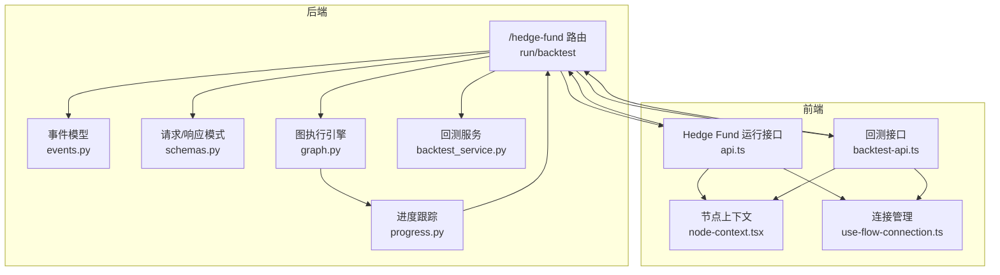
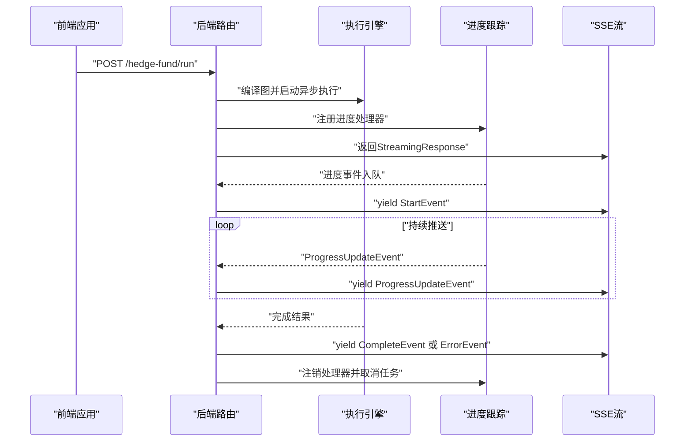
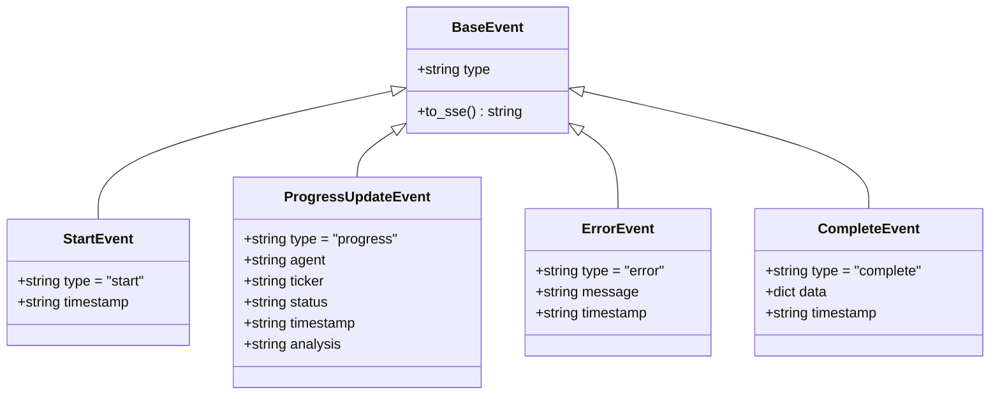
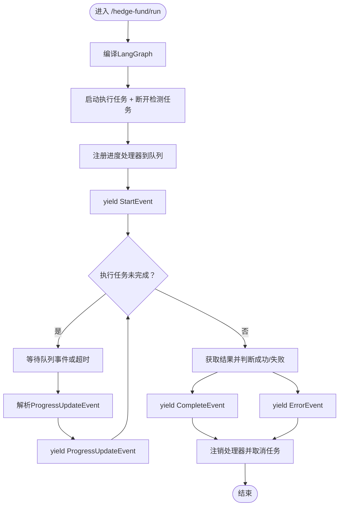
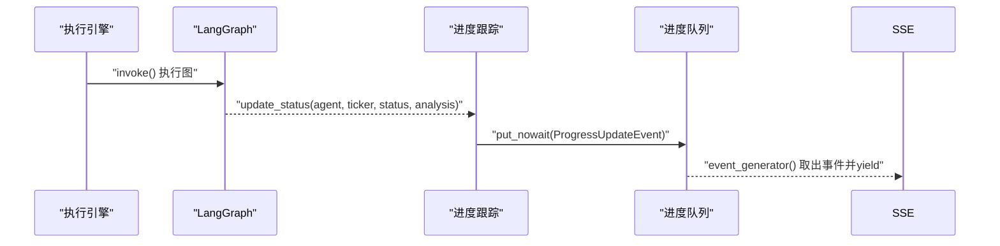
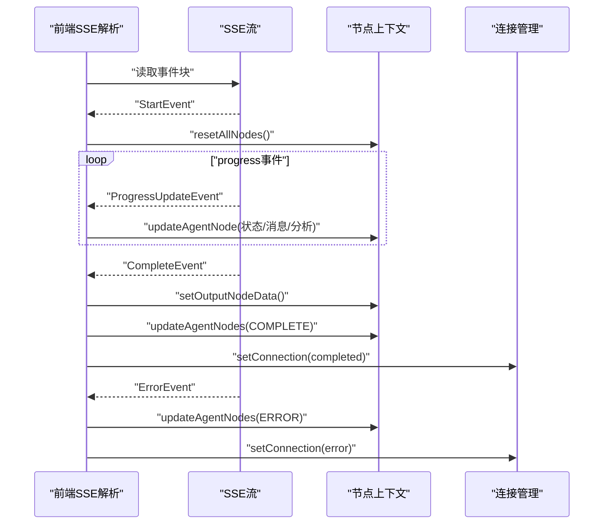
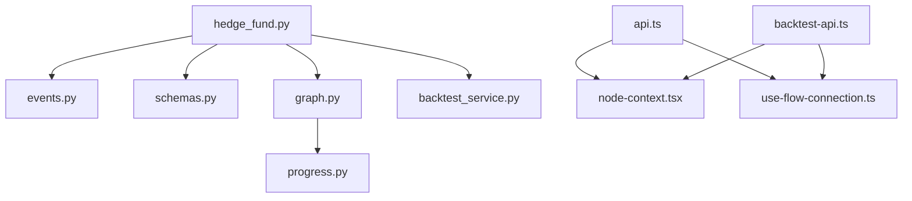

# 流式响应系统

<cite>
**本文档引用的文件**
- [app/backend/routes/hedge_fund.py](file://app/backend/routes/hedge_fund.py)
- [app/backend/models/events.py](file://app/backend/models/events.py)
- [app/backend/models/schemas.py](file://app/backend/models/schemas.py)
- [app/backend/services/graph.py](file://app/backend/services/graph.py)
- [app/backend/services/backtest_service.py](file://app/backend/services/backtest_service.py)
- [src/utils/progress.py](file://src/utils/progress.py)
- [app/frontend/src/services/api.ts](file://app/frontend/src/services/api.ts)
- [app/frontend/src/services/backtest-api.ts](file://app/frontend/src/services/backtest-api.ts)
- [app/frontend/src/hooks/use-flow-connection.ts](file://app/frontend/src/hooks/use-flow-connection.ts)
- [app/frontend/src/contexts/node-context.tsx](file://app/frontend/src/contexts/node-context.tsx)
- [app/backend/routes/health.py](file://app/backend/routes/health.py)
- [app/backend/routes/storage.py](file://app/backend/routes/storage.py)
- [src/backtesting/controller.py](file://src/backtesting/controller.py)
- [src/utils/display.py](file://src/utils/display.py)
</cite>

## 目录
1. [引言](#引言)
2. [项目结构](#项目结构)
3. [核心组件](#核心组件)
4. [架构总览](#架构总览)
5. [详细组件分析](#详细组件分析)
6. [依赖关系分析](#依赖关系分析)
7. [性能考虑](#性能考虑)
8. [故障排除指南](#故障排除指南)
9. [结论](#结论)
10. [附录](#附录)

## 引言
本文件系统性阐述该AI对冲基金项目中的流式响应（Server-Sent Events, SSE）系统，覆盖事件驱动架构、消息格式、客户端连接管理、实时状态推送、错误处理与断开检测、数据序列化与传输协议、重连与心跳策略、性能优化与资源清理、调试工具与监控指标，以及与WebSocket的差异与适用场景。文档面向不同技术背景的读者，既提供高层概览也包含代码级细节与可视化图示。

## 项目结构
后端采用FastAPI框架，路由层负责接收请求并返回SSE流；事件模型定义了统一的消息格式；前端通过fetch API以POST方式发起SSE连接，使用ReadableStream读取并解析事件；进度跟踪器在后台异步执行任务并将状态推送到队列，再由事件生成器转换为SSE事件。

**图表来源**
- [app/backend/routes/hedge_fund.py:18-155](file://app/backend/routes/hedge_fund.py#L18-L155)
- [app/backend/models/events.py:5-46](file://app/backend/models/events.py#L5-L46)
- [app/backend/models/schemas.py:61-141](file://app/backend/models/schemas.py#L61-L141)
- [app/backend/services/graph.py:132-177](file://app/backend/services/graph.py#L132-L177)
- [app/backend/services/backtest_service.py:285-512](file://app/backend/services/backtest_service.py#L285-L512)
- [src/utils/progress.py:12-64](file://src/utils/progress.py#L12-L64)
- [app/frontend/src/services/api.ts:87-308](file://app/frontend/src/services/api.ts#L87-L308)
- [app/frontend/src/services/backtest-api.ts:20-287](file://app/frontend/src/services/backtest-api.ts#L20-L287)
- [app/frontend/src/contexts/node-context.tsx:63-86](file://app/frontend/src/contexts/node-context.tsx#L63-L86)
- [app/frontend/src/hooks/use-flow-connection.ts:19-73](file://app/frontend/src/hooks/use-flow-connection.ts#L19-L73)

**章节来源**
- [app/backend/routes/hedge_fund.py:1-353](file://app/backend/routes/hedge_fund.py#L1-L353)
- [app/backend/models/events.py:1-46](file://app/backend/models/events.py#L1-L46)
- [app/backend/models/schemas.py:1-292](file://app/backend/models/schemas.py#L1-L292)
- [app/backend/services/graph.py:1-193](file://app/backend/services/graph.py#L1-L193)
- [app/backend/services/backtest_service.py:1-539](file://app/backend/services/backtest_service.py#L1-L539)
- [src/utils/progress.py:1-117](file://src/utils/progress.py#L1-L117)
- [app/frontend/src/services/api.ts:1-309](file://app/frontend/src/services/api.ts#L1-L309)
- [app/frontend/src/services/backtest-api.ts:1-291](file://app/frontend/src/services/backtest-api.ts#L1-L291)
- [app/frontend/src/contexts/node-context.tsx:1-438](file://app/frontend/src/contexts/node-context.tsx#L1-L438)
- [app/frontend/src/hooks/use-flow-connection.ts:1-268](file://app/frontend/src/hooks/use-flow-connection.ts#L1-L268)

## 核心组件
- 事件模型：定义统一的SSE事件格式，包含类型与数据字段，并提供序列化为SSE字符串的方法。
- 路由层：提供/hedge-fund/run与/hedge-fund/backtest两个SSE端点，分别用于实时交易决策流与回测流。
- 执行引擎：基于LangGraph构建工作流图，异步执行并注册进度回调，将状态写入队列。
- 前端接口：使用fetch + ReadableStream解析SSE事件，更新节点状态与输出面板。
- 连接管理：前端维护每个流程的连接状态机，支持手动停止、自动清理与状态恢复。
- 进度跟踪：全局进度对象注册多个处理器，将状态广播给事件生成器。

**章节来源**
- [app/backend/models/events.py:5-46](file://app/backend/models/events.py#L5-L46)
- [app/backend/routes/hedge_fund.py:18-155](file://app/backend/routes/hedge_fund.py#L18-L155)
- [app/backend/services/graph.py:132-177](file://app/backend/services/graph.py#L132-L177)
- [src/utils/progress.py:12-64](file://src/utils/progress.py#L12-L64)
- [app/frontend/src/services/api.ts:87-308](file://app/frontend/src/services/api.ts#L87-L308)
- [app/frontend/src/hooks/use-flow-connection.ts:19-73](file://app/frontend/src/hooks/use-flow-connection.ts#L19-L73)

## 架构总览
SSE事件流采用“后端事件生成器 + 前端事件解析”的模式。后端在请求生命周期内启动异步任务与断开检测任务，将进度事件写入队列并通过StreamingResponse逐条发送SSE事件；前端通过ReadableStream增量解析事件，按事件类型更新UI状态。

**图表来源**
- [app/backend/routes/hedge_fund.py:63-155](file://app/backend/routes/hedge_fund.py#L63-L155)
- [src/utils/progress.py:22-64](file://src/utils/progress.py#L22-L64)
- [app/backend/services/graph.py:132-177](file://app/backend/services/graph.py#L132-L177)

## 详细组件分析

### 事件模型与消息格式
- 事件基类提供统一的type字段与to_sse序列化方法，确保SSE事件的event与data字段正确生成。
- 四种事件类型：
  - start：开始事件，用于初始化前端状态。
  - progress：进度事件，携带agent、ticker、status、analysis等字段。
  - error：错误事件，携带错误信息。
  - complete：完成事件，携带最终数据（如决策、信号、回测指标等）。

**图表来源**
- [app/backend/models/events.py:5-46](file://app/backend/models/events.py#L5-L46)

**章节来源**
- [app/backend/models/events.py:1-46](file://app/backend/models/events.py#L1-L46)

### 后端路由与SSE事件生成
- /hedge-fund/run：接收HedgeFundRequest，编译LangGraph，启动异步执行与断开检测任务，使用队列推送progress事件，完成后发送complete或error事件。
- /hedge-fund/backtest：与run类似，但使用BacktestService进行回测，进度事件中可包含每日回测结果的JSON字符串作为analysis字段。
- 断开检测：通过request.receive()监听http.disconnect事件，一旦检测到断开立即取消执行任务并清理资源。

**图表来源**
- [app/backend/routes/hedge_fund.py:63-155](file://app/backend/routes/hedge_fund.py#L63-L155)

**章节来源**
- [app/backend/routes/hedge_fund.py:18-155](file://app/backend/routes/hedge_fund.py#L18-L155)

### 执行引擎与进度跟踪
- 图执行：create_graph根据React Flow结构构建StateGraph，compile后调用run_graph_async在独立线程池中运行，避免阻塞事件循环。
- 进度回调：progress.register_handler将回调注入，每次update_status触发时，向队列写入ProgressUpdateEvent。
- 解析与封装：parse_hedge_fund_response将LLM输出解析为结构化数据，供complete事件携带。

**图表来源**
- [app/backend/services/graph.py:132-177](file://app/backend/services/graph.py#L132-L177)
- [src/utils/progress.py:44-64](file://src/utils/progress.py#L44-L64)

**章节来源**
- [app/backend/services/graph.py:1-193](file://app/backend/services/graph.py#L1-L193)
- [src/utils/progress.py:1-117](file://src/utils/progress.py#L1-L117)

### 前端SSE解析与状态更新
- 接口实现：api.ts与backtest-api.ts均通过fetch发起POST请求，读取ReadableStream，按“event:”和“data:”分隔符解析事件。
- 状态映射：
  - start：重置节点状态。
  - progress：根据agent映射到唯一节点ID，更新状态、消息、分析、时间戳。
  - complete：存储最终数据到输出节点，标记所有代理为完成。
  - error：标记所有代理为错误。
- 连接管理：use-flow-connection维护连接状态机，支持手动停止、自动清理与过期恢复。

**图表来源**
- [app/frontend/src/services/api.ts:122-279](file://app/frontend/src/services/api.ts#L122-L279)
- [app/frontend/src/services/backtest-api.ts:56-256](file://app/frontend/src/services/backtest-api.ts#L56-L256)
- [app/frontend/src/contexts/node-context.tsx:98-182](file://app/frontend/src/contexts/node-context.tsx#L98-L182)
- [app/frontend/src/hooks/use-flow-connection.ts:115-148](file://app/frontend/src/hooks/use-flow-connection.ts#L115-L148)

**章节来源**
- [app/frontend/src/services/api.ts:87-308](file://app/frontend/src/services/api.ts#L87-L308)
- [app/frontend/src/services/backtest-api.ts:20-287](file://app/frontend/src/services/backtest-api.ts#L20-L287)
- [app/frontend/src/contexts/node-context.tsx:63-86](file://app/frontend/src/contexts/node-context.tsx#L63-L86)
- [app/frontend/src/hooks/use-flow-connection.ts:19-73](file://app/frontend/src/hooks/use-flow-connection.ts#L19-L73)

### 错误处理与断开检测
- 客户端断开：后端通过request.receive()轮询http.disconnect，断开后立即取消执行任务并清理资源。
- 前端异常：捕获AbortError以外的错误，标记节点为ERROR并更新连接状态。
- 服务端异常：捕获异常并返回ErrorEvent，前端同样标记ERROR并更新连接状态。

**章节来源**
- [app/backend/routes/hedge_fund.py:51-155](file://app/backend/routes/hedge_fund.py#L51-L155)
- [app/frontend/src/services/api.ts:259-295](file://app/frontend/src/services/api.ts#L259-L295)
- [app/frontend/src/services/backtest-api.ts:233-274](file://app/frontend/src/services/backtest-api.ts#L233-L274)

### 数据序列化与传输协议
- 事件序列化：BaseEvent.to_sse将事件转为SSE格式，包含event与data两行，以空行分隔。
- 请求/响应模型：HedgeFundRequest/BacktestRequest定义输入参数，CompleteEvent.data承载最终结果。
- 分析数据：回测日结果以JSON字符串形式嵌入progress事件的analysis字段，前端解析后展示。

**章节来源**
- [app/backend/models/events.py:10-13](file://app/backend/models/events.py#L10-L13)
- [app/backend/models/schemas.py:61-141](file://app/backend/models/schemas.py#L61-L141)
- [app/backend/routes/hedge_fund.py:246-256](file://app/backend/routes/hedge_fund.py#L246-L256)

### 客户端断开重连、心跳与超时
- 断开检测：后端主动检测http.disconnect，前端通过AbortController中断请求。
- 重连策略：当前实现未内置自动重连逻辑，建议在前端连接管理中增加指数退避与最大重试次数。
- 心跳：SSE未内置心跳，可在后端周期性发送空事件或start事件维持连接活跃。
- 超时：可通过AbortController与连接状态机实现超时控制与资源清理。

**章节来源**
- [app/backend/routes/hedge_fund.py:51-101](file://app/backend/routes/hedge_fund.py#L51-L101)
- [app/frontend/src/hooks/use-flow-connection.ts:187-211](file://app/frontend/src/hooks/use-flow-connection.ts#L187-L211)

### 性能优化与资源清理
- 异步执行：run_graph_async使用线程池避免阻塞事件循环。
- 队列限流：前端仅保留最近N条回测结果，防止内存膨胀。
- 及时清理：finally块中注销处理器、取消任务、关闭断开检测任务。
- 资源释放：后端在complete/error后清理进度处理器与任务句柄。

**章节来源**
- [app/backend/services/graph.py:132-138](file://app/backend/services/graph.py#L132-L138)
- [app/backend/routes/hedge_fund.py:142-153](file://app/backend/routes/hedge_fund.py#L142-L153)
- [app/frontend/src/services/backtest-api.ts:135-140](file://app/frontend/src/services/backtest-api.ts#L135-L140)

### 调试工具与监控指标
- 健康检查：/health/ping返回简单SSE流，便于验证SSE通道可用性。
- 存储接口：/storage/save-json用于持久化输出，便于离线分析。
- 显示工具：CLI侧有丰富的表格打印与格式化函数，可用于对比前后端输出一致性。

**章节来源**
- [app/backend/routes/health.py:14-27](file://app/backend/routes/health.py#L14-L27)
- [app/backend/routes/storage.py:22-41](file://app/backend/routes/storage.py#L22-L41)
- [src/utils/display.py:17-255](file://src/utils/display.py#L17-L255)

### 与WebSocket的差异与适用场景
- 单向性：SSE为单向推送，适合后端向前端推送状态与结果；WebSocket双向通信更适合交互频繁的场景。
- 兼容性：SSE在浏览器中通过fetch + ReadableStream即可实现，无需额外库；WebSocket需要专门的客户端库。
- 自动重连：SSE通常由浏览器自动重连，WebSocket需自实现重连与握手。
- 适用场景：本项目以“一次性执行 + 实时进度推送 + 结果汇总”为主，SSE更简洁高效；若需用户输入或双向交互，可考虑WebSocket。

**章节来源**
- [app/backend/routes/hedge_fund.py:18-155](file://app/backend/routes/hedge_fund.py#L18-L155)
- [app/frontend/src/services/api.ts:109-116](file://app/frontend/src/services/api.ts#L109-L116)

## 依赖关系分析

**图表来源**
- [app/backend/routes/hedge_fund.py:1-16](file://app/backend/routes/hedge_fund.py#L1-L16)
- [app/backend/models/events.py:1-2](file://app/backend/models/events.py#L1-L2)
- [app/backend/models/schemas.py:1-6](file://app/backend/models/schemas.py#L1-L6)
- [app/backend/services/graph.py:1-12](file://app/backend/services/graph.py#L1-L12)
- [app/backend/services/backtest_service.py:1-16](file://app/backend/services/backtest_service.py#L1-L16)
- [src/utils/progress.py:1-9](file://src/utils/progress.py#L1-L9)
- [app/frontend/src/services/api.ts:1-8](file://app/frontend/src/services/api.ts#L1-L8)
- [app/frontend/src/services/backtest-api.ts:1-8](file://app/frontend/src/services/backtest-api.ts#L1-L8)
- [app/frontend/src/contexts/node-context.tsx:1-4](file://app/frontend/src/contexts/node-context.tsx#L1-L4)
- [app/frontend/src/hooks/use-flow-connection.ts:1-4](file://app/frontend/src/hooks/use-flow-connection.ts#L1-L4)

**章节来源**
- [app/backend/routes/hedge_fund.py:1-16](file://app/backend/routes/hedge_fund.py#L1-L16)
- [app/frontend/src/services/api.ts:1-8](file://app/frontend/src/services/api.ts#L1-L8)
- [app/frontend/src/services/backtest-api.ts:1-8](file://app/frontend/src/services/backtest-api.ts#L1-L8)

## 性能考虑
- I/O密集型：LangGraph执行与外部API调用可能阻塞，通过run_graph_async与线程池降低影响。
- 内存管理：前端限制回测结果数量；后端及时取消任务与注销处理器。
- 并发控制：队列与任务分离，避免事件堆积导致内存增长。
- 网络效率：SSE单连接推送，减少连接建立成本；事件体紧凑，避免冗余字段。

[本节为通用指导，不直接分析具体文件]

## 故障排除指南
- SSE无法连接：检查CORS配置与后端SSE端点是否可达；使用/health/ping验证通道。
- 事件解析失败：确认事件格式为“event: type”与“data: {...}”且以空行分隔；检查前端buffer拼接逻辑。
- 连接意外中断：查看后端断开检测日志；前端检查AbortError分支与连接状态机。
- 结果为空：确认执行任务返回值非空；complete事件前应先发送start与若干progress事件。
- 资源未释放：核对finally块是否执行；确保注销处理器与取消任务。

**章节来源**
- [app/backend/routes/health.py:14-27](file://app/backend/routes/health.py#L14-L27)
- [app/frontend/src/services/api.ts:242-244](file://app/frontend/src/services/api.ts#L242-L244)
- [app/backend/routes/hedge_fund.py:142-153](file://app/backend/routes/hedge_fund.py#L142-L153)

## 结论
该SSE流式响应系统以清晰的事件模型与严格的生命周期管理实现了从后端执行到前端实时可视化的完整闭环。通过断开检测、资源清理与前端状态机，系统具备良好的鲁棒性与可维护性。建议后续增强自动重连、心跳与监控埋点，进一步提升生产环境稳定性。

[本节为总结性内容，不直接分析具体文件]

## 附录

### 事件类型与字段定义
- start：type="start"，可选timestamp。
- progress：type="progress"，包含agent、ticker、status、timestamp、analysis。
- error：type="error"，包含message、timestamp。
- complete：type="complete"，包含data字典与timestamp。

**章节来源**
- [app/backend/models/events.py:16-46](file://app/backend/models/events.py#L16-L46)

### 前端集成要点
- 使用AbortController中断SSE连接。
- 按事件类型更新节点状态与输出面板。
- 维护连接状态机，支持手动停止与自动清理。

**章节来源**
- [app/frontend/src/services/api.ts:298-307](file://app/frontend/src/services/api.ts#L298-L307)
- [app/frontend/src/hooks/use-flow-connection.ts:187-211](file://app/frontend/src/hooks/use-flow-connection.ts#L187-L211)