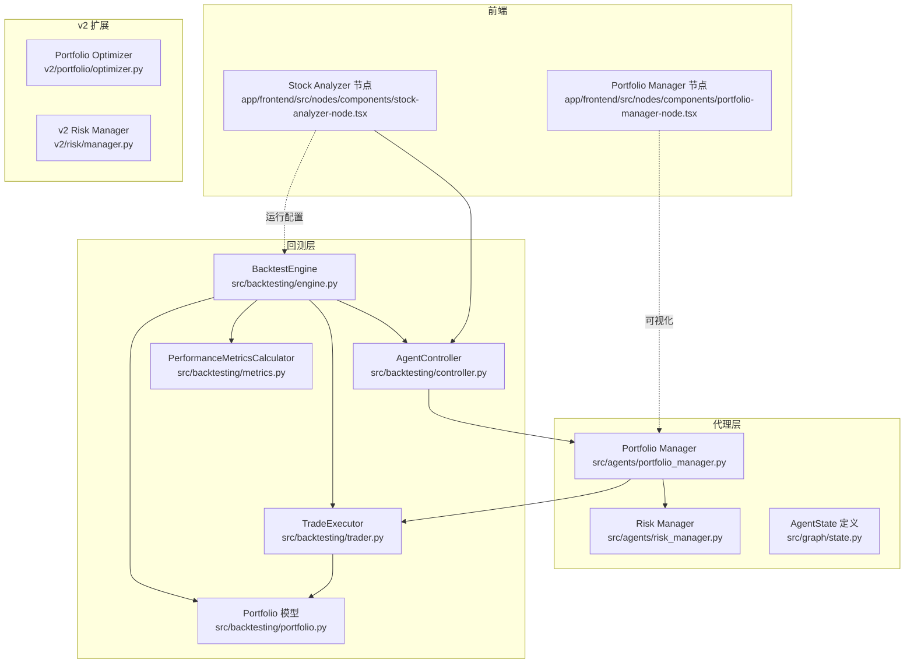
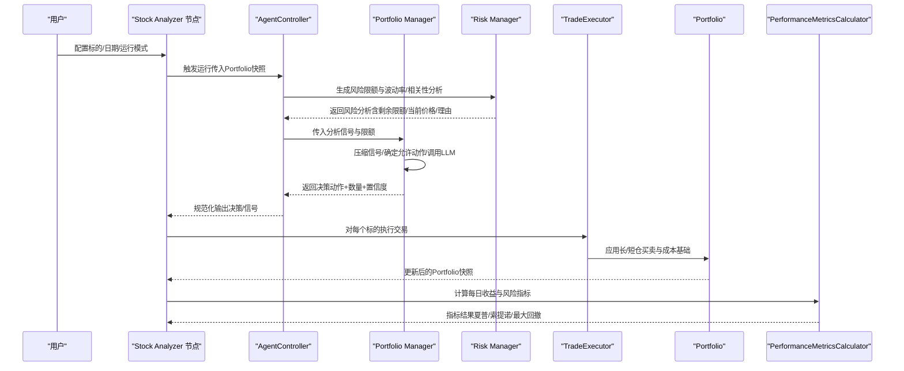
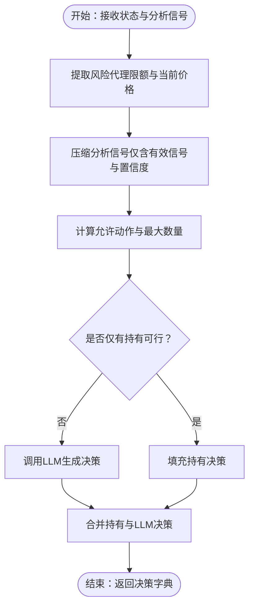
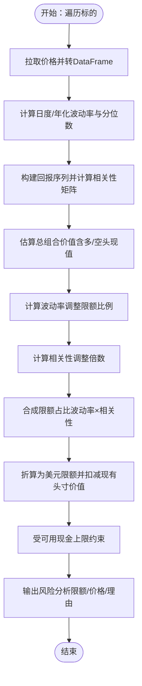
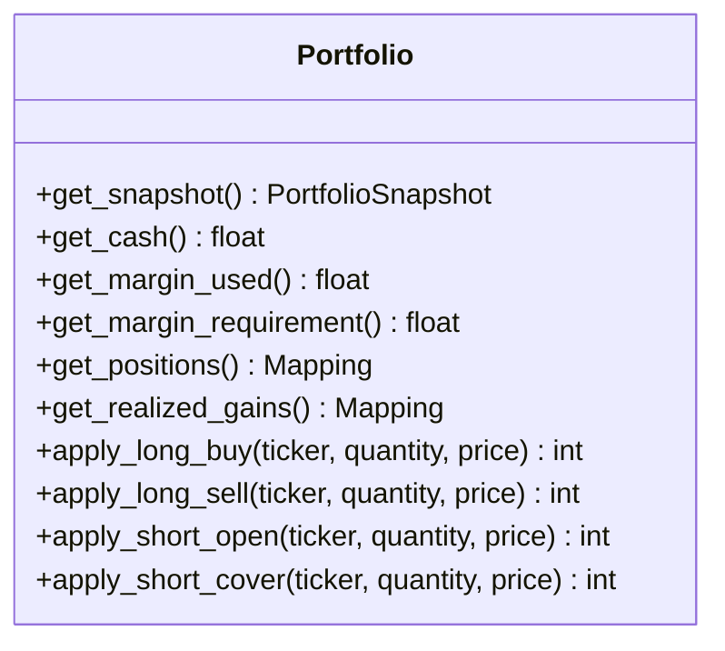
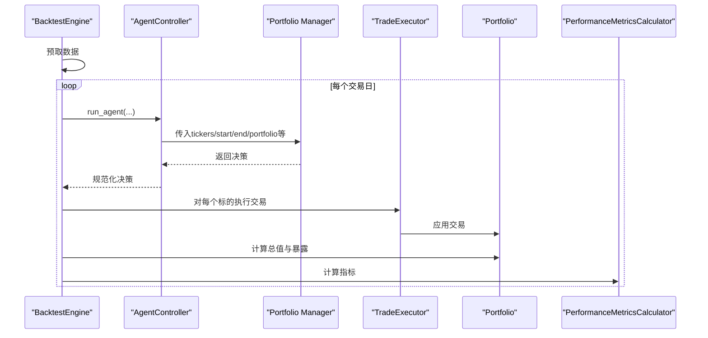
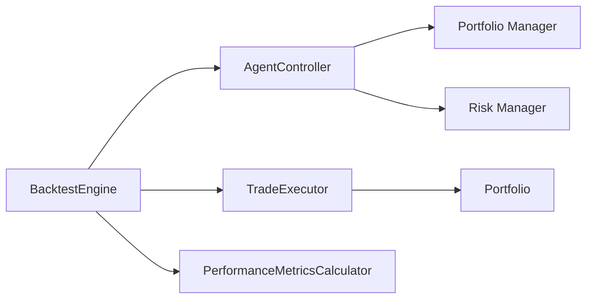

# 组合管理

<cite>
**本文引用的文件**
- [src/agents/portfolio_manager.py](file://src/agents/portfolio_manager.py)
- [src/agents/risk_manager.py](file://src/agents/risk_manager.py)
- [src/backtesting/portfolio.py](file://src/backtesting/portfolio.py)
- [src/backtesting/engine.py](file://src/backtesting/engine.py)
- [src/backtesting/controller.py](file://src/backtesting/controller.py)
- [src/backtesting/trader.py](file://src/backtesting/trader.py)
- [src/backtesting/metrics.py](file://src/backtesting/metrics.py)
- [src/graph/state.py](file://src/graph/state.py)
- [app/frontend/src/nodes/components/portfolio-manager-node.tsx](file://app/frontend/src/nodes/components/portfolio-manager-node.tsx)
- [app/frontend/src/nodes/components/stock-analyzer-node.tsx](file://app/frontend/src/nodes/components/stock-analyzer-node.tsx)
- [v2/portfolio/optimizer.py](file://v2/portfolio/optimizer.py)
- [v2/risk/manager.py](file://v2/risk/manager.py)
</cite>

## 目录
1. [简介](#简介)
2. [项目结构](#项目结构)
3. [核心组件](#核心组件)
4. [架构总览](#架构总览)
5. [详细组件分析](#详细组件分析)
6. [依赖分析](#依赖分析)
7. [性能考量](#性能考量)
8. [故障排查指南](#故障排查指南)
9. [结论](#结论)
10. [附录](#附录)

## 简介
本文件系统性阐述该AI对冲基金项目的“组合管理”能力，重点覆盖以下方面：
- 组合管理代理（Portfolio Manager）如何聚合多分析代理信号，结合风险约束生成最终交易决策；
- 风险管理代理（Risk Manager）如何基于波动率与相关性进行头寸规模控制与风险限额计算；
- 回测引擎中的组合管理逻辑、绩效评估指标与风险控制参数配置；
- 实盘与回测在执行层面的差异与注意事项；
- 最佳实践与常见问题解决方案。

## 项目结构
围绕组合管理的关键代码分布在如下模块：
- 代理层：Portfolio Manager、Risk Manager 及通用图状态定义；
- 回测层：Portfolio 资产负债模型、Backtest Engine 协调器、AgentController、TradeExecutor、PerformanceMetricsCalculator；
- 前端节点：Stock Analyzer 与 Portfolio Manager 节点用于可视化与交互；
- v2 层：Portfolio Optimizer 与 Risk Manager 的演进方向（策略扩展与风险度量增强）。

图表来源
- [src/agents/portfolio_manager.py:1-263](file://src/agents/portfolio_manager.py#L1-L263)
- [src/agents/risk_manager.py:1-318](file://src/agents/risk_manager.py#L1-L318)
- [src/backtesting/engine.py:1-195](file://src/backtesting/engine.py#L1-L195)
- [src/backtesting/controller.py:1-68](file://src/backtesting/controller.py#L1-L68)
- [src/backtesting/trader.py:1-40](file://src/backtesting/trader.py#L1-L40)
- [src/backtesting/portfolio.py:1-196](file://src/backtesting/portfolio.py#L1-L196)
- [src/backtesting/metrics.py:1-78](file://src/backtesting/metrics.py#L1-L78)
- [src/graph/state.py:1-52](file://src/graph/state.py#L1-L52)
- [app/frontend/src/nodes/components/stock-analyzer-node.tsx:1-421](file://app/frontend/src/nodes/components/stock-analyzer-node.tsx#L1-L421)
- [app/frontend/src/nodes/components/portfolio-manager-node.tsx:1-160](file://app/frontend/src/nodes/components/portfolio-manager-node.tsx#L1-L160)
- [v2/portfolio/optimizer.py:1-6](file://v2/portfolio/optimizer.py#L1-L6)
- [v2/risk/manager.py:1-6](file://v2/risk/manager.py#L1-L6)

章节来源
- [src/agents/portfolio_manager.py:1-263](file://src/agents/portfolio_manager.py#L1-L263)
- [src/agents/risk_manager.py:1-318](file://src/agents/risk_manager.py#L1-L318)
- [src/backtesting/engine.py:1-195](file://src/backtesting/engine.py#L1-L195)
- [src/backtesting/controller.py:1-68](file://src/backtesting/controller.py#L1-L68)
- [src/backtesting/trader.py:1-40](file://src/backtesting/trader.py#L1-L40)
- [src/backtesting/portfolio.py:1-196](file://src/backtesting/portfolio.py#L1-L196)
- [src/backtesting/metrics.py:1-78](file://src/backtesting/metrics.py#L1-L78)
- [src/graph/state.py:1-52](file://src/graph/state.py#L1-L52)
- [app/frontend/src/nodes/components/stock-analyzer-node.tsx:1-421](file://app/frontend/src/nodes/components/stock-analyzer-node.tsx#L1-L421)
- [app/frontend/src/nodes/components/portfolio-manager-node.tsx:1-160](file://app/frontend/src/nodes/components/portfolio-manager-node.tsx#L1-L160)
- [v2/portfolio/optimizer.py:1-6](file://v2/portfolio/optimizer.py#L1-L6)
- [v2/risk/manager.py:1-6](file://v2/risk/manager.py#L1-L6)

## 核心组件
- 组合管理代理（Portfolio Manager）
  - 职责：汇总各分析代理信号与风险限额，生成每个标的的操作指令（买入/卖出/做空/平仓/持有），并确保数量不超过允许上限；
  - 关键流程：解析风险代理提供的剩余头寸限额与当前价格；压缩分析信号；构建最小提示词；调用LLM生成决策；合并纯持有结果。
- 风险管理代理（Risk Manager）
  - 职责：基于历史价格计算波动率与相关性，给出波动率调整后的头寸限额与可用资金上限，并记录理由；
  - 关键流程：拉取价格数据；计算日度/年化波动率与分位数；计算与活跃头寸的相关性；合成波动率×相关性调整因子；换算为美元限额并扣减现有头寸价值。
- 回测组合模型（Portfolio）
  - 职责：维护现金、保证金占用与头寸（含多头/空头成本基础），支持按市价执行买卖与做空/平仓，计算已实现损益；
  - 关键流程：长仓买入/卖出、短仓开仓/平仓；保证金占用与释放；成本基础滚动更新；已实现损益累加。
- 回测引擎（BacktestEngine）
  - 职责：驱动每日循环，拉取价格、运行代理、执行交易、估值与暴露计算、累积净值曲线与指标；
  - 关键流程：预取数据；逐日推进；AgentController 规范化输出；TradeExecutor 执行；Portfolio 计值；PerformanceMetricsCalculator 计算夏普/索提诺/最大回撤等。
- 前端节点
  - 职责：Stock Analyzer 节点负责输入标的、日期与运行模式；Portfolio Manager 节点展示状态与模型选择；
  - 关键流程：收集用户配置；触发后端流式或回测；展示投资报告与状态。

章节来源
- [src/agents/portfolio_manager.py:25-263](file://src/agents/portfolio_manager.py#L25-L263)
- [src/agents/risk_manager.py:11-219](file://src/agents/risk_manager.py#L11-L219)
- [src/backtesting/portfolio.py:9-196](file://src/backtesting/portfolio.py#L9-L196)
- [src/backtesting/engine.py:27-195](file://src/backtesting/engine.py#L27-L195)
- [app/frontend/src/nodes/components/stock-analyzer-node.tsx:32-421](file://app/frontend/src/nodes/components/stock-analyzer-node.tsx#L32-L421)
- [app/frontend/src/nodes/components/portfolio-manager-node.tsx:19-160](file://app/frontend/src/nodes/components/portfolio-manager-node.tsx#L19-L160)

## 架构总览
下图展示了从输入到执行再到回测评估的整体流程，以及代理间的数据传递与职责边界。

图表来源
- [src/backtesting/controller.py:12-68](file://src/backtesting/controller.py#L12-L68)
- [src/agents/risk_manager.py:11-219](file://src/agents/risk_manager.py#L11-L219)
- [src/agents/portfolio_manager.py:25-263](file://src/agents/portfolio_manager.py#L25-L263)
- [src/backtesting/trader.py:10-40](file://src/backtesting/trader.py#L10-L40)
- [src/backtesting/portfolio.py:82-196](file://src/backtesting/portfolio.py#L82-L196)
- [src/backtesting/metrics.py:22-78](file://src/backtesting/metrics.py#L22-L78)

## 详细组件分析

### 组合管理代理（Portfolio Manager）
- 决策输入
  - 来自各分析代理的信号（含信号强度与置信度）；
  - 来自风险代理的“剩余头寸限额”与“当前价格”，用于确定可下单数量；
  - 投资组合快照（现金、多/空头寸、成本基础、保证金占用与要求）。
- 决策过程
  - 动作可行性计算：根据账户现金、保证金占用与头寸，确定每标的允许动作与最大数量（买入/卖出/做空/平仓/持有）；
  - 信号压缩：仅保留非空的分析信号与置信度，剔除空代理；
  - LLM提示：构造极简提示词，限定输出格式，避免冗余信息；
  - 默认回退：若LLM失败，以“持有”作为兜底决策，保证系统稳健性。
- 输出
  - 每个标的的动作、数量与置信度，以及简要理由；
  - 在可视化界面中可查看推理摘要。

图表来源
- [src/agents/portfolio_manager.py:177-263](file://src/agents/portfolio_manager.py#L177-L263)

章节来源
- [src/agents/portfolio_manager.py:25-263](file://src/agents/portfolio_manager.py#L25-L263)

### 风险管理代理（Risk Manager）
- 数据准备
  - 拉取历史价格，转换为DataFrame，计算日度/年化波动率与波动率分位数；
  - 计算标的间的相关系数矩阵，用于衡量与活跃头寸的联动程度；
  - 估算总组合价值（现金+多头市值-空头市值）。
- 风险限额计算
  - 波动率调整：依据年化波动率区间映射至不同基准限额比例；
  - 相关性调整：基于与活跃头寸的平均/最大相关性，乘以调整倍数；
  - 合成限额：波动率×相关性调整后的限额占总组合的比例，再折算为美元限额；
  - 剩余限额：限额减去现有头寸价值，同时不超出现金可用额。
- 输出
  - 每标的“剩余头寸限额”、“当前价格”、“波动率指标”、“相关性指标”与“理由字段”。

图表来源
- [src/agents/risk_manager.py:11-219](file://src/agents/risk_manager.py#L11-L219)

章节来源
- [src/agents/risk_manager.py:11-219](file://src/agents/risk_manager.py#L11-L219)

### 回测组合模型（Portfolio）
- 支持功能
  - 多头/空头头寸与成本基础滚动更新；
  - 已实现损益累计（多头卖出与空头平仓分别计算）；
  - 保证金占用与释放（做空开仓占用保证金，平仓按比例释放）；
  - 现金变动追踪（买入/卖出/做空/平仓影响）。
- 执行语义
  - 买入/卖出：按可用现金与价格上限执行部分成交；
  - 做空/平仓：按可用保证金与价格上限执行部分成交；
  - 成本基础：多头/空头均价滚动更新；
  - 已实现损益：按成交数量与均价差额累加。

图表来源
- [src/backtesting/portfolio.py:9-196](file://src/backtesting/portfolio.py#L9-L196)

章节来源
- [src/backtesting/portfolio.py:9-196](file://src/backtesting/portfolio.py#L9-L196)

### 回测引擎（BacktestEngine）
- 协调流程
  - 预取数据：为标的与基准（如SPY）拉取价格与财务/新闻/内参数据；
  - 逐日循环：按工作日推进，拉取当日收盘价；
  - 代理运行：通过 AgentController 规范化输出；
  - 交易执行：按决策与当前价格调用 TradeExecutor；
  - 估值与暴露：计算组合总值与多/空/总/净暴露；
  - 指标计算：使用 PerformanceMetricsCalculator 计算夏普/索提诺/最大回撤等。
- 参数与配置
  - 初始资本、初始保证金要求、模型名称/提供商、分析师集合；
  - 日期范围、标的列表、每日回测开关。

图表来源
- [src/backtesting/engine.py:96-195](file://src/backtesting/engine.py#L96-L195)
- [src/backtesting/controller.py:12-68](file://src/backtesting/controller.py#L12-L68)
- [src/backtesting/trader.py:10-40](file://src/backtesting/trader.py#L10-L40)
- [src/backtesting/metrics.py:22-78](file://src/backtesting/metrics.py#L22-L78)

章节来源
- [src/backtesting/engine.py:27-195](file://src/backtesting/engine.py#L27-L195)
- [src/backtesting/controller.py:9-68](file://src/backtesting/controller.py#L9-L68)
- [src/backtesting/trader.py:7-40](file://src/backtesting/trader.py#L7-L40)
- [src/backtesting/metrics.py:8-78](file://src/backtesting/metrics.py#L8-L78)

### 前端节点（Stock Analyzer 与 Portfolio Manager）
- Stock Analyzer 节点
  - 输入：标的列表、运行模式（单次/回测）、日期范围、初始资金；
  - 行为：收集图结构与模型配置，触发后端运行或回测，展开底部面板显示输出。
- Portfolio Manager 节点
  - 展示：状态颜色与消息、模型选择、投资报告弹窗；
  - 交互：连接下游输出节点，查看推理摘要。

章节来源
- [app/frontend/src/nodes/components/stock-analyzer-node.tsx:32-421](file://app/frontend/src/nodes/components/stock-analyzer-node.tsx#L32-L421)
- [app/frontend/src/nodes/components/portfolio-manager-node.tsx:19-160](file://app/frontend/src/nodes/components/portfolio-manager-node.tsx#L19-L160)

### v2 扩展（组合优化与风险度量）
- v2 Portfolio Optimizer：聚焦均值-方差优化、特征值清洗（Marchenko-Pastur）、Black-Litterman、风险平价等；
- v2 Risk Manager：强调最大回撤控制、基于波动率与相关性的头寸规模、尾部风险指标与压力测试。

章节来源
- [v2/portfolio/optimizer.py:1-6](file://v2/portfolio/optimizer.py#L1-L6)
- [v2/risk/manager.py:1-6](file://v2/risk/manager.py#L1-L6)

## 依赖分析
- 组件耦合
  - AgentController 与 BacktestEngine 解耦了代理调用与回测循环，便于替换代理或扩展分析代理；
  - TradeExecutor 与 Portfolio 的耦合清晰，职责单一，便于测试与验证；
  - Portfolio Manager 依赖风险代理输出与图状态，但通过最小提示词与默认回退保障鲁棒性。
- 外部依赖
  - 价格/财务/新闻/内参数据接口由工具模块提供；
  - LLM 接口通过统一调用封装，便于切换模型与供应商。

图表来源
- [src/backtesting/controller.py:12-68](file://src/backtesting/controller.py#L12-L68)
- [src/backtesting/engine.py:96-195](file://src/backtesting/engine.py#L96-L195)
- [src/backtesting/trader.py:10-40](file://src/backtesting/trader.py#L10-L40)
- [src/backtesting/portfolio.py:82-196](file://src/backtesting/portfolio.py#L82-L196)
- [src/backtesting/metrics.py:22-78](file://src/backtesting/metrics.py#L22-L78)

章节来源
- [src/backtesting/controller.py:9-68](file://src/backtesting/controller.py#L9-L68)
- [src/backtesting/engine.py:27-195](file://src/backtesting/engine.py#L27-L195)
- [src/backtesting/trader.py:7-40](file://src/backtesting/trader.py#L7-L40)
- [src/backtesting/portfolio.py:9-196](file://src/backtesting/portfolio.py#L9-L196)
- [src/backtesting/metrics.py:8-78](file://src/backtesting/metrics.py#L8-L78)

## 性能考量
- 提示词最小化：Portfolio Manager 使用极简提示词，减少Token消耗与LLM响应时间；
- 动作预裁剪：先计算允许动作与最大数量，过滤掉纯持有标的，降低LLM负担；
- 数据预取：回测引擎在开始前批量拉取所需数据，减少运行时IO等待；
- 指标计算窗口：指标计算需至少2期收益，避免早期数据不足导致指标为空；
- 保证金占用：短仓按保证金要求占用与释放，避免超额交易导致回撤扩大。

## 故障排查指南
- 价格数据缺失
  - 现象：风险代理提示“无有效价格数据”或“无足够数据点”；
  - 处理：检查API密钥与日期范围；确认标的在指定日期存在交易；必要时放宽日期或更换数据源。
- 交易未成交或部分成交
  - 现象：执行返回0或小于请求量；
  - 处理：检查现金/保证金是否充足；核对价格是否为正；确认允许动作与最大数量限制。
- LLM输出异常
  - 现象：Portfolio Manager 返回默认“持有”；
  - 处理：检查提示词格式与模型稳定性；确认分析信号与限额字段完整；必要时增加置信度阈值。
- 指标为空
  - 现象：夏普/索提诺/最大回撤为None；
  - 处理：确认回测周期至少包含2个工作日；检查每日净值序列是否为空；核对无风险利率与交易日设置。
- 前端无法运行
  - 现象：点击运行无响应或报错；
  - 处理：检查网络与后端服务连通性；确认模型列表加载成功；核对节点连接与图结构。

章节来源
- [src/agents/risk_manager.py:37-76](file://src/agents/risk_manager.py#L37-L76)
- [src/backtesting/trader.py:18-37](file://src/backtesting/trader.py#L18-L37)
- [src/backtesting/metrics.py:26-37](file://src/backtesting/metrics.py#L26-L37)
- [app/frontend/src/nodes/components/stock-analyzer-node.tsx:128-234](file://app/frontend/src/nodes/components/stock-analyzer-node.tsx#L128-L234)

## 结论
该组合管理系统通过“风险代理+分析代理+组合管理代理”的分层设计，实现了从信号聚合到最终决策的闭环；回测引擎则提供了严谨的执行与评估框架。通过波动率与相关性驱动的限额机制，系统在追求收益的同时有效控制了风险敞口。v2 层的组合优化与风险度量扩展为进一步提升策略质量提供了方向。

## 附录
- 组合优化与资产配置策略建议
  - 基于波动率与相关性的头寸限额是基础；可引入均值-方差优化、Black-Litterman 或风险平价进一步提升分散化效果；
  - 引入压力测试与尾部风险指标（如CVaR）以应对极端行情。
- 止损机制
  - 可在组合管理代理中增加“止损触发阈值”与“强制平仓动作”；或在回测中加入“最大连续回撤”阈值控制。
- 风险控制参数配置清单
  - 年化波动率分位段与限额比例映射；
  - 相关性调整倍数表；
  - 保证金要求与可用现金上限；
  - 回测无风险利率与交易日天数。