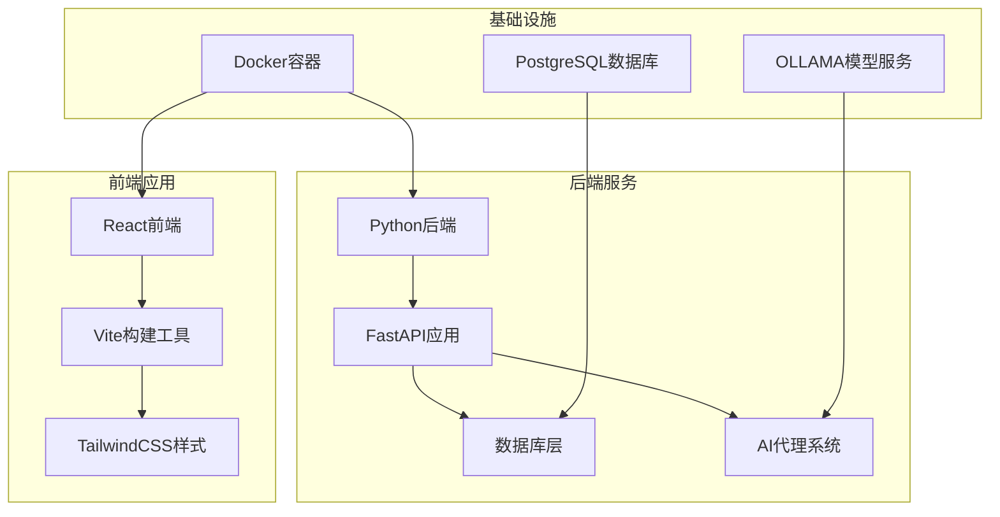
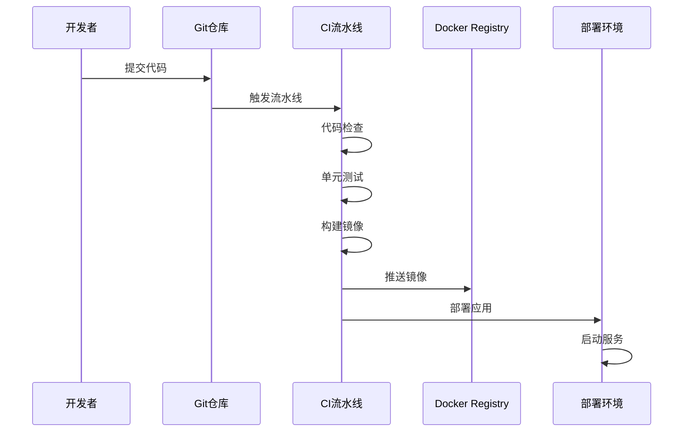
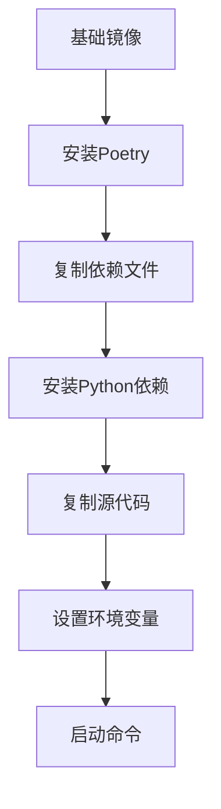
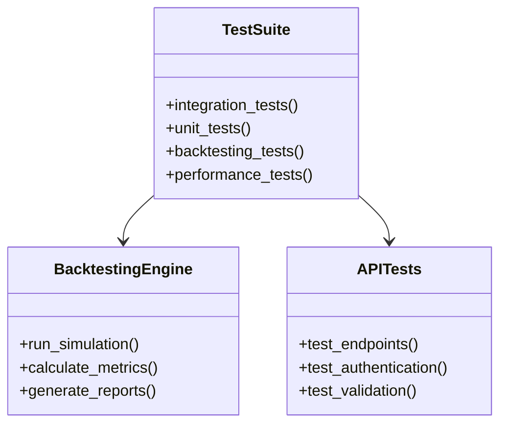
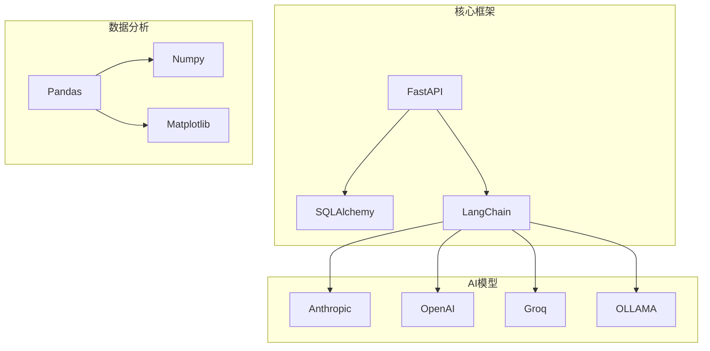
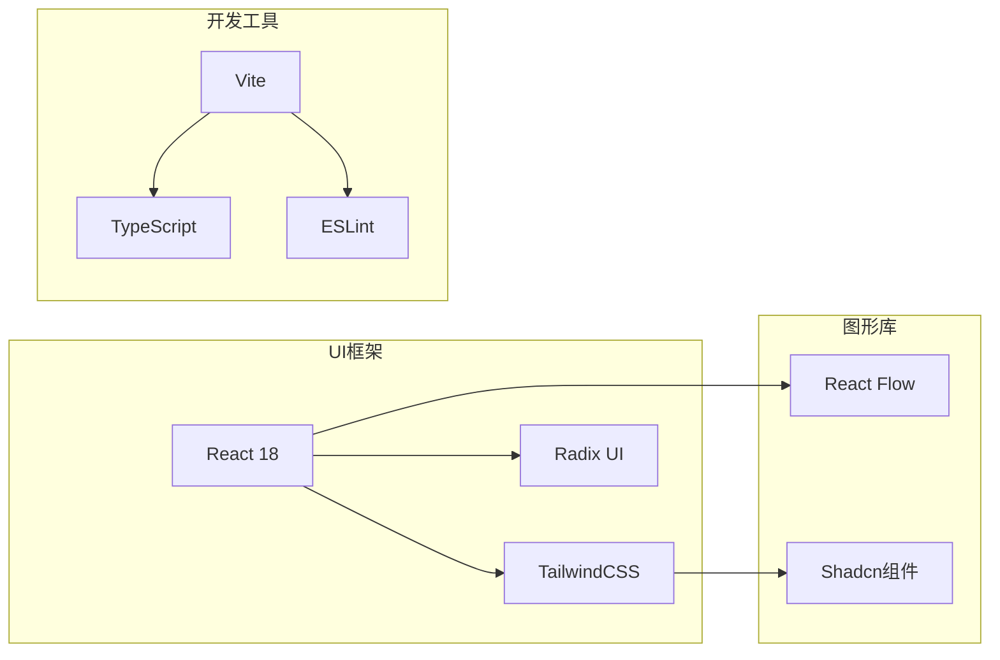

# CI/CD流水线

<cite>
**本文档引用的文件**
- [pyproject.toml](file://pyproject.toml)
- [poetry.lock](file://poetry.lock)
- [Dockerfile](file://docker/Dockerfile)
- [docker-compose.yml](file://docker/docker-compose.yml)
- [package.json](file://app/frontend/package.json)
- [pnpm-lock.yaml](file://app/frontend/pnpm-lock.yaml)
- [dependabot.yml](file://app/frontend/.github/dependabot.yml)
- [.eslintrc.cjs](file://app/frontend/.eslintrc.cjs)
- [alembic.ini](file://app/backend/alembic.ini)
</cite>

## 目录
1. [简介](#简介)
2. [项目结构](#项目结构)
3. [核心组件](#核心组件)
4. [架构概览](#架构概览)
5. [详细组件分析](#详细组件分析)
6. [依赖分析](#依赖分析)
7. [性能考虑](#性能考虑)
8. [故障排除指南](#故障排除指南)
9. [结论](#结论)
10. [附录](#附录)

## 简介

本项目是一个基于AI的量化对冲基金系统，采用Python后端和React前端技术栈。项目实现了完整的CI/CD流水线配置，包括自动化测试、依赖管理和容器化部署。

该系统的核心功能包括：
- 多代理AI决策系统
- 实时市场数据处理
- 回测引擎
- 组合投资管理
- 前端可视化界面

## 项目结构

项目采用模块化架构，主要分为以下几个核心部分：

**图表来源**
- [Dockerfile:1-23](file://docker/Dockerfile#L1-L23)
- [docker-compose.yml:1-95](file://docker/docker-compose.yml#L1-L95)

**章节来源**
- [pyproject.toml:1-62](file://pyproject.toml#L1-L62)
- [package.json:1-56](file://app/frontend/package.json#L1-L56)

## 核心组件

### 后端服务组件

后端采用FastAPI框架，提供了RESTful API接口，支持以下核心功能：

- **AI代理服务**：集成多个AI模型（Anthropic、OpenAI、Groq等）
- **数据处理**：实时市场数据获取和处理
- **回测引擎**：历史数据回测和性能评估
- **数据库管理**：使用SQLAlchemy进行数据持久化

### 前端组件

前端基于React 18和TypeScript，采用现代化开发工具链：

- **组件库**：Radix UI和Shadcn组件系统
- **状态管理**：自定义Hook和Context API
- **可视化**：React Flow图形化编辑器
- **样式系统**：TailwindCSS和CSS变量

### 数据库架构

项目使用PostgreSQL作为主数据库，通过Alembic进行数据库迁移管理：

- **核心表结构**：包含资金流、交易记录、AI模型配置等
- **迁移管理**：自动化的数据库版本控制
- **连接池**：优化数据库连接性能

**章节来源**
- [pyproject.toml:13-41](file://pyproject.toml#L13-L41)
- [alembic.ini](file://app/backend/alembic.ini)

## 架构概览

系统采用微服务架构，通过Docker容器化部署：

**图表来源**
- [Dockerfile:8-19](file://docker/Dockerfile#L8-L19)
- [docker-compose.yml:18-46](file://docker/docker-compose.yml#L18-L46)

## 详细组件分析

### Docker容器化配置

Dockerfile采用多阶段构建策略，优化镜像大小和构建效率：

**图表来源**
- [Dockerfile:1-23](file://docker/Dockerfile#L1-L23)

关键特性：
- 使用Python 3.11 Slim镜像减少体积
- Poetry配置为非虚拟环境模式
- 分层缓存优化构建速度

**章节来源**
- [Dockerfile:1-23](file://docker/Dockerfile#L1-L23)

### 依赖管理策略

项目采用双重依赖管理系统：

#### Python依赖管理
- **Poetry**：主要包管理工具，锁定精确版本
- **poetry.lock**：固定依赖版本，确保可重现构建
- **开发依赖**：代码格式化、静态分析工具

#### 前端依赖管理
- **pnpm**：快速包管理器，节省磁盘空间
- **package.json**：定义项目脚本和依赖
- **版本锁定**：确保团队开发一致性

**章节来源**
- [pyproject.toml:42-47](file://pyproject.toml#L42-L47)
- [package.json:5-10](file://app/frontend/package.json#L5-L10)

### 自动化测试配置

测试框架采用pytest，支持多种测试场景：

**图表来源**
- [pyproject.toml:43-44](file://pyproject.toml#L43-L44)

**章节来源**
- [pyproject.toml:43-44](file://pyproject.toml#L43-L44)

### 代码质量检查

实施多层次代码质量保证：

#### Python代码检查
- **Black**：代码格式化，统一编码风格
- **Flake8**：静态代码分析，发现潜在问题
- **isort**：导入语句排序，提高可读性

#### 前端代码检查
- **ESLint**：TypeScript和JavaScript静态分析
- **TypeScript编译**：类型检查和语法验证

**章节来源**
- [pyproject.toml:52-59](file://pyproject.toml#L52-L59)
- [.eslintrc.cjs](file://app/frontend/.eslintrc.cjs)

### 安全扫描配置

项目集成多种安全检查机制：

**图表来源**
- [dependabot.yml:1-12](file://app/frontend/.github/dependabot.yml#L1-L12)

**章节来源**
- [dependabot.yml:4-12](file://app/frontend/.github/dependabot.yml#L4-L12)

## 依赖分析

### Python依赖关系图

**图表来源**
- [pyproject.toml:13-41](file://pyproject.toml#L13-L41)

### 前端依赖关系

**图表来源**
- [package.json:11-35](file://app/frontend/package.json#L11-L35)

**章节来源**
- [poetry.lock:1-800](file://poetry.lock#L1-L800)
- [pnpm-lock.yaml:1-800](file://app/frontend/pnpm-lock.yaml#L1-L800)

## 性能考虑

### 构建性能优化

1. **分层缓存策略**
   - 优先复制依赖文件，利用Docker缓存
   - Poetry配置禁用虚拟环境，减少构建时间

2. **镜像优化**
   - 使用Slim基础镜像
   - 多阶段构建减少最终镜像大小

3. **并行执行**
   - Docker Compose支持服务并行启动
   - 测试套件并行执行优化

### 运行时性能

1. **数据库优化**
   - 连接池配置
   - 查询优化和索引策略

2. **AI模型性能**
   - 模型缓存机制
   - 批量处理优化

## 故障排除指南

### 常见构建问题

**依赖安装失败**
- 检查网络连接和代理设置
- 清理pip缓存和重新安装
- 验证Python版本兼容性

**Docker构建错误**
- 确认Dockerfile权限
- 检查上下文路径配置
- 验证镜像标签命名

### 运行时问题

**服务启动失败**
- 检查环境变量配置
- 验证端口占用情况
- 查看日志输出定位问题

**数据库连接问题**
- 确认连接字符串正确性
- 检查数据库服务状态
- 验证用户权限设置

**章节来源**
- [docker-compose.yml:26-29](file://docker/docker-compose.yml#L26-L29)

## 结论

本项目的CI/CD流水线设计体现了现代软件工程的最佳实践：

1. **完整的自动化流程**：从代码提交到生产部署的全流程自动化
2. **多语言支持**：同时支持Python和JavaScript生态系统的最佳实践
3. **容器化部署**：标准化的Docker容器化方案
4. **质量保证**：多层次的代码质量和安全检查机制
5. **可扩展性**：模块化架构支持功能扩展和性能优化

建议持续改进的方向：
- 集成更全面的性能监控
- 实施蓝绿部署策略
- 增强安全扫描覆盖范围
- 优化构建缓存策略

## 附录

### 部署配置要点

- **环境隔离**：开发、测试、生产环境分离
- **配置管理**：环境变量和配置文件分离
- **备份策略**：数据库和重要配置的定期备份
- **监控告警**：关键指标的监控和告警机制

### 维护建议

1. **定期更新**：保持依赖库和框架的最新版本
2. **安全审计**：定期进行安全漏洞扫描
3. **性能调优**：根据实际使用情况进行性能优化
4. **文档维护**：及时更新技术文档和操作手册