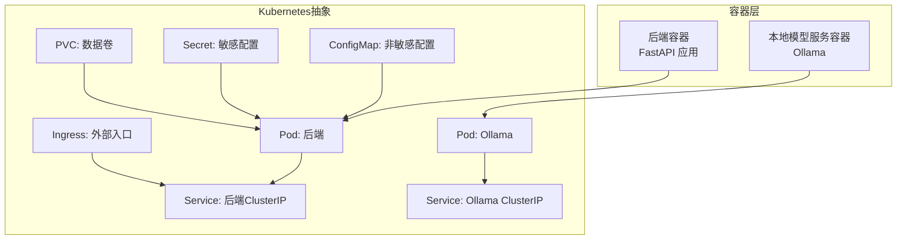
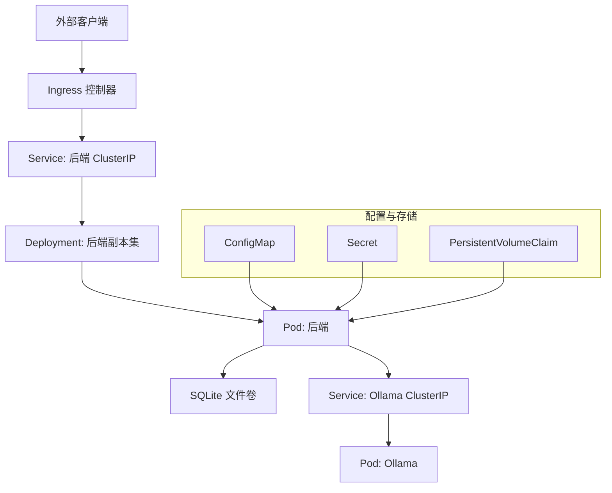
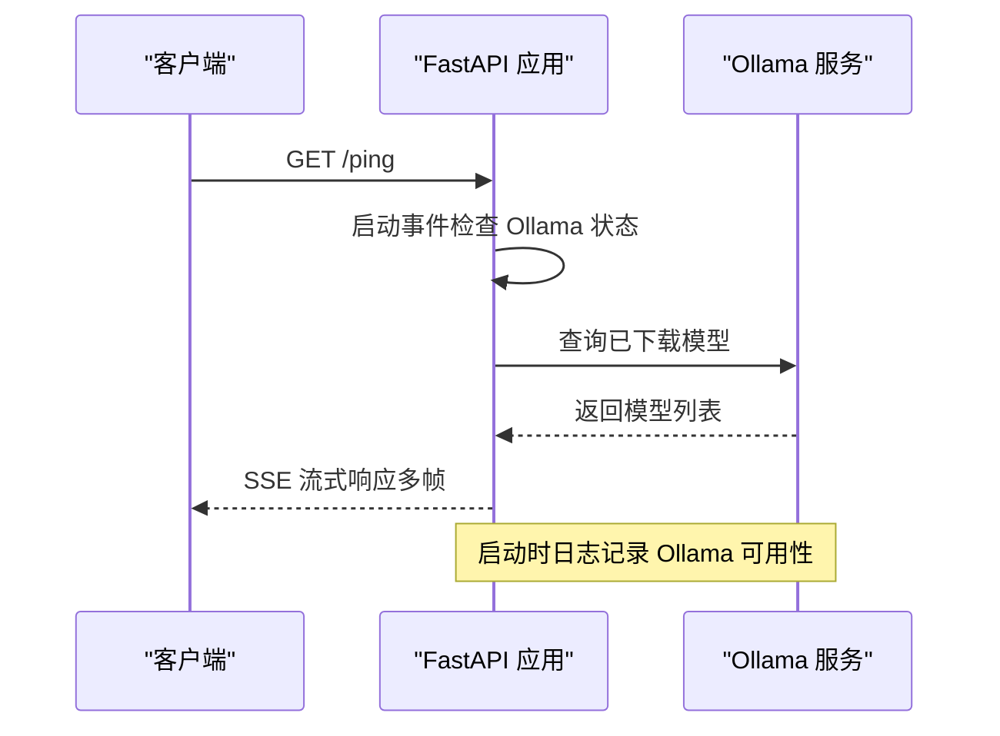
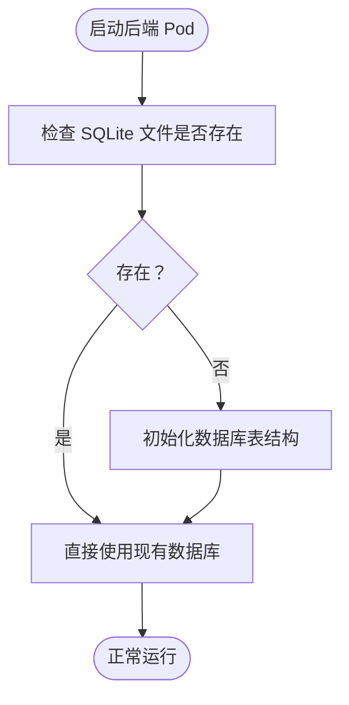
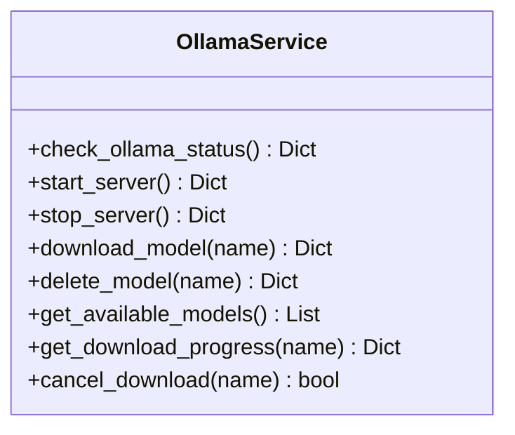
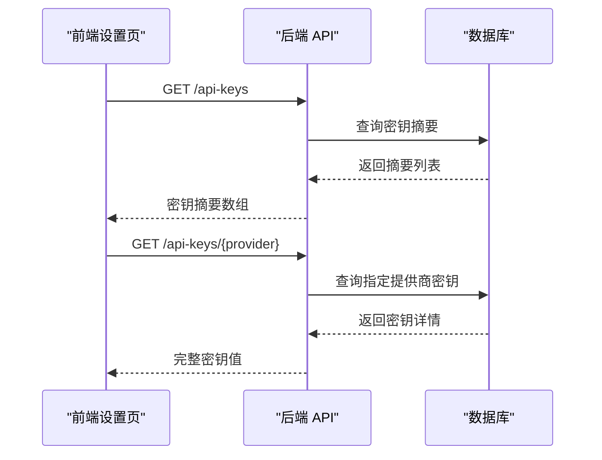
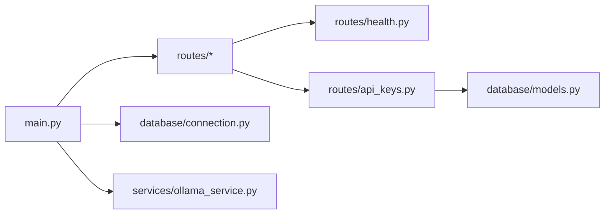

# Kubernetes部署

<cite>
**本文引用的文件**
- [docker-compose.yml](file://docker/docker-compose.yml)
- [Dockerfile](file://docker/Dockerfile)
- [README.md（容器）](file://docker/README.md)
- [main.py](file://app/backend/main.py)
- [health.py](file://app/backend/routes/health.py)
- [connection.py](file://app/backend/database/connection.py)
- [models.py](file://app/backend/database/models.py)
- [ollama_service.py](file://app/backend/services/ollama_service.py)
- [api_keys.py](file://app/backend/routes/api_keys.py)
- [api-keys.tsx](file://app/frontend/src/components/settings/api-keys.tsx)
</cite>

## 目录
1. [简介](#简介)
2. [项目结构](#项目结构)
3. [核心组件](#核心组件)
4. [架构总览](#架构总览)
5. [详细组件分析](#详细组件分析)
6. [依赖关系分析](#依赖关系分析)
7. [性能考量](#性能考量)
8. [故障排查指南](#故障排查指南)
9. [结论](#结论)
10. [附录](#附录)

## 简介
本指南面向在Kubernetes中部署“AI对冲基金”应用的工程团队，覆盖从Pod配置、Service与Ingress到Deployment滚动更新、副本管理与HPA自动扩缩容；同时涵盖ConfigMap与Secret管理、环境变量注入与敏感信息保护；持久化存储与PVC配置及数据备份策略；负载均衡、服务发现与网络策略；监控指标、健康检查与故障自愈；以及命名空间管理、资源配额与权限控制等生产级主题。文档以仓库现有后端FastAPI应用与本地Docker Compose为基础，结合Kubernetes最佳实践进行落地说明。

## 项目结构
该仓库包含后端Python应用（FastAPI）、前端React应用、以及基于Docker与Docker Compose的本地运行方式。Kubernetes部署可直接复用现有容器镜像与端口配置，并通过Kubernetes原生资源实现编排与弹性伸缩。

图示来源
- [docker-compose.yml:18-91](file://docker/docker-compose.yml#L18-L91)
- [main.py:15-31](file://app/backend/main.py#L15-L31)

章节来源
- [docker-compose.yml:1-95](file://docker/docker-compose.yml#L1-L95)
- [Dockerfile:1-23](file://docker/Dockerfile#L1-L23)
- [README.md（容器）:93-144](file://docker/README.md#L93-L144)

## 核心组件
- 后端服务（FastAPI）
  - 提供REST接口与SSE健康检查，支持CORS跨域访问。
  - 启动时检查Ollama可用性，便于集成本地大模型服务。
- 数据库（SQLite）
  - 使用SQLAlchemy与SQLite文件存储，路径为相对后端目录的本地文件。
- Ollama服务集成
  - 提供状态检查、模型下载进度流式返回、模型拉取与删除等能力。
- API密钥管理
  - 提供增删改查、批量更新、启用/禁用与最后使用时间更新等接口。
- 前端设置页
  - 支持加载与编辑各提供商的API密钥，调用后端接口获取完整密钥值。

章节来源
- [main.py:15-56](file://app/backend/main.py#L15-L56)
- [health.py:9-28](file://app/backend/routes/health.py#L9-L28)
- [connection.py:1-32](file://app/backend/database/connection.py#L1-L32)
- [models.py:6-115](file://app/backend/database/models.py#L6-L115)
- [ollama_service.py:34-151](file://app/backend/services/ollama_service.py#L34-L151)
- [api_keys.py:19-201](file://app/backend/routes/api_keys.py#L19-L201)
- [api-keys.tsx:96-120](file://app/frontend/src/components/settings/api-keys.tsx#L96-L120)

## 架构总览
下图展示Kubernetes部署下的典型拓扑：Ingress作为统一入口，将流量分发至后端Service；后端Pod依赖内部Ollama服务与SQLite数据库；敏感配置通过Secret注入，非敏感配置通过ConfigMap管理；持久化通过PVC挂载到后端Pod。

图示来源
- [docker-compose.yml:18-91](file://docker/docker-compose.yml#L18-L91)
- [main.py:15-31](file://app/backend/main.py#L15-L31)

## 详细组件分析

### 后端服务（FastAPI）与健康检查
- 路由设计
  - 根路径返回欢迎信息。
  - /ping提供SSE流，用于健康探活与前端心跳。
- CORS配置
  - 允许特定前端地址访问，便于开发调试。
- 启动事件
  - 检测Ollama安装与运行状态，记录可用模型列表。

图示来源
- [health.py:14-27](file://app/backend/routes/health.py#L14-L27)
- [main.py:32-56](file://app/backend/main.py#L32-L56)
- [ollama_service.py:34-51](file://app/backend/services/ollama_service.py#L34-L51)

章节来源
- [health.py:9-28](file://app/backend/routes/health.py#L9-L28)
- [main.py:20-27](file://app/backend/main.py#L20-L27)
- [main.py:32-56](file://app/backend/main.py#L32-L56)

### 数据库与持久化
- 数据库类型与连接
  - 使用SQLite，通过SQLAlchemy连接，路径为后端目录下的本地文件。
- 持久化建议
  - 在Kubernetes中使用PVC挂载共享存储，确保多副本后端可共享数据库文件。
  - 对于生产环境，建议迁移到PostgreSQL或MySQL以获得更好的并发与可靠性。

图示来源
- [connection.py:8-24](file://app/backend/database/connection.py#L8-L24)
- [main.py:17-18](file://app/backend/main.py#L17-L18)

章节来源
- [connection.py:1-32](file://app/backend/database/connection.py#L1-L32)
- [models.py:6-115](file://app/backend/database/models.py#L6-L115)
- [main.py:17-18](file://app/backend/main.py#L17-L18)

### Ollama服务集成
- 功能点
  - 检查安装与运行状态、拉起/停止服务、模型下载与删除、进度流式返回。
- 适用场景
  - 在Kubernetes中可将Ollama作为独立Pod与Service，后端通过Service名称访问。
  - 通过Ingress暴露Ollama或在后端Pod内直接访问，取决于部署策略。

图示来源
- [ollama_service.py:19-519](file://app/backend/services/ollama_service.py#L19-L519)

章节来源
- [ollama_service.py:34-151](file://app/backend/services/ollama_service.py#L34-L151)
- [docker-compose.yml:2-16](file://docker/docker-compose.yml#L2-L16)

### API密钥管理与前端交互
- 后端接口
  - 创建/更新、查询、按提供商获取、更新、删除、批量更新、停用、更新最后使用时间。
- 前端交互
  - 组件加载密钥摘要，再逐个请求完整密钥值，支持即时编辑与保存。

图示来源
- [api_keys.py:42-78](file://app/backend/routes/api_keys.py#L42-L78)
- [api-keys.tsx:96-120](file://app/frontend/src/components/settings/api-keys.tsx#L96-L120)

章节来源
- [api_keys.py:19-201](file://app/backend/routes/api_keys.py#L19-L201)
- [api-keys.tsx:96-120](file://app/frontend/src/components/settings/api-keys.tsx#L96-L120)

## 依赖关系分析
- 组件耦合
  - 后端依赖数据库连接模块与模型定义；Ollama服务封装在独立类中，便于测试与替换。
  - 健康检查路由与CORS中间件属于基础设施层，被主应用直接依赖。
- 外部依赖
  - Ollama服务可通过本地Docker Compose或Kubernetes Service访问。
  - 前端通过后端接口访问密钥管理功能。

图示来源
- [main.py:15-31](file://app/backend/main.py#L15-L31)
- [health.py:1-28](file://app/backend/routes/health.py#L1-L28)
- [api_keys.py:1-201](file://app/backend/routes/api_keys.py#L1-L201)
- [connection.py:1-32](file://app/backend/database/connection.py#L1-L32)
- [models.py:1-115](file://app/backend/database/models.py#L1-L115)
- [ollama_service.py:19-519](file://app/backend/services/ollama_service.py#L19-L519)

章节来源
- [main.py:15-31](file://app/backend/main.py#L15-L31)
- [health.py:1-28](file://app/backend/routes/health.py#L1-L28)
- [api_keys.py:1-201](file://app/backend/routes/api_keys.py#L1-L201)
- [connection.py:1-32](file://app/backend/database/connection.py#L1-L32)
- [models.py:1-115](file://app/backend/database/models.py#L1-L115)
- [ollama_service.py:19-519](file://app/backend/services/ollama_service.py#L19-L519)

## 性能考量
- 连接池与并发
  - SQLite在单文件模式下并发受限，建议在生产使用PostgreSQL/MySQL并配置连接池。
- 模型服务
  - Ollama模型下载与推理会占用CPU/GPU，建议为后端与Ollama分别设置资源限制与HPA。
- 健康检查
  - /ping使用SSE，适合前端心跳；后端应提供轻量级就绪/存活探针以配合K8s自愈。
- 存储I/O
  - SQLite写入频繁时建议使用SSD或高性能持久卷，并开启合适的读写缓存策略。

## 故障排查指南
- 健康检查失败
  - 检查后端SSE路由是否可达；确认CORS允许范围；观察启动日志中Ollama状态提示。
- Ollama不可用
  - 确认Ollama Pod已就绪；检查Service名称与端口；验证后端环境变量中的Ollama地址。
- 数据库异常
  - 检查PVC挂载与权限；确认数据库文件存在且可读写；必要时重建数据库表。
- 密钥管理问题
  - 前端加载失败时，检查后端接口返回；确认数据库中密钥记录存在且未被禁用。

章节来源
- [health.py:14-27](file://app/backend/routes/health.py#L14-L27)
- [main.py:32-56](file://app/backend/main.py#L32-L56)
- [connection.py:8-24](file://app/backend/database/connection.py#L8-L24)
- [api_keys.py:67-78](file://app/backend/routes/api_keys.py#L67-L78)

## 结论
本指南基于现有后端应用与Docker Compose配置，给出了在Kubernetes中部署的系统化方案。通过合理的Pod与Service设计、HPA弹性伸缩、ConfigMap/Secret安全注入、PVC持久化与Ingress路由，可构建高可用、可观测、可扩展的生产级平台。建议在生产环境中逐步替换SQLite为云数据库、引入Prometheus/Grafana监控、完善网络策略与RBAC权限控制。

## 附录

### 部署清单要点（概念性）
- 命名空间与资源配额
  - 为不同环境创建独立命名空间；设置LimitRange与ResourceQuota约束。
- 配置管理
  - 使用ConfigMap存放非敏感配置；使用Secret存放API密钥等敏感信息。
- 存储与备份
  - PVC绑定持久卷；定期快照或导出数据库备份；确保多副本共享存储一致性。
- 网络与安全
  - Service使用ClusterIP；Ingress暴露HTTP/HTTPS；配置NetworkPolicy限制入站/出站。
- 可观测性
  - 配置存活/就绪探针；收集应用日志与指标；设置告警规则。
- 自动化
  - 使用Deployment管理副本；HPA根据CPU/内存或自定义指标扩缩容；滚动更新策略合理设置最大不可用与最大额外实例数。

### 生产环境最佳实践
- 镜像与命令
  - 基于精简基础镜像构建；设置工作目录与PYTHONPATH；容器入口命令由K8s管理而非默认CMD。
- 端口与服务
  - 后端监听0.0.0.0；Service暴露所需端口；Ingress配置TLS与重写规则。
- 安全
  - 最小权限原则；Secret只在内存中使用；避免在镜像中硬编码密钥。
- 可靠性
  - 设置重启策略与优雅退出；配置探针与健康检查；启用PodDisruptionBudget保障可用性。