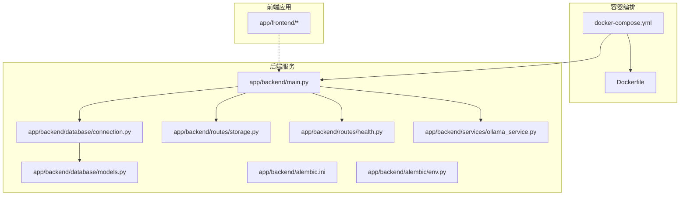
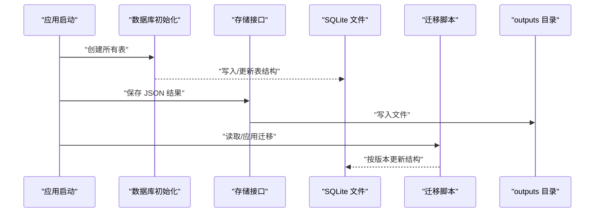
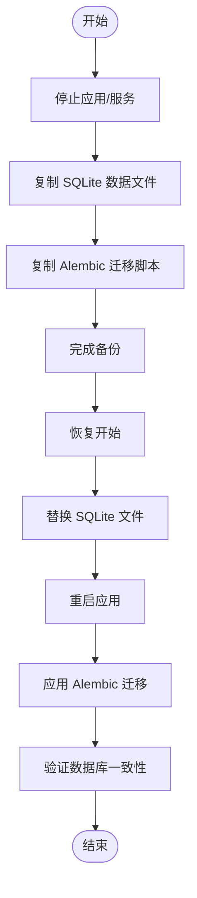
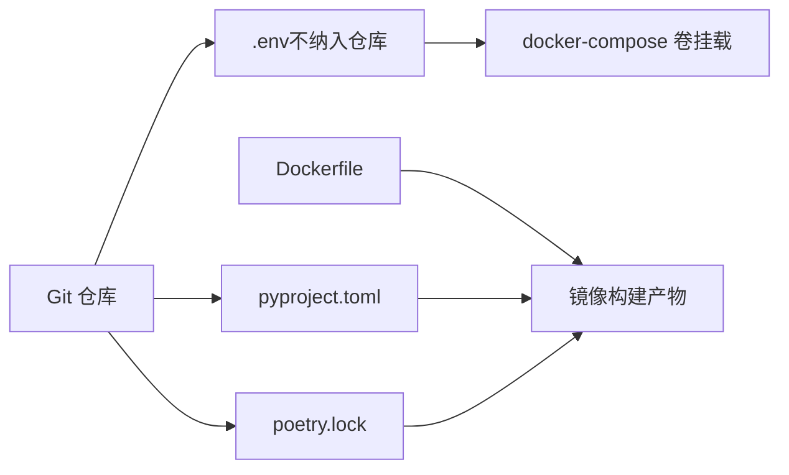
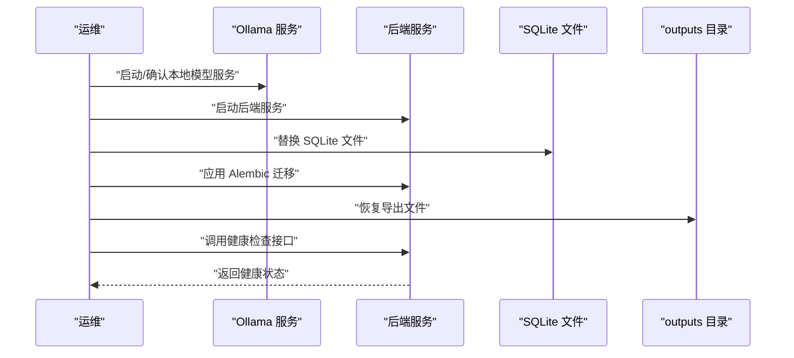
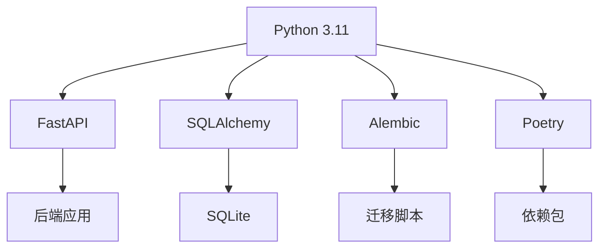

# 备份与灾难恢复

<cite>
**本文引用的文件**
- [README.md](file://README.md)
- [pyproject.toml](file://pyproject.toml)
- [poetry.lock](file://poetry.lock)
- [docker/Dockerfile](file://docker/Dockerfile)
- [docker/docker-compose.yml](file://docker/docker-compose.yml)
- [app/backend/main.py](file://app/backend/main.py)
- [app/backend/database/connection.py](file://app/backend/database/connection.py)
- [app/backend/database/models.py](file://app/backend/database/models.py)
- [app/backend/alembic.ini](file://app/backend/alembic.ini)
- [app/backend/alembic/env.py](file://app/backend/alembic/env.py)
- [app/backend/routes/storage.py](file://app/backend/routes/storage.py)
- [app/backend/routes/health.py](file://app/backend/routes/health.py)
- [app/backend/services/ollama_service.py](file://app/backend/services/ollama_service.py)
</cite>

## 目录
1. [简介](#简介)
2. [项目结构](#项目结构)
3. [核心组件](#核心组件)
4. [架构总览](#架构总览)
5. [详细组件分析](#详细组件分析)
6. [依赖分析](#依赖分析)
7. [性能考量](#性能考量)
8. [故障排查指南](#故障排查指南)
9. [结论](#结论)
10. [附录](#附录)

## 简介
本策略文档面向“AI对冲基金”项目，围绕数据备份、系统快照与应用恢复制定可执行的备份与灾难恢复方案。重点覆盖：
- 数据库备份策略：SQLite 文件级备份、Alembic 迁移脚本与元数据保护
- 增量与全量备份配置建议
- 配置文件与代码版本管理、依赖包备份
- 恢复测试、RTO/RPO 目标与恢复时间估算
- 多地域备份、异地容灾与高可用架构设计
- 备份验证、完整性检查与恢复演练流程
- 业务连续性计划、紧急响应与沟通机制
- 备份自动化、监控告警与成本优化策略

## 项目结构
项目采用前后端分离与容器化部署方式，后端使用 FastAPI + SQLAlchemy + Alembic，前端为 React/Vite 应用，通过 Docker Compose 编排运行。数据库采用 SQLite 文件存储于后端目录中。

图表来源
- [docker/docker-compose.yml:1-95](file://docker/docker-compose.yml#L1-L95)
- [docker/Dockerfile:1-23](file://docker/Dockerfile#L1-L23)
- [app/backend/main.py:1-56](file://app/backend/main.py#L1-L56)
- [app/backend/database/connection.py:1-32](file://app/backend/database/connection.py#L1-L32)
- [app/backend/database/models.py:1-115](file://app/backend/database/models.py#L1-L115)
- [app/backend/alembic.ini:1-120](file://app/backend/alembic.ini#L1-L120)
- [app/backend/alembic/env.py:1-78](file://app/backend/alembic/env.py#L1-L78)
- [app/backend/routes/storage.py:1-44](file://app/backend/routes/storage.py#L1-L44)
- [app/backend/routes/health.py:1-28](file://app/backend/routes/health.py#L1-L28)
- [app/backend/services/ollama_service.py:1-519](file://app/backend/services/ollama_service.py#L1-L519)

章节来源
- [README.md:1-158](file://README.md#L1-L158)
- [docker/docker-compose.yml:1-95](file://docker/docker-compose.yml#L1-L95)
- [docker/Dockerfile:1-23](file://docker/Dockerfile#L1-L23)
- [app/backend/main.py:1-56](file://app/backend/main.py#L1-L56)

## 核心组件
- 数据库层：SQLite 文件位于后端目录，由 SQLAlchemy 引擎连接；Alembic 负责迁移脚本与版本控制。
- 应用层：FastAPI 提供 REST 接口，包含健康检查、JSON 文件持久化接口等。
- 存储层：后端提供将 JSON 数据写入项目根目录 outputs 的接口，便于导出运行结果。
- 本地模型：Ollama 服务用于本地大模型推理，支持下载、删除与进度流式输出。
- 容器化：Dockerfile 与 docker-compose.yml 统一构建与编排，卷挂载用于持久化与配置注入。

章节来源
- [app/backend/database/connection.py:1-32](file://app/backend/database/connection.py#L1-L32)
- [app/backend/database/models.py:1-115](file://app/backend/database/models.py#L1-L115)
- [app/backend/alembic.ini:1-120](file://app/backend/alembic.ini#L1-L120)
- [app/backend/alembic/env.py:1-78](file://app/backend/alembic/env.py#L1-L78)
- [app/backend/routes/storage.py:1-44](file://app/backend/routes/storage.py#L1-L44)
- [app/backend/routes/health.py:1-28](file://app/backend/routes/health.py#L1-L28)
- [app/backend/services/ollama_service.py:1-519](file://app/backend/services/ollama_service.py#L1-L519)
- [docker/docker-compose.yml:1-95](file://docker/docker-compose.yml#L1-L95)
- [docker/Dockerfile:1-23](file://docker/Dockerfile#L1-L23)

## 架构总览
下图展示备份与恢复涉及的关键路径：应用启动时初始化数据库表、运行期间产生的 JSON 输出、SQLite 数据文件以及 Alembic 迁移脚本。

图表来源
- [app/backend/main.py:15-18](file://app/backend/main.py#L15-L18)
- [app/backend/routes/storage.py:22-41](file://app/backend/routes/storage.py#L22-L41)
- [app/backend/database/connection.py:12-18](file://app/backend/database/connection.py#L12-L18)
- [app/backend/alembic.ini:66-66](file://app/backend/alembic.ini#L66-L66)

## 详细组件分析

### 数据库备份策略（SQLite）
- 当前实现：SQLite 数据库存储在后端目录的本地文件中，连接字符串直接指向该文件。
- 备份建议：
  - 全量备份：停止服务后复制 SQLite 文件；或在只读模式下进行一致性快照（需确保无写入）。
  - 增量备份：基于 WAL/回滚日志的增量（若启用 WAL），但本项目未显式开启 WAL；可考虑定期全量备份并结合应用日志追踪变更窗口。
  - 迁移脚本保护：Alembic 版本目录与脚本必须纳入备份范围，确保可回溯到任意历史版本。
- 恢复流程：
  - 将备份的 SQLite 文件替换当前文件，重启服务后 Alembic 自动应用迁移脚本以达到目标版本。
  - 若迁移失败，回退到上一个已知可用的迁移版本。

图表来源
- [app/backend/database/connection.py:9-12](file://app/backend/database/connection.py#L9-L12)
- [app/backend/alembic.ini:66-66](file://app/backend/alembic.ini#L66-L66)
- [app/backend/alembic/env.py:28-77](file://app/backend/alembic/env.py#L28-L77)

章节来源
- [app/backend/database/connection.py:1-32](file://app/backend/database/connection.py#L1-L32)
- [app/backend/database/models.py:1-115](file://app/backend/database/models.py#L1-L115)
- [app/backend/alembic.ini:1-120](file://app/backend/alembic.ini#L1-L120)
- [app/backend/alembic/env.py:1-78](file://app/backend/alembic/env.py#L1-L78)

### 配置文件与代码版本管理
- 配置文件：.env 通过卷挂载注入容器，应纳入版本控制外的备份策略；同时保留 .env.example 作为模板。
- 代码版本：仓库本身即版本控制；建议将关键配置文件与依赖清单纳入备份范围。
- 依赖包备份：
  - 使用 Poetry 管理依赖，锁定文件与依赖清单需纳入备份。
  - Dockerfile 中安装 Poetry 并使用锁定文件进行安装，确保镜像可重复构建。

图表来源
- [README.md:67-82](file://README.md#L67-L82)
- [pyproject.toml:1-62](file://pyproject.toml#L1-L62)
- [poetry.lock:143-187](file://poetry.lock#L143-L187)
- [docker/Dockerfile:8-16](file://docker/Dockerfile#L8-L16)
- [docker/docker-compose.yml:23-24](file://docker/docker-compose.yml#L23-L24)

章节来源
- [README.md:65-82](file://README.md#L65-L82)
- [pyproject.toml:1-62](file://pyproject.toml#L1-L62)
- [poetry.lock:143-187](file://poetry.lock#L143-L187)
- [docker/Dockerfile:1-23](file://docker/Dockerfile#L1-L23)
- [docker/docker-compose.yml:1-95](file://docker/docker-compose.yml#L1-L95)

### 应用恢复流程（JSON 输出与健康检查）
- JSON 输出：后端提供保存 JSON 到 outputs 目录的接口，可用于导出运行结果与中间状态。
- 健康检查：提供简单健康检查接口，可用于恢复后的可用性验证。
- 恢复顺序建议：
  - 启动依赖服务（如 Ollama，若使用本地模型）
  - 启动后端服务
  - 恢复数据库（替换 SQLite 文件并应用 Alembic 迁移）
  - 恢复 outputs 目录中的导出文件
  - 执行健康检查与功能自检

图表来源
- [app/backend/routes/storage.py:22-41](file://app/backend/routes/storage.py#L22-L41)
- [app/backend/routes/health.py:14-27](file://app/backend/routes/health.py#L14-L27)
- [app/backend/services/ollama_service.py:57-79](file://app/backend/services/ollama_service.py#L57-L79)
- [app/backend/database/connection.py:12-18](file://app/backend/database/connection.py#L12-L18)

章节来源
- [app/backend/routes/storage.py:1-44](file://app/backend/routes/storage.py#L1-L44)
- [app/backend/routes/health.py:1-28](file://app/backend/routes/health.py#L1-L28)
- [app/backend/services/ollama_service.py:1-519](file://app/backend/services/ollama_service.py#L1-L519)

### 多地域备份、异地容灾与高可用设计
- 多地域备份：将 SQLite 文件与 Alembic 迁移脚本上传至对象存储（如 S3/GCS），按区域分桶存放，定期同步。
- 异地容灾：在不同可用区/区域部署相同的服务副本，使用共享存储或对象存储作为统一数据源，实现跨区域快速切换。
- 高可用：通过容器编排的健康检查与自动重启策略，结合外部负载均衡与数据库主从/集群（若迁移到关系型数据库）提升可用性。

[本节为概念性设计，不直接分析具体文件，故无章节来源]

### 恢复测试、RTO/RPO 目标与恢复时间估算
- RTO/RPO 目标：根据业务影响设定目标（例如 RTO=2 小时，RPO=15 分钟）。
- 恢复测试：定期进行“备份-恢复-验证”演练，覆盖数据库、配置文件、依赖包与导出文件。
- 恢复时间估算：依据备份类型与数据量估算恢复时间，并结合演练结果持续优化。

[本节为通用实践指导，不直接分析具体文件，故无章节来源]

### 备份验证、完整性检查与恢复演练流程
- 备份验证：校验 SQLite 文件完整性与 Alembic 迁移脚本一致性；对 outputs 导出文件进行抽样比对。
- 完整性检查：恢复后执行健康检查、关键接口调用与数据查询，确保业务功能正常。
- 演练流程：制定标准化演练脚本，记录执行步骤、耗时与问题，形成复盘报告。

[本节为通用实践指导，不直接分析具体文件，故无章节来源]

### 业务连续性计划、紧急响应与沟通机制
- BC计划：明确关键系统与数据的恢复优先级，定义触发条件与责任分工。
- 紧急响应：建立应急小组、联系人清单与处置流程，确保事件发生时快速响应。
- 沟通机制：设定内部与外部沟通渠道，规范信息发布与升级流程。

[本节为通用实践指导，不直接分析具体文件，故无章节来源]

### 备份自动化、监控告警与成本优化策略
- 自动化：通过定时任务或 CI/CD 触发备份作业，自动上传至对象存储并生成校验摘要。
- 监控告警：监控备份成功率、延迟与存储容量，异常时发送告警。
- 成本优化：采用压缩、去重与生命周期策略，按数据重要性选择存储层级，减少长期归档成本。

[本节为通用实践指导，不直接分析具体文件，故无章节来源]

## 依赖分析
- 语言与框架：Python 3.11、FastAPI、SQLAlchemy、Alembic、Poetry。
- 本地模型：Ollama 客户端集成，支持模型下载、删除与进度流式输出。
- 容器化：Dockerfile 使用 Poetry 安装依赖，docker-compose 编排服务与卷挂载。

图表来源
- [pyproject.toml:13-41](file://pyproject.toml#L13-L41)
- [docker/Dockerfile:8-16](file://docker/Dockerfile#L8-L16)
- [app/backend/services/ollama_service.py:1-519](file://app/backend/services/ollama_service.py#L1-L519)

章节来源
- [pyproject.toml:1-62](file://pyproject.toml#L1-L62)
- [docker/Dockerfile:1-23](file://docker/Dockerfile#L1-L23)
- [app/backend/services/ollama_service.py:1-519](file://app/backend/services/ollama_service.py#L1-L519)

## 性能考量
- SQLite 写入性能：在高并发场景建议迁移到关系型数据库并启用 WAL/主从架构。
- 备份性能：对大文件进行分块传输与断点续传，避免长时间锁表。
- 恢复性能：优先恢复关键数据与服务，再逐步恢复非关键模块。

[本节为通用指导，不直接分析具体文件，故无章节来源]

## 故障排查指南
- 数据库无法启动：检查 SQLite 文件是否存在且可读写；确认 Alembic 迁移是否成功。
- 健康检查失败：确认后端服务已启动并监听端口；查看日志输出。
- JSON 导出失败：确认 outputs 目录权限与磁盘空间；检查请求参数与接口返回错误。

章节来源
- [app/backend/routes/health.py:14-27](file://app/backend/routes/health.py#L14-L27)
- [app/backend/routes/storage.py:22-44](file://app/backend/routes/storage.py#L22-L44)
- [app/backend/main.py:32-56](file://app/backend/main.py#L32-L56)

## 结论
本策略文档基于现有代码库现状，提出了针对 SQLite 数据库、配置文件、依赖包与导出文件的备份与恢复方案，并补充了多地域备份、容灾与高可用设计建议。建议尽快引入对象存储与自动化工具链，完善恢复测试与监控告警体系，以满足业务连续性要求。

## 附录
- 关键文件路径参考：
  - 数据库连接与模型：[app/backend/database/connection.py:1-32](file://app/backend/database/connection.py#L1-L32)、[app/backend/database/models.py:1-115](file://app/backend/database/models.py#L1-L115)
  - 迁移配置：[app/backend/alembic.ini:1-120](file://app/backend/alembic.ini#L1-L120)、[app/backend/alembic/env.py:1-78](file://app/backend/alembic/env.py#L1-L78)
  - 应用入口与路由：[app/backend/main.py:1-56](file://app/backend/main.py#L1-L56)、[app/backend/routes/storage.py:1-44](file://app/backend/routes/storage.py#L1-L44)、[app/backend/routes/health.py:1-28](file://app/backend/routes/health.py#L1-L28)
  - 本地模型服务：[app/backend/services/ollama_service.py:1-519](file://app/backend/services/ollama_service.py#L1-L519)
  - 容器化配置：[docker/Dockerfile:1-23](file://docker/Dockerfile#L1-L23)、[docker/docker-compose.yml:1-95](file://docker/docker-compose.yml#L1-L95)
  - 依赖与版本：[pyproject.toml:1-62](file://pyproject.toml#L1-L62)、[poetry.lock:143-187](file://poetry.lock#L143-L187)