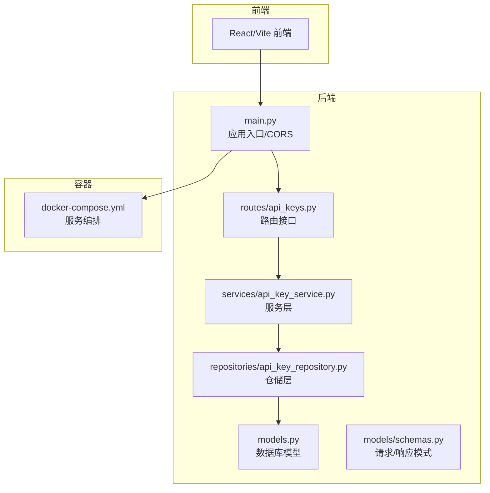
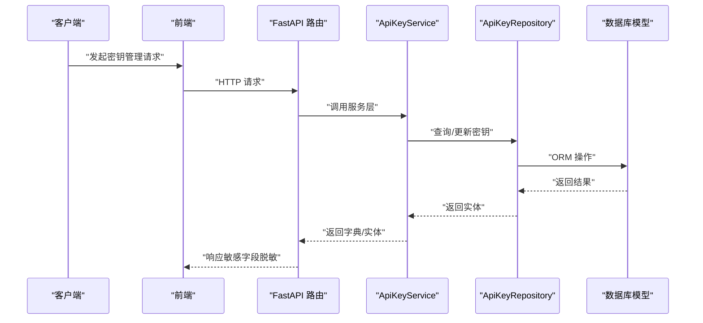
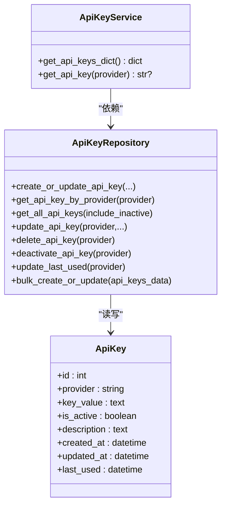
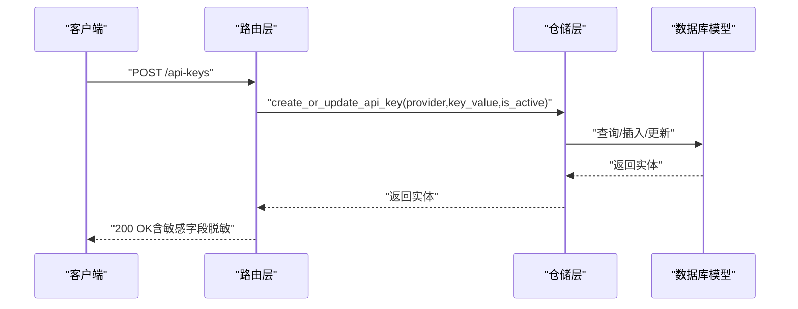
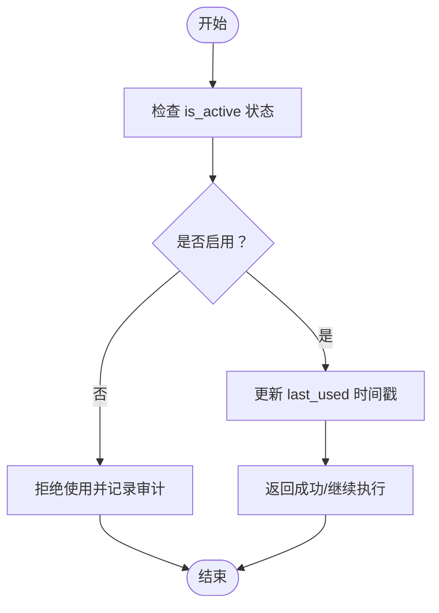

# 安全合规

<cite>
**本文引用的文件**
- [app/backend/database/models.py](file://app/backend/database/models.py)
- [app/backend/repositories/api_key_repository.py](file://app/backend/repositories/api_key_repository.py)
- [app/backend/services/api_key_service.py](file://app/backend/services/api_key_service.py)
- [app/backend/routes/api_keys.py](file://app/backend/routes/api_keys.py)
- [app/backend/models/schemas.py](file://app/backend/models/schemas.py)
- [src/utils/api_key.py](file://src/utils/api_key.py)
- [app/backend/main.py](file://app/backend/main.py)
- [docker/docker-compose.yml](file://docker/docker-compose.yml)
</cite>

## 目录
1. [引言](#引言)
2. [项目结构](#项目结构)
3. [核心组件](#核心组件)
4. [架构总览](#架构总览)
5. [详细组件分析](#详细组件分析)
6. [依赖分析](#依赖分析)
7. [性能考虑](#性能考虑)
8. [故障排查指南](#故障排查指南)
9. [结论](#结论)
10. [附录](#附录)

## 引言
本文件面向“安全合规”的全面实施方案，结合代码库中已实现的API密钥管理能力，系统化阐述密钥管理、访问控制、数据加密策略、身份认证与授权、会话管理、网络安全、防火墙与入侵检测、数据脱敏与隐私保护、合规性检查、安全审计与漏洞扫描、渗透测试、密钥轮换与证书管理、安全补丁更新、业务连续性与灾难恢复、数据备份、安全培训与意识提升以及事件响应流程等主题。文档在技术深度与可操作性之间取得平衡，既适合技术人员深入理解实现细节，也便于非技术读者把握整体安全策略。

## 项目结构
后端采用FastAPI框架，数据库使用SQLAlchemy模型定义；前端为React/Vite应用；容器编排通过Docker Compose实现。与安全合规直接相关的模块集中在后端的API密钥管理子系统（模型、仓储、服务、路由、请求/响应模式），以及启动与CORS配置。

图表来源
- [app/backend/database/models.py:1-115](file://app/backend/database/models.py#L1-L115)
- [app/backend/repositories/api_key_repository.py:1-131](file://app/backend/repositories/api_key_repository.py#L1-L131)
- [app/backend/services/api_key_service.py:1-23](file://app/backend/services/api_key_service.py#L1-L23)
- [app/backend/routes/api_keys.py:1-201](file://app/backend/routes/api_keys.py#L1-L201)
- [app/backend/models/schemas.py:1-292](file://app/backend/models/schemas.py#L1-L292)
- [app/backend/main.py:1-56](file://app/backend/main.py#L1-L56)
- [docker/docker-compose.yml:1-95](file://docker/docker-compose.yml#L1-L95)

章节来源
- [app/backend/main.py:1-56](file://app/backend/main.py#L1-L56)
- [docker/docker-compose.yml:1-95](file://docker/docker-compose.yml#L1-L95)

## 核心组件
- 数据库模型：定义了API密钥表结构，包含提供方标识、密钥值、启用状态、描述、最后使用时间等字段，并具备时间戳自动维护能力。
- 仓储层：封装数据库读写操作，支持创建/更新、查询、批量更新、停用、删除、更新最后使用时间等。
- 服务层：对外暴露加载全部活跃密钥字典与按提供方获取单个密钥的服务方法。
- 路由层：提供REST接口用于创建/更新、列出、查询、更新、删除、停用、批量更新、更新最后使用时间等。
- 请求/响应模式：定义了密钥创建、更新、响应、摘要等数据结构，确保敏感信息不被泄露（如列表接口不返回真实密钥值）。
- 应用入口：配置CORS白名单，便于前端本地开发环境访问。

章节来源
- [app/backend/database/models.py:97-115](file://app/backend/database/models.py#L97-L115)
- [app/backend/repositories/api_key_repository.py:9-131](file://app/backend/repositories/api_key_repository.py#L9-L131)
- [app/backend/services/api_key_service.py:6-23](file://app/backend/services/api_key_service.py#L6-L23)
- [app/backend/routes/api_keys.py:19-201](file://app/backend/routes/api_keys.py#L19-L201)
- [app/backend/models/schemas.py:243-292](file://app/backend/models/schemas.py#L243-L292)
- [app/backend/main.py:20-27](file://app/backend/main.py#L20-L27)

## 架构总览
下图展示了从客户端到数据库的密钥管理调用链路，以及关键安全控制点（CORS、响应脱敏、仓储隔离）。

图表来源
- [app/backend/routes/api_keys.py:19-201](file://app/backend/routes/api_keys.py#L19-L201)
- [app/backend/services/api_key_service.py:12-23](file://app/backend/services/api_key_service.py#L12-L23)
- [app/backend/repositories/api_key_repository.py:15-131](file://app/backend/repositories/api_key_repository.py#L15-L131)
- [app/backend/database/models.py:97-115](file://app/backend/database/models.py#L97-L115)

## 详细组件分析

### 组件A：API密钥管理子系统
该子系统围绕密钥的生命周期展开，包括创建/更新、查询、停用、删除、批量更新、记录最后使用时间等。服务层负责将数据库实体转换为对外可用的数据结构，路由层负责输入校验与错误处理，仓储层负责数据持久化。

图表来源
- [app/backend/database/models.py:97-115](file://app/backend/database/models.py#L97-L115)
- [app/backend/repositories/api_key_repository.py:9-131](file://app/backend/repositories/api_key_repository.py#L9-L131)
- [app/backend/services/api_key_service.py:6-23](file://app/backend/services/api_key_service.py#L6-L23)

章节来源
- [app/backend/database/models.py:97-115](file://app/backend/database/models.py#L97-L115)
- [app/backend/repositories/api_key_repository.py:9-131](file://app/backend/repositories/api_key_repository.py#L9-L131)
- [app/backend/services/api_key_service.py:6-23](file://app/backend/services/api_key_service.py#L6-L23)

### 组件B：密钥管理API工作流
以下序列图展示典型“创建或更新密钥”流程，体现输入验证、仓储操作与异常处理。

图表来源
- [app/backend/routes/api_keys.py:27-39](file://app/backend/routes/api_keys.py#L27-L39)
- [app/backend/repositories/api_key_repository.py:15-46](file://app/backend/repositories/api_key_repository.py#L15-L46)
- [app/backend/models/schemas.py:243-272](file://app/backend/models/schemas.py#L243-L272)

章节来源
- [app/backend/routes/api_keys.py:19-40](file://app/backend/routes/api_keys.py#L19-L40)
- [app/backend/repositories/api_key_repository.py:15-46](file://app/backend/repositories/api_key_repository.py#L15-L46)
- [app/backend/models/schemas.py:243-272](file://app/backend/models/schemas.py#L243-L272)

### 组件C：密钥使用与状态跟踪
- 状态字段：启用/禁用（is_active）便于快速阻断风险密钥。
- 最后使用时间（last_used）可用于密钥轮换触发与审计。
- 列表接口默认不返回真实密钥值，仅返回摘要信息，降低泄露面。

图表来源
- [app/backend/repositories/api_key_repository.py:96-118](file://app/backend/repositories/api_key_repository.py#L96-L118)
- [app/backend/models/schemas.py:274-286](file://app/backend/models/schemas.py#L274-L286)

章节来源
- [app/backend/repositories/api_key_repository.py:96-118](file://app/backend/repositories/api_key_repository.py#L96-L118)
- [app/backend/models/schemas.py:274-286](file://app/backend/models/schemas.py#L274-L286)

### 组件D：前端密钥读取辅助
前端可通过状态对象中的元数据读取已注入的密钥字典，便于在运行时按提供方检索对应密钥。

章节来源
- [src/utils/api_key.py:1-9](file://src/utils/api_key.py#L1-L9)

## 依赖分析
- 路由层依赖仓储层提供的数据库操作能力。
- 服务层依赖仓储层，负责数据转换与对外输出。
- 仓储层依赖数据库模型，进行ORM映射与查询。
- 应用入口配置CORS，限制允许的源，避免跨域风险。

图表来源
- [app/backend/routes/api_keys.py:1-201](file://app/backend/routes/api_keys.py#L1-L201)
- [app/backend/services/api_key_service.py:1-23](file://app/backend/services/api_key_service.py#L1-L23)
- [app/backend/repositories/api_key_repository.py:1-131](file://app/backend/repositories/api_key_repository.py#L1-L131)
- [app/backend/database/models.py:1-115](file://app/backend/database/models.py#L1-L115)
- [app/backend/main.py:1-56](file://app/backend/main.py#L1-L56)

章节来源
- [app/backend/routes/api_keys.py:1-201](file://app/backend/routes/api_keys.py#L1-L201)
- [app/backend/services/api_key_service.py:1-23](file://app/backend/services/api_key_service.py#L1-L23)
- [app/backend/repositories/api_key_repository.py:1-131](file://app/backend/repositories/api_key_repository.py#L1-L131)
- [app/backend/database/models.py:1-115](file://app/backend/database/models.py#L1-L115)
- [app/backend/main.py:1-56](file://app/backend/main.py#L1-L56)

## 性能考虑
- 数据库索引：提供方字段具备唯一索引与普通索引，有利于高频查询与去活化筛选。
- 批量操作：仓储层提供批量创建/更新接口，减少多次往返，提高运维效率。
- 查询优化：列表接口默认排除密钥值字段，降低响应体大小与网络开销。
- 连接与事务：仓储层在单次操作内完成提交与刷新，避免长事务占用资源。

章节来源
- [app/backend/database/models.py:106](file://app/backend/database/models.py#L106)
- [app/backend/repositories/api_key_repository.py:120-131](file://app/backend/repositories/api_key_repository.py#L120-L131)
- [app/backend/models/schemas.py:274-286](file://app/backend/models/schemas.py#L274-L286)

## 故障排查指南
- 密钥不存在：当按提供方查询不到密钥或未启用时，路由层返回404；建议检查提供方名称拼写与is_active状态。
- 更新失败：仓储层在更新失败时返回None，路由层抛出500；建议检查数据库连接与权限。
- 删除失败：若提供方不存在，删除返回False；请确认目标密钥存在。
- 停用失败：同上，确认密钥存在且处于启用状态。
- 最后使用时间更新失败：确认密钥存在且启用，检查数据库写入权限。

章节来源
- [app/backend/routes/api_keys.py:67-78](file://app/backend/routes/api_keys.py#L67-L78)
- [app/backend/repositories/api_key_repository.py:86-118](file://app/backend/repositories/api_key_repository.py#L86-L118)

## 结论
当前代码库已具备完善的API密钥生命周期管理能力，覆盖创建、查询、更新、停用、删除、批量更新与使用追踪等关键环节，并通过响应脱敏与CORS白名单降低泄露与跨域风险。在此基础上，建议补充如下安全合规措施以形成闭环：身份认证与授权、会话管理、数据加密、网络安全与入侵检测、数据脱敏与隐私保护、合规性检查、安全审计与漏洞扫描、渗透测试、密钥轮换与证书管理、安全补丁更新、业务连续性与灾难恢复、数据备份、安全培训与意识提升、事件响应流程等。

## 附录

### A. 身份认证、授权机制与会话管理配置
- 认证：建议引入基于令牌的身份认证（如JWT），在路由层增加鉴权中间件，对受保护接口进行统一校验。
- 授权：基于角色/权限矩阵，对密钥管理接口进行细粒度授权控制（如只允许管理员创建/删除，普通用户仅可查询）。
- 会话：采用短期有效令牌与刷新令牌机制，结合服务端会话存储或无状态令牌，防止会话劫持。

### B. 网络安全、防火墙与入侵检测
- 防火墙：仅开放必要端口（如API服务端口），限制来源IP范围，对管理端口进行严格访问控制。
- 入侵检测：部署IDS/IPS，监控异常流量与可疑请求模式，结合日志分析与告警联动。

### C. 数据脱敏、隐私保护与合规性检查
- 脱敏：在日志与响应中屏蔽密钥值、敏感参数；对PII数据进行哈希或掩码处理。
- 合规：遵循GDPR、CCPA等法规要求，明确数据处理目的、最小化收集、数据主体权利保障与跨境传输条件。

### D. 安全审计、漏洞扫描与渗透测试
- 审计：记录所有密钥操作（创建、更新、停用、删除、最后使用时间变更）的审计日志，保留不可篡改。
- 漏洞扫描：定期对后端、前端与容器镜像进行静态与动态扫描，修复高危漏洞。
- 渗透测试：委托专业机构进行红蓝对抗，验证边界防护与应急响应能力。

### E. 密钥轮换、证书管理与安全补丁更新
- 轮换：建立周期性轮换策略（如90天），结合last_used触发与业务窗口安排。
- 证书：统一CA签发与自动续期，TLS强制开启，禁用弱密码套件。
- 补丁：建立自动化补丁管理流程，优先修复严重与高危漏洞。

### F. 业务连续性、灾难恢复与数据备份
- 备份：对数据库与配置文件进行增量+全量备份，异地存储，定期验证恢复。
- 恢复：制定RTO/RPO目标，演练多场景恢复（硬件故障、数据损坏、灾难事件）。

### G. 安全培训、意识提升与事件响应
- 培训：定期开展安全意识与技能训练，覆盖开发、运维与管理岗位。
- 响应：建立事件分级与处置流程，明确报告路径、影响评估与恢复步骤，持续改进。