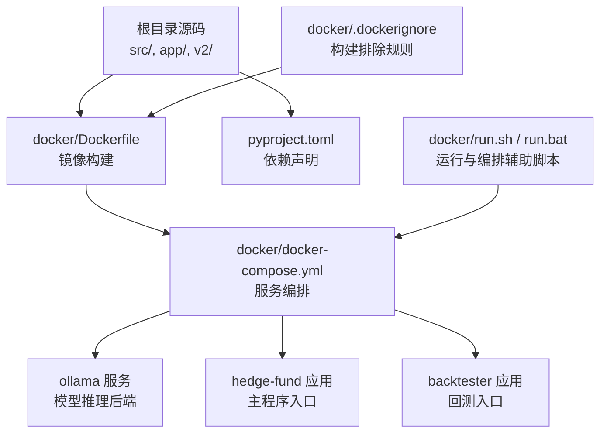
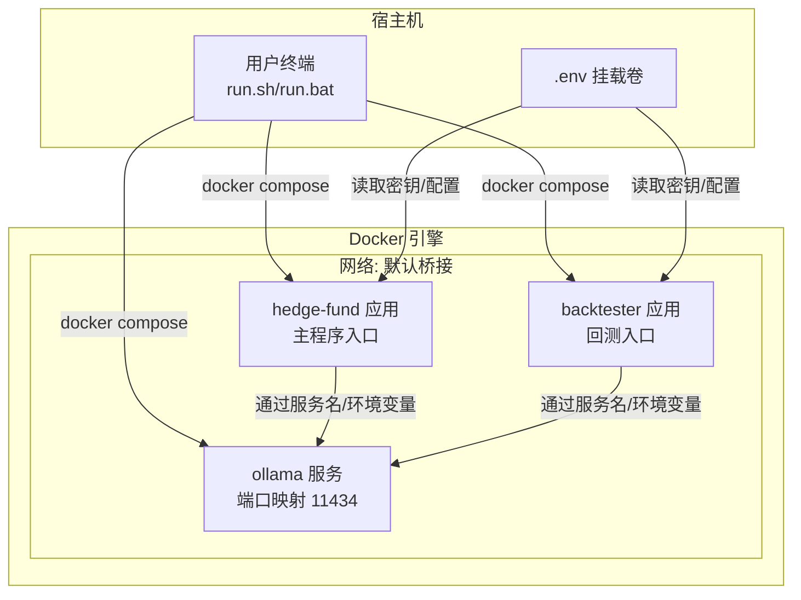
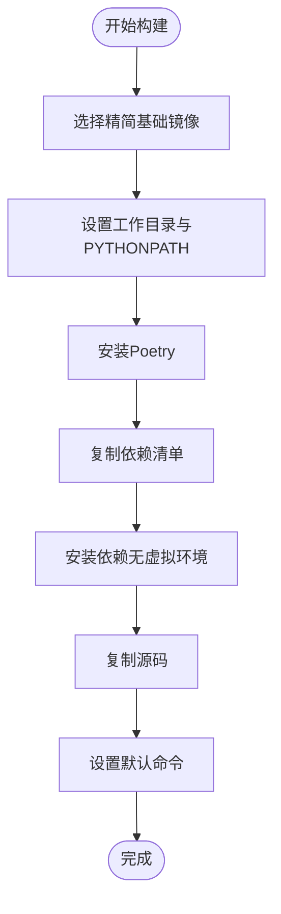
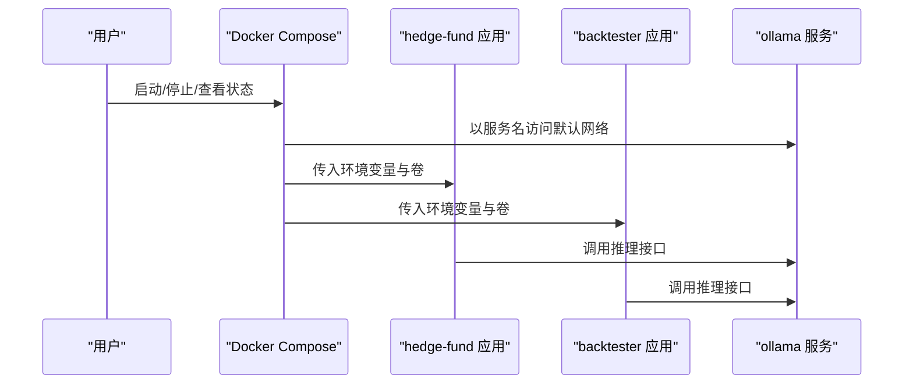
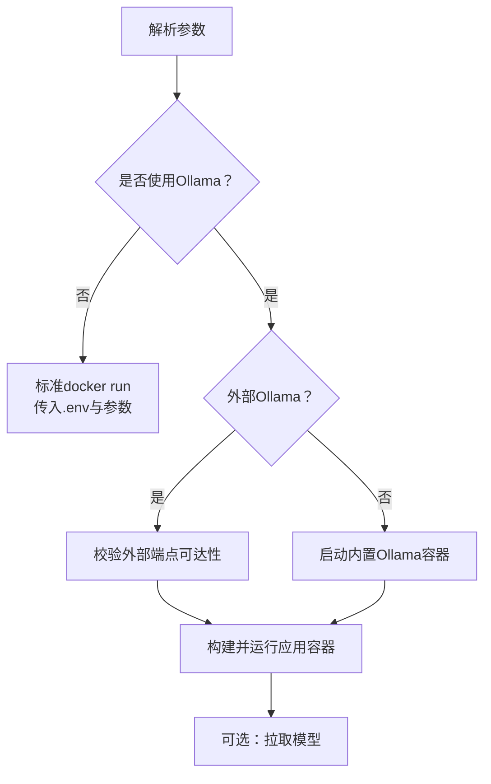
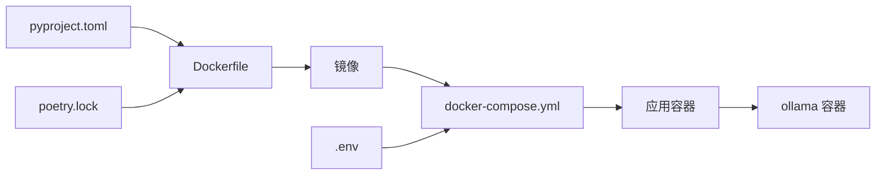

# 容器化部署

<cite>
**本文引用的文件**   
- [docker/Dockerfile](file://docker/Dockerfile)
- [docker/docker-compose.yml](file://docker/docker-compose.yml)
- [docker/.dockerignore](file://docker/.dockerignore)
- [docker/README.md](file://docker/README.md)
- [docker/run.sh](file://docker/run.sh)
- [docker/run.bat](file://docker/run.bat)
- [pyproject.toml](file://pyproject.toml)
- [src/utils/docker.py](file://src/utils/docker.py)
- [src/main.py](file://src/main.py)
- [app/backend/main.py](file://app/backend/main.py)
</cite>

## 目录
1. [简介](#简介)
2. [项目结构](#项目结构)
3. [核心组件](#核心组件)
4. [架构总览](#架构总览)
5. [详细组件分析](#详细组件分析)
6. [依赖关系分析](#依赖关系分析)
7. [性能与体积优化](#性能与体积优化)
8. [安全加固与合规](#安全加固与合规)
9. [环境变量与配置管理](#环境变量与配置管理)
10. [卷挂载与网络配置](#卷挂载与网络配置)
11. [健康检查与重启策略](#健康检查与重启策略)
12. [日志管理与调试](#日志管理与调试)
13. [故障排除指南](#故障排除指南)
14. [结论](#结论)

## 简介
本指南面向在本地或CI/CD环境中进行容器化部署的工程团队，围绕该AI对冲基金项目的Docker镜像构建、多阶段优化、容器编排与配置管理展开。内容覆盖Dockerfile最佳实践、镜像体积优化、安全加固策略；解释docker-compose服务编排、服务依赖与服务发现；提供环境变量、卷挂载与网络配置建议；说明容器健康检查、重启策略与资源限制；并给出日志管理、调试与故障排除方法，以及容器安全扫描与合规检查流程。

## 项目结构
该项目采用“根目录源码 + docker子目录”的组织方式，核心容器化资产集中在docker目录中，配合Poetry依赖管理与Python应用入口，形成可复用的镜像构建与编排方案。

图表来源
- [docker/Dockerfile:1-23](file://docker/Dockerfile#L1-L23)
- [docker/docker-compose.yml:1-95](file://docker/docker-compose.yml#L1-L95)
- [docker/.dockerignore:1-28](file://docker/.dockerignore#L1-L28)
- [docker/run.sh:1-372](file://docker/run.sh#L1-L372)
- [docker/run.bat:1-414](file://docker/run.bat#L1-L414)
- [pyproject.toml:1-62](file://pyproject.toml#L1-L62)

章节来源
- [docker/Dockerfile:1-23](file://docker/Dockerfile#L1-L23)
- [docker/docker-compose.yml:1-95](file://docker/docker-compose.yml#L1-L95)
- [docker/.dockerignore:1-28](file://docker/.dockerignore#L1-L28)
- [docker/README.md:1-211](file://docker/README.md#L1-L211)
- [docker/run.sh:1-372](file://docker/run.sh#L1-L372)
- [docker/run.bat:1-414](file://docker/run.bat#L1-L414)
- [pyproject.toml:1-62](file://pyproject.toml#L1-L62)

## 核心组件
- 镜像构建层：基于精简基础镜像，使用Poetry安装依赖，复制源码，设置默认命令。
- 编排层：通过Compose定义服务（ollama、hedge-fund、backtester等），共享卷与环境变量，启用重启策略。
- 运行脚本层：跨平台run.sh/run.bat封装参数解析、外部/内置Ollama连接、Compose集成与模型拉取。
- 应用入口层：主程序与回测入口均支持CLI参数与环境变量加载，便于容器内执行。

章节来源
- [docker/Dockerfile:1-23](file://docker/Dockerfile#L1-L23)
- [docker/docker-compose.yml:1-95](file://docker/docker-compose.yml#L1-L95)
- [docker/run.sh:1-372](file://docker/run.sh#L1-L372)
- [docker/run.bat:1-414](file://docker/run.bat#L1-L414)
- [src/main.py:1-180](file://src/main.py#L1-L180)

## 架构总览
下图展示容器化部署的整体交互：Compose启动ollama与应用服务，应用通过环境变量访问Ollama；.env挂载到应用容器以注入密钥与配置；网络默认由Compose管理，服务间通过服务名互通。

图表来源
- [docker/docker-compose.yml:1-95](file://docker/docker-compose.yml#L1-L95)
- [docker/run.sh:237-362](file://docker/run.sh#L237-L362)
- [docker/run.bat:272-395](file://docker/run.bat#L272-L395)

## 详细组件分析

### Dockerfile 最佳实践与多阶段优化
- 基础镜像选择：使用精简的基础镜像，减少攻击面与体积。
- 依赖安装：先复制依赖清单，利用缓存分层；再安装Poetry并执行无虚拟环境安装，避免额外虚拟环境开销。
- 源码复制：仅复制必要源码，结合.dockerignore排除日志、缓存与IDE文件。
- 工作目录与路径：设置工作目录与PYTHONPATH，确保应用入口可直接调用模块。
- 默认命令：通过CMD指定应用入口，便于Compose覆盖为不同任务（主程序、回测）。

图表来源
- [docker/Dockerfile:1-23](file://docker/Dockerfile#L1-L23)
- [docker/.dockerignore:1-28](file://docker/.dockerignore#L1-L28)
- [pyproject.toml:1-62](file://pyproject.toml#L1-L62)

章节来源
- [docker/Dockerfile:1-23](file://docker/Dockerfile#L1-L23)
- [docker/.dockerignore:1-28](file://docker/.dockerignore#L1-L28)
- [pyproject.toml:1-62](file://pyproject.toml#L1-L62)

### docker-compose 编排与服务发现
- 服务定义：定义ollama、多个应用服务（主程序、带推理输出、Ollama模式、回测等），统一镜像来源与构建上下文。
- 卷挂载：将根目录.env挂载至/app/.env，实现密钥与配置注入。
- 环境变量：统一设置Python缓冲、Ollama地址、路径等；支持通过环境变量覆盖Ollama端点。
- 网络与端口：ollama暴露11434端口；应用通过服务名访问Ollama。
- 重启策略：为ollama设置unless-stopped，提升可用性。
- 交互式运行：tty与stdin_open便于交互式调试。

图表来源
- [docker/docker-compose.yml:1-95](file://docker/docker-compose.yml#L1-L95)

章节来源
- [docker/docker-compose.yml:1-95](file://docker/docker-compose.yml#L1-L95)

### 运行脚本与参数传递（跨平台）
- 参数解析：支持股票池、日期范围、初始资金、保证金比例、是否显示推理、是否使用Ollama、外部Ollama端点等。
- 外部/内置Ollama：自动探测外部Ollama或启动内置服务；提供健康检查与等待逻辑。
- 模型拉取：通过Compose进入Ollama容器执行拉取命令，并轮询确认下载完成。
- 统一入口：根据命令选择主程序或回测入口，拼装完整docker run/compose命令。

图表来源
- [docker/run.sh:51-129](file://docker/run.sh#L51-L129)
- [docker/run.sh:237-362](file://docker/run.sh#L237-L362)
- [docker/run.bat:52-178](file://docker/run.bat#L52-L178)
- [docker/run.bat:304-395](file://docker/run.bat#L304-L395)

章节来源
- [docker/run.sh:1-372](file://docker/run.sh#L1-L372)
- [docker/run.bat:1-414](file://docker/run.bat#L1-L414)

### 应用入口与环境变量加载
- 主程序入口：支持CLI参数解析、初始化工作流、打印交易输出。
- 环境变量：通过dotenv加载根目录.env中的密钥与配置，供应用使用。
- Ollama工具：提供模型可用性检查、列表查询、下载与删除能力，便于容器内自动化处理。

章节来源
- [src/main.py:1-180](file://src/main.py#L1-L180)
- [src/utils/docker.py:1-124](file://src/utils/docker.py#L1-L124)

## 依赖关系分析
- Dockerfile依赖pyproject.toml与poetry.lock，确保依赖安装一致性。
- Compose依赖Dockerfile构建镜像，并通过卷与环境变量与应用交互。
- 运行脚本依赖Compose命令与容器内部工具链（curl、ollama CLI）。

图表来源
- [pyproject.toml:1-62](file://pyproject.toml#L1-L62)
- [docker/Dockerfile:1-23](file://docker/Dockerfile#L1-L23)
- [docker/docker-compose.yml:1-95](file://docker/docker-compose.yml#L1-L95)

章节来源
- [pyproject.toml:1-62](file://pyproject.toml#L1-L62)
- [docker/Dockerfile:1-23](file://docker/Dockerfile#L1-L23)
- [docker/docker-compose.yml:1-95](file://docker/docker-compose.yml#L1-L95)

## 性能与体积优化
- 分层缓存：先复制依赖清单再安装依赖，最大化利用缓存命中率。
- 精简基础镜像：使用python:3.11-slim降低镜像体积与安全风险。
- 排除无关文件：通过.dockerignore排除日志、缓存、IDE文件与环境示例，减少构建上下文大小。
- 无虚拟环境安装：Poetry配置不创建虚拟环境，避免额外空间占用。
- 多服务共用镜像：通过命令覆盖实现不同任务，减少镜像数量与构建成本。

章节来源
- [docker/Dockerfile:1-23](file://docker/Dockerfile#L1-L23)
- [docker/.dockerignore:1-28](file://docker/.dockerignore#L1-L28)
- [docker/docker-compose.yml:1-95](file://docker/docker-compose.yml#L1-L95)

## 安全加固与合规
- 最小权限原则：使用非root用户运行（如需可在Dockerfile中添加）。
- 只读根文件系统：对应用容器可考虑设置只读根文件系统，结合必要的写入卷。
- 秘钥与敏感配置：通过卷挂载.env，避免硬编码在镜像中；生产环境建议使用密钥管理服务。
- 端口与网络：仅暴露必要端口（如11434），服务间通过默认网络通信。
- 镜像扫描：在CI中集成镜像安全扫描（如Trivy、Clair），检测已知漏洞。
- 合规检查：建立镜像版本与依赖清单审计流程，确保符合组织合规要求。

## 环境变量与配置管理
- 关键变量
  - OLLAMA_BASE_URL：指向Ollama服务地址（可为内置或外部）。
  - PYTHONUNBUFFERED：保证Python输出实时可见。
  - PYTHONPATH：确保模块导入正确。
- 注入方式
  - Compose通过environment字段注入；.env通过卷挂载注入。
- 建议
  - 将敏感变量放入Secrets（若使用Swarm/K8s）或外部密钥管理；本地开发使用.env。
  - 对外暴露的变量在文档中明确用途与默认值。

章节来源
- [docker/docker-compose.yml:26-29](file://docker/docker-compose.yml#L26-L29)
- [docker/docker-compose.yml:72-74](file://docker/docker-compose.yml#L72-L74)
- [docker/run.sh:269-323](file://docker/run.sh#L269-L323)
- [docker/run.bat:304-356](file://docker/run.bat#L304-L356)

## 卷挂载与网络配置
- 卷挂载
  - .env挂载至/app/.env，实现密钥与配置注入。
  - ollama_data命名卷持久化模型数据。
- 网络
  - 默认桥接网络，服务可通过服务名互相访问。
  - ollama暴露11434端口，便于外部访问或调试。

章节来源
- [docker/docker-compose.yml:12-16](file://docker/docker-compose.yml#L12-L16)
- [docker/docker-compose.yml:23-30](file://docker/docker-compose.yml#L23-L30)
- [docker/docker-compose.yml:93-95](file://docker/docker-compose.yml#L93-L95)

## 健康检查与重启策略
- 重启策略
  - ollama使用unless-stopped，提高可用性。
- 健康检查
  - 可在应用容器中增加健康检查探针（如HTTP端点或自定义脚本），并在Compose中启用。
- 建议
  - 对关键服务配置健康检查与最大重启次数，避免无限重启。
  - 在CI中加入健康检查验证步骤。

章节来源
- [docker/docker-compose.yml:16-16](file://docker/docker-compose.yml#L16-L16)
- [docker/run.sh:302-321](file://docker/run.sh#L302-L321)
- [docker/run.bat:336-356](file://docker/run.bat#L336-L356)

## 日志管理与调试
- 日志采集
  - 使用容器日志驱动（如json-file）收集stdout/stderr；在生产环境接入集中式日志（如ELK/Fluentd）。
- 调试技巧
  - 使用tty与stdin_open保持交互式会话。
  - 通过run.sh/run.bat的compose模式快速启动与验证。
- 建议
  - 设置合理的日志级别与轮转策略，避免磁盘膨胀。
  - 在应用入口记录关键事件与错误堆栈，便于定位问题。

## 故障排除指南
- Ollama不可达
  - 检查端口映射与防火墙；使用内置或外部Ollama时分别验证。
  - 通过脚本的健康检查逻辑确认连通性。
- 模型未就绪
  - 使用脚本拉取模型并轮询确认；检查磁盘空间与网络。
- 权限与路径
  - 确认卷挂载路径与权限；.env文件存在且格式正确。
- Compose命令
  - 确认docker-compose可用；必要时切换为docker compose。

章节来源
- [docker/run.sh:136-148](file://docker/run.sh#L136-L148)
- [docker/run.sh:174-194](file://docker/run.sh#L174-L194)
- [docker/run.sh:208-235](file://docker/run.sh#L208-L235)
- [docker/run.bat:179-191](file://docker/run.bat#L179-L191)
- [docker/run.bat:204-226](file://docker/run.bat#L204-L226)
- [docker/run.bat:241-270](file://docker/run.bat#L241-L270)

## 结论
本指南提供了从镜像构建到编排部署的完整落地路径：以精简基础镜像与Poetry依赖安装为核心，结合.dockerignore与命令覆盖实现体积与效率平衡；通过Compose实现服务编排与配置注入；借助跨平台运行脚本简化外部/内置Ollama的对接与模型管理；并给出健康检查、重启策略、日志与安全加固建议。按此方案实施，可在本地与CI环境中稳定、可重复地交付AI对冲基金应用。