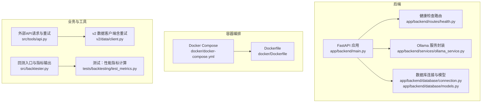
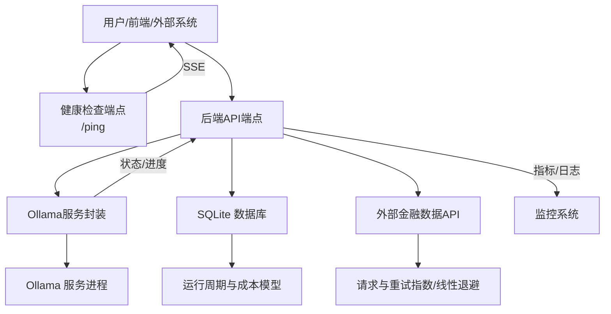
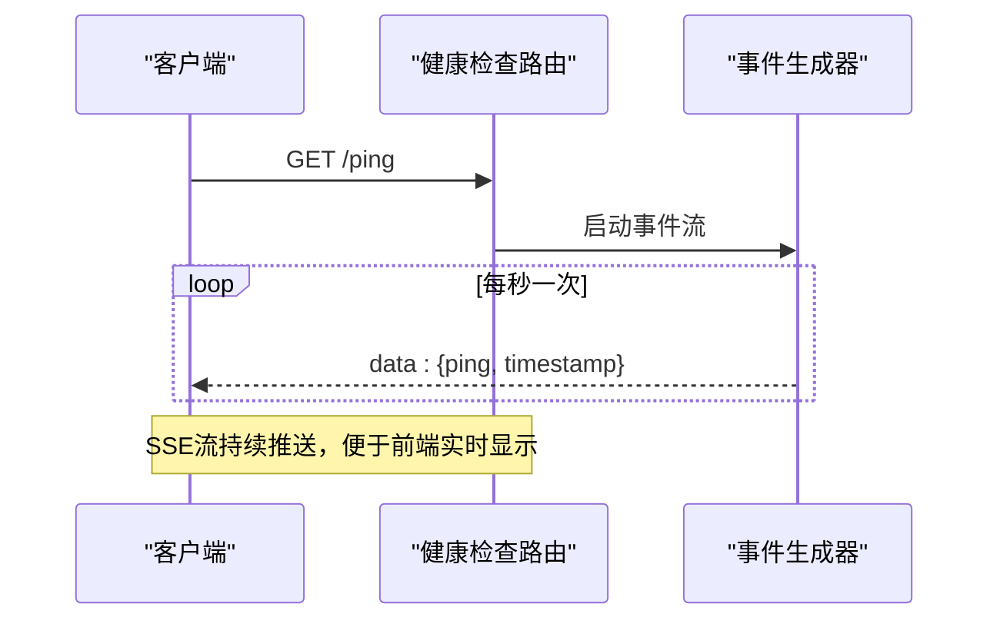
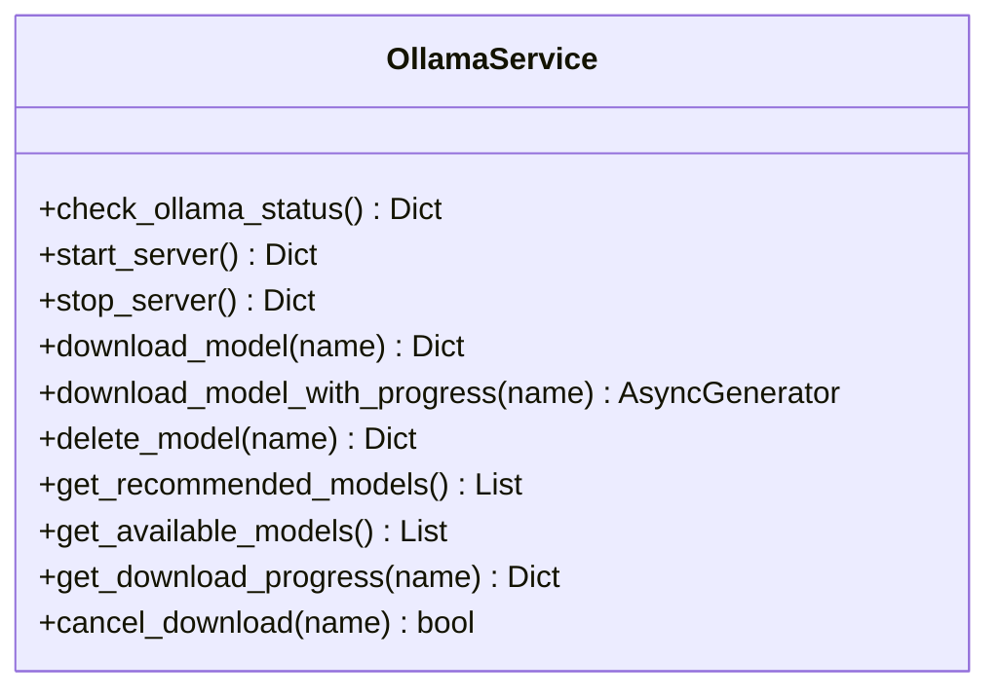
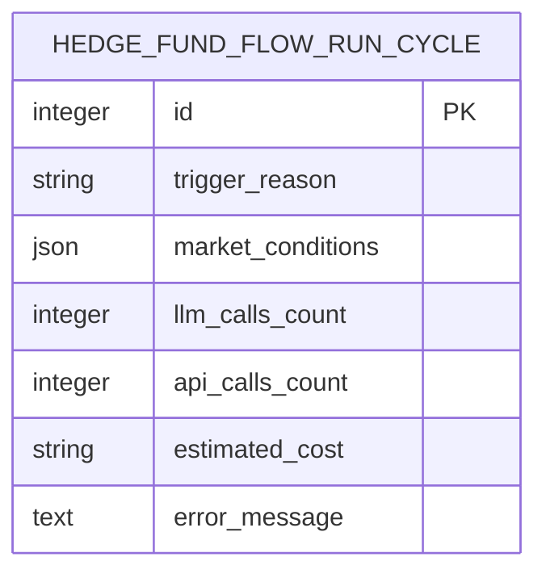
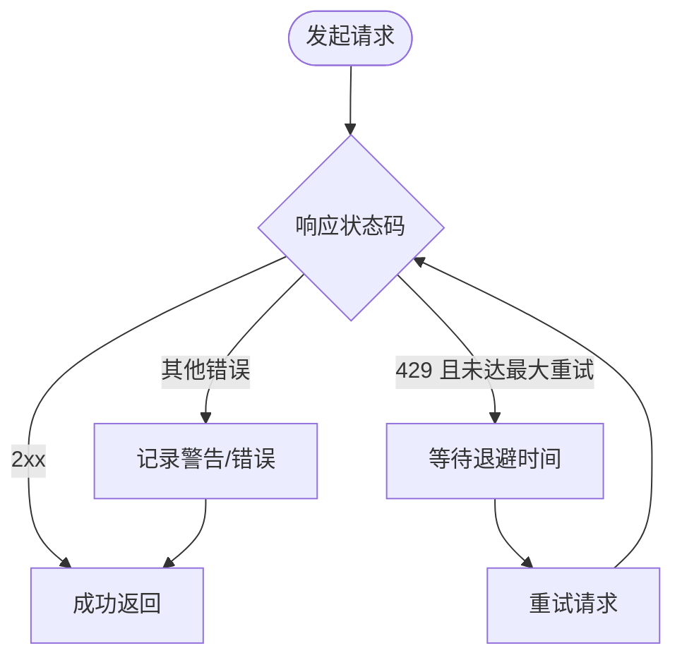
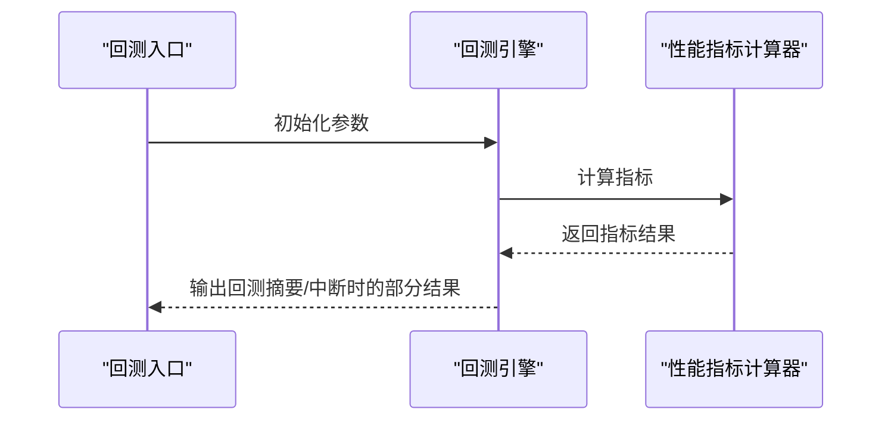
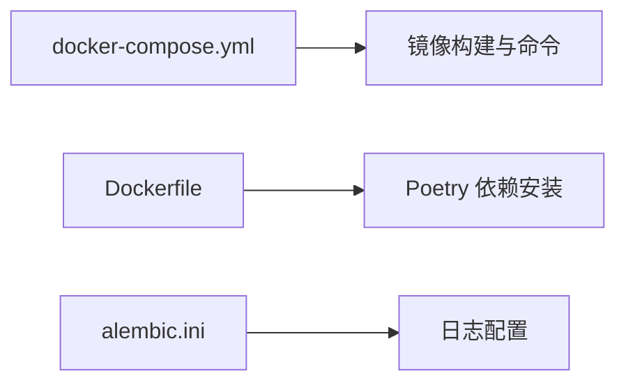

# 监控告警

<cite>
**本文引用的文件**
- [app/backend/main.py](file://app/backend/main.py)
- [app/backend/routes/health.py](file://app/backend/routes/health.py)
- [app/backend/services/ollama_service.py](file://app/backend/services/ollama_service.py)
- [app/backend/database/connection.py](file://app/backend/database/connection.py)
- [app/backend/database/models.py](file://app/backend/database/models.py)
- [docker/docker-compose.yml](file://docker/docker-compose.yml)
- [docker/Dockerfile](file://docker/Dockerfile)
- [src/tools/api.py](file://src/tools/api.py)
- [v2/data/client.py](file://v2/data/client.py)
- [src/backtester.py](file://src/backtester.py)
- [tests/backtesting/test_metrics.py](file://tests/backtesting/test_metrics.py)
- [app/backend/alembic.ini](file://app/backend/alembic.ini)
- [README.md](file://README.md)
- [app/backend/README.md](file://app/backend/README.md)
</cite>

## 目录
1. [简介](#简介)
2. [项目结构](#项目结构)
3. [核心组件](#核心组件)
4. [架构总览](#架构总览)
5. [详细组件分析](#详细组件分析)
6. [依赖分析](#依赖分析)
7. [性能考虑](#性能考虑)
8. [故障排查指南](#故障排查指南)
9. [结论](#结论)
10. [附录](#附录)

## 简介
本文件面向“AI对冲基金”项目的系统监控与告警综合解决方案，覆盖应用性能监控（APM）、基础设施监控、业务指标监控、日志聚合与错误追踪、健康检查与服务可用性监控、故障检测机制、告警通知渠道与升级策略、值班管理流程、分布式追踪与链路监控、用户体验监控、容量规划、性能优化与成本监控等。当前仓库已具备基础健康检查端点、容器化部署与数据库连接、日志记录与重试退避策略，可作为构建完整监控体系的起点。

## 项目结构
后端采用FastAPI框架，提供REST接口；前端为React/Vite应用；容器编排通过Docker Compose实现；数据层使用SQLite并通过SQLAlchemy建模；部分外部API调用具备重试与限流处理逻辑；CLI支持回测引擎与性能指标计算。

图表来源
- [app/backend/main.py:1-56](file://app/backend/main.py#L1-L56)
- [app/backend/routes/health.py:1-28](file://app/backend/routes/health.py#L1-L28)
- [app/backend/services/ollama_service.py:1-519](file://app/backend/services/ollama_service.py#L1-L519)
- [app/backend/database/connection.py:1-32](file://app/backend/database/connection.py#L1-L32)
- [app/backend/database/models.py:85-115](file://app/backend/database/models.py#L85-L115)
- [docker/docker-compose.yml:1-95](file://docker/docker-compose.yml#L1-L95)
- [docker/Dockerfile:1-23](file://docker/Dockerfile#L1-L23)
- [src/tools/api.py:25-60](file://src/tools/api.py#L25-L60)
- [v2/data/client.py:191-226](file://v2/data/client.py#L191-L226)
- [src/backtester.py:1-67](file://src/backtester.py#L1-L67)
- [tests/backtesting/test_metrics.py:1-51](file://tests/backtesting/test_metrics.py#L1-L51)

章节来源
- [README.md:1-158](file://README.md#L1-L158)
- [app/backend/README.md:1-102](file://app/backend/README.md#L1-L102)
- [docker/docker-compose.yml:1-95](file://docker/docker-compose.yml#L1-L95)
- [docker/Dockerfile:1-23](file://docker/Dockerfile#L1-L23)

## 核心组件
- 健康检查端点：提供根路径与SSE心跳端点，便于前端或外部系统进行连通性与可用性探测。
- Ollama服务集成：封装本地大模型服务的安装状态检查、服务启停、模型下载进度流式返回等能力，便于在监控中观测推理资源可用性。
- 数据库与模型：定义了运行周期与成本跟踪字段，可用于业务指标采集与成本监控。
- 外部API请求与重试：在工具模块与v2数据客户端中实现了指数/线性退避与限流处理，有助于降低上游限流风险并提升稳定性。
- 回测与性能指标：回测引擎输出投资组合序列，测试用例验证指标计算逻辑，可作为业务KPI的观测基线。

章节来源
- [app/backend/routes/health.py:9-28](file://app/backend/routes/health.py#L9-L28)
- [app/backend/services/ollama_service.py:34-151](file://app/backend/services/ollama_service.py#L34-L151)
- [app/backend/database/models.py:85-115](file://app/backend/database/models.py#L85-L115)
- [src/tools/api.py:25-60](file://src/tools/api.py#L25-L60)
- [v2/data/client.py:191-226](file://v2/data/client.py#L191-L226)
- [src/backtester.py:13-67](file://src/backtester.py#L13-L67)
- [tests/backtesting/test_metrics.py:24-51](file://tests/backtesting/test_metrics.py#L24-L51)

## 架构总览
下图展示从容器编排到后端服务、数据库与外部API的关键交互路径，以及健康检查与Ollama服务的状态反馈。

图表来源
- [docker/docker-compose.yml:18-91](file://docker/docker-compose.yml#L18-L91)
- [app/backend/main.py:32-56](file://app/backend/main.py#L32-L56)
- [app/backend/routes/health.py:14-28](file://app/backend/routes/health.py#L14-L28)
- [app/backend/services/ollama_service.py:34-151](file://app/backend/services/ollama_service.py#L34-L151)
- [app/backend/database/connection.py:12-32](file://app/backend/database/connection.py#L12-L32)
- [src/tools/api.py:25-60](file://src/tools/api.py#L25-L60)
- [v2/data/client.py:191-226](file://v2/data/client.py#L191-L226)

## 详细组件分析

### 健康检查与可用性监控
- 根路径返回欢迎信息，用于快速确认服务可达。
- /ping 使用Server-Sent Events（SSE）持续推送心跳消息，适合前端轮询替代方案与实时可用性观测。
- 建议结合外部探针（如Prometheus黑盒探测、云厂商健康检查）与SSE端点共同评估整体可用性。

图表来源
- [app/backend/routes/health.py:14-28](file://app/backend/routes/health.py#L14-L28)

章节来源
- [app/backend/routes/health.py:9-28](file://app/backend/routes/health.py#L9-L28)
- [app/backend/README.md:69-73](file://app/backend/README.md#L69-L73)

### Ollama服务状态与模型管理
- 提供安装状态检查、服务启停、模型下载进度流式返回、模型删除与推荐模型加载等能力。
- 可用于监控本地推理资源的可用性与容量变化，辅助业务侧决策（如是否启用本地模型）。

图表来源
- [app/backend/services/ollama_service.py:19-173](file://app/backend/services/ollama_service.py#L19-L173)

章节来源
- [app/backend/services/ollama_service.py:34-151](file://app/backend/services/ollama_service.py#L34-L151)

### 数据库与成本指标模型
- 运行周期模型包含LLM调用次数、外部API调用次数与估算成本等字段，可直接用于业务成本监控与趋势分析。

图表来源
- [app/backend/database/models.py:85-115](file://app/backend/database/models.py#L85-L115)

章节来源
- [app/backend/database/models.py:85-115](file://app/backend/database/models.py#L85-L115)

### 外部API请求与重试退避
- 工具模块与v2数据客户端均实现了请求重试与限流处理，有助于在高并发或上游限流场景下提升成功率与稳定性。

图表来源
- [src/tools/api.py:25-60](file://src/tools/api.py#L25-L60)
- [v2/data/client.py:191-226](file://v2/data/client.py#L191-L226)

章节来源
- [src/tools/api.py:25-60](file://src/tools/api.py#L25-L60)
- [v2/data/client.py:191-226](file://v2/data/client.py#L191-L226)

### 回测与性能指标
- 回测引擎按时间序列输出投资组合价值，测试用例验证夏普比率、索提诺比率与最大回撤等指标的计算逻辑，可作为业务KPI的观测基线。

图表来源
- [src/backtester.py:13-67](file://src/backtester.py#L13-L67)
- [tests/backtesting/test_metrics.py:24-51](file://tests/backtesting/test_metrics.py#L24-L51)

章节来源
- [src/backtester.py:13-67](file://src/backtester.py#L13-L67)
- [tests/backtesting/test_metrics.py:24-51](file://tests/backtesting/test_metrics.py#L24-L51)

## 依赖分析
- 容器化与部署：Docker Compose定义了后端服务、推理服务（Ollama）与回测任务；Dockerfile基于Python Slim镜像并使用Poetry安装依赖。
- 日志与迁移：Alembic配置包含日志器与处理器，便于在数据库迁移过程中输出日志。

图表来源
- [docker/docker-compose.yml:18-91](file://docker/docker-compose.yml#L18-L91)
- [docker/Dockerfile:8-19](file://docker/Dockerfile#L8-L19)
- [app/backend/alembic.ini:86-119](file://app/backend/alembic.ini#L86-L119)

章节来源
- [docker/docker-compose.yml:1-95](file://docker/docker-compose.yml#L1-L95)
- [docker/Dockerfile:1-23](file://docker/Dockerfile#L1-L23)
- [app/backend/alembic.ini:86-119](file://app/backend/alembic.ini#L86-L119)

## 性能考虑
- 外部API限流与退避：建议在生产环境统一收敛至一个重试策略（例如统一的指数退避或线性退避），并结合Jitter避免雪崩效应。
- 数据库写入：运行周期的成本字段更新应批量提交，减少事务开销；对高频写入场景可考虑异步队列或批处理。
- 推理资源：Ollama模型下载与推理需预留磁盘空间与内存，建议监控磁盘使用率与GPU/CPU占用，必要时拆分服务实例。
- 回测性能：回测引擎输出序列较大时，建议分页或抽样输出，并在前端做虚拟滚动以降低渲染压力。

## 故障排查指南
- 健康检查失败
  - 检查后端服务是否启动、端口是否开放。
  - 使用SSE端点确认事件流是否正常推送。
- Ollama不可用
  - 查看启动事件中的状态日志，确认安装与服务运行状态。
  - 若服务未运行，尝试手动启动或通过API触发启动。
- 外部API限流
  - 观察重试日志与退避间隔，确认是否达到最大重试次数。
  - 调整上游配额或引入多账号轮询。
- 数据库异常
  - 检查SQLite文件权限与路径，确保绝对路径正确。
  - 关注Alembic日志，定位迁移问题。

章节来源
- [app/backend/main.py:32-56](file://app/backend/main.py#L32-L56)
- [app/backend/routes/health.py:14-28](file://app/backend/routes/health.py#L14-L28)
- [src/tools/api.py:25-60](file://src/tools/api.py#L25-L60)
- [v2/data/client.py:191-226](file://v2/data/client.py#L191-L226)
- [app/backend/database/connection.py:7-32](file://app/backend/database/connection.py#L7-L32)
- [app/backend/alembic.ini:86-119](file://app/backend/alembic.ini#L86-L119)

## 结论
当前代码库已具备健康检查、容器化部署、数据库建模与外部API重试等基础能力，可作为构建全面监控体系的基石。建议在此基础上补充Prometheus指标导出、Grafana仪表板、告警规则与通知通道、分布式追踪与用户体验监控，并完善容量规划与成本监控策略，形成闭环的可观测性体系。

## 附录

### Prometheus指标收集建议
- 应用指标
  - HTTP请求数、请求耗时（直方图）、错误率、队列长度、模型下载进度百分比。
- 基础设施指标
  - CPU/内存/磁盘使用率、网络I/O、容器重启次数、卷使用率。
- 业务指标
  - LLM调用次数、外部API调用次数、估算成本、回测收益序列、最大回撤、夏普比率。

### Grafana仪表板配置建议
- 面板类型：时序曲线、热力图、单值指标、表格。
- 数据源：Prometheus。
- 示例面板：
  - /ping延迟分布（SSE事件到达时间差）
  - Ollama模型下载进度与状态
  - 成本估算与预算对比
  - 回测收益曲线与风险指标

### 告警规则设置建议
- 健康检查失败阈值（如连续N次失败）
- Ollama服务不可达或长时间无响应
- 外部API错误率突增或限流比例超阈
- 成本估算超出预算阈值
- 回测收益为负且持续N期

### 告警通知渠道与升级策略
- 通知渠道：邮件、Slack、Webhook、PagerDuty。
- 升级策略：首次告警静默N分钟，未恢复则升级到更高优先级；值班人员未响应则自动升级。

### 值班管理流程
- 值班表与排班系统对接。
- 告警自动派发与认领，记录处置过程与恢复时间。

### 分布式追踪与链路监控
- 在API入口与关键业务节点埋点，记录Trace ID与Span名称。
- 将SSE事件与回测执行纳入同一追踪上下文，便于端到端观测。

### 用户体验监控
- 前端FPS、首屏时间、交互延迟、SSE断线重连次数。
- 回测结果加载时间与数据完整性。

### 容量规划、性能优化与成本监控
- 基于历史指标预测峰值流量与资源需求。
- 优化外部API调用批次与缓存命中率。
- 对比不同模型与推理后端的成本与性能，动态选择最优组合。