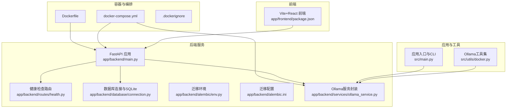
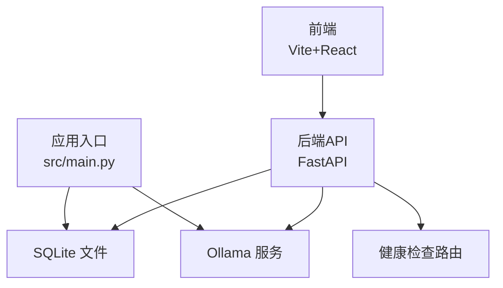
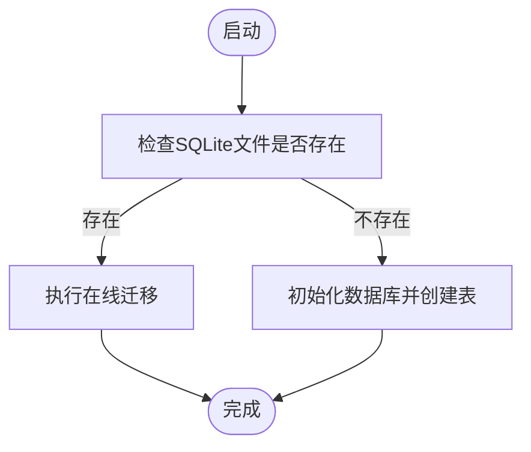
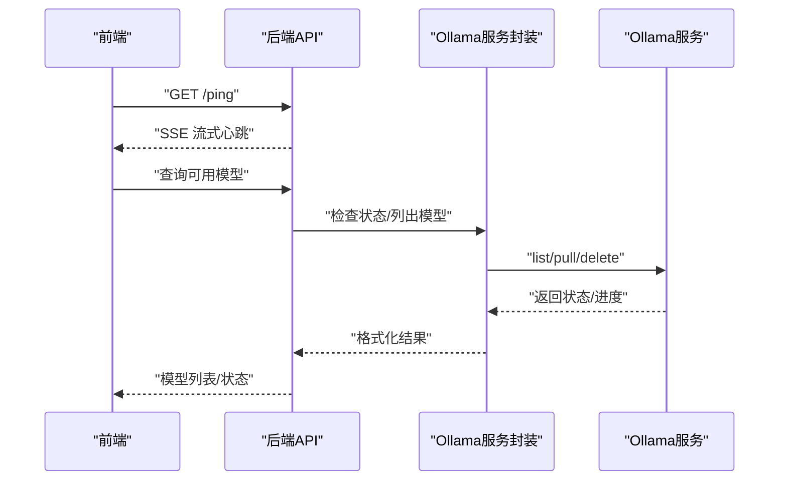
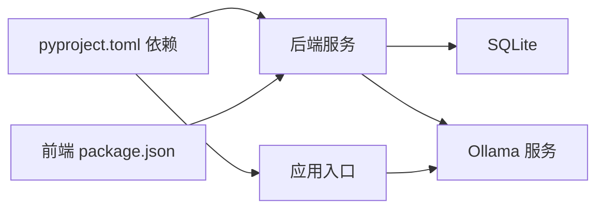

# 部署与运维

<cite>
**本文引用的文件**
- [Dockerfile](file://docker/Dockerfile)
- [docker-compose.yml](file://docker/docker-compose.yml)
- [.dockerignore](file://docker/.dockerignore)
- [pyproject.toml](file://pyproject.toml)
- [main.py（后端）](file://app/backend/main.py)
- [health.py（路由）](file://app/backend/routes/health.py)
- [connection.py（数据库连接）](file://app/backend/database/connection.py)
- [ollama_service.py（服务）](file://app/backend/services/ollama_service.py)
- [docker.py（工具）](file://src/utils/docker.py)
- [main.py（应用入口）](file://src/main.py)
- [package.json（前端）](file://app/frontend/package.json)
- [alembic/env.py](file://app/backend/alembic/env.py)
- [alembic.ini](file://app/backend/alembic.ini)
</cite>

## 目录
1. [简介](#简介)
2. [项目结构](#项目结构)
3. [核心组件](#核心组件)
4. [架构总览](#架构总览)
5. [详细组件分析](#详细组件分析)
6. [依赖关系分析](#依赖关系分析)
7. [性能考虑](#性能考虑)
8. [故障排查指南](#故障排查指南)
9. [结论](#结论)
10. [附录](#附录)

## 简介
本指南面向部署与运维团队，围绕该AI对冲基金项目的容器化、本地编排、数据库迁移、模型服务集成与健康检查等主题，提供从镜像构建到运行时可观测性的系统性实践建议。文档同时给出可扩展到Kubernetes与CI/CD的通用方法论与最佳实践，帮助实现稳定、可维护、可扩展的生产级交付。

## 项目结构
该项目采用多模块组织：Python后端（FastAPI）、Python应用主程序（LangGraph工作流）、前端React/Vite、以及容器与编排脚本。后端使用SQLite作为默认存储，通过Alembic进行迁移；应用层通过Ollama提供本地大模型推理能力；容器化采用Docker与Compose，便于本地开发与测试。

图示来源
- [Dockerfile:1-23](file://docker/Dockerfile#L1-L23)
- [docker-compose.yml:1-95](file://docker/docker-compose.yml#L1-L95)
- [main.py（后端）:1-56](file://app/backend/main.py#L1-L56)
- [health.py（路由）:1-28](file://app/backend/routes/health.py#L1-L28)
- [connection.py（数据库连接）:1-32](file://app/backend/database/connection.py#L1-L32)
- [ollama_service.py（服务）:1-519](file://app/backend/services/ollama_service.py#L1-L519)
- [main.py（应用入口）:1-180](file://src/main.py#L1-L180)
- [docker.py（工具）:1-124](file://src/utils/docker.py#L1-L124)
- [package.json（前端）:1-56](file://app/frontend/package.json#L1-L56)

章节来源
- [Dockerfile:1-23](file://docker/Dockerfile#L1-L23)
- [docker-compose.yml:1-95](file://docker/docker-compose.yml#L1-L95)
- [pyproject.toml:1-62](file://pyproject.toml#L1-L62)

## 核心组件
- 容器镜像与构建
  - 使用官方Python基础镜像，启用Poetry安装依赖，复制源码并设置默认命令。
  - .dockerignore排除日志、缓存、IDE与系统文件，减少镜像体积与构建时间。
- 本地编排
  - Compose定义Ollama服务与多个应用实例（含推理模式与回测），共享卷挂载.env，统一环境变量与网络。
- 后端服务
  - FastAPI应用，CORS配置允许前端访问，启动时探测Ollama状态，提供健康检查SSE接口。
- 数据库与迁移
  - SQLite路径为相对后端目录的本地文件，Alembic配置与迁移脚本位于后端目录。
- 模型服务集成
  - Ollama服务封装支持状态检查、拉取/删除模型、进度流式返回等。
- 应用入口与工具
  - CLI入口负责工作流编排与输出展示；工具模块提供Docker环境下的模型可用性保障与下载流程。

章节来源
- [Dockerfile:1-23](file://docker/Dockerfile#L1-L23)
- [.dockerignore:1-28](file://docker/.dockerignore#L1-L28)
- [docker-compose.yml:1-95](file://docker/docker-compose.yml#L1-L95)
- [main.py（后端）:1-56](file://app/backend/main.py#L1-L56)
- [health.py（路由）:1-28](file://app/backend/routes/health.py#L1-L28)
- [connection.py（数据库连接）:1-32](file://app/backend/database/connection.py#L1-L32)
- [ollama_service.py（服务）:1-519](file://app/backend/services/ollama_service.py#L1-L519)
- [docker.py（工具）:1-124](file://src/utils/docker.py#L1-L124)
- [main.py（应用入口）:1-180](file://src/main.py#L1-L180)

## 架构总览
下图展示了容器内服务交互与数据流向：前端通过HTTP访问后端API；后端在启动时检查Ollama状态；应用入口根据CLI参数执行工作流；数据库为SQLite文件；Ollama作为本地推理服务由Compose管理。

图示来源
- [main.py（后端）:1-56](file://app/backend/main.py#L1-L56)
- [health.py（路由）:1-28](file://app/backend/routes/health.py#L1-L28)
- [connection.py（数据库连接）:1-32](file://app/backend/database/connection.py#L1-L32)
- [ollama_service.py（服务）:1-519](file://app/backend/services/ollama_service.py#L1-L519)
- [main.py（应用入口）:1-180](file://src/main.py#L1-L180)

## 详细组件分析

### 容器镜像与多阶段构建策略
- 当前镜像基于精简Python基础镜像，使用Poetry安装依赖，随后复制全部源码。该策略适合开发与本地编排场景，便于快速迭代。
- 多阶段构建建议
  - 阶段一：安装依赖（仅复制依赖清单以利用缓存）
  - 阶段二：复制构建产物或源码，安装运行时依赖，移除开发依赖
  - 阶段三：最终运行镜像，仅包含运行所需文件，进一步瘦身
- 镜像优化要点
  - 使用更小的基础镜像（如distroless）
  - 清理包管理器缓存与构建中间产物
  - 合理分层，避免频繁重建
  - 启用镜像压缩与只读根文件系统
- 运行时安全
  - 非root用户运行
  - 只挂载必要卷，限制权限
  - 使用只读文件系统与最小权限

章节来源
- [Dockerfile:1-23](file://docker/Dockerfile#L1-L23)
- [.dockerignore:1-28](file://docker/.dockerignore#L1-L28)

### 本地编排与服务发现
- Compose通过服务名实现容器间通信（如后端服务访问Ollama）。建议在生产中使用稳定的DNS或服务网格实现服务发现。
- 端口映射与网络隔离
  - 将Ollama端口映射到宿主机以便调试，生产中应限制外部访问
  - 将应用与模型服务置于同一网络，避免跨网络延迟
- 环境变量与配置
  - 通过环境变量传递模型服务地址（如OLLAMA_BASE_URL），并在后端启动时记录状态

章节来源
- [docker-compose.yml:1-95](file://docker/docker-compose.yml#L1-L95)
- [main.py（后端）:32-56](file://app/backend/main.py#L32-L56)

### 数据库与迁移
- 存储与连接
  - SQLite文件位于后端目录，使用绝对路径确保一致性
  - FastAPI依赖注入提供会话生命周期管理
- 迁移
  - Alembic配置指向SQLite文件路径，支持离线/在线迁移
  - 建议在CI中执行迁移校验，确保部署前Schema一致

图示来源
- [connection.py（数据库连接）:1-32](file://app/backend/database/connection.py#L1-L32)
- [alembic/env.py:1-78](file://app/backend/alembic/env.py#L1-L78)
- [alembic.ini:1-120](file://app/backend/alembic.ini#L1-L120)

章节来源
- [connection.py（数据库连接）:1-32](file://app/backend/database/connection.py#L1-L32)
- [alembic/env.py:1-78](file://app/backend/alembic/env.py#L1-L78)
- [alembic.ini:1-120](file://app/backend/alembic.ini#L1-L120)

### 健康检查与可观测性
- 健康检查
  - 提供根路径与SSE风格的/ping接口，便于前端轮询与实时刷新
- 日志与追踪
  - 后端启动时记录Ollama状态信息，便于诊断
  - 建议引入结构化日志、采样与集中式日志收集
- 监控指标
  - 建议暴露Prometheus指标（如请求QPS、错误率、响应时间、模型下载进度）
  - 结合APM工具（如OpenTelemetry）采集链路追踪

章节来源
- [health.py（路由）:1-28](file://app/backend/routes/health.py#L1-L28)
- [main.py（后端）:32-56](file://app/backend/main.py#L32-L56)

### 模型服务集成与工作流
- Ollama服务封装
  - 支持状态检查、拉取/删除模型、进度流式返回、跨平台进程控制
  - 在后端启动时探测Ollama状态，记录可用模型列表
- 应用入口
  - CLI解析输入，构建LangGraph工作流，执行交易决策并输出结果
- Docker工具
  - 在容器环境中检测Ollama可用性、列出已下载模型、按需下载模型

图示来源
- [health.py（路由）:1-28](file://app/backend/routes/health.py#L1-L28)
- [ollama_service.py（服务）:1-519](file://app/backend/services/ollama_service.py#L1-L519)
- [docker.py（工具）:1-124](file://src/utils/docker.py#L1-L124)

章节来源
- [ollama_service.py（服务）:1-519](file://app/backend/services/ollama_service.py#L1-L519)
- [docker.py（工具）:1-124](file://src/utils/docker.py#L1-L124)
- [main.py（应用入口）:1-180](file://src/main.py#L1-L180)

### 负载均衡、自动扩缩容与故障转移
- 负载均衡
  - 在Kubernetes中使用Service与Ingress实现流量接入；后端可多副本部署
- 自动扩缩容
  - 基于CPU/内存或自定义指标（如队列长度、请求延迟）触发HPA
- 故障转移
  - 多副本与就绪/存活探针确保滚动更新期间不中断服务
  - 前端通过健康检查接口感知后端状态，实现优雅降级

（本节为概念性说明，未直接分析具体文件）

### 安全加固、漏洞扫描与合规
- 安全基线
  - 非root运行、最小权限、只读根文件系统、禁用不必要的网络端口
- 漏洞扫描
  - CI中集成镜像漏洞扫描（如Trivy、Clair），对依赖进行定期审计
- 合规
  - 生成SBOM、保留镜像版本与依赖清单；敏感信息通过Secret管理

（本节为概念性说明，未直接分析具体文件）

### 备份恢复、灾难恢复与业务连续性
- 数据备份
  - SQLite文件定期快照；生产中建议使用对象存储归档
- 灾难恢复
  - 多可用区部署、跨区域复制、演练RTO/RPO目标
- 业务连续性
  - 多副本、蓝绿/金丝雀发布、自动回滚策略

（本节为概念性说明，未直接分析具体文件）

### 运维自动化、基础设施即代码与变更管理
- IaC
  - 使用Helm/Kustomize/terraform管理Kubernetes资源与集群配置
- CI/CD
  - 触发条件：PR/MR合并、标签推送；步骤：静态检查、单元测试、镜像构建与扫描、部署到预生产、人工审批后发布到生产
- 变更管理
  - 变更日志、影响评估、回滚预案、灰度发布

（本节为概念性说明，未直接分析具体文件）

### 成本优化、资源管理与性能调优
- 成本优化
  - 合理分配CPU/内存配额、启用资源限制与自动扩缩容、选择合适实例规格
- 资源管理
  - Pod亲和性与反亲和性、节点选择器、污点容忍
- 性能调优
  - 模型加载策略（预热）、并发与批处理、缓存热点数据、I/O优化

（本节为概念性说明，未直接分析具体文件）

## 依赖关系分析
- 组件耦合
  - 后端依赖数据库连接与Ollama服务；应用入口依赖Ollama服务与工作流；Compose将后端与Ollama解耦但通过网络互通
- 外部依赖
  - Python依赖通过Poetry管理；前端依赖通过package.json管理
- 迁移与版本
  - Alembic迁移脚本与数据库版本保持同步，建议在CI中强制执行迁移校验

图示来源
- [pyproject.toml:1-62](file://pyproject.toml#L1-L62)
- [main.py（后端）:1-56](file://app/backend/main.py#L1-L56)
- [main.py（应用入口）:1-180](file://src/main.py#L1-L180)
- [package.json（前端）:1-56](file://app/frontend/package.json#L1-L56)

章节来源
- [pyproject.toml:1-62](file://pyproject.toml#L1-L62)
- [package.json（前端）:1-56](file://app/frontend/package.json#L1-L56)

## 性能考虑
- 镜像与启动
  - 减少层数、清理缓存、按需安装依赖，缩短构建与启动时间
- 运行时
  - 合理设置并发与超时；对I/O密集型操作（如模型下载）采用异步与流式处理
- 数据库
  - SQLite适用于开发与小规模场景；生产建议迁移到分布式数据库并启用连接池

（本节为一般性指导，未直接分析具体文件）

## 故障排查指南
- 健康检查
  - 使用/ping接口确认后端可用；若无响应，检查容器日志与端口映射
- Ollama集成
  - 后端启动日志记录Ollama状态；若不可用，检查Compose网络、端口映射与模型服务状态
- 数据库
  - 确认SQLite文件路径与权限；迁移失败时查看Alembic日志
- 模型下载
  - 使用工具函数检测可用性与下载进度；长时间无响应时检查网络与磁盘空间

章节来源
- [health.py（路由）:1-28](file://app/backend/routes/health.py#L1-L28)
- [main.py（后端）:32-56](file://app/backend/main.py#L32-L56)
- [connection.py（数据库连接）:1-32](file://app/backend/database/connection.py#L1-L32)
- [docker.py（工具）:1-124](file://src/utils/docker.py#L1-L124)

## 结论
本指南基于现有代码与配置，给出了从容器镜像构建、本地编排、数据库迁移、模型服务集成到健康检查与可观测性的完整实践路线。建议在此基础上扩展至Kubernetes与CI/CD流水线，引入安全扫描、成本优化与灾备方案，形成完整的生产级交付体系。

## 附录
- 快速验证清单
  - 镜像构建成功且体积合理
  - Compose启动后端与Ollama，健康检查可用
  - SQLite文件存在且可写
  - 模型服务可用并可列出/下载模型
  - 前端可访问后端API并显示SSE心跳

（本节为一般性指导，未直接分析具体文件）