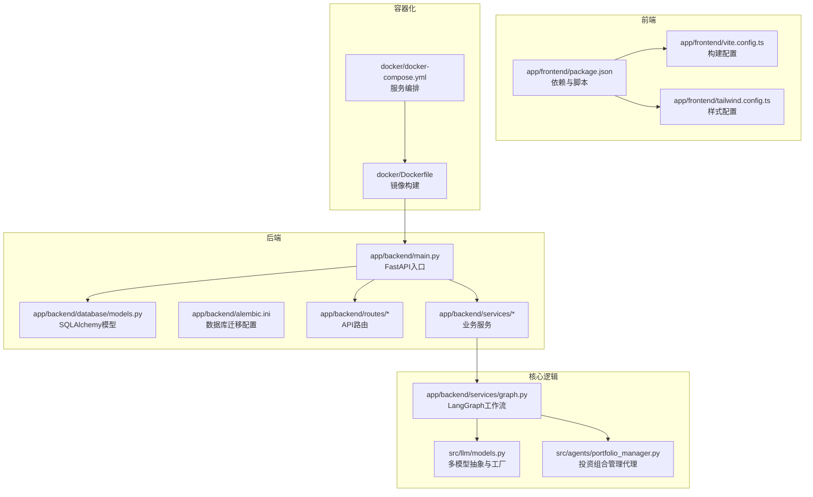
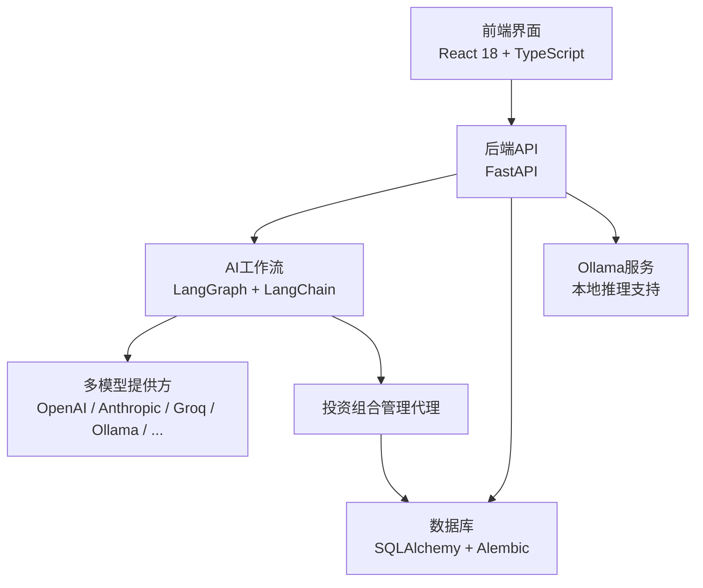
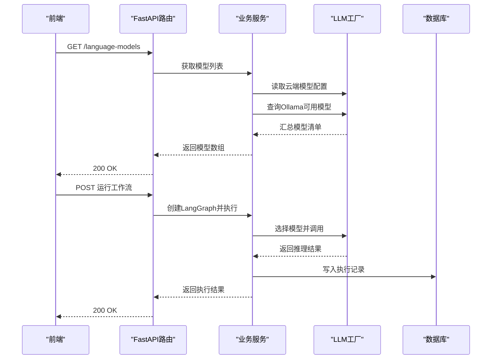
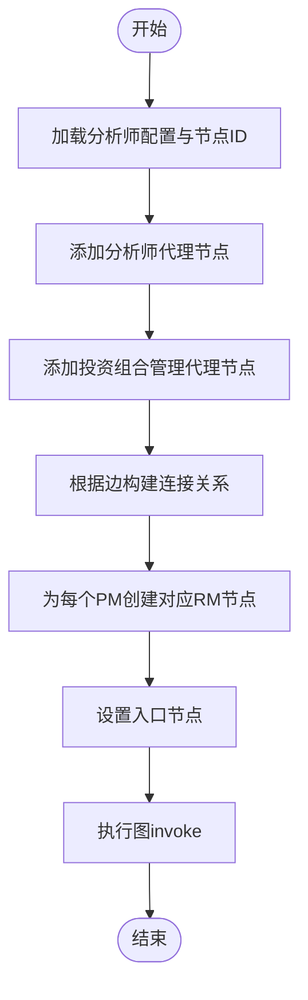
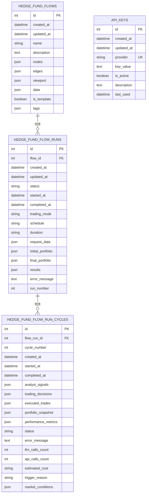
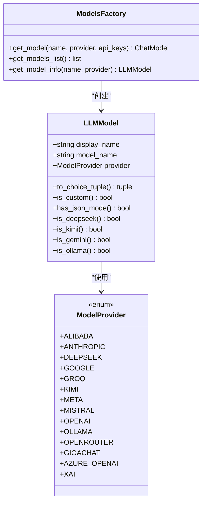
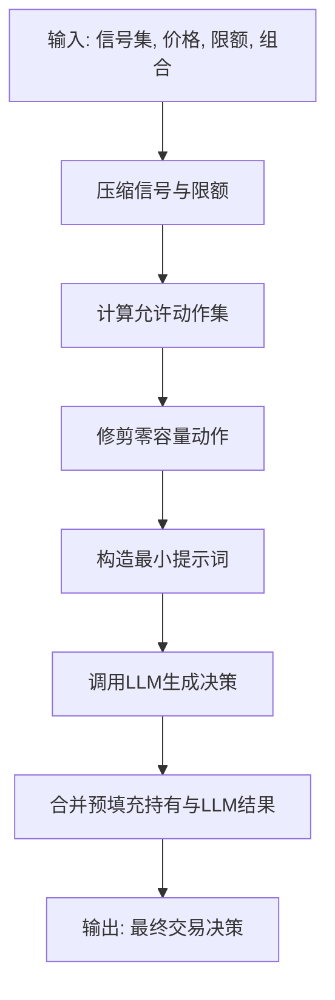
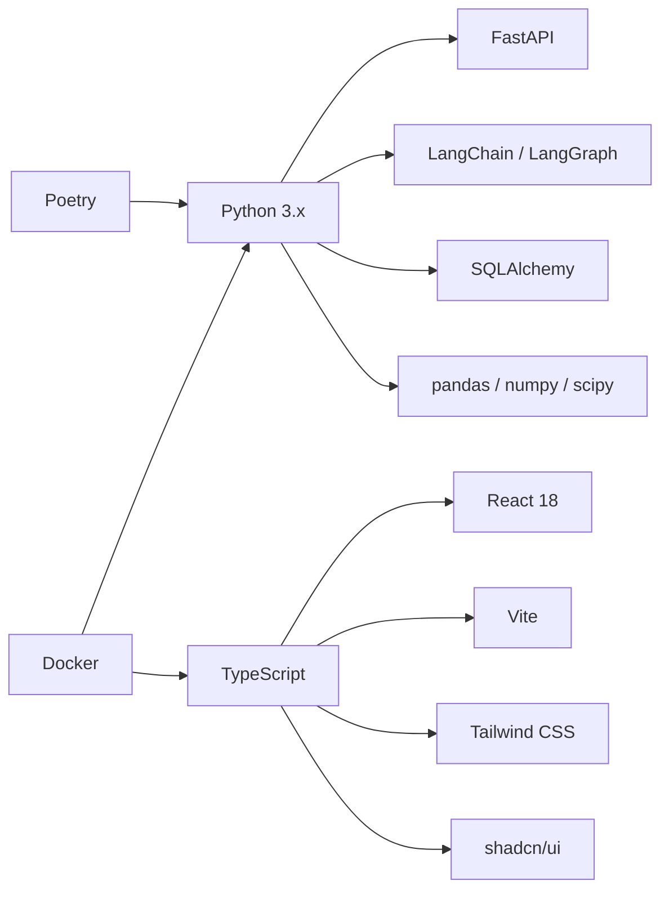

# 技术栈概览

<cite>
**本文档引用的文件**
- [pyproject.toml](file://pyproject.toml)
- [README.md](file://README.md)
- [app/backend/main.py](file://app/backend/main.py)
- [app/backend/alembic.ini](file://app/backend/alembic.ini)
- [app/backend/database/models.py](file://app/backend/database/models.py)
- [app/backend/services/graph.py](file://app/backend/services/graph.py)
- [app/backend/services/agent_service.py](file://app/backend/services/agent_service.py)
- [app/backend/routes/language_models.py](file://app/backend/routes/language_models.py)
- [src/llm/models.py](file://src/llm/models.py)
- [src/agents/portfolio_manager.py](file://src/agents/portfolio_manager.py)
- [app/frontend/package.json](file://app/frontend/package.json)
- [app/frontend/vite.config.ts](file://app/frontend/vite.config.ts)
- [app/frontend/tailwind.config.ts](file://app/frontend/tailwind.config.ts)
- [docker/docker-compose.yml](file://docker/docker-compose.yml)
- [docker/Dockerfile](file://docker/Dockerfile)
</cite>

## 目录
1. [简介](#简介)
2. [项目结构](#项目结构)
3. [核心组件](#核心组件)
4. [架构总览](#架构总览)
5. [详细组件分析](#详细组件分析)
6. [依赖分析](#依赖分析)
7. [性能考虑](#性能考虑)
8. [故障排除指南](#故障排除指南)
9. [结论](#结论)

## 简介
本项目是一个基于AI的对冲基金系统，采用前后端分离架构，后端使用Python 3.x与FastAPI构建REST API，结合LangChain/LangGraph实现多智能体AI决策流程；前端使用React 18 + TypeScript + Vite构建可视化界面，配合Tailwind CSS与shadcn/ui组件库实现现代化UI体验。系统支持多种大模型提供商（OpenAI、Anthropic、Groq、Ollama等），并提供回测引擎与数据库持久化能力。

## 项目结构
项目采用模块化分层组织：
- 后端应用：app/backend（FastAPI + SQLAlchemy + Alembic）
- 前端应用：app/frontend（React + TypeScript + Vite）
- 核心业务逻辑：src（AI代理、回测、LLM模型抽象）
- 容器化与CI/CD：docker（Dockerfile + docker-compose）

**图表来源**
- [app/backend/main.py:1-56](file://app/backend/main.py#L1-L56)
- [app/backend/database/models.py:1-115](file://app/backend/database/models.py#L1-L115)
- [app/backend/alembic.ini:1-120](file://app/backend/alembic.ini#L1-L120)
- [app/backend/services/graph.py:1-193](file://app/backend/services/graph.py#L1-L193)
- [src/llm/models.py:1-258](file://src/llm/models.py#L1-L258)
- [src/agents/portfolio_manager.py:1-263](file://src/agents/portfolio_manager.py#L1-L263)
- [app/frontend/package.json:1-56](file://app/frontend/package.json#L1-L56)
- [app/frontend/vite.config.ts:1-14](file://app/frontend/vite.config.ts#L1-L14)
- [app/frontend/tailwind.config.ts:1-144](file://app/frontend/tailwind.config.ts#L1-L144)
- [docker/Dockerfile:1-23](file://docker/Dockerfile#L1-L23)
- [docker/docker-compose.yml:1-95](file://docker/docker-compose.yml#L1-L95)

**章节来源**
- [README.md:1-158](file://README.md#L1-L158)
- [pyproject.toml:1-62](file://pyproject.toml#L1-L62)

## 核心组件
- 后端框架与运行时
  - FastAPI：高性能异步Web框架，提供REST API与中间件支持（CORS）。
  - Python 3.11：统一的运行时版本，确保依赖兼容性。
- 数据库与迁移
  - SQLAlchemy：ORM映射与查询接口。
  - Alembic：数据库迁移工具，SQLite默认配置。
- AI与语言模型
  - LangChain/LangGraph：构建多智能体工作流，连接不同LLM提供方。
  - 多模型支持：OpenAI、Anthropic、Groq、Ollama、Google、DeepSeek、xAI、GigaChat、Azure OpenAI等。
- 前端技术栈
  - React 18 + TypeScript：类型安全与现代组件模型。
  - Vite：快速构建与热更新。
  - Tailwind CSS + shadcn/ui：原子化样式与可复用UI组件。
- 开发与部署
  - Poetry：依赖管理与打包。
  - Docker + docker-compose：容器化与服务编排。
  - GitHub Actions：CI/CD（通过仓库Actions模板体现）。

**章节来源**
- [pyproject.toml:13-40](file://pyproject.toml#L13-L40)
- [app/backend/main.py:15-56](file://app/backend/main.py#L15-L56)
- [app/backend/alembic.ini:66](file://app/backend/alembic.ini#L66)
- [app/frontend/package.json:11-54](file://app/frontend/package.json#L11-L54)
- [docker/docker-compose.yml:1-95](file://docker/docker-compose.yml#L1-L95)

## 架构总览
系统采用“前端可视化 + 后端API + AI工作流 + 数据库”的分层架构。前端通过API与后端交互，后端通过LangGraph协调多个AI代理完成分析与决策，并将结果持久化到数据库。

**图表来源**
- [app/backend/main.py:15-56](file://app/backend/main.py#L15-L56)
- [app/backend/services/graph.py:36-129](file://app/backend/services/graph.py#L36-L129)
- [src/llm/models.py:142-257](file://src/llm/models.py#L142-L257)
- [app/backend/database/models.py:6-115](file://app/backend/database/models.py#L6-L115)
- [app/backend/routes/language_models.py:13-62](file://app/backend/routes/language_models.py#L13-L62)

## 详细组件分析

### 后端API与路由
- 入口应用：初始化FastAPI实例、CORS策略、数据库表创建与启动事件检查Ollama状态。
- 路由模块：提供语言模型列表与提供商分组接口，整合云端模型与本地Ollama模型。
- 服务层：封装LangGraph工作流创建与执行、代理函数包装、Ollama服务调用。

**图表来源**
- [app/backend/main.py:15-56](file://app/backend/main.py#L15-L56)
- [app/backend/routes/language_models.py:13-62](file://app/backend/routes/language_models.py#L13-L62)
- [app/backend/services/graph.py:132-177](file://app/backend/services/graph.py#L132-L177)
- [src/llm/models.py:142-257](file://src/llm/models.py#L142-L257)

**章节来源**
- [app/backend/main.py:15-56](file://app/backend/main.py#L15-L56)
- [app/backend/routes/language_models.py:13-62](file://app/backend/routes/language_models.py#L13-L62)

### LangGraph工作流与AI代理
- 工作流构建：根据前端传递的节点与边动态生成LangGraph，自动连接分析师代理、风险代理与投资组合管理代理。
- 执行机制：异步包装同步执行，避免阻塞事件循环；通过状态对象传递市场数据、信号与元数据。
- 代理函数：通过偏函数绑定唯一代理ID，适配LangGraph节点签名。

**图表来源**
- [app/backend/services/graph.py:36-129](file://app/backend/services/graph.py#L36-L129)
- [app/backend/services/agent_service.py:5-13](file://app/backend/services/agent_service.py#L5-L13)

**章节来源**
- [app/backend/services/graph.py:36-129](file://app/backend/services/graph.py#L36-L129)
- [app/backend/services/agent_service.py:5-13](file://app/backend/services/agent_service.py#L5-L13)

### 数据库模型与迁移
- 模型设计：包含流程配置、执行运行、周期明细与API密钥表，支持JSON字段存储复杂状态与结果。
- 迁移配置：默认SQLite路径，日志级别与格式化配置，便于开发调试。

**图表来源**
- [app/backend/database/models.py:6-115](file://app/backend/database/models.py#L6-L115)
- [app/backend/alembic.ini:66](file://app/backend/alembic.ini#L66)

**章节来源**
- [app/backend/database/models.py:6-115](file://app/backend/database/models.py#L6-L115)
- [app/backend/alembic.ini:66](file://app/backend/alembic.ini#L66)

### LLM模型工厂与多提供商支持
- 提供商枚举：统一管理支持的LLM提供商，便于扩展与配置。
- 模型工厂：按提供商返回对应的Chat模型实例，自动注入API Key或本地基地址。
- JSON模式与自定义模型：针对不同提供商启用JSON模式与特殊参数。

**图表来源**
- [src/llm/models.py:17-78](file://src/llm/models.py#L17-L78)
- [src/llm/models.py:142-257](file://src/llm/models.py#L142-L257)

**章节来源**
- [src/llm/models.py:17-78](file://src/llm/models.py#L17-L78)
- [src/llm/models.py:142-257](file://src/llm/models.py#L142-L257)

### 投资组合管理代理
- 决策模型：定义交易动作、数量、置信度与理由的Pydantic模型。
- 行为逻辑：汇总分析师信号与风控限制，计算允许动作集合，调用LLM生成最终交易决策。
- 推理展示：在开启推理模式时输出人类可读的决策过程。

**图表来源**
- [src/agents/portfolio_manager.py:13-263](file://src/agents/portfolio_manager.py#L13-L263)

**章节来源**
- [src/agents/portfolio_manager.py:13-263](file://src/agents/portfolio_manager.py#L13-L263)

### 前端技术栈与构建配置
- 依赖与脚本：React、Radix UI、shadcn/ui、Tailwind CSS、Vite、TypeScript等。
- 构建别名：@指向src目录，提升导入便捷性。
- 样式体系：Tailwind CSS + 插件扩展，支持深色主题与动画。

**章节来源**
- [app/frontend/package.json:11-54](file://app/frontend/package.json#L11-L54)
- [app/frontend/vite.config.ts:1-14](file://app/frontend/vite.config.ts#L1-L14)
- [app/frontend/tailwind.config.ts:1-144](file://app/frontend/tailwind.config.ts#L1-L144)

### 容器化与部署
- 镜像构建：基于python:3.11-slim，安装Poetry并直接安装依赖，设置PYTHONPATH。
- 服务编排：Ollama容器与主应用容器，共享环境变量与卷挂载。
- 默认命令：可通过docker-compose覆盖为主应用或回测脚本。

**章节来源**
- [docker/Dockerfile:1-23](file://docker/Dockerfile#L1-L23)
- [docker/docker-compose.yml:1-95](file://docker/docker-compose.yml#L1-L95)

## 依赖分析
- 后端依赖
  - FastAPI + Pydantic：API与数据校验。
  - SQLAlchemy + Alembic：数据库ORM与迁移。
  - LangChain + LangGraph：AI工作流与多模型集成。
  - 科学计算：pandas、numpy、scipy。
- 前端依赖
  - React 18 + TypeScript：组件与类型系统。
  - Vite：构建与开发服务器。
  - Tailwind CSS + shadcn/ui：样式与UI组件。
- 开发工具
  - Poetry：依赖管理与打包。
  - Docker：容器化与部署。

**图表来源**
- [pyproject.toml:13-40](file://pyproject.toml#L13-L40)
- [app/frontend/package.json:11-54](file://app/frontend/package.json#L11-L54)

**章节来源**
- [pyproject.toml:13-40](file://pyproject.toml#L13-L40)
- [app/frontend/package.json:11-54](file://app/frontend/package.json#L11-L54)

## 性能考虑
- 异步执行：后端API与LangGraph执行通过异步封装避免阻塞，提升并发响应能力。
- 本地推理：通过Ollama本地模型降低网络延迟与成本，适合回测与离线场景。
- 数据库优化：合理使用JSON字段存储状态与结果，避免过度规范化导致的查询复杂度上升。
- 前端构建：Vite提供快速热更新与按需打包，Tailwind原子化样式减少CSS体积。

## 故障排除指南
- Ollama状态检查失败
  - 现象：启动时无法检测Ollama状态或提示未安装。
  - 处理：确认Ollama服务已安装并运行，或在设置页面中启动；检查环境变量OLLAMA_BASE_URL。
- API密钥缺失
  - 现象：调用特定提供商时报错，提示未设置API Key。
  - 处理：在.env文件中配置对应提供商的API Key，或通过API密钥管理接口上传。
- 数据库迁移问题
  - 现象：首次运行出现表不存在或迁移异常。
  - 处理：确认Alembic配置正确，SQLite路径有效；必要时手动执行迁移命令。

**章节来源**
- [app/backend/main.py:32-56](file://app/backend/main.py#L32-L56)
- [src/llm/models.py:142-257](file://src/llm/models.py#L142-L257)
- [app/backend/alembic.ini:66](file://app/backend/alembic.ini#L66)

## 结论
本项目以模块化方式整合了现代AI与金融工程能力：后端通过FastAPI与LangGraph实现可扩展的AI工作流，数据库与迁移工具保障数据一致性；前端采用React生态与Tailwind CSS提供良好的用户体验。通过多模型提供商支持与容器化部署，系统具备高度的灵活性与可维护性，适合进一步扩展至生产级对冲基金决策平台。