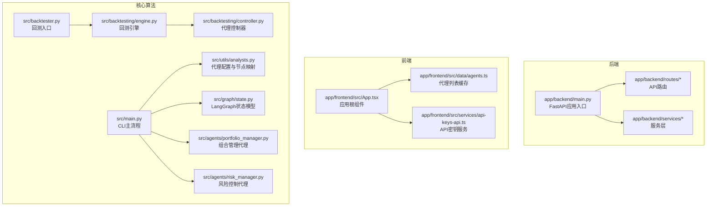
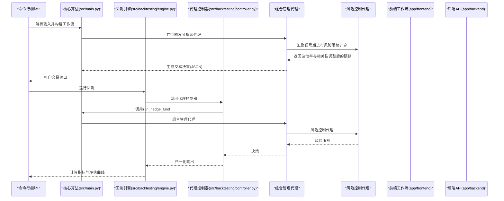
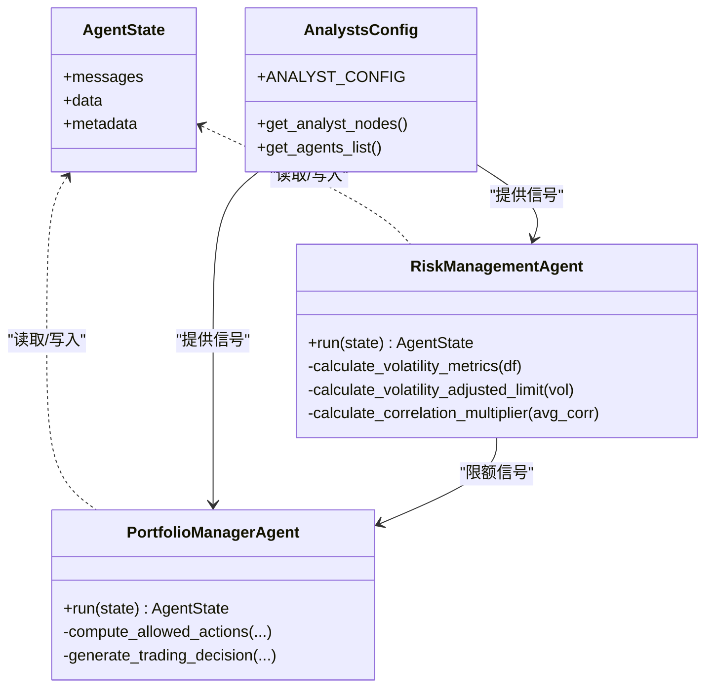
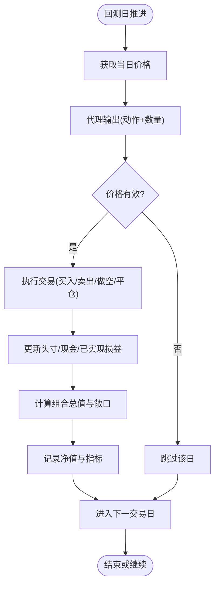
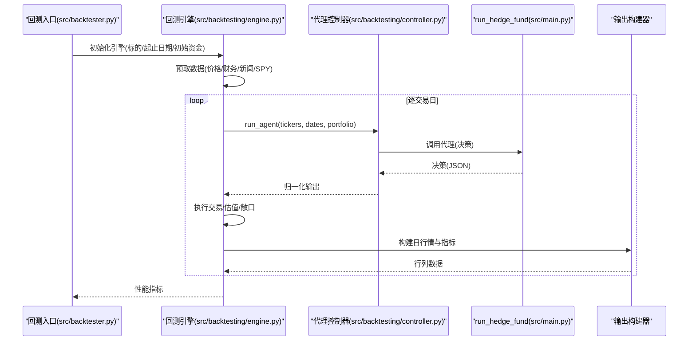
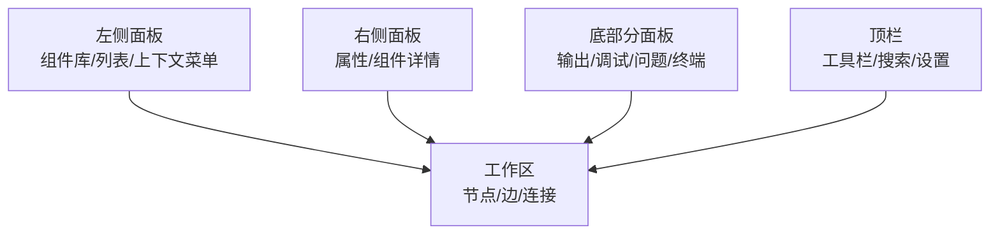
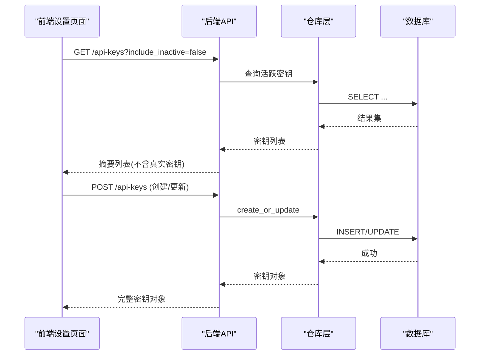
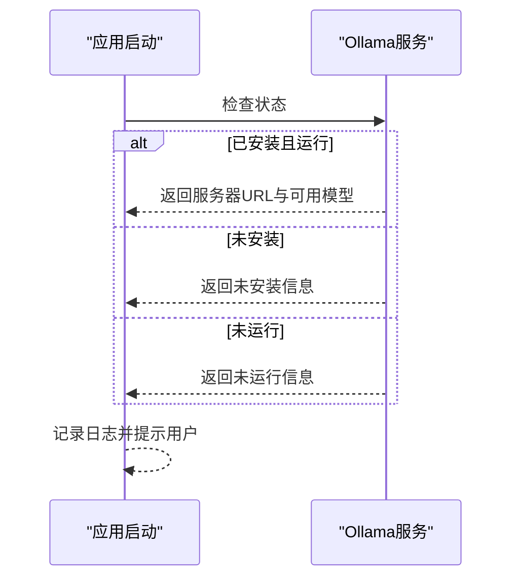
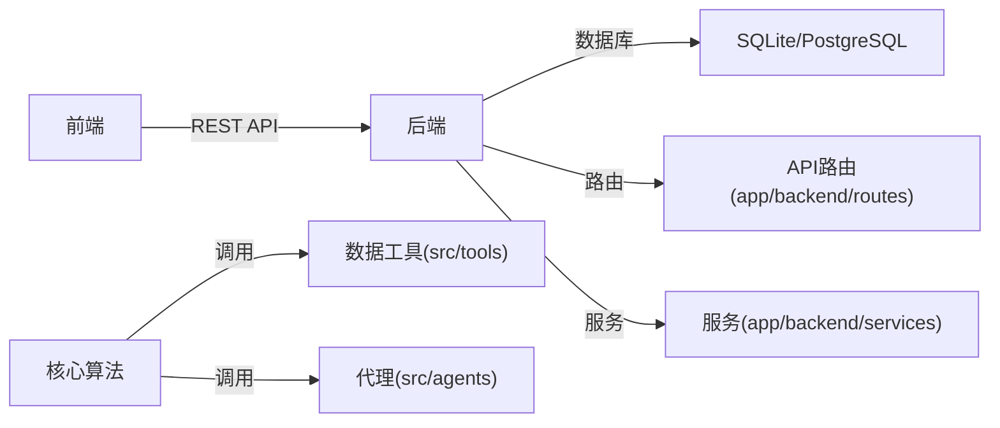

# 核心功能特性

<cite>
**本文引用的文件**
- [src/main.py](file://src/main.py)
- [src/backtester.py](file://src/backtester.py)
- [src/backtesting/engine.py](file://src/backtesting/engine.py)
- [src/backtesting/controller.py](file://src/backtesting/controller.py)
- [src/agents/portfolio_manager.py](file://src/agents/portfolio_manager.py)
- [src/agents/risk_manager.py](file://src/agents/risk_manager.py)
- [src/utils/analysts.py](file://src/utils/analysts.py)
- [src/graph/state.py](file://src/graph/state.py)
- [app/backend/main.py](file://app/backend/main.py)
- [app/backend/routes/api_keys.py](file://app/backend/routes/api_keys.py)
- [app/backend/services/api_key_service.py](file://app/backend/services/api_key_service.py)
- [app/frontend/src/data/agents.ts](file://app/frontend/src/data/agents.ts)
- [app/frontend/src/services/api-keys-api.ts](file://app/frontend/src/services/api-keys-api.ts)
</cite>

## 目录
1. [简介](#简介)
2. [项目结构](#项目结构)
3. [核心组件](#核心组件)
4. [架构总览](#架构总览)
5. [详细组件分析](#详细组件分析)
6. [依赖分析](#依赖分析)
7. [性能考虑](#性能考虑)
8. [故障排除指南](#故障排除指南)
9. [结论](#结论)
10. [附录](#附录)

## 简介
本文件聚焦于AI对冲基金项目的四大核心功能特性：多代理协作系统（含19位专业投资理念代理）、实时交易执行模拟、回测引擎（历史数据回测、性能指标与基准比较）、图形化工作流界面（VS Code风格可视化），以及API密钥管理与流式响应处理。文档在技术深度与可读性之间取得平衡，既面向开发者也面向非技术用户。

## 项目结构
项目采用前后端分离与模块化设计：
- 后端（FastAPI）：提供REST API、数据库初始化、CORS配置、Ollama集成检查等。
- 前端（React/Vite）：提供图形化工作流界面、代理列表加载、设置面板、API密钥管理等。
- 核心算法与回测：独立的Python模块，包含代理系统、回测引擎、指标计算与输出构建器。

图表来源
- [app/backend/main.py:1-56](file://app/backend/main.py#L1-L56)
- [app/frontend/src/App.tsx:1-12](file://app/frontend/src/App.tsx#L1-L12)
- [src/main.py:100-131](file://src/main.py#L100-L131)
- [src/backtesting/engine.py:27-80](file://src/backtesting/engine.py#L27-L80)
- [src/backtesting/controller.py:9-23](file://src/backtesting/controller.py#L9-L23)
- [src/agents/portfolio_manager.py:24-94](file://src/agents/portfolio_manager.py#L24-L94)
- [src/agents/risk_manager.py:10-219](file://src/agents/risk_manager.py#L10-L219)
- [src/utils/analysts.py:184-201](file://src/utils/analysts.py#L184-L201)
- [src/graph/state.py:14-19](file://src/graph/state.py#L14-L19)

章节来源
- [app/backend/main.py:1-56](file://app/backend/main.py#L1-L56)
- [app/frontend/src/App.tsx:1-12](file://app/frontend/src/App.tsx#L1-L12)
- [src/main.py:100-131](file://src/main.py#L100-L131)

## 核心组件
- 多代理协作系统：通过LangGraph状态图编排19位专业投资理念代理，最终由组合管理代理生成交易决策；风险控制代理负责波动率与相关性调整的风险限额计算。
- 实时交易执行模拟：在回测引擎中调用交易执行器，按决策执行买卖/做空/平仓，并计算组合价值与敞口，不进行真实下单。
- 回测引擎：基于工作日序列推进，预取价格与财务数据，逐日运行代理、执行交易、记录每日净值与指标，支持中断恢复与部分结果展示。
- 图形化工作流界面：前端提供左侧组件库、右侧属性面板、底部输出面板、顶部工具栏，支持拖拽连接、右键菜单、快捷键等VS Code风格交互。
- API密钥管理：后端提供增删改查、批量更新、停用与最后使用时间更新接口；前端提供统一的API封装与缓存策略。
- 流式响应处理：后端启动事件检查本地LLM可用性；前端通过Toast提示与异步请求实现近似流式的用户反馈。

章节来源
- [src/main.py:46-93](file://src/main.py#L46-L93)
- [src/backtesting/engine.py:96-195](file://src/backtesting/engine.py#L96-L195)
- [src/backtesting/controller.py:12-66](file://src/backtesting/controller.py#L12-L66)
- [src/agents/portfolio_manager.py:24-94](file://src/agents/portfolio_manager.py#L24-L94)
- [src/agents/risk_manager.py:10-219](file://src/agents/risk_manager.py#L10-L219)
- [app/backend/routes/api_keys.py:19-201](file://app/backend/routes/api_keys.py#L19-L201)
- [app/frontend/src/services/api-keys-api.ts:42-158](file://app/frontend/src/services/api-keys-api.ts#L42-L158)

## 架构总览
下图展示了从CLI到后端API、再到前端工作流的整体交互路径，以及回测引擎在离线模式下的运行方式。

图表来源
- [src/main.py:46-93](file://src/main.py#L46-L93)
- [src/backtesting/engine.py:132-142](file://src/backtesting/engine.py#L132-L142)
- [src/backtesting/controller.py:12-66](file://src/backtesting/controller.py#L12-L66)
- [src/agents/portfolio_manager.py:24-94](file://src/agents/portfolio_manager.py#L24-L94)
- [src/agents/risk_manager.py:10-219](file://src/agents/risk_manager.py#L10-L219)

## 详细组件分析

### 多代理协作系统与19位专业投资理念代理
- 工作流编排：通过状态图将“开始节点”连接至所选分析师代理，再汇聚到风险控制代理，最终由组合管理代理生成统一决策。
- 代理配置中心：集中定义19位代理的显示名、描述、理念、顺序与函数映射，确保前后端一致。
- 信号汇聚与约束：组合管理代理压缩各分析师信号与置信度，结合风险代理提供的剩余头寸限额与当前价格，确定允许动作与数量。
- 协作机制：风险代理先于组合管理代理运行，提供波动率与相关性调整后的头寸上限；组合管理代理在LLM辅助下完成最终决策。

图表来源
- [src/graph/state.py:14-19](file://src/graph/state.py#L14-L19)
- [src/agents/risk_manager.py:10-219](file://src/agents/risk_manager.py#L10-L219)
- [src/agents/portfolio_manager.py:24-94](file://src/agents/portfolio_manager.py#L24-L94)
- [src/utils/analysts.py:24-178](file://src/utils/analysts.py#L24-L178)

章节来源
- [src/main.py:100-131](file://src/main.py#L100-L131)
- [src/utils/analysts.py:184-201](file://src/utils/analysts.py#L184-L201)
- [src/agents/risk_manager.py:10-219](file://src/agents/risk_manager.py#L10-L219)
- [src/agents/portfolio_manager.py:24-94](file://src/agents/portfolio_manager.py#L24-L94)

### 实时交易执行模拟（不实际下单）
- 执行器职责：根据决策中的动作与数量，结合当前价格与组合状态，计算可成交数量并更新头寸、现金与已实现损益。
- 价值与敞口：每日计算组合总值与多头/空头/总敞口、净敞口与多空比率，用于指标计算与可视化。
- 无真实订单：所有操作仅在内存组合对象上进行，不调用外部交易所或经纪商API。

图表来源
- [src/backtesting/engine.py:114-164](file://src/backtesting/engine.py#L114-L164)

章节来源
- [src/backtesting/engine.py:114-164](file://src/backtesting/engine.py#L114-L164)

### 回测引擎：历史数据回测、性能指标与基准比较
- 数据预取：为标的与基准（如SPY）预拉取价格、财务指标、内幕交易与新闻，保证回测覆盖全面。
- 指标计算：在至少3个净值点后计算夏普、索提诺、最大回撤、多空比率、总/净敞口等。
- 基准比较：以SPY日收益作为基准，对比策略收益表现。
- 中断处理：支持键盘中断，尽可能输出部分结果摘要。

图表来源
- [src/backtester.py:13-67](file://src/backtester.py#L13-L67)
- [src/backtesting/engine.py:96-195](file://src/backtesting/engine.py#L96-L195)
- [src/backtesting/controller.py:12-66](file://src/backtesting/controller.py#L12-L66)
- [src/main.py:46-93](file://src/main.py#L46-L93)

章节来源
- [src/backtester.py:13-67](file://src/backtester.py#L13-L67)
- [src/backtesting/engine.py:96-195](file://src/backtesting/engine.py#L96-L195)
- [src/backtesting/controller.py:12-66](file://src/backtesting/controller.py#L12-L66)

### 图形化工作流界面（VS Code风格）
- 组件组织：左侧组件库（分析师、输出节点等）、右侧属性面板、底部输出面板（调试、终端、问题等）、顶部工具栏。
- 交互能力：拖拽连线、右键菜单、搜索框、快捷键、标签页管理、主题切换等。
- 数据驱动：代理列表通过API一次性拉取并缓存，避免重复请求；工作流状态通过节点上下文传递。

图表来源
- [app/frontend/src/App.tsx:1-12](file://app/frontend/src/App.tsx#L1-L12)
- [app/frontend/src/data/agents.ts:18-30](file://app/frontend/src/data/agents.ts#L18-L30)

章节来源
- [app/frontend/src/App.tsx:1-12](file://app/frontend/src/App.tsx#L1-L12)
- [app/frontend/src/data/agents.ts:18-30](file://app/frontend/src/data/agents.ts#L18-L30)

### API密钥管理系统：安全存储与访问控制
- 后端接口：提供创建/查询/更新/删除/批量更新、停用与最后使用时间更新等完整CRUD能力。
- 安全策略：查询返回摘要信息，隐藏真实密钥；仅在需要时注入到下游请求。
- 前端封装：统一的API服务类，支持包含/排除未激活密钥、批量更新、停用与最后使用时间更新。

图表来源
- [app/backend/routes/api_keys.py:19-201](file://app/backend/routes/api_keys.py#L19-L201)
- [app/backend/services/api_key_service.py:12-23](file://app/backend/services/api_key_service.py#L12-L23)
- [app/frontend/src/services/api-keys-api.ts:42-158](file://app/frontend/src/services/api-keys-api.ts#L42-L158)

章节来源
- [app/backend/routes/api_keys.py:19-201](file://app/backend/routes/api_keys.py#L19-L201)
- [app/backend/services/api_key_service.py:12-23](file://app/backend/services/api_key_service.py#L12-L23)
- [app/frontend/src/services/api-keys-api.ts:42-158](file://app/frontend/src/services/api-keys-api.ts#L42-L158)

### 流式响应处理：实时状态更新与错误处理
- 后端启动检查：在应用启动时检查本地LLM服务状态，通过日志向用户反馈安装/运行/可用模型情况。
- 前端提示：使用Toast组件进行全局通知，配合异步请求与缓存策略提升交互流畅度。
- 错误处理：API路由捕获异常并返回标准化错误响应；前端在请求失败时抛出错误交由调用方处理。

图表来源
- [app/backend/main.py:32-56](file://app/backend/main.py#L32-L56)

章节来源
- [app/backend/main.py:32-56](file://app/backend/main.py#L32-L56)
- [app/frontend/src/App.tsx:1-12](file://app/frontend/src/App.tsx#L1-L12)

## 依赖分析
- 组件耦合：核心算法与后端API解耦，通过CLI与HTTP两种入口接入；前端通过REST API与后端通信。
- 外部依赖：后端依赖数据库与第三方数据源（通过工具模块抽象），前端依赖浏览器fetch与Vite环境变量。
- 循环依赖：未发现直接循环导入；代理配置通过集中常量表管理，避免分散定义导致的耦合。

图表来源
- [app/backend/main.py:15-31](file://app/backend/main.py#L15-L31)
- [src/main.py:46-93](file://src/main.py#L46-L93)

章节来源
- [app/backend/main.py:15-31](file://app/backend/main.py#L15-L31)
- [src/main.py:46-93](file://src/main.py#L46-L93)

## 性能考虑
- 数据预取：回测前一年窗口预取价格与财务数据，减少运行期IO等待。
- 输出增量：每日输出以增量方式构建，避免重复打印历史。
- LLM调用优化：组合管理代理仅对存在可行动作的标的发送LLM，其余纯持有，降低token消耗。
- 并发与缓存：前端对代理列表进行内存缓存，减少重复网络请求。

## 故障排除指南
- 回测中断：支持键盘中断，若已产生部分净值序列，会尝试输出初始/末尾净值与总回报摘要。
- API密钥缺失：风险代理在缺少有效API密钥时使用默认波动率参数，避免完全失败。
- LLM不可用：后端启动时检测本地LLM状态，未安装或未运行时给出明确提示与指引。

章节来源
- [src/backtester.py:19-40](file://src/backtester.py#L19-L40)
- [src/agents/risk_manager.py:37-45](file://src/agents/risk_manager.py#L37-L45)
- [app/backend/main.py:32-56](file://app/backend/main.py#L32-L56)

## 结论
本项目通过模块化设计实现了从多代理协作、实时模拟交易到回测与可视化的完整闭环。19位专业投资理念代理在风险控制代理的限额约束下协同决策，回测引擎提供严谨的历史验证与指标输出，前端工作流提供直观的VS Code风格操作体验，后端API密钥管理保障了敏感信息的安全与可控访问。整体架构清晰、扩展性强，适合进一步引入更多代理与数据源。

## 附录
- 使用场景与价值
  - 多代理协作：在不确定市场环境下，通过不同理念代理的信号聚合与限额约束，提高决策稳健性。
  - 实时模拟：在不承担真实交易成本与滑点的前提下，快速验证策略逻辑与参数敏感性。
  - 回测引擎：提供可复现的历史验证，支持基准比较与风险指标评估，支撑策略迭代。
  - 图形化工作流：降低策略构建门槛，便于非技术用户参与策略设计与调试。
  - API密钥管理：集中管理与审计第三方数据源密钥，避免泄露与误用。
  - 流式响应：在启动阶段即时反馈系统状态，提升用户体验与运维效率。