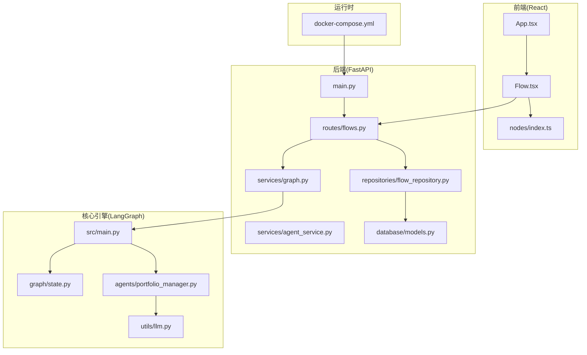
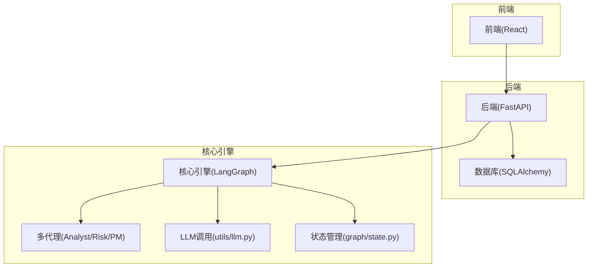
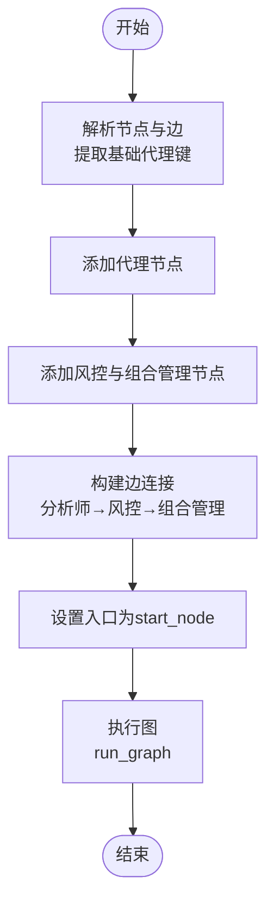
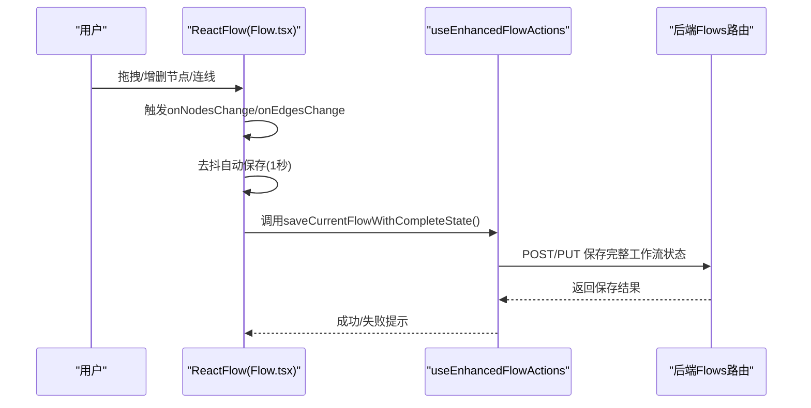
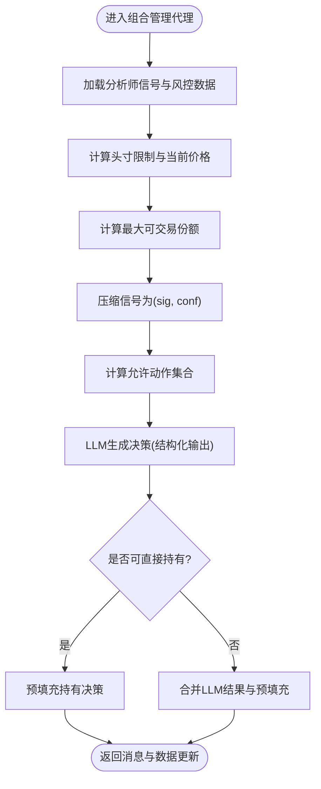
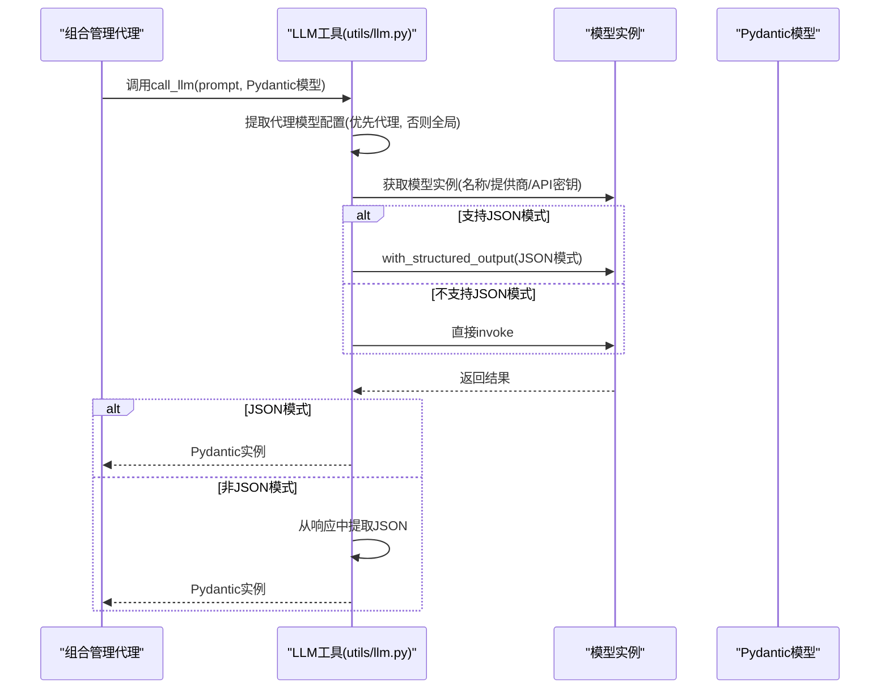
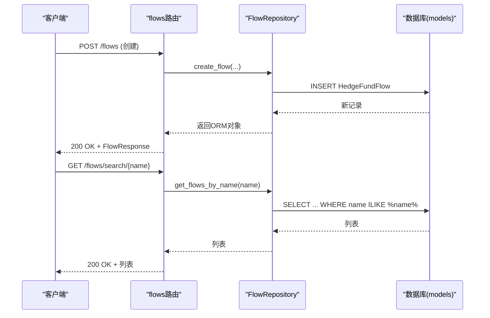
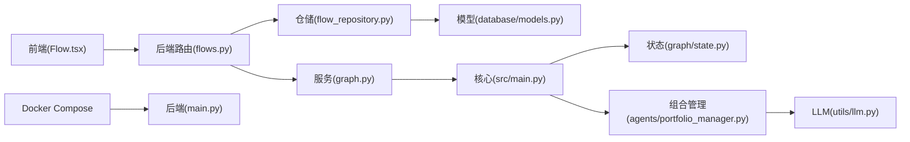

# 系统架构设计

<cite>
**本文档引用的文件**
- [app/backend/main.py](file://app/backend/main.py)
- [app/backend/routes/flows.py](file://app/backend/routes/flows.py)
- [app/backend/database/models.py](file://app/backend/database/models.py)
- [app/backend/repositories/flow_repository.py](file://app/backend/repositories/flow_repository.py)
- [app/backend/services/graph.py](file://app/backend/services/graph.py)
- [app/backend/services/agent_service.py](file://app/backend/services/agent_service.py)
- [src/graph/state.py](file://src/graph/state.py)
- [src/main.py](file://src/main.py)
- [src/agents/portfolio_manager.py](file://src/agents/portfolio_manager.py)
- [src/utils/llm.py](file://src/utils/llm.py)
- [app/frontend/src/App.tsx](file://app/frontend/src/App.tsx)
- [app/frontend/src/Flow.tsx](file://app/frontend/src/Flow.tsx)
- [app/frontend/src/nodes/index.ts](file://app/frontend/src/nodes/index.ts)
- [docker/docker-compose.yml](file://docker/docker-compose.yml)
</cite>

## 目录
1. [引言](#引言)
2. [项目结构](#项目结构)
3. [核心组件](#核心组件)
4. [架构总览](#架构总览)
5. [详细组件分析](#详细组件分析)
6. [依赖分析](#依赖分析)
7. [性能考虑](#性能考虑)
8. [故障排除指南](#故障排除指南)
9. [结论](#结论)
10. [附录](#附录)

## 引言
本项目是一个基于AI的对冲基金系统，采用前后端分离与微服务化架构，结合LangGraph实现多代理协作的事件驱动工作流。系统分为三层：表现层（React前端）、业务逻辑层（Python后端FastAPI服务）、数据访问层（SQLAlchemy数据库）。通过可配置的代理节点与状态图编排，实现从用户输入到AI分析再到交易决策的完整数据流。

## 项目结构
项目采用分层与功能域混合的组织方式：
- 前端（React + TypeScript）：可视化拖拽式工作流编辑器、组件库与UI控件、上下文与钩子、服务封装等。
- 后端（FastAPI + Python）：路由层、仓储层、服务层、图编排与执行、LLM调用工具。
- 核心引擎（LangGraph + 代理）：状态定义、工作流编排、多代理协作、风险与组合管理。
- 数据与模型：数据库表结构、API键存储、回测与指标等。
- 运维（Docker）：本地Ollama服务与应用容器编排。

**图表来源**
- [app/frontend/src/App.tsx:1-12](file://app/frontend/src/App.tsx#L1-L12)
- [app/frontend/src/Flow.tsx:1-313](file://app/frontend/src/Flow.tsx#L1-L313)
- [app/frontend/src/nodes/index.ts:1-60](file://app/frontend/src/nodes/index.ts#L1-L60)
- [app/backend/main.py:1-56](file://app/backend/main.py#L1-L56)
- [app/backend/routes/flows.py:1-174](file://app/backend/routes/flows.py#L1-L174)
- [app/backend/repositories/flow_repository.py:1-103](file://app/backend/repositories/flow_repository.py#L1-L103)
- [app/backend/database/models.py:1-115](file://app/backend/database/models.py#L1-L115)
- [app/backend/services/graph.py:1-193](file://app/backend/services/graph.py#L1-L193)
- [app/backend/services/agent_service.py:1-13](file://app/backend/services/agent_service.py#L1-L13)
- [src/graph/state.py:1-52](file://src/graph/state.py#L1-L52)
- [src/main.py:1-180](file://src/main.py#L1-L180)
- [src/agents/portfolio_manager.py:1-263](file://src/agents/portfolio_manager.py#L1-L263)
- [src/utils/llm.py:1-148](file://src/utils/llm.py#L1-L148)
- [docker/docker-compose.yml:1-95](file://docker/docker-compose.yml#L1-L95)

**章节来源**
- [app/backend/main.py:1-56](file://app/backend/main.py#L1-L56)
- [app/frontend/src/App.tsx:1-12](file://app/frontend/src/App.tsx#L1-L12)
- [docker/docker-compose.yml:1-95](file://docker/docker-compose.yml#L1-L95)

## 核心组件
- 表现层（React前端）
  - 应用入口与布局：App.tsx负责顶层布局与通知组件挂载。
  - 工作流画布：Flow.tsx使用ReactFlow实现节点与连线的可视化编辑，支持自动保存、历史快照、撤销重做、键盘快捷键等。
  - 节点与边类型：nodes/index.ts集中注册节点组件与初始节点/连线，支撑多代理节点、组合管理节点等。
- 业务逻辑层（FastAPI后端）
  - 应用入口：main.py初始化FastAPI、CORS、数据库表创建，并在启动时检查Ollama可用性。
  - 路由层：flows.py提供工作流的CRUD与搜索接口，统一响应模型与错误处理。
  - 仓储层：flow_repository.py封装HedgeFundFlow等实体的增删改查。
  - 服务层：graph.py基于React Flow结构动态构建LangGraph，run_graph封装异步执行；agent_service.py用于将代理函数绑定唯一agent_id。
- 核心引擎（LangGraph + 代理）
  - 状态定义：graph/state.py定义AgentState，包含消息、数据与元数据三段式状态。
  - 工作流编排：src/main.py与backend/services/graph.py共同完成从节点到边的映射、起止点设置与执行。
  - 组合管理：agents/portfolio_manager.py聚合各分析师信号，结合风控限额生成最终交易决策。
  - LLM调用：utils/llm.py提供结构化输出、重试、默认回退与按代理/全局模型配置选择。

**章节来源**
- [app/frontend/src/App.tsx:1-12](file://app/frontend/src/App.tsx#L1-L12)
- [app/frontend/src/Flow.tsx:1-313](file://app/frontend/src/Flow.tsx#L1-L313)
- [app/frontend/src/nodes/index.ts:1-60](file://app/frontend/src/nodes/index.ts#L1-L60)
- [app/backend/main.py:1-56](file://app/backend/main.py#L1-L56)
- [app/backend/routes/flows.py:1-174](file://app/backend/routes/flows.py#L1-L174)
- [app/backend/repositories/flow_repository.py:1-103](file://app/backend/repositories/flow_repository.py#L1-L103)
- [app/backend/services/graph.py:1-193](file://app/backend/services/graph.py#L1-L193)
- [app/backend/services/agent_service.py:1-13](file://app/backend/services/agent_service.py#L1-L13)
- [src/graph/state.py:1-52](file://src/graph/state.py#L1-L52)
- [src/main.py:1-180](file://src/main.py#L1-L180)
- [src/agents/portfolio_manager.py:1-263](file://src/agents/portfolio_manager.py#L1-L263)
- [src/utils/llm.py:1-148](file://src/utils/llm.py#L1-L148)

## 架构总览
系统采用前后端分离与微服务化理念：
- 分层架构
  - 表现层：React前端负责用户交互与工作流可视化，通过HTTP API与后端通信。
  - 业务逻辑层：FastAPI提供REST接口，封装领域服务与数据访问。
  - 数据访问层：SQLAlchemy ORM映射数据库表，统一事务与查询。
- 微服务化
  - 后端以路由模块化组织，每个资源（flows、runs、storage等）独立路由，便于扩展与维护。
  - 前后端通过明确的请求/响应模型进行契约约束，降低耦合。
- 多代理协作
  - 基于LangGraph的状态机，通过节点与边描述代理间的事件驱动流转。
  - 每个代理节点接收状态并返回更新后的状态，最终由组合管理节点汇总决策。

**图表来源**
- [app/backend/main.py:1-56](file://app/backend/main.py#L1-L56)
- [app/backend/routes/flows.py:1-174](file://app/backend/routes/flows.py#L1-L174)
- [app/backend/database/models.py:1-115](file://app/backend/database/models.py#L1-L115)
- [app/backend/services/graph.py:1-193](file://app/backend/services/graph.py#L1-L193)
- [src/graph/state.py:1-52](file://src/graph/state.py#L1-L52)
- [src/agents/portfolio_manager.py:1-263](file://src/agents/portfolio_manager.py#L1-L263)
- [src/utils/llm.py:1-148](file://src/utils/llm.py#L1-L148)

## 详细组件分析

### 组件A分析：工作流编排与执行（LangGraph）
- 设计要点
  - 动态构建：根据React Flow的nodes/edges动态创建LangGraph节点与边，支持分析师节点、风控节点与组合管理节点的灵活组合。
  - 状态管理：AgentState包含messages、data、metadata三段式状态，确保消息传递、数据共享与元信息（如模型配置、请求对象）贯穿全链路。
  - 执行策略：run_graph封装同步执行并在异步环境中通过线程池避免阻塞事件循环。
- 关键流程
  - 节点解析：从unique_id提取基础代理键，区分组合管理节点并为其生成对应的风控节点。
  - 边连接：过滤非代理节点边，建立分析师→风控→组合管理→结束的流水线。
  - 入口设置：将start_node作为入口，未被其他代理节点连接的节点直接连入start_node。

**图表来源**
- [app/backend/services/graph.py:36-129](file://app/backend/services/graph.py#L36-L129)
- [src/graph/state.py:15-19](file://src/graph/state.py#L15-L19)

**章节来源**
- [app/backend/services/graph.py:1-193](file://app/backend/services/graph.py#L1-L193)
- [src/graph/state.py:1-52](file://src/graph/state.py#L1-L52)

### 组件B分析：前端工作流编辑器（ReactFlow）
- 设计要点
  - 完整生命周期：初始化、节点/连线变更、自动保存、历史快照、撤销重做。
  - 主题与网格：根据主题切换背景色与网格颜色，提升可读性。
  - 快捷键：支持Ctrl/Cmd+Z撤销、Shift+Ctrl/Cmd+Z重做。
- 关键流程
  - 自动保存：对节点新增/删除、位置变化（拖拽结束）触发去抖保存；对连线新建立即保存。
  - 历史管理：首次初始化或清空状态时记录快照；节点/连线变化后定时快照。
  - 保存动作：通过增强的保存动作保存当前工作流的完整状态（nodes/edges/viewport/data）。

**图表来源**
- [app/frontend/src/Flow.tsx:91-210](file://app/frontend/src/Flow.tsx#L91-L210)
- [app/backend/routes/flows.py:18-157](file://app/backend/routes/flows.py#L18-L157)

**章节来源**
- [app/frontend/src/Flow.tsx:1-313](file://app/frontend/src/Flow.tsx#L1-L313)
- [app/frontend/src/nodes/index.ts:1-60](file://app/frontend/src/nodes/index.ts#L1-L60)
- [app/backend/routes/flows.py:1-174](file://app/backend/routes/flows.py#L1-L174)

### 组件C分析：组合管理代理（Portfolio Manager）
- 设计要点
  - 输入聚合：从analyst_signals压缩各代理信号与置信度，结合风控限额与当前价格计算最大可交易数量。
  - 行为约束：根据头寸、保证金要求、现金与价格计算允许动作（买/卖/做空/平仓/持有），并剔除零容量动作。
  - 输出格式：使用Pydantic模型标准化输出，便于LLM结构化生成与后续解析。
- 关键流程
  - 信号压缩：仅保留有效信号与置信度，去除空代理。
  - 最大份额：基于头寸限制与股价计算最大可交易份额。
  - 决策生成：最小化提示词，仅传递必要上下文，减少token消耗并提高确定性。

**图表来源**
- [src/agents/portfolio_manager.py:25-94](file://src/agents/portfolio_manager.py#L25-L94)
- [src/agents/portfolio_manager.py:177-263](file://src/agents/portfolio_manager.py#L177-L263)

**章节来源**
- [src/agents/portfolio_manager.py:1-263](file://src/agents/portfolio_manager.py#L1-L263)

### 组件D分析：LLM调用与模型配置（utils/llm.py）
- 设计要点
  - 结构化输出：优先使用JSON模式结构化输出；对不支持JSON模式的模型，从Markdown代码块中提取JSON。
  - 重试与回退：最多三次重试，失败时使用默认工厂生成安全回退响应。
  - 配置优先级：优先从请求对象中提取代理特定模型配置，否则回退到全局配置。
- 关键流程
  - 配置提取：从state.metadata.request中读取代理模型配置，若不可用则使用全局默认值。
  - 模型实例化：根据provider与name获取模型实例，必要时附加结构化输出方法。
  - 结果解析：对JSON模式模型直接返回Pydantic实例；对非JSON模型解析响应中的JSON片段。

**图表来源**
- [src/utils/llm.py:10-84](file://src/utils/llm.py#L10-L84)
- [src/utils/llm.py:124-147](file://src/utils/llm.py#L124-L147)

**章节来源**
- [src/utils/llm.py:1-148](file://src/utils/llm.py#L1-L148)

### 组件E分析：后端API与数据持久化
- 设计要点
  - 路由模块化：flows路由提供工作流的创建、查询、更新、删除、复制与搜索。
  - 仓储抽象：FlowRepository封装CRUD操作，支持模板标记与标签字段。
  - 数据模型：HedgeFundFlow存储React Flow的nodes/edges/viewport/data；HedgeFundFlowRun与HedgeFundFlowRunCycle跟踪执行状态、结果与成本。
- 关键流程
  - 创建工作流：接收nodes/edges/data等，写入数据库并返回ORM模型。
  - 查询与搜索：支持分页排序与名称模糊匹配。
  - 删除与复制：删除物理记录；复制时清空模板标记并生成新名称。

**图表来源**
- [app/backend/routes/flows.py:18-174](file://app/backend/routes/flows.py#L18-L174)
- [app/backend/repositories/flow_repository.py:12-103](file://app/backend/repositories/flow_repository.py#L12-L103)
- [app/backend/database/models.py:6-115](file://app/backend/database/models.py#L6-L115)

**章节来源**
- [app/backend/routes/flows.py:1-174](file://app/backend/routes/flows.py#L1-L174)
- [app/backend/repositories/flow_repository.py:1-103](file://app/backend/repositories/flow_repository.py#L1-L103)
- [app/backend/database/models.py:1-115](file://app/backend/database/models.py#L1-L115)

## 依赖分析
- 组件内聚与耦合
  - 前端：Flow.tsx与hooks/service紧密耦合，但通过context解耦UI与业务逻辑；nodes/index.ts集中注册节点类型，降低跨文件耦合。
  - 后端：routes依赖repository，repository依赖models，形成清晰的分层；services/graph依赖agents与utils，保持业务逻辑与执行分离。
  - 核心引擎：agents依赖utils/llm与graph/state，形成稳定的代理-工具-状态依赖。
- 外部依赖
  - FastAPI/CORS：跨域与中间件配置。
  - SQLAlchemy：ORM与数据库迁移版本。
  - LangGraph/LangChain：状态图与消息类型。
  - Docker：本地Ollama服务与应用容器编排。

**图表来源**
- [app/frontend/src/Flow.tsx:1-313](file://app/frontend/src/Flow.tsx#L1-L313)
- [app/backend/routes/flows.py:1-174](file://app/backend/routes/flows.py#L1-L174)
- [app/backend/repositories/flow_repository.py:1-103](file://app/backend/repositories/flow_repository.py#L1-L103)
- [app/backend/database/models.py:1-115](file://app/backend/database/models.py#L1-L115)
- [app/backend/services/graph.py:1-193](file://app/backend/services/graph.py#L1-L193)
- [src/main.py:1-180](file://src/main.py#L1-L180)
- [src/graph/state.py:1-52](file://src/graph/state.py#L1-L52)
- [src/agents/portfolio_manager.py:1-263](file://src/agents/portfolio_manager.py#L1-L263)
- [src/utils/llm.py:1-148](file://src/utils/llm.py#L1-L148)
- [docker/docker-compose.yml:1-95](file://docker/docker-compose.yml#L1-L95)

**章节来源**
- [app/backend/main.py:1-56](file://app/backend/main.py#L1-L56)
- [docker/docker-compose.yml:1-95](file://docker/docker-compose.yml#L1-L95)

## 性能考虑
- 前端
  - 自动保存去抖：节点/连线变更与连线新建分别采用不同阈值，平衡实时性与网络压力。
  - 历史快照：对频繁变更进行定时快照，避免每次变更都触发保存。
- 后端
  - 异步执行：LangGraph执行通过线程池避免阻塞事件循环，适合高并发场景。
  - 数据库索引：按更新时间倒序查询，支持模板过滤与名称模糊匹配。
- 核心引擎
  - LLM调用：结构化输出减少解析开销；非JSON模式模型从响应中提取JSON，保证兼容性。
  - 代理约束：预计算允许动作与最大份额，减少LLM推理负担。

## 故障排除指南
- 启动阶段
  - Ollama状态检查：后端启动时会尝试检查Ollama安装与运行状态，若未安装或未运行，日志会给出提示与指引。
- API错误
  - 404/500：flows路由对不存在资源与内部异常进行统一错误包装与HTTP状态码返回。
- LLM调用
  - 重试与回退：当模型调用失败时，工具会进行多次重试并使用默认工厂生成安全回退响应，避免流程中断。
- 前端保存
  - 自动保存失败：前端会在控制台打印错误并避免过度提示；可通过快捷键手动保存确认状态。

**章节来源**
- [app/backend/main.py:32-56](file://app/backend/main.py#L32-L56)
- [app/backend/routes/flows.py:41-174](file://app/backend/routes/flows.py#L41-L174)
- [src/utils/llm.py:72-84](file://src/utils/llm.py#L72-L84)
- [app/frontend/src/Flow.tsx:180-209](file://app/frontend/src/Flow.tsx#L180-L209)

## 结论
该系统通过前后端分离与微服务化设计，结合LangGraph的事件驱动工作流，实现了从用户输入到AI分析再到交易决策的完整闭环。前端提供直观的工作流编辑体验，后端以模块化路由与仓储保障数据一致性，核心引擎以状态图与多代理协作实现可扩展的智能决策。通过结构化输出、重试与回退机制以及容器化部署，系统具备良好的稳定性与可维护性。

## 附录
- 扩展性设计建议
  - 新代理添加：在agents目录新增代理文件，遵循AgentState输入与Pydantic输出约定；在analyst配置中注册节点键与函数映射，即可通过前端工作流编排接入。
  - 新LLM提供商集成：在llm/models中新增提供商适配与模型列表，utils/llm中扩展模型获取与结构化输出逻辑。
  - 新数据源接入：在backtesting与data模块中扩展数据客户端与缓存策略，确保与现有指标与回测框架兼容。
- 运行时环境
  - Docker Compose提供Ollama服务与应用容器编排，支持多种运行模式（推理、回测、Ollama模式）。

**章节来源**
- [docker/docker-compose.yml:1-95](file://docker/docker-compose.yml#L1-L95)
- [src/utils/llm.py:1-148](file://src/utils/llm.py#L1-L148)
- [src/agents/portfolio_manager.py:1-263](file://src/agents/portfolio_manager.py#L1-L263)