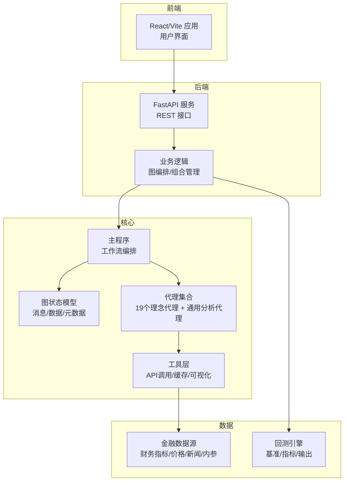
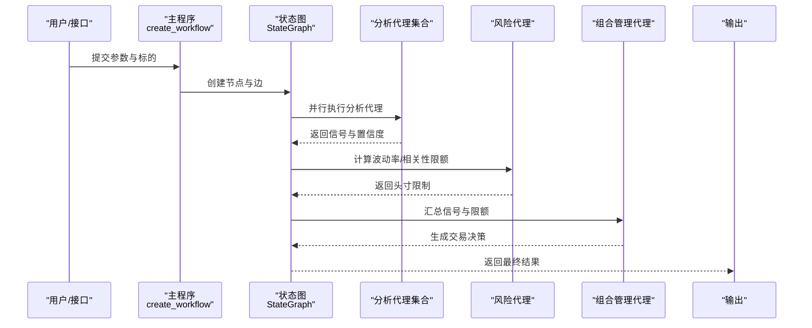
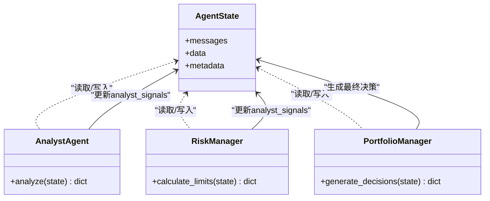
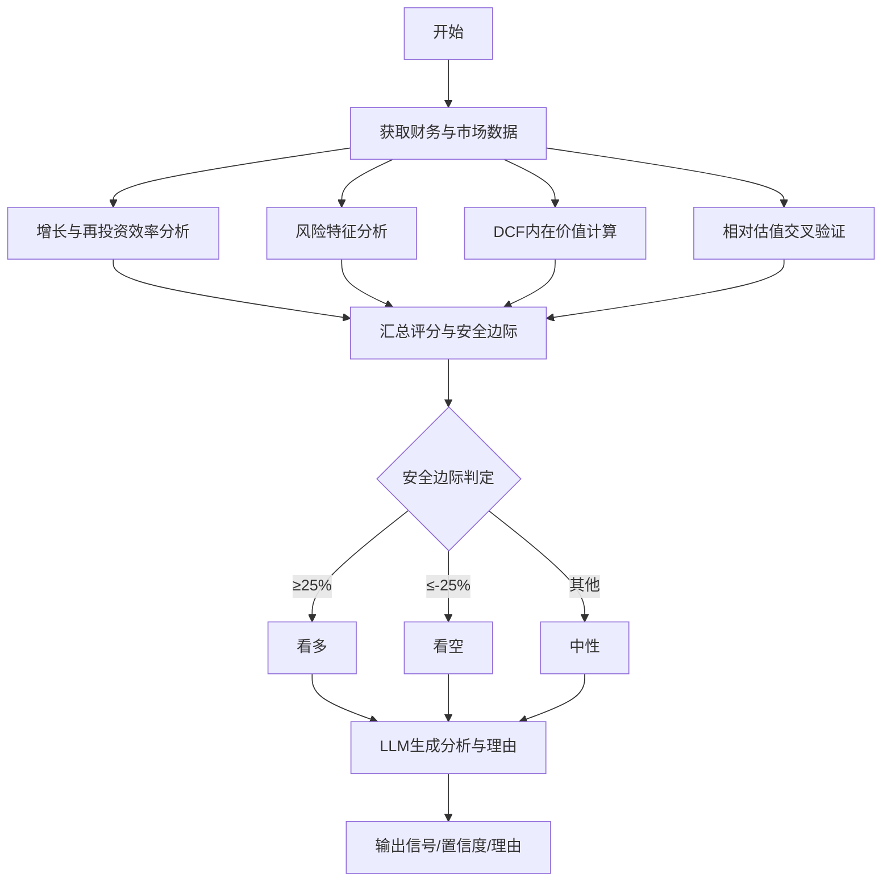
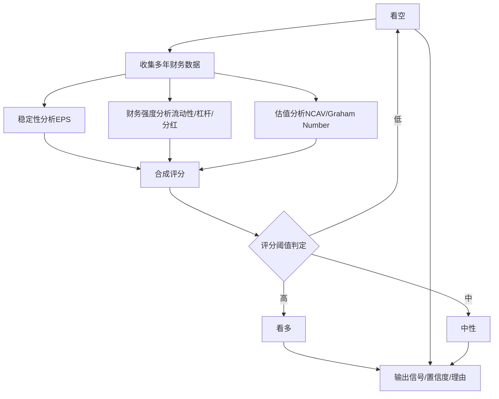
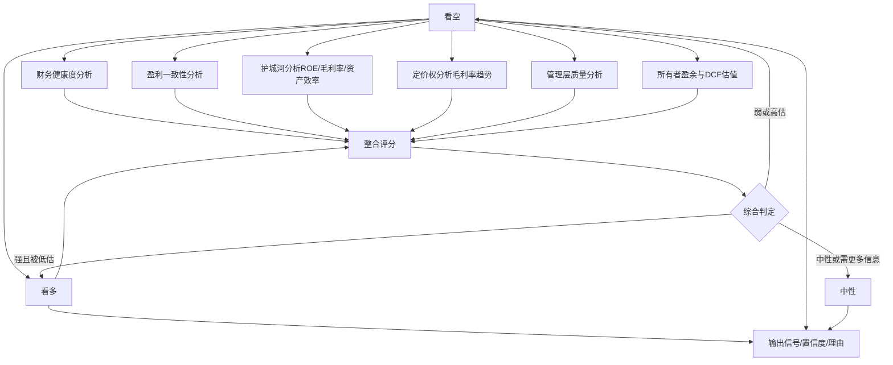
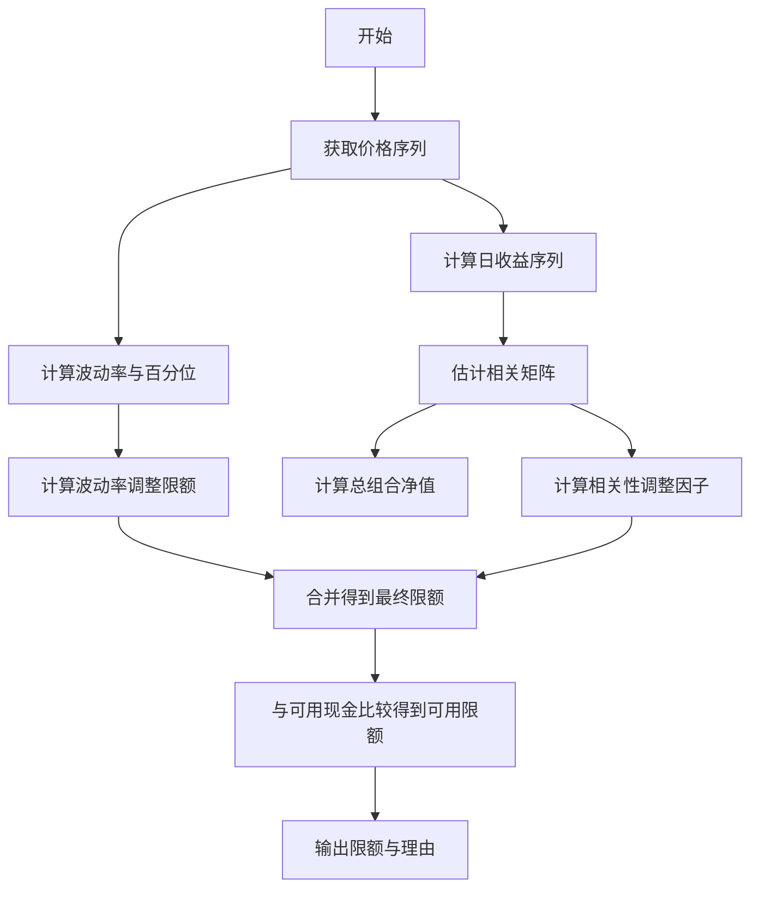
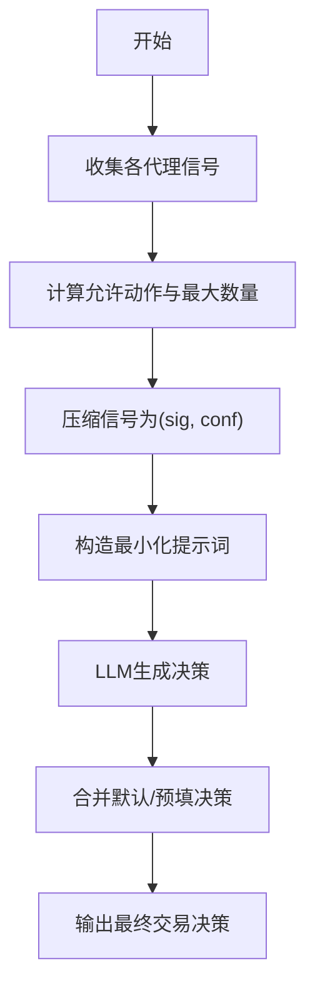
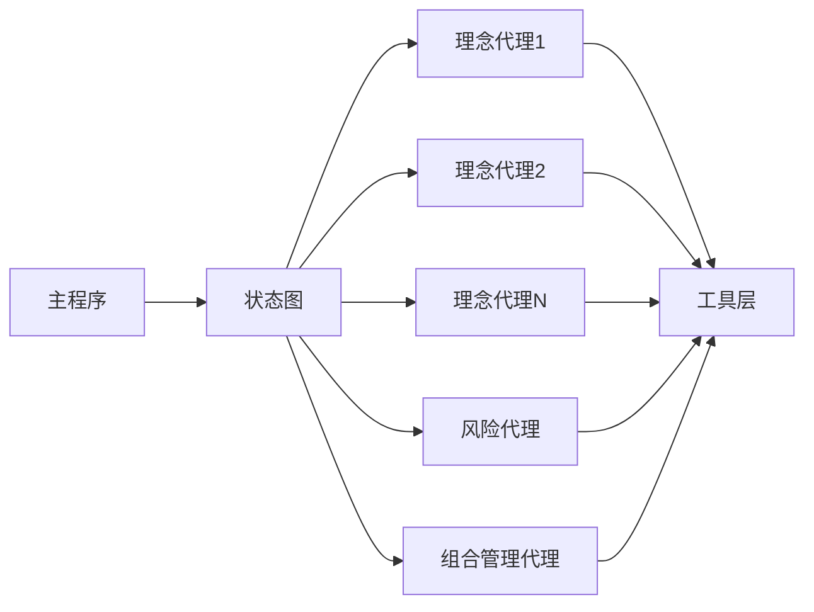

# 项目介绍与目标

<cite>
**本文引用的文件**
- [README.md](file://README.md)
- [src/main.py](file://src/main.py)
- [src/graph/state.py](file://src/graph/state.py)
- [src/utils/analysts.py](file://src/utils/analysts.py)
- [src/agents/portfolio_manager.py](file://src/agents/portfolio_manager.py)
- [src/agents/risk_manager.py](file://src/agents/risk_manager.py)
- [src/agents/fundamentals.py](file://src/agents/fundamentals.py)
- [src/agents/sentiment.py](file://src/agents/sentiment.py)
- [src/agents/aswath_damodaran.py](file://src/agents/aswath_damodaran.py)
- [src/agents/ben_graham.py](file://src/agents/ben_graham.py)
- [src/agents/warren_buffett.py](file://src/agents/warren_buffett.py)
- [src/backtester.py](file://src/backtester.py)
- [app/backend/README.md](file://app/backend/README.md)
- [app/frontend/README.md](file://app/frontend/README.md)
</cite>

## 目录
1. [引言](#引言)
2. [项目结构](#项目结构)
3. [核心组件](#核心组件)
4. [架构总览](#架构总览)
5. [详细组件分析](#详细组件分析)
6. [依赖关系分析](#依赖关系分析)
7. [性能考量](#性能考量)
8. [故障排查指南](#故障排查指南)
9. [结论](#结论)
10. [附录](#附录)

## 引言
本项目旨在探索人工智能在交易决策中的应用，属于教育研究性质，不用于真实交易或投资建议。系统通过多个“专业投资理念代理”协同工作，模拟一个专业对冲基金团队的运作方式：每个代理代表一种投资哲学与分析方法（例如价值投资、成长投资、技术分析、宏观策略、风险管理等），最终由组合经理代理汇总信号并生成交易决策。

项目强调以下目标：
- 教育与研究导向：帮助学习者理解不同投资理念与AI结合的可能性
- 多代理协作：通过LangGraph状态图编排多个分析代理，形成完整的决策流水线
- 风险控制优先：内置波动率与相关性调整的风险限额计算，确保交易规模可控
- 可扩展与可配置：支持CLI与Web界面运行，并提供回测引擎验证策略效果

## 项目结构
项目采用分层与功能模块化组织：
- 核心运行入口与工作流编排位于命令行与后端服务中
- 代理层包含19个理念代理与通用分析代理（估值、技术、新闻情绪等）
- 图状态与工具层提供统一的状态结构、消息传递与数据访问
- 前后端分离：CLI与Web应用分别提供交互入口

图表来源
- [src/main.py:100-130](file://src/main.py#L100-L130)
- [src/graph/state.py:14-18](file://src/graph/state.py#L14-L18)
- [src/utils/analysts.py:24-178](file://src/utils/analysts.py#L24-L178)
- [app/backend/README.md:69-72](file://app/backend/README.md#L69-L72)

章节来源
- [README.md:1-52](file://README.md#L1-L52)
- [src/main.py:133-180](file://src/main.py#L133-L180)
- [app/backend/README.md:1-102](file://app/backend/README.md#L1-L102)
- [app/frontend/README.md:1-37](file://app/frontend/README.md#L1-L37)

## 核心组件
- 工作流编排与状态图
  - 使用LangGraph构建状态图，定义起始节点、分析代理节点、风险代理与组合管理代理之间的连接关系
  - 状态包含消息序列、数据字典与元数据，支持跨代理传递与累积
- 代理集合
  - 19个理念代理：Aswath Damodaran、Ben Graham、Warren Buffett、Bill Ackman、Cathie Wood、Charlie Munger、Michael Burry、Mohnish Pabrai、Nassim Taleb、Peter Lynch、Phil Fisher、Rakesh Jhunjhunwala、Stanley Druckenmiller、以及若干通用分析代理（估值、技术、新闻情绪等）
  - 通用分析代理：对财务、技术、新闻情绪进行独立分析，输出信号与置信度
- 组合管理与风控
  - 风控代理根据波动率与相关性计算头寸限额，避免过度集中与高风险暴露
  - 组合管理代理汇总各代理信号与限额约束，生成最终交易决策（买卖/做空/平仓/持有）

章节来源
- [src/main.py:100-130](file://src/main.py#L100-L130)
- [src/graph/state.py:14-18](file://src/graph/state.py#L14-L18)
- [src/utils/analysts.py:24-178](file://src/utils/analysts.py#L24-L178)
- [src/agents/risk_manager.py:10-219](file://src/agents/risk_manager.py#L10-L219)
- [src/agents/portfolio_manager.py:24-93](file://src/agents/portfolio_manager.py#L24-L93)

## 架构总览
系统采用“多代理+状态图”的决策架构：
- 输入阶段：解析CLI/Web参数，构建初始状态（时间范围、标的、初始资金、模型选择等）
- 执行阶段：按配置启动选定代理，每个代理独立分析并产出信号；风控代理随后给出头寸限制；组合管理代理综合信号与限额生成最终指令
- 输出阶段：打印或返回交易决策，支持可视化与调试

图表来源
- [src/main.py:100-130](file://src/main.py#L100-L130)
- [src/agents/risk_manager.py:10-219](file://src/agents/risk_manager.py#L10-L219)
- [src/agents/portfolio_manager.py:24-93](file://src/agents/portfolio_manager.py#L24-L93)

## 详细组件分析

### 多代理协作与19个理念代理
- 设计思路
  - 将每位投资大师的理念抽象为可执行的代理函数，每个代理负责特定分析维度（财务、技术、新闻情绪、宏观等）
  - 代理之间通过状态图并行协作，最终由组合管理代理汇总决策
- 代理清单（部分示例）
  - 价值投资：Aswath Damodaran（DCF/相对估值/安全边际）、Ben Graham（NCAV/Graham Number）、Warren Buffett（护城河/定价权/股东回报）
  - 成长投资：Peter Lynch（十倍股）、Phil Fisher（深调研Scuttlebutt）、Cathie Wood（颠覆性创新）
  - 宏观/行为：Bill Ackman（激进行动主义）、Stanley Druckenmiller（宏观趋势）、Nassim Taleb（黑天鹅/反脆弱）
  - 通用分析：技术分析、新闻情绪、基本面、估值、增长等
- 关键实现要点
  - 代理统一使用状态图消息传递，输出标准化信号与置信度
  - 风控代理在组合管理前统一给出头寸限额，避免过度集中
  - 组合管理代理在LLM辅助下，结合允许动作与信号权重，生成最终交易指令

图表来源
- [src/graph/state.py:14-18](file://src/graph/state.py#L14-L18)
- [src/agents/risk_manager.py:10-219](file://src/agents/risk_manager.py#L10-L219)
- [src/agents/portfolio_manager.py:24-93](file://src/agents/portfolio_manager.py#L24-L93)

章节来源
- [README.md:5-29](file://README.md#L5-L29)
- [src/utils/analysts.py:24-178](file://src/utils/analysts.py#L24-L178)

### Aswath Damodaran理念代理
- 核心思想：以内在价值为中心，结合增长与再投资效率、DCF估值、相对估值与安全边际
- 实现流程
  - 获取财务指标与现金流等基础数据
  - 分析增长与再投资效率、风险特征（贝塔、利息保障等）
  - 计算DCF内在价值，对比市值与安全边际
  - 通过LLM生成具有Damodaran风格的分析与理由
- 决策规则：安全边际≥25%为看多，≤-25%为看空，否则中性

图表来源
- [src/agents/aswath_damodaran.py:27-137](file://src/agents/aswath_damodaran.py#L27-L137)

章节来源
- [src/agents/aswath_damodaran.py:27-420](file://src/agents/aswath_damodaran.py#L27-L420)

### Ben Graham理念代理
- 核心思想：以安全边际为核心，强调稳健财务、稳定盈利与净额流动资产（NCAV）折扣
- 实现流程
  - 收集多年EPS、资产负债表与分红记录
  - 计算当前比率、债务占比与股息历史
  - 评估NCAV与Graham Number，计算安全边际
  - 通过LLM生成符合Graham风格的理由与建议

图表来源
- [src/agents/ben_graham.py:20-94](file://src/agents/ben_graham.py#L20-L94)

章节来源
- [src/agents/ben_graham.py:20-349](file://src/agents/ben_graham.py#L20-L349)

### Warren Buffett理念代理
- 核心思想：护城河、定价权、管理层质量、财务稳健与长期回报能力
- 实现流程
  - 分析财务健康度、一致性与盈利能力
  - 评估护城河（ROE一致性、毛利率稳定性、资产效率）
  - 分析管理层质量（回购/分红/增发）
  - 计算所有者盈余与三阶段DCF，得出保守内在价值
  - 通过LLM综合事实生成最终信号

图表来源
- [src/agents/warren_buffett.py:19-153](file://src/agents/warren_buffett.py#L19-L153)

章节来源
- [src/agents/warren_buffett.py:19-827](file://src/agents/warren_buffett.py#L19-L827)

### 风险管理代理
- 功能：基于波动率与相关性计算头寸限额，结合组合现有头寸与可用现金，给出每只股票的剩余可用头寸上限
- 关键算法
  - 波动率调整：根据年化波动率映射到基准仓位比例
  - 相关性调整：利用活跃头寸间的相关系数，降低高度相关的集中度
  - 现金约束：不超过可用现金与保证金要求

图表来源
- [src/agents/risk_manager.py:10-219](file://src/agents/risk_manager.py#L10-L219)

章节来源
- [src/agents/risk_manager.py:10-318](file://src/agents/risk_manager.py#L10-L318)

### 组合管理代理
- 功能：汇总各代理信号与限额约束，确定允许动作（买/卖/做空/平仓/持有），并在LLM辅助下生成最终交易决策
- 关键逻辑
  - 允许动作计算：考虑当前现金、保证金、现有头寸与最大可交易量
  - 信号压缩：仅保留有效代理信号与置信度
  - LLM决策：在严格约束下，为每只标的选择单一动作与数量

图表来源
- [src/agents/portfolio_manager.py:24-93](file://src/agents/portfolio_manager.py#L24-L93)

章节来源
- [src/agents/portfolio_manager.py:24-263](file://src/agents/portfolio_manager.py#L24-L263)

### 通用分析代理（示例）
- 财务分析代理：基于TTM财务指标（ROE、利润率、负债比、自由现金流等）打分并生成信号
- 新闻情绪代理：结合内参交易与公司新闻，加权聚合看涨/看跌信号并计算置信度

章节来源
- [src/agents/fundamentals.py:10-164](file://src/agents/fundamentals.py#L10-L164)
- [src/agents/sentiment.py:11-139](file://src/agents/sentiment.py#L11-L139)

## 依赖关系分析
- 组件耦合
  - 主程序与状态图耦合度低，通过节点注册与边连接实现松耦合
  - 代理间无直接调用，全部通过状态图消息传递，提升可扩展性
  - 风控与组合管理代理依赖于外部金融数据API与内部工具层
- 外部依赖
  - LLM推理：通过统一的LLM调用封装，支持多种模型提供商
  - 金融数据：通过工具层API获取财务指标、价格、新闻与内参交易
- 循环依赖
  - 未发现循环导入；代理与工具层通过函数调用解耦

图表来源
- [src/main.py:100-130](file://src/main.py#L100-L130)
- [src/utils/analysts.py:184-186](file://src/utils/analysts.py#L184-L186)

章节来源
- [src/main.py:100-130](file://src/main.py#L100-L130)
- [src/utils/analysts.py:184-201](file://src/utils/analysts.py#L184-L201)

## 性能考量
- 并行化与吞吐
  - 分析代理在状态图中并行执行，显著缩短整体处理时间
  - 风控代理在组合管理前统一计算限额，减少重复计算
- 数据访问优化
  - 价格与财务数据尽量复用，避免重复API请求
  - 回测模式下可重用中间结果，提高迭代效率
- LLM成本控制
  - 通过最小化提示词与预填默认决策，降低Token消耗
  - 可选本地LLM（OLLAMA）以降低成本与延迟

## 故障排查指南
- 常见问题
  - API密钥缺失：检查环境变量与密钥配置
  - 无价格/财务数据：确认数据源可用与时间窗口设置
  - LLM解析失败：查看JSON解析错误与默认回退逻辑
- 调试建议
  - 启用“显示推理”选项，逐代理查看输出与理由
  - 使用CLI回测模式观察中断后的部分结果
  - 在Web后端查看健康检查与API文档定位接口问题

章节来源
- [src/main.py:30-42](file://src/main.py#L30-L42)
- [src/backtester.py:13-40](file://src/backtester.py#L13-L40)
- [app/backend/README.md:69-72](file://app/backend/README.md#L69-L72)

## 结论
本项目以教育研究为目标，通过19个专业投资理念代理与多代理协作系统，探索AI在交易决策中的可能性。系统基于LangGraph构建状态图工作流，结合风险控制与组合管理，形成从数据到信号再到交易指令的完整闭环。项目强调可解释性与可扩展性，适合教学演示与策略验证，不应用于真实投资。

## 附录
- 运行方式
  - CLI：Poetry安装后直接运行主程序与回测脚本
  - Web：后端FastAPI服务提供REST接口，前端React应用提供可视化界面
- 开发动机与预期成果
  - 动机：将经典投资理念与现代AI技术结合，构建可解释的多代理决策系统
  - 成果：提供可配置的代理集合、统一的状态图编排、风险控制与组合管理模块，以及回测与可视化工具

章节来源
- [README.md:84-158](file://README.md#L84-L158)
- [app/backend/README.md:51-102](file://app/backend/README.md#L51-L102)
- [app/frontend/README.md:18-37](file://app/frontend/README.md#L18-L37)