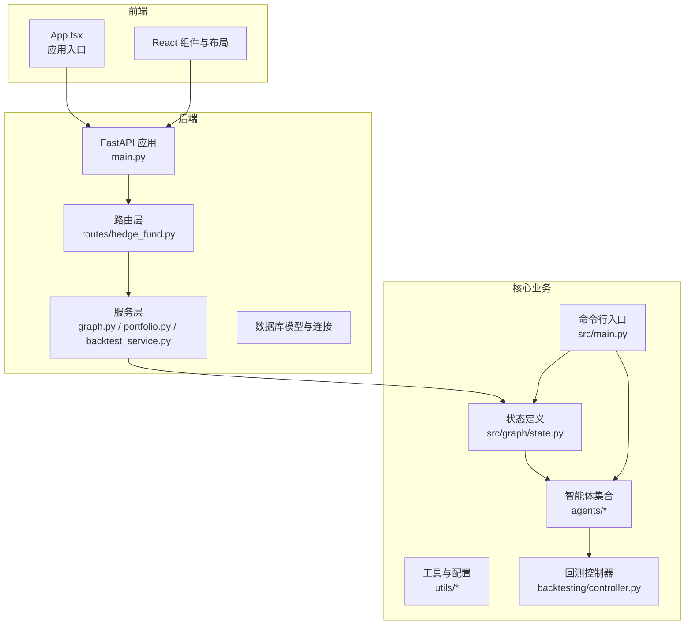
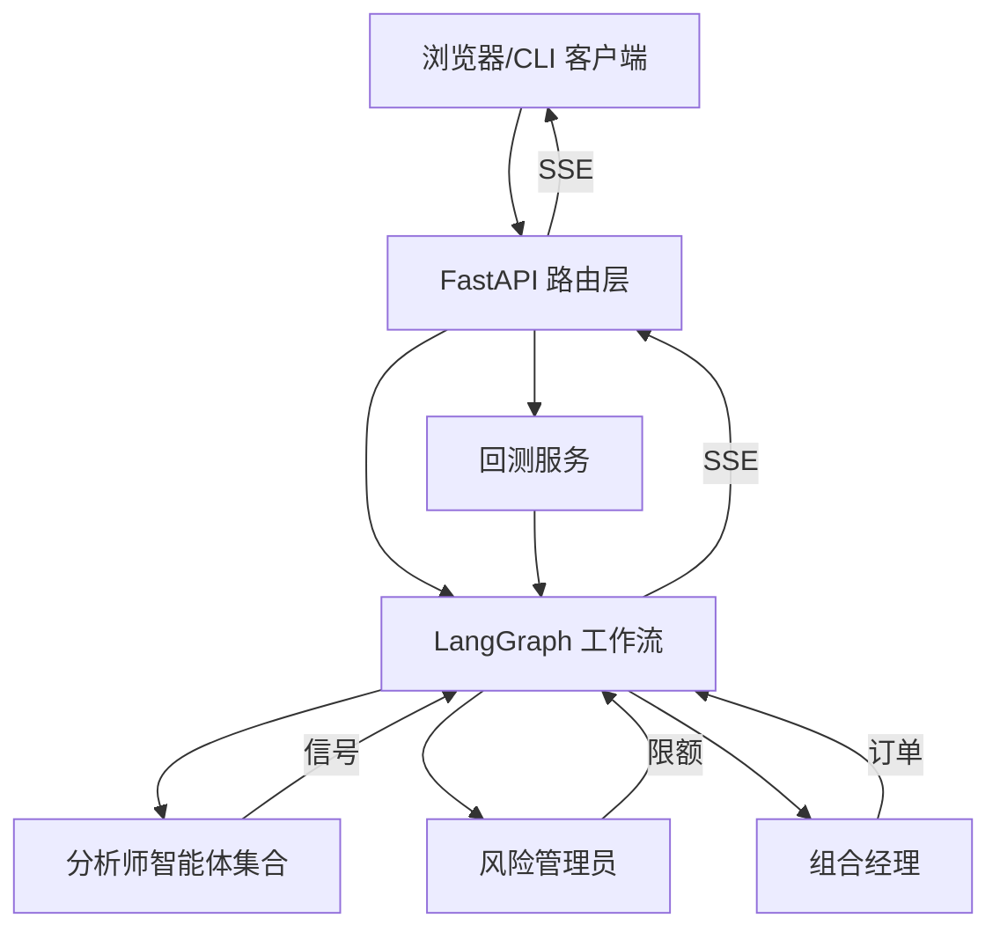
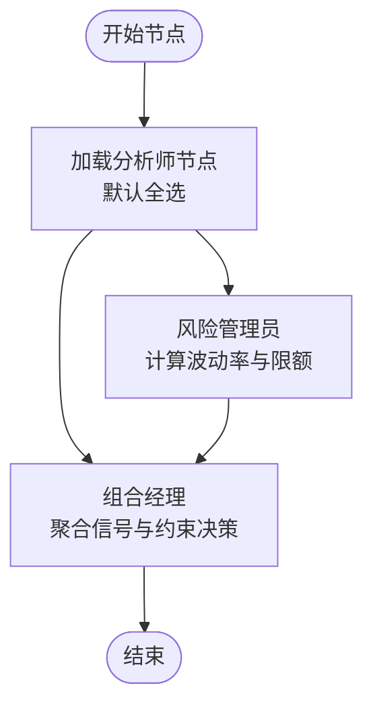
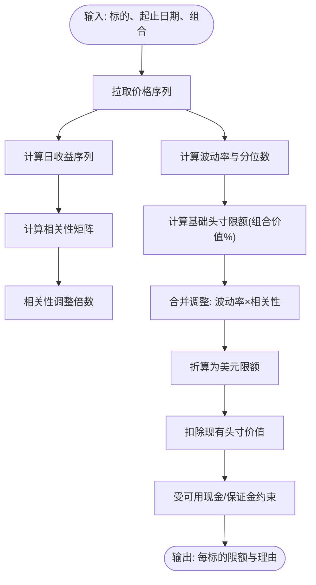
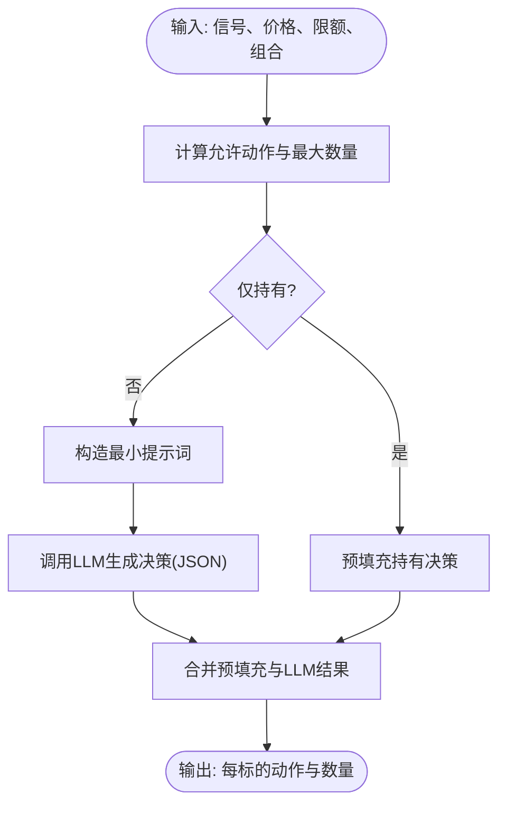
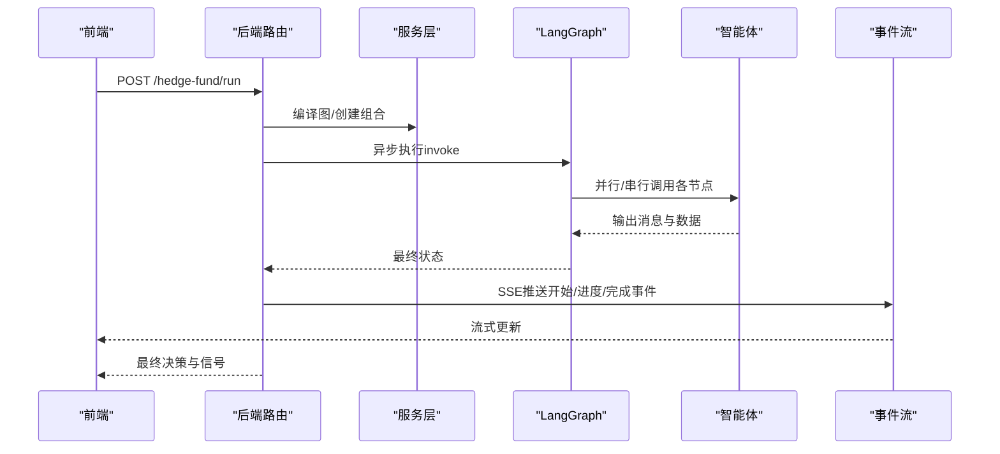
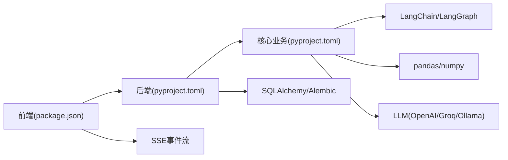

# 项目概述

<cite>
**本文引用的文件**
- [README.md](file://README.md)
- [pyproject.toml](file://pyproject.toml)
- [src/main.py](file://src/main.py)
- [src/graph/state.py](file://src/graph/state.py)
- [src/utils/analysts.py](file://src/utils/analysts.py)
- [src/agents/portfolio_manager.py](file://src/agents/portfolio_manager.py)
- [src/agents/risk_manager.py](file://src/agents/risk_manager.py)
- [app/backend/README.md](file://app/backend/README.md)
- [app/backend/main.py](file://app/backend/main.py)
- [app/backend/routes/hedge_fund.py](file://app/backend/routes/hedge_fund.py)
- [app/frontend/README.md](file://app/frontend/README.md)
- [app/frontend/src/App.tsx](file://app/frontend/src/App.tsx)
- [app/frontend/package.json](file://app/frontend/package.json)
- [docker/docker-compose.yml](file://docker/docker-compose.yml)
- [src/backtesting/controller.py](file://src/backtesting/controller.py)
</cite>

## 目录
1. [引言](#引言)
2. [项目结构](#项目结构)
3. [核心组件](#核心组件)
4. [架构总览](#架构总览)
5. [详细组件分析](#详细组件分析)
6. [依赖分析](#依赖分析)
7. [性能考虑](#性能考虑)
8. [故障排查指南](#故障排查指南)
9. [结论](#结论)
10. [附录](#附录)

## 引言
本项目是一个面向教育与研究目的的AI驱动对冲基金系统原型，旨在探索多智能体协作在投资决策中的应用。系统通过多个“分析师”智能体（如价值投资、成长投资、技术分析、新闻情绪等）并行生成交易信号，由风险管理员计算波动率与相关性调整后的头寸限额，最终由组合经理基于约束条件做出买卖/做空/平仓等决策。该系统同时提供命令行界面与Web应用两种使用方式，并支持本地与云端大模型运行模式；回测模块可对策略进行历史数据验证。

项目强调教育属性与免责声明：仅供学习研究使用，不构成任何投资建议或承诺收益，使用者需自行承担风险。

**章节来源**
- [README.md:1-44](file://README.md#L1-L44)

## 项目结构
项目采用分层与按功能域划分的组织方式，分为三层：
- 后端服务层（FastAPI）：提供REST API与事件流接口，负责编排图执行、回测与数据库交互。
- 前端展示层（React/Vite）：提供可视化流程编辑器与控制面板，连接后端API实现交互。
- 核心业务层（Python）：包含多智能体工作流、状态管理、回测引擎与工具集。

**图表来源**
- [app/backend/main.py:15-31](file://app/backend/main.py#L15-L31)
- [app/backend/routes/hedge_fund.py:16-161](file://app/backend/routes/hedge_fund.py#L16-L161)
- [src/main.py:100-131](file://src/main.py#L100-L131)
- [src/graph/state.py:14-19](file://src/graph/state.py#L14-L19)
- [src/agents/portfolio_manager.py:24-94](file://src/agents/portfolio_manager.py#L24-L94)
- [src/agents/risk_manager.py:10-220](file://src/agents/risk_manager.py#L10-L220)
- [src/backtesting/controller.py:9-68](file://src/backtesting/controller.py#L9-L68)

**章节来源**
- [app/backend/README.md:74-91](file://app/backend/README.md#L74-L91)
- [app/frontend/README.md:6-8](file://app/frontend/README.md#L6-L8)
- [src/main.py:100-131](file://src/main.py#L100-L131)

## 核心组件
- 多智能体工作流与状态
  - 使用LangGraph构建状态图，节点包括起始节点、若干分析师节点、风险管理员与组合经理，形成串行+汇聚的协作链路。
  - 状态类型包含消息序列、数据字典与元数据，支持跨节点传递价格、信号、限额等信息。
- 分析师智能体
  - 提供价值、技术、新闻情绪、宏观等多维度分析，统一输出信号与置信度，供组合经理聚合决策。
- 风险管理员
  - 基于历史价格计算波动率、年化波动与分位数，结合组合内头寸的相关性，给出波动率与相关性双重调整后的头寸限额。
- 组合经理
  - 在已知价格、限额与可用现金/保证金约束下，综合各分析师信号，决定买卖/做空/平仓的数量与理由。
- 回测控制器
  - 将单日运行封装为回测步进，规范化输出并推进组合快照，支持连续回测与指标统计。
- 后端API与事件流
  - 提供/hedge-fund/run与/hedge-fund/backtest两个端点，使用Server-Sent Events流式返回进度与结果。
- 前端应用
  - 基于React与Vite，集成流程图编辑器与控制面板，连接后端API实现可视化操作与结果展示。

**章节来源**
- [src/graph/state.py:14-19](file://src/graph/state.py#L14-L19)
- [src/utils/analysts.py:24-178](file://src/utils/analysts.py#L24-L178)
- [src/agents/risk_manager.py:10-220](file://src/agents/risk_manager.py#L10-L220)
- [src/agents/portfolio_manager.py:24-94](file://src/agents/portfolio_manager.py#L24-L94)
- [src/backtesting/controller.py:9-68](file://src/backtesting/controller.py#L9-L68)
- [app/backend/routes/hedge_fund.py:16-161](file://app/backend/routes/hedge_fund.py#L16-L161)
- [app/frontend/src/App.tsx:1-12](file://app/frontend/src/App.tsx#L1-L12)

## 架构总览
系统采用“前端-后端-核心业务”的分层架构，核心业务以Python为主，前后端通过HTTP与SSE通信。后端负责编排LangGraph工作流、调用外部数据源与LLM、执行回测，并将中间状态与最终结果以事件流形式推送至前端。

**图表来源**
- [app/backend/routes/hedge_fund.py:16-161](file://app/backend/routes/hedge_fund.py#L16-L161)
- [src/agents/risk_manager.py:10-220](file://src/agents/risk_manager.py#L10-L220)
- [src/agents/portfolio_manager.py:24-94](file://src/agents/portfolio_manager.py#L24-L94)
- [src/utils/analysts.py:24-178](file://src/utils/analysts.py#L24-L178)

## 详细组件分析

### 多智能体协作与状态图
- 工作流构建
  - 从配置中读取分析师节点映射，若未指定则默认启用全部分析师。
  - 添加风险管理员与组合经理节点，并将所有分析师汇聚到风险管理员，再由组合经理汇总决策。
- 状态结构
  - messages：消息序列，用于LLM对话与跨节点传递。
  - data：共享数据，包含标的列表、初始资金、当前价格、分析师信号等。
  - metadata：元数据，包含是否显示推理、模型名称与提供商等。

**图表来源**
- [src/main.py:100-131](file://src/main.py#L100-L131)
- [src/graph/state.py:14-19](file://src/graph/state.py#L14-L19)
- [src/utils/analysts.py:184-187](file://src/utils/analysts.py#L184-L187)

**章节来源**
- [src/main.py:100-131](file://src/main.py#L100-L131)
- [src/graph/state.py:14-19](file://src/graph/state.py#L14-L19)
- [src/utils/analysts.py:24-178](file://src/utils/analysts.py#L24-L178)

### 风险管理流程（波动率与相关性调整）
- 数据准备
  - 汇总当前交易标的与组合内已有头寸，拉取价格序列并计算日收益。
- 波动率计算
  - 计算日度与年化波动率，并估算当前波动率在历史滚动窗口中的分位数。
- 相关性分析
  - 对活跃头寸计算相关系数矩阵，取与活跃头寸的平均/最大相关性作为分散化惩罚因子。
- 限额计算
  - 基于年化波动率与相关性调整，得到组合价值百分比的头寸上限，并折算为美元限额，再扣减现有头寸价值，得到剩余可用限额。
  - 限额还受可用现金与保证金限制。

**图表来源**
- [src/agents/risk_manager.py:24-220](file://src/agents/risk_manager.py#L24-L220)

**章节来源**
- [src/agents/risk_manager.py:10-318](file://src/agents/risk_manager.py#L10-L318)

### 组合管理与决策生成
- 输入处理
  - 从分析师信号压缩出每标的信号与置信度，结合当前价格与限额计算最大可交易数量。
- 行为空间
  - 基于现金、保证金与现有头寸，确定允许的动作集合（买入、卖出、做空、平仓、持有），并剔除零容量动作。
- 决策生成
  - 以最小提示词模板将信号与允许动作传入LLM，要求其为每个标的选择一个动作与数量，并返回JSON格式。
  - 若无有效动作，则预填充“持有”；若LLM失败，使用默认“持有”回退。

**图表来源**
- [src/agents/portfolio_manager.py:177-263](file://src/agents/portfolio_manager.py#L177-L263)

**章节来源**
- [src/agents/portfolio_manager.py:24-263](file://src/agents/portfolio_manager.py#L24-L263)

### 后端API与事件流（SSE）
- /hedge-fund/run
  - 接收前端提交的图结构、参数与API密钥，编译LangGraph并异步执行。
  - 注册进度回调，将每个阶段的状态更新以SSE事件流返回，客户端断开时取消任务。
  - 最终返回JSON格式的决策与信号。
- /hedge-fund/backtest
  - 与/run类似，但使用回测服务在时间序列上连续执行，逐日推送回测结果与性能指标。
- /hedge-fund/agents
  - 返回可用智能体清单，供前端流程编辑器使用。

**图表来源**
- [app/backend/routes/hedge_fund.py:16-161](file://app/backend/routes/hedge_fund.py#L16-L161)

**章节来源**
- [app/backend/routes/hedge_fund.py:16-353](file://app/backend/routes/hedge_fund.py#L16-L353)

### 命令行与容器化运行
- 命令行入口
  - 支持指定标的、时间范围、是否显示推理、是否使用本地Ollama等参数，直接运行核心工作流并打印结果。
- 容器化
  - docker-compose提供Ollama服务与多个示例任务（运行、回测、带推理等），通过环境变量传递Ollama地址。

**章节来源**
- [src/main.py:133-180](file://src/main.py#L133-L180)
- [docker/docker-compose.yml:1-95](file://docker/docker-compose.yml#L1-L95)

## 依赖分析
- 技术栈概览
  - Python后端：FastAPI、SQLAlchemy、Alembic、LangChain/LangGraph、pandas/numpy、rich/colorama/questionary等。
  - 前端：React、Vite、@xyflow/react、Radix UI组件等。
  - 运行时：Ollama（可选）、Docker容器编排。
- 关键依赖关系
  - 后端路由依赖服务层（图编排、回测、组合管理），服务层依赖核心状态与智能体。
  - 前端依赖后端API，通过SSE接收实时事件。
  - 命令行入口直连核心状态与智能体，支持本地/云端LLM切换。

**图表来源**
- [app/frontend/package.json:11-35](file://app/frontend/package.json#L11-L35)
- [pyproject.toml:13-41](file://pyproject.toml#L13-L41)

**章节来源**
- [pyproject.toml:13-41](file://pyproject.toml#L13-L41)
- [app/frontend/package.json:11-35](file://app/frontend/package.json#L11-L35)

## 性能考虑
- 并行与串行
  - 分析师节点可并行执行，风险管理员与组合经理串行汇聚，减少LLM调用次数与上下文复杂度。
- 提示词最小化
  - 组合经理提示词仅包含必要字段，避免冗余信息导致token浪费。
- 数据缓存与去重
  - 风险管理员避免重复拉取价格，回测按日推进，减少重复计算。
- I/O与网络
  - SSE流式返回降低前端等待时间；外部API调用应设置超时与重试策略。
- 资源限制
  - 限额计算考虑可用现金与保证金，避免超买/超卖；对高波动/高相关性标的施加更严格限制。

[本节为通用指导，无需特定文件引用]

## 故障排查指南
- 后端启动与Ollama
  - 后端启动时会检查Ollama安装与运行状态，若未安装或未运行，可在设置页或手动启动。
- API密钥与权限
  - 后端路由会在请求缺少密钥时从数据库读取；请确认密钥配置正确且具有访问金融数据的权限。
- SSE断开与取消
  - 客户端断开时后端会取消执行任务；若长时间无响应，请检查网络与防火墙设置。
- 回测异常
  - 回测过程中若出现某日失败，事件流会返回错误事件；请查看当日标的与数据可用性。
- 前端依赖
  - 前端依赖包版本与Node版本需匹配；若安装失败，请清理缓存并重装。

**章节来源**
- [app/backend/main.py:32-56](file://app/backend/main.py#L32-L56)
- [app/backend/routes/hedge_fund.py:157-161](file://app/backend/routes/hedge_fund.py#L157-L161)
- [app/backend/routes/hedge_fund.py:333-337](file://app/backend/routes/hedge_fund.py#L333-L337)

## 结论
本项目以多智能体协作为核心，通过风险管理员与组合经理的两级过滤，实现了从信号到订单的闭环流程。后端以FastAPI提供REST与SSE接口，前端以React实现可视化编排与结果展示，核心业务层以LangGraph串联分析师与风控逻辑，回测模块提供历史验证能力。项目明确教育与非实盘属性，适合学习AI在量化投资中的应用与系统设计思路。

[本节为总结性内容，无需特定文件引用]

## 附录
- 快速开始
  - 命令行：安装Poetry后运行主程序，支持本地/云端LLM与时间范围参数。
  - Web应用：安装前端依赖后启动开发服务器，连接后端API。
- Docker
  - 使用docker-compose一键启动Ollama与示例任务，便于快速验证本地LLM与回测流程。

**章节来源**
- [README.md:84-131](file://README.md#L84-L131)
- [app/frontend/README.md:18-27](file://app/frontend/README.md#L18-L27)
- [docker/docker-compose.yml:1-95](file://docker/docker-compose.yml#L1-L95)